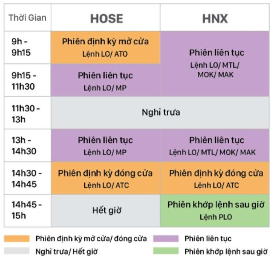

Trong bài này, chúng ta sẽ tìm hiểu những kiến thức cơ bản về các loại lệnh trong giao dịch chứng khoán.

 

## Tóm tắt
- [Các loại lệnh trong giao dịch chứng khoán](#cac-loai-lenh-trong-giao-dich-chung-khoan)
- [ATO](#ato)
- [ATC](#atc)
- [LO](#lo)
- [MP](#mp)
- [MTL](#mtl)
- [MOK](#mok)
- [Tổng kết](#tong-ket)

 

## Các loại lệnh trong giao dịch chứng khoán

Dưới đây là bảng chứa các thông tin về các lệnh thường được sử dụng trong giao dịch chứng khoán.

Nắm vững các thông tin về các lệnh cơ bản này giúp nhà đầu tư có thể hiểu mình đang làm gì, và mình sẽ làm gì tiếp theo trong giao dịch chứng khoán.

 

## ATO

ATO là tên viết tắt của **At the open order**, có nghĩa là lệnh mở cửa.

Lệnh tranh mua, bán tại mọi mức giá mở cửa. Phần chưa khớp sẽ bị hủy sau phiên định kỳ mở cửa.

Lệnh ATO có khối lượng cố định nhưng giá thì thay đổi. Giá mở cửa ATO sẽ là mức giá có khối lượng khớp lệnh lớn nhất. Lệnh ATO được ưu tiên khớp lệnh trước lệnh LO. Lệnh ATO chỉ dùng ở phiên khớp lệnh định kỳ mở cửa (sáng 9h - 9h15) để xác định giá mở cửa và sẽ tự động tự hủy bỏ sau thời điểm xác định giá mở cửa nếu lệnh không khớp hoặc không khớp hết. Lệnh ATO chỉ được áp dụng trên sàn HOSE.

 

## ATC

ATC là tên viết tắt của At the close order, có nghĩa là lệnh đóng cửa.

Lệnh tranh mua, bán tại mọi mức giá đóng cửa. Phần chưa khớp sẽ bị hủy sau phiên định kỳ đóng cửa.

Lệnh ATC có thể áp dụng đối với các cổ phiếu niêm yết trên 2 sàn HOSE and HNX.

 

## LO

LO là tên viết tắt của **Limit order**, có nghĩa là lệnh giới hạn hoặc lệnh cố định mua bán.

 

## MP

MP là tên viết tắt của **Market price order**, có nghĩa là lệnh thị trường.

Lệnh mua tại mức giá chờ bán thấp nhất. Lệnh bán tại mức giá chờ mua cao nhất. Phần chưa khớp sẽ chuyển thành lệnh LO.

 

## MTL

MTL là tên viết tắt của Market to limit order, có nghĩa là lệnh thị trường giới hạn.

Lệnh này giống lệnh MP.

 

## MAK

MAK là tên viết tắt của Fill and Kill order, có nghĩa là lệnh thị trường khớp và hủy.

Giống lệnh MP nhưng có thể thực hiện toàn bộ hoặc một phần, phần chưa khớp lệnh sẽ bị hủy ngay sau khi khớp lệnh.

 

## MOK

MOK là tên viết tắt của Fill or Kill order, có nghĩa là lệnh thị trường khớp toàn bộ hoặc hủy.

Giống lệnh MP nhưng nếu không được thực hiện toàn bộ thì tự động hủy toàn bộ lệnh, kể cả phần đã khớp.

 

## Tổng kết
- Nắm vững được định nghĩa của các lệnh cơ bản trong giao dịch chứng khoán, thời điểm sẽ sử dụng các lệnh này.

 

Refer:

