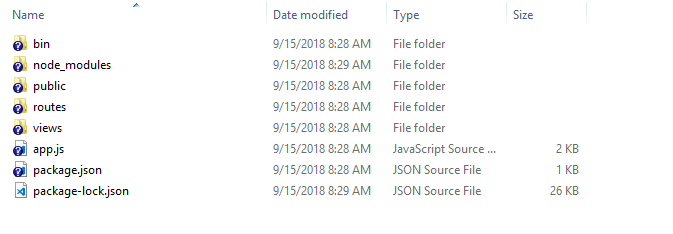

Hi, everyone. Today, I will guide you some information about setting Express framework.


## Table of Contents
- [Download module Express from npm.](#download-module-express-from-npm)
- [Make the directory of express project.](#make-the-directory-of-express-project)
- [Install the Node.js's packages in this folder.](#install-the-node.js's-package-in-this-folder)


## Download module Express from npm.

```js
npm install express-generator -g
```

When it has finished completely, module express will be contain in node-modules of npm. 


## Make the directory of express project. 
Now, you want to make the project using Express framework with template engine EJS. 

Typing command in Visual Studio Code's terminal or Command Prompt.

```javascript
express name_project -e
```

Parameter e is something that you want to use template engine javascript - EJS. 
To find out some information about EJS, you can read about the article: [What is EJS?](https://ducmanhphan.github.io/2018-09-15-What-is-EJS/)

At this moment, you have the directory that looks same as the below image. 




## Install the Node.js's packages in this folder. 
You can see some codes in the ```app.js```.

```Javascript
var winston = require('winston');
var createError = require('http-errors');
var express = require('express');
var path = require('path');
var cookieParser = require('cookie-parser');
var logger = require('morgan');

var indexRouter = require('./routes/index');
var usersRouter = require('./routes/users');

... 

// error handler
app.use(function(err, req, res, next) {
  // set locals, only providing error in development
  res.locals.message = err.message;
  res.locals.error = req.app.get('env') === 'development' ? err : {};

  // add this line to include winston logging
  winston.error(`${err.status || 500} - ${err.message} - ${req.originalUrl} - ${req.method} - ${req.ip}`);

  // render the error page
  res.status(err.status || 500);
  res.render('error');
});

```

All packages do not still install in this project. You have to install with yourself. Use the following command:

``` 
npm install 
```

When we want to use both ```morgan``` (default in express) and ```winston``` package, we will refer to this [link](https://www.digitalocean.com/community/tutorials/how-to-use-winston-to-log-node-js-applications).

The above steps are the skeleton to install express framework. Now, you can confidently code your project. 

<br>

## Install some necessary packages
- Use ```winston``` package

    ```winston``` is designed to be a simple and universal logging library with support for multiple transports. A transport is essentially a storage device for our logs. Each ```winston``` logger can have multiple transports configured at different levels.

    ```js
    npm install winston --dev
    ```

    It's often useful to keep any type of support or utility configuration files for our applications in a special folder, so let's create a ```config``` folder that will contain the ```winston``` configuration.

    Assuming that we are in our project's directory.

    ```js
    mkdir ./config
    ```

    After creating ```config``` folder, we will create file that will contain our ```winston``` configuration, which we'll call ```winston.js```.

    ```js
    code ./config/winston.js        // in Windows
    touch ./config/winston.js       // in MacOS
    ```

    Finally, we will createa folder that contains our log files:

    ```js
    mkdir ./log
    ```

    In order to make our life easier, we should install ```app-root-path``` package that is useful to specify paths in Node.js. This package is not directly relevant to Winston, but helps immensely when specifying paths to files in Node.js code. We'll use it to specify the location of the Winston log files from the root of the project and avoid ugly relative path syntax:

    ```js
    npm install app-root-path --save-dev
    ```

    Start with ```winston.js``` file, we have:

    ```typescript
    import {Logger, createLogger, transports, format} from "winston";

    export const logger: Logger = createLogger({
    exitOnError: false,
    level: 'info',
    format: format.combine(
        format.label({ label: 'ToDoApp' }),
        format.colorize(),
        format.timestamp(),
        format.printf(({ level, message, label, timestamp }) => `${timestamp} [${label}] ${level}: ${message}`)
    ),
    transports: [
        new transports.Console(),
        new transports.File({
        filename: 'logs/combined.log'
        })
    ]
    });
    ```

    With these variables in place, we can define the configuration settings for our transports. Transports are a concept introduced by Winston that refer to the storage/output mechanisms used for the logs. Winston comes with three core transports - console, file, and HTTP. 
    
    We will be focusing on the console and file transports for this tutorial: the console transport will log information to the console, and the file transport will log information to a specified file. Each transport definition can contain its own configuration settings such as file size, log levels, and log format. 
    
    Here is a quick summary of the settings we'll be using for each transport: 
    - level - Level of messages to log.
    - filename - The file to be used to write log data to.
    - handleExceptions - Catch and log unhandled exceptions.
    - json - Records log data in JSON format.
    - maxsize - Max size of log file, in bytes, before a new file will be created. 
    - maxFiles - Limit the number of  files created when the size of the log file is exceeded.
    - colorize - Colorize the output. This can be useful when looking at console logs.

    Logging levels indicate message priority and are denoted by an integer. Winston uses npm logging levels that are prioritized from 0 to 5 (highest to lowest):
    - 0 - error
    - 1 - warning
    - 2 - info
    - 3 - verbose
    - 4 - debug
    - 5 - silly

    When specifying a logging level for a particular transport, anything at that level or higher will be logged. For example, by specifying a level of info, anything at level error, warn, or info will be logged. Log levels are specified when calling the logger, meaning we can do the following to record an error: logger.error('test error message').

    or

    ```javascript
    var appRoot = require('app-root-path');
    var winston = require('winston');

    var options = {
        file: {
            level: 'info',
            filename: `${appRoot}/logs/app.log`,
            handleExceptions: true,
            json: true,
            maxsize: 5242880, // 5MB
            maxFiles: 5,
            colorize: false,
        },
        console: {
            level: 'debug',
            handleExceptions: true,
            json: false,
            colorize: true,
        },
    };

    var logger = new winston.Logger({
        transports: [
            new winston.transports.File(options.file),
            new winston.transports.Console(options.console)
        ],
        exitOnError: false, // do not exit on handled exceptions
    });

    logger.stream = {
        write: function(message, encoding) {
            // use the 'info' log level so the output will be picked up by both transports (file and console)
            logger.info(message);
        },
    };

    module.exports = logger;
    ```

- Use ```config``` package

    ```config``` package will be used to organize hierarchical configurations for our app deployments. It lets us define a set of default parameters, and extend them for different deployment environments (development, qa, staging, production, etc.).

    Configuration files in ```config``` package will be created in ```config``` directory. We can refer to this [link](https://github.com/lorenwest/node-config/wiki/Configuration-Files).

    ```js
    npm install config --dev
    ```

- Use ```knex``` package

    Knex.js is a **batteries included** SQL query builder for ```Postgres```, ```MSSQL```, ```MySQL```, ```MariaDB```, ```SQLite3```, ```Oracle```, and ```Amazon Redshift``` designed to flexible, portable, and fun to use.

    It features both traditional node style ```callbacks``` as well as a ```promise``` interface for cleaner ```async``` flow control, a stream interface, full featured query and schema builders, ```transaction``` support (with savepoints), ```connection pooling``` and standardized responses between different query clients and dialects.    


    How to use ```knex``` package:
    - Installing ```knex``` package and some drives for each DBMS.

        ```javascript
        npm install knex --save

        // Then add one ò the following (adding a --save) flag:
        npm install pg              // for PostgreSQL and Amazon Redshift
        npm install sqlite3
        npm install mysql           // for MySQL or MariaDB
        npm install mysql2
        npm install oracle
        npm install mssql
        ```
    - Initializing the Library

        The ```knex``` module is itself a function which takes a configuration object for Knex, accepting a few parameters. The ```client``` parameter is required and determines which ```client``` adapter will be used with the library.

        ```userParams``` is an optional parameter that allows you to pass arbitrary parameters which will be accessible via knex.userParams property.

        Initializing the library should normally only ever happen once in your application, as it creates a connection pool for the current database, you should use the instance returned from the initialize call throughout your library.

        ```js
        var knex = require('knex')({
            client: 'mysql',
            connection: {
                host : '127.0.0.1',
                user : 'your_database_user',
                password : 'your_database_password',
                database : 'myapp_test'
            },
            userParams: {
                userParam1: '451'
            }
        });

        // Create a table
        knex.schema.createTable('users', function(table) {
            table.increments('id');
            table.string('user_name');
        });
                
        knex.schema.createTable('accounts', function(table) {
            table.increments('id');
            table.string('account_name');
            table.integer('user_id').unsigned().references('users.id');
        })
        
        // Insert information to users table        
        knex("users").insert([
            {user_name: 'Tim'},
            {user_name: 'Peter'}
        ]);

        // Update infor
        knex("users")
            .where({id: 2})
            .update(user_name: 'Homer');

        // Delete row
        knex("users")
            .where({id: 2})
            .del();
                
        // Query both of the rows.        
        knex('users')
            .join('accounts', 'users.id', 'accounts.user_id')
            .select('users.user_name as user', 'accounts.account_name as account');                
        ```

- Use ```body-parser``` package

    To handle HTTP POST request in Express.js version 4 and above, we need to install middleware module called ```body-parser```.

    Parse incoming request bodies in a middleware before our handlers, available under the ```req.body``` property.

    The middleware was a part of Express.js earlier but now, we have to install it separately. This ```body-parser``` module parses the JSON, buffer, string and URL encoded data submitted using HTTP POST.

    ```js
    npm install body-parser --save
    ```

    ```js
    const express = require('express');
    const bodyParser = require('body-parser');
    const app = express();

    // support parsing of application/json type post data
    app.use(bodyParser.json());

    // support parsing of application/x-www-form-urlencoded post data
    app.use(bodyParser.urlencoded({extended: true}));
    ```

    To go a little more in depth; body-parser gives you a middleware which uses nodejs/zlib to unzip the incoming request data if it's zipped and stream-utils/raw-body to await the full, raw contents of the request body before "parsing it" (this means that if you weren't going to use the request body, you just wasted some time).

    After having the raw contents, body-parser will parse it using one of four strategies, depending on the specific middleware you decided to use:
    - ```bodyParser.raw()```: Doesn't actually parse the body, but just exposes the buffered up contents from before in a Buffer on req.body.

    - ```bodyParser.text()```: Reads the buffer as plain text and exposes the resulting string on req.body.

    - ```bodyParser.urlencoded()```: Parses the text as URL encoded data (which is how browsers tend to send form data from regular forms set to POST) and exposes the resulting object (containing the keys and values) on req.body. For comparison; in PHP all of this is automatically done and exposed in ```$_POST```.

    - ```bodyParser.json()```: Parses the text as JSON and exposes the resulting object on req.body.

    Only after setting the ```req.body``` to the desirable contents will it call the next middleware in the stack, which can then access the request data without having to think about how to unzip and parse it.

- Use ```js-yaml``` package

    ```YAML``` (YAML Ain’t Markup Language) is a **human friendly data serialization standard for all programming languages**. YAML and JSON are closely related. YAML is a data serialization language just like JSON and XML. It uses indentation format to define the structure.

    In fact, all JSON syntax is valid YAML as of the YAML 1.2 spec, but not all YAML syntax is valid JSON. YAML is a superset of JSON. 

    There are some advantages of YAML over JSON:
    - Cleaner syntax that is often more readable than JSON
    - Supports comments to provide additional hints and instructions to those editing the configuration files
    - Includes a feature called anchors that enables content to be duplicated across a document.
    - Includes a feature called merging which behaves a bit like inheritance in object-oriented programming.
    - There is no extra delimiter is used. So it is the lightweight than XML and JSON.

    ```js
    npm install js-yaml --save
    ```

    With yaml file:

    ```yaml
    fruit:
    - apple
    - orange
    - banana
    ```

    ```js
    const yaml = require('js-yaml');
    const fs = require('fs');


    try {
        const config = yaml.safeLoad(fs.readFileSync('test.yml', 'utf8'));
        for (const fruit of config.fruit) {
            console.log(fruit);
        }
    } catch (e) {
        console.log(e);
    }
    ```

- Use ```jwt-simple``` package

    It is encode and decode module.

    ```js
    npm install jwt-simple --save
    ```

    ```js
    var jwt = require('jwt-simple');
    var payload = {foo: 'bar'};
    var secret = 'xxx';

    // Use H256 secret
    var secret = Buffer.from('fe1a1915a379f3be5394b64d14794932', 'hex');

    // encode
    var token = jwt.encode(payload, secret);

    // decode, by default the signature of the token is verified
    var decoded = jwt.decode(token, secret);
    console.log(decoded);

    // decode without verify the signature of the token
    //var decoded = jwt.decode(token, secret, true);
    //console.log(decoded);

    // decode with a specific algorithm - HS256, HS384, HS512, RS256 (not using the algorithm described in the token payload)
    //var decoded = jwt.decode(token, secret, false, 'HS256');
    //console.log(decoded); //=> { foo: 'bar' }
    ```

- Use ```passport``` package

    Use to authenticate requests, which it does through an extensible set of plugins known as strategies. Strategies can range from verifying username and password credentials, delegated authentication using OAuth (for example, via Facebook or Twitter), or federated authentication using OpenID.

    Before authenticating requests, the strategy (or strategies) used by an application must be configured.

    ```js
    passport.use(new LocalStrategy(
        function(username, password, done) {
            User.findOne({ username: username }, function (err, user) {
                if (err) { 
                    return done(err); 
                }

                if (!user) { 
                    return done(null, false); 
                }

                if (!user.verifyPassword(password)) { 
                    return done(null, false);             
                }
                
                return done(null, user);
            });
        }
    ));
    ```

    ```js
    npm install passport --save
    ```

- Use ```passport-jwt``` package

    A Passport strategy for authenticating with a JSON Web Token.

    This module lets us authenticate endpoints using a JSON web token. It is intended to be used to secure RESTful endpoints without sessions.

    ```js
    npm install passport-jwt --dev
    ```

<br>

Thanks for your reading.

<br>

Refer:

[https://www.digitalocean.com/community/tutorials/how-to-use-winston-to-log-node-js-applications](https://www.digitalocean.com/community/tutorials/how-to-use-winston-to-log-node-js-applications)

[https://www.npmjs.com/package/winston](https://www.npmjs.com/package/winston)

[https://www.npmjs.com/package/config](https://www.npmjs.com/package/config)

[https://knexjs.org/](https://knexjs.org/)

[https://devhints.io/knex](https://devhints.io/knex)

<br>

**Getting Started with YAML in Node.js using js-yaml**

[https://thisdavej.com/getting-started-with-yaml-in-node-js-using-js-yaml/](https://thisdavej.com/getting-started-with-yaml-in-node-js-using-js-yaml/)