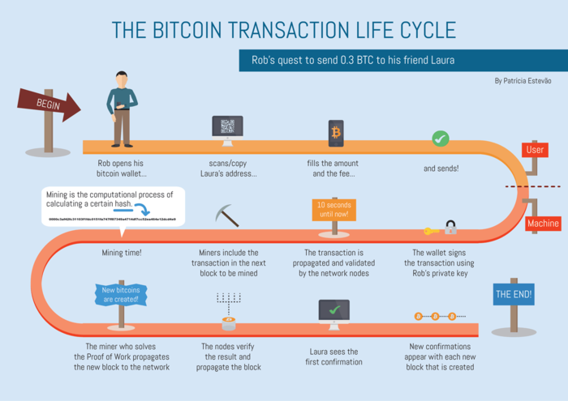

Where are the transactions create by the clients which will go to? It is an question when you're curiousity about transactions in blockchain. 

In bitcoin, you will know about the truth: "Each ten minutes, one block will be mined". And in a block, it can not contains so many transactions. Therefore, miner will choose the transactions that have high fee. 

So there are still transactions that miner will not choosed, where will it be contains?

This article will make you understand about this question and deeper blockchain.

 

## Talbe of Contents
- [Transaction pool](#transaction-pool)
- [How do transactions work](#how-do-transactions-work)

 

## Transaction pool
Transaction pool is the place where contains all of unconfirmed transactions. Transaction pool is stored on a special device and its contents can be accessed, observed in real time.

Confirmed transactions have the reversed meanings with the unconfirmed transactions. Confirmed transactions are the transactions which are included into the block in the blockchain.

 

## How do transactions work

Assuming that you want to send some of your bitcoin to your friend. You open your wallet, fill in information about the number of bitcoin that need to transfer and the address of receiver. 

When you press the *Send* button, bitcoin software will check your wallet that will be enough bitcoin to give the other person. If not, it will notify you about this problem. Reversely, it will examine the bitcoin that you have at the mommemt and the bitcoin at the unspent transaction outputs.

After completely check the wallet, it will broadcast this transaction onto the Bitcoin network and prepare to fully verified it.

Continuously, this transaction will be throw away to the **Transaction pool**. It is called the **Transaction pool** because the *nodes* on Bitcoin network stored it in RAM memory. A node is an electronic device that is a part of the Bitcoin network. 

Every node is running the Bitcoin Core software and holds a complete copy of the Blockchain. At the same time, each node contains its own unique set of unconfirmed transactions, means that it's impossible for a single node to contain the entirety of the transaction pool.

For your transaction to become completed, it needs to be confirmed/verified. To verify it, there is at least one miner that needs to pick it up from the Transaction pool and validate it. Miners are people who use their computers to process and confirm Bitcoin transactions. Ideally, a transaction from the Transaction pool will be verified 6 times before it becomes a part of the Blockchain. Once your transaction is verified 6 times, there is a 99.99% probability that is valid. 

Confirming bitcoin transactions is a task which requires plenty of computational power and electricity. Every time a miner validates a transaction, he will receive a compensation for his efforts which will be paid out in Bitcoin. This compensation is called as Transaction fee. 

All transactions in Transaction pool have the different transaction fees, so the miners can look for the transaction that has the highest fee, and validate it.

After your transaction is validated, it will become a part of the next block in the blockchain. And your transaction is received one confirmation. In Bitcoin, when you received enough 6 confirmations, your transaction will not be reversed.

After your transaction and the other transactions are confirmed transactions, they will be removed from the Transaction pool. This will sharply reduce the size of the Transaction pool and create space for information about new unconfirmed transactions to be stored.

Thanks for your reading.

 

Refer: 

[https://captainaltcoin.com/bitcoin-memory-pool-mempool/](https://captainaltcoin.com/bitcoin-memory-pool-mempool/)

[https://www.coindesk.com/information/how-do-bitcoin-transactions-work](https://www.coindesk.com/information/how-do-bitcoin-transactions-work)

[https://coinguides.org/bitcoin-mempool/](https://coinguides.org/bitcoin-mempool/)