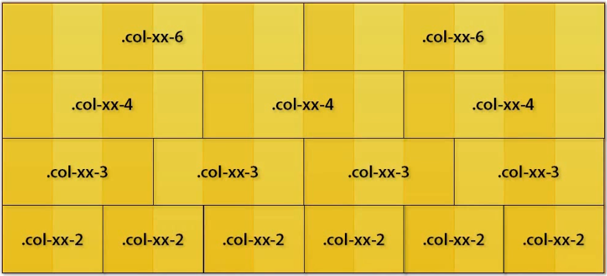
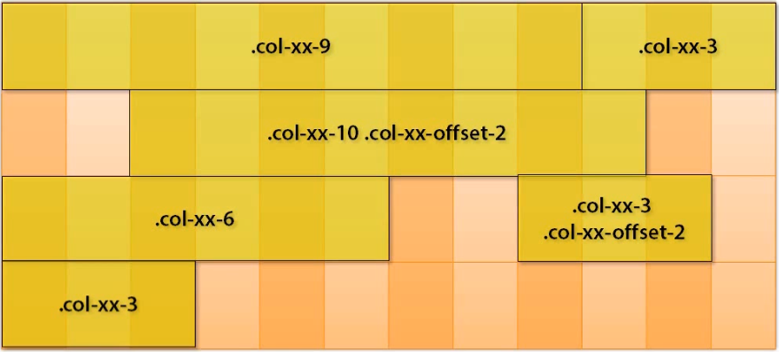
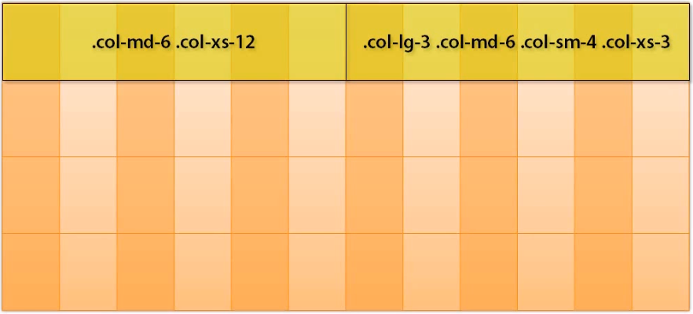

In order to improve the speed of making the website, I think that I have to learn about Bootstrap framework immediately. Because with bootstrap, you can easily make the website fast.

The belows is some basic titles about Bootstrap. 

<br>

## Table of Contents
- [Use bootstrap framework](#use-bootstrap-framework)
- [Container](#container)
- [Grid system](#grid-system)
- [Naviagtion bar](#naviagtion-bar)

<br>

## Use bootstrap framework

There are two ways to use the bootstrap, it includes: 
- Use the link to bootstrap files in the internet. 

```Html
<!doctype html>
<html lang="en">
<head>
    <!-- ... -->
    <!-- the compression css file of bootstrap 4 -->
    <link rel="stylesheet" href="https://maxcdn.bootstrapcdn.com/bootstrap/4.0.0-beta.2/css/bootstrap.min.css">
 
</head>
<body>
    <!-- ... -->
    <div class="container-fluid">
      <!-- do something here -->
    </div>
 
    <!-- The compression Jquery library is used for bootstap.min.js -->
    <script src="https://ajax.googleapis.com/ajax/libs/jquery/3.2.1/jquery.min.js"></script>
    <!-- The compression popper library is used for bootstrap.min.js -->
    <script src="https://cdnjs.cloudflare.com/ajax/libs/popper.js/1.12.6/umd/popper.min.js"></script>
    <!-- The compression js file of bootstrap 4, it should be lied before body tag-->
    <script src="https://maxcdn.bootstrapcdn.com/bootstrap/4.0.0-beta.2/js/bootstrap.min.js"></script>
</body>
</html>
```

- Download the bootstrap 4 at [Link bootstrap 4](https://getbootstrap.com/docs/4.0/getting-started/download/)
In order to download all necessary files in bootstrap 4, you can get from the links:
  - file bootstrap.min.js and bootstrap.min.css: it is in the **Compiled CSS and JS** of website https://getbootstrap.com/docs/4.0/getting-started/download/
  - file popper.min.js: https://github.com/FezVrasta/popper.js
  - file jquery.min.js: you can google for this file.

- The new feature of bootstrap 4 compares with bootstrap 3: 
  - Bootstrap 4 uses the Flexbox Grid, bootstrap 3 uses the float method.
  - Bootstrap 4 uses *rem* CSS units, bootstrap 3 uses px units.

<br>

## Container

There are two container classes to choose from: 
- .container class provides a responsive fixed width container.
- .container-fluid class provides a full width container, spanning the entire width of the viewport.

With **.container**, we have some cases: 
- If it is the extra small devices - screen width <= 576 px - means that it is **Phone**, this element's width is equal to 100%.

- If it is small devices - 768 px > screen width >= 576 px - means that it is **Phone**, this element will appear at the center of the screen and this element's width is equal to 576 px.

- If it is medium devices - 992 px > screen width >= 768 - means that it is **Tablet**, this element will appear at the center of the screen and this element's width is equal to 768 px.

- If it is large devices - 1200 px > screen width >= 992 px - means that is is **Desktop**, this element will appear at the center of the screen and this element's width is equal to 992 px.

- If it is xlarge devices - screen width >= 1200 px - means that is is **Desktop**, this element will appear at the center of the screen and this element's width is equal to 1200 px.

<br>

## Grid system
Bootstrap's grid system is built with flexbox and allows up to 12 columns across the page. 

The columns will re-arrange automatically depending on the screen size. 

Bootstrap 3, 4 include the concept of multiple grids, these are separate grids for each of the different resolution. 

Grid system has 5 classes: 
- .col-   (extra small devices - screen width <= 576px)
- .col-sm (small devices - screen width >= 576px)
- .col-md (medium devices - screen width >= 768px)
- .col-lg (large devices - screen width >= 992px)
- .col-xl (xlarge devices - screen width >= 1200px)

You have to create a row. Then, add the desired number of columns.



Ex: 

```html
<div class="row">
    <div class="col-sm-4">.col-sm-4</div>
    <div class="col-sm-8">.col-sm-8</div>
</div>
```

<br>

If you want to choose the offset value for the column, you can do with the below guides: 



<br>
Using the multiple grids make your website flexible when user opens the website with the different screens. With the each specify screen, the responsed grid will be choosed.



Ex: Sample for using multiple grids. 

```HTML
<div id="page">
    <header class="container">
    </header>
    <section id="body" class="container">
        <section id="main" class="col-md-8 col-sm-9"></section>
    </section>
    <section id="sidebar" class="col-md-4 col-sm-3"></section>
    <footer class="container">...</footer>
</div>
```


Note: 
- Image is got from the "Bootstrap 3" course in pluralsight.com

<br>

## Naviagtion bar
A navigation bar is a navigation header that is placed at the top of the page.

With navigation bar, it has two state that depends on the size of screen: 
- expand
- collapse

One **.navbar** can contains one or many **.navbar-nav**. To split up the position among the **.navbar-nav**, you can use the **mr-auto** (margin right auto) class or **ml-auto** (margin left auto).

And in **.navbar**, you also use with form.

The inside of **.navbar-nav** contains many **.nav-item**.  


With **.navbar** class, you can use to accompany with some class **.nav-bar-expand-xl\|lg\|md\|sm**.

**.justify-content-center** make the **.navbar** lie at the center of the navigation bar.

In order to change the state of **nav-item** between active and disabled, you can use **active** class and **disabled** class.


Ex: 
```html
<nav class="navbar navbar-expand-sm bg-light justify-content-center">
    <a class="navbar-brand" href="#">HOME</a>   <!-- (1) -->
    <a class="navbar-brand" href="#">   <!-- (2) -->
        
    </a>
    <ul class="navbar-nav">
        <li class="nav-item">  <!-- (3) -->
            <a class="nav-link navbar-brand" href="#">Name of website</a>
        </li>
        <li class="nav-item active">
            <a class="nav-link" href="#">HTML</a>
        </li>
        <li class="nav-item disabled">
            <a class="nav-link" href="#">CSS</a>
        </li>
        <li class="nav-item">
            <a class="nav-link" href="#">Javascript</a>
        </li>
    </ul>
</nav>
```

Beside the navigation item, you can insert the **.navbar-brand** to display the name or logo of website. You can place the **.navbar-brand** at the above (1), (2) and (3).


When the size of screen is made smaller than the begining point, you can use the collapse state to hide the *navbar-item*s.

You can use some class that is related to the collapse state: 
- collapse
- navbar-collapse
- navbar-toggler

Ex: 

```html
<nav class="navbar navbar-expand-sm navbar-dark fixed-top">
    <a class="navbar-brand" href="#">Name of website</a>

    <!-- Collapse button -->
    <button class="navbar-toggler" type="button" data-toggle="collapse" data-target="#collapse-navbar">
        <span class="navbar-toggler-icon"></span>
    </button>

    <div class="collapse navbar-collapse" id="collapse-navbar">
        <ul class="navbar-nav ml-auto">        
            <li class="nav-item active">
                <a class="nav-link" href="#">HTML</a>
            </li>
            <li class="nav-item disabled">
                <a class="nav-link" href="#">CSS</a>
            </li>
            <li class="nav-item">
                <a class="nav-link" href="#">Javascript</a>
            </li>
        </ul>
        <ul class="navbar-nav mr-auto">
            <form class="form-inline" action="/page">
                <input class="form-control mr-sm-2" type="text" placeholder="Search">
                <button class="btn btn-warning" type="submit">Search</button>
            </form>
        </ul>
    </div>
</nav>
```


When you want to squeeze some items in **.nav-item**, you can use the **dropdown** class in **.nav-item**.

Ex: 

```html
<li class="nav-item dropdown">
    <a class="nav-link dropdown-toggle" href="#" id="drop-navitem" data-toggle="dropdown">Front-end</a>
    <div class="dropdown-menu">
        <a class="dropdown-item" href="#">Javascript</a>
        <a class="dropdown-item" href="#">CSS</a>
        <a class="dropdown-item" href="#">HTML</a>
    </div>
</li>
```

Thanks for our reading.