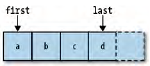

Hi, everyone. Clean code is the way that you learn to write code clearly, understandably, and easily maintain. 

So, in this article, I will notes some tips about clean code in book **The art of readable code** of the two author - **Dustin Boswell** and **Trevor Foucher**.

<br>

## Table of Contents
- [Must-remember key idea](#1-must-remember-key-idea)
- [Naming the variable, function and class](#2-naming-the-variable-function-and-class)
- [Organize Code](#3-organize-code)
- [Comment](#4-comment)

<br>

## 1. Must-remember key idea

- Code should be easy to understand.

- Code should be written to minimize the time it would take for someone else to understand it. 

I think the two idea is above, you have to always remember, because the performance of computer is greater than before, so the size of RAM is bigger, the speed of CPU is faster. So you should not worry about the hardware of computer.

And the maintaining software is the worst time that I have done. Because you have to read about approximately one thousand line of code in one function. It takes so much time to understand. But when you know the root of cause, bug will be fixed in shortest time. 

Beside the optimizing of design and using the compatible of algorithm and data structure, code is written to be easy to understand that is crucial at the surface-level.

<br>

## 2. Naming the variable, function and class

KEY IDEA: 

```
- Pack information into your names.
- It's better to be clear and precise than to be cute.
- Actively scrutinize your names by asking yourself, "What other meanings could someone interpret from this name?".
```


### 2.1. Variable's name and Class's name

To assign the class's name, you can use the **CamelCase** and focus on the content of this class. 

In C++, you can choose the class's name with **C** character as the prefix (**C** means class).

<br>

Continuously, you will go to the variable's name. 

The choose the name for variable is as same as naming class. When you understand the target of this variable, you still have to know the scope or lifetime of it.

- Returned variable: avoid choosing the generic name such as retval. Because when you see it at the first time, you only know that "It is used to return value". Outside of it, I do not predict the other meanings of it.

    For example: 

    ```Javascript
    let euclidean_norm = function(v) {
        let retval = 0.0;  // should name to sum_squares
        for (let i = 0; i< v.length; ++i) {
            retval += v[i] * v[i];

            // you will identify bug obviously when the expression have: 
            // sum_squares += v[i];
        }

        return Math.sqrt(retval);
    }
    ```

    A better name would describe the purpose of the variable or the value it contains.

- Temporary variable: The name **tmp** should be used in cases when being short-lived and temporary is the most important fact about that variable.

    For example: 

    ```C++
    if (right < left) {
        let tmp = right; 
        right = left;
        left = tmp;
    }
    ```

    You can find that the **tmp** variable has temporary storage, with a lifespan of only a few lines. So you can choose this name for this variable.

    For example:

    ```Javascript
    String tmp = user.name();
    tmp += " " + user.phone_number();
    tmp += " " + user.email();
    ...
    template.set("user_info", tmp);
    ```

    Even though this variable has a short lifespan, being temporary storage isn't the most important thing about this variable. Instead, a name like *user_info* would be more descriptive. 

- Iterator variable: Normally, the i, j, k keywords are usually used as iterator variable in the loop statements. But when you have many nested loops, it make some arduous bug that you can not detect. 

    So, you can append the first character of the array variables into the iterator variables.

    ```C++
    for (int ci = 0; i < clubs.size(); ++i)
        for (int mi = 0; j < clubs[ci].members.size(); ++j)
            for (int ui = 0; k < users.size(); ++k)
                if (clubs[ci].members[mi] == users[ui])
                    cout << "user[" << ui << "] is in club[" << ci << "]";
    ```

- Normal variable: If a variable contains something that the reader must know, you can attach an extra word to the variable's name.
    For example: 

    ```C++
    std::string strId_Hex = "af84ef845cd8";  // format of strId is hexa
    ```

    If your variable is **a measurement** (such as amount of time or a number of bytes). It's helpful to encode the units into the variable's name. 

    For example: 

    ```Javascript
    let start_ms = (new Date()).getTime();
    ...
    let elapsed_ms = (new Date()).getTime() - start_ms;
    ...
    ``` 

    The belows is the table that contains unitless function parameter, and the variable with units. 

    | Function parameter | Parameter with units |
    | ------------------ | -------------------- |
    | Start(int delay)   | delay -> delay_secs  |
    | CreateCache(int size) | size -> size_mb   |
    | ThrottleDownload(float limit) | limit -> max_kbps |
    | Rotate(float angle) | angle -> degrees_cw |

    <br>

    When the variable contains an important information that is related to the **security** such as encoding of a string, encrypted string, ..., you can attach this information to this variable. 

    | Situation | Better name |
    | --------- | ----------- |
    | A password is in *plaintext* and should be encrypted before further processing | plaintext_password |
    | A user-provided comment that needs escaping before being displayed | unescaped_comment |
    | Bytes of html have been converted to UTF8 | html_utf8 |
    | Incoming data has been *url encoded* | data_urlenc |

    For example: 
    
    Use **$** symbol for the JQuery object.

    ```Javascript
    let $all_images = $('img');   // $all_images is a JQuery object
    let height = 200;       // height is not
    ```

    In HTML/CSS, use underscores to seperate words in IDs, and dashes to separate words in classes

    ```HTML
    <div id="middle_column" class="main-content">
    ...
    ```

    <br>

    Based on the **scope of variable**, you can choose the suitable name for it. Chooing shorter name for shorter scope and long name for large scope. 

    For example: 

    ```C++
    if (debug) {
        map<string, int> m;
        LookUpNamesNumbers(&m);
        Print(m);
    }
    ```

    Because m is a variable that only exists in the short if statement. And the reader can easily get all the information about **m variable**. 

    But you have to take care about it when it is global variable or a class member. Then, **m variable** have longer name to pack enough information about it.

    <br>

    **Prefer min and max for (Inclusive) limits**

    ```
    The clearest way to name a limit is to put max_ and min_ in front of the thing being limited.
    ```

    For example:

    ```Python
    MAX_ITEMS_IN_CART 10
    
    if shopping_cart.num_items() > MAX_ITEMS_IN_CART:
        Error("Too many items in cart.")
    ```
    <br>

    **Prefer first and last for Inclusive Ranges**

    

    For *inclusive* ranges where the range should include end point, a good choice is **first/last**.

    Example: 

    ```Python
    set.PrintKeys(first="Bart", last="Maggie")
    ```
    <br>

    **Prefer begin and end for Inclusive/Exclusive Ranges**

    

    <br>

    **Naming Booleans**

    When you want to choose name for the boolean variable, you should add words like **is, has, can, should** that make booleans more clear.

    It's best to avoid *negated* terms in a name. 

    For example: 

    ```C++
    bool disable_ssl = false;  // should not use.
    bool use_ssl = true;   // should use it.
    ```

### 2.2. Function's name
With the name of function, you should choose the specific words, avoiding **empty** words to concentrate on the target of this function. 

You have to wonder some questions with "Why, Which, What, Where, How, Who" to make the problem clear by yourself. And you have to understand some steps that will be implemented in the function. Then, based on them, you can choose the function's name.

For example:

```python
def GetPage(url):
    ... 
```

When you see the name of function **GetPage()**, immediately, you have the questions "What is the page?", "Where do you get the page?". The "get" verb is very common, not particular. And you should understand the **Page** like the back of your hand.

If the function get page from a local cache, or from database, you can attach the strings "FromLocal", or "FromDatabase" to this above function.

If the function get from internet, you can use some other verbs, such as **download, fetch**. With them, you have **downloadPage()** or **fetchPage()**.

<br>
Another example:

```python
class BinaryTree {
    int Size();
}
```

"What did the **Size()** method calculate?" is the first question you think. It can be the height of the tree, the number of nodes, the memory footprint of the tree. 

You can turn this **Size()** method into something like **Height()**, **NumNodes()**, or **MemoryBytes()**.

<br>
Example:

```python
results = Database.all_objects.filter("year <= 2011");
```

It turns out that filter is the ambiguous word. It can mean *to pick out* or *to get rid of*. It's best to avoid the name *filter* because it's so easily mistrusted.

So, to want *to pick out*, a better name is **select()**. To want *to get rid of*, a better name is **exclude()**.

<br>

The belows is the set of verbs that you need to naming the function.

| Word | Alternatives |
| ---- | ------------ |
| send | deliver, dispatch, announce, distribute, route |
| find | search, extract, locate, recover |
| start | launch, create, begin, open |
| make | create, setup, build, generate, compose, add, new |


<br>

**Rule for naming function**

- Function names should be verbs if the function changes the state of the program, and nouns if they're used to return a certain value.

- Use **get** when it gets the data locally from class variable or has a calculation. (Ex: person.getAge()).

- Use **retrieve** when it must get the data from the outside (Ex: from database: db.retrieveUserById(id))

<br>

## 3. Organize Code


<br>

## 4. Comment


<br>

Thanks for your reading.