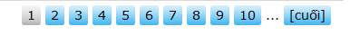

In this article, we will continue finding out something about bootstrap 4. 

Let's get started.

<br>

## Table of Contents
- [Menu](#menu)
- [Jumbotron](#jumbotron)
- [Collapse with button and anchor](#collapse-with-button-and-anchor)
- [Accordion](#accordion)
- [Dropdown state](#dropdown-state)
- [Pagination](#pagination)
- [Form](#form)

<br>

## Menu
In bootstrap 4, there are two types of menu. It includes: 
- horizontal menu
- vertical menu

To make horizontal menu, add the **.nav** class to a \<ul\> element, followed by **.nav-item** for each \<li\> and add the **.nav-link** class to their links.

To make the vertical menu, add the **.flex-column** class into the \<ul\> element that is behind the **.nav** class.

Ex:

```html
 <ul class="nav">
  <li class="nav-item">
    <a class="nav-link" href="#">Html</a>
  </li>
  <li class="nav-item">
    <a class="nav-link" href="#">Javascript</a>
  </li>
</ul> 
```

To make the tabs, you can add the **.nav-tabs** class in \<ul\> element. 

<br>

## Jumbotron
A jumbotron indicates a big grey box for calling extra attention to some special content or information.

Use **.jumbotron** or **.jumbotron-fluid** classes to create a jumbotron. Inside of **.jumbotron-fluid**, you can insert the **.container** or **.container-fluid** classes to make a full-width jumbotron without rounded borders.

Ex:

```html
<div class="jumbotron jumbotron-fluid">
  <div class="container">
    ...
  </div>
</div>
```

<br>

## Collapse with button and anchor
When you want to hide the contents of the other elements, you can use **.collapse** class to set collapsable state for these elements. 

To control (show/hide) the collapsible content, add the **data-toggle="collapse"** attribute to an \<a\> or a \<button\> element. Then add the **data-target="#id"** attribute to connect the button with the collapsible content (\<div id="demo"\>).

Ex: 

```html
<button data-toggle="collapse" data-target="#collapsedElement">Click</button>

<div id="collapsedElement" class="collapse">
  ...
</div>
```

Before we practice collapsing with button, now, we will continue with anchor.

With anchor, we will do something like collapse with button. But replacing the **data-target** property in **collapse with button**, use **href** property in **\<a\>**.

```html
<div class="content">
   <a class="btn btn-primary" data-toggle="collapse" href="#collapse_target">Click here</a>

   <div id="collapse_target" class="collapse">
      Lorem ipsum dolor text....
   </div>
</div>
```

Apart from **\<a\>** element that is used with **href**, all other tags can be used with **data-target**.

The Bootstrap collapse plugin requires the two elements to work properly - the controller element such as a button or hyperlink by clicking on which you want to collapse the other element, and the collapsible element itself. 

- The ```data-toggle="collapse"``` attribute is added to the controller element along with a attribute ```data-target``` (for buttons) or ```href``` (for anchors) to automatically assign the control of a collapsible element.

- The ```data-target``` or ```href``` attribute accepts a CSS selector to apply the collapse to a specific element. Be sure to add the class ```.collapse``` to collapsible element.

- We can optionally add the class ```.in``` to the collapsible element, we can utilize the Bootstrap panel component.

To gain more information about collapsing elements, we can refer to the [link](https://www.tutorialrepublic.com/twitter-bootstrap-tutorial/bootstrap-accordion.php).

<br>

## Accordion
Be simplicity, accordion contains many collapsable elements. Accordion allows showing only one collapsed element at the same time.

```html
<div id="accordion" class="panel-group">
   <div class="panel panel-default">
      <div class="panel-heading">
            <h4 class="panel-title">
               <a data-toggle="collapse" data-parent="#accordion" href="#collapseOne">1. What is HTML?</a>
            </h4>
      </div>

      <div id="collapseOne" class="panel-collapse collapse in">
            <div class="panel-body">
               <p>HTML stands for HyperText Markup Language. HTML is the standard markup language for describing the structure of web pages. <a href="https://www.tutorialrepublic.com/html-tutorial/" target="_blank">Learn more.</a></p>
            </div>
      </div>
   </div>

   <div class="panel panel-default">
      <div class="panel-heading">
            <h4 class="panel-title">
               <a data-toggle="collapse" data-parent="#accordion" href="#collapseTwo">2. What is Bootstrap?</a>
            </h4>
      </div>

      <div id="collapseTwo" class="panel-collapse collapse in">
            <div class="panel-body">
               <p>Bootstrap is a sleek, intuitive, and powerful front-end framework for faster and easier web development. It is a collection of CSS and HTML conventions. <a href="https://www.tutorialrepublic.com/twitter-bootstrap-tutorial/" target="_blank">Learn more.</a></p>
            </div>
      </div>
   </div>

   <div class="panel panel-default">
      <div class="panel-heading">
            <h4 class="panel-title">
               <a data-toggle="collapse" data-parent="#accordion" href="#collapseThree">3. What is CSS?</a>
            </h4>
      </div>

      <div id="collapseThree" class="panel-collapse collapse">
            <div class="panel-body">
               <p>CSS stands for Cascading Style Sheet. CSS allows you to specify various style properties for a given HTML element such as colors, backgrounds, fonts etc. <a href="https://www.tutorialrepublic.com/css-tutorial/" target="_blank">Learn more.</a></p>
            </div>
      </div>
   </div>
</div>
```

```javascript
$(document).ready(function(){
   // Add minus icon for collapse element which is open by default
   $(".collapse.in").each(function(){
      $(this).siblings(".panel-heading").find(".glyphicon").addClass("glyphicon-minus").removeClass("glyphicon-plus");
   });

   // Toggle plus minus icon on show hide of collapse element
   $(".collapse").on('show.bs.collapse', function(){
      $(this).parent().find(".glyphicon").removeClass("glyphicon-plus").addClass("glyphicon-minus");
   }).on('hide.bs.collapse', function(){
      $(this).parent().find(".glyphicon").removeClass("glyphicon-minus").addClass("glyphicon-plus");
   });
});
```

<br>

## Dropdown state


<br>

## Pagination
Pagination is used to go to the other pages in website quickly. The pagination have the image: 



To create a basic pagination, add the **.pagination** class to an <ul> element. Then add the **.page-item** to each <li> element and a **.page-link** class to each link inside <li>:

About adjusting the size of pagination, you have some classes such as **pagination-sm**, **pagination-lg**. 


Ex: 

```html
<ul class="pagination pagination-sm justify-content-left">
  <li class="page-item disabled"><a class="page-link" href="#">1</a></li>
  <li class="page-item"><a class="page-link" href="#">1</a></li>
  <li class="page-item active"><a class="page-link" href="#">2</a></li>
  <li class="page-item"><a class="page-link" href="#">...</a></li>
  <li class="page-item"><a class="page-link" href="#">Final</a></li>
</ul>
```

<br>

## Form

Bootstrap has 3 ways to arrange the elements in the form.
- Use **.form-group** to organize elements vertically
- Use **.form-inline** to organize element horizontally
- Put the elements into the Grid system, you can use the **.form-row** class.

Ex:

```html
<form>
<!-- Vertically -->
<div class="form-group">
    <label for="myEmail">Email</label>
    <input type="email" id = "myEmail" class="form-control" placeholder="Email">
    <label for="myPassword">Password</label>
    <input type="password" id="myPassword" class="form-control" placeholder="Password">
    <button type="submit" class="btn btn-primary">Submit</button>
</div>
</form>
```

```html
<form>
   <!-- Horizontally -->
   <div class="form-inline">
      <label for="myEmail">Email</label>
      <input type="email" id="myEmail" class="form-control" placeholder="Email">
      <label for="myPassword">Password</label>
      <input type="password" id="myPassword" class="form-control" placeholder="Password">
      <button type="submit" class="btn btn-primary">Submit</button>
   </div>
</form>
```

```html
<form>
   <!-- Grid -->
   <div class="row">
      <div class="col-6 col-sm-4">
         <input type="text" class="form-control" placeholder=".col-6 .col-sm-4">
      </div>
      <div class="col-6 col-sm-8">
         <input type="text" class="form-control" placeholder=".col-6 .col-sm-8">
      </div>
   </div>
</form>
```

```html
<form>
   <!-- Grid - form-row -->
   <div class="form-row">
      <div class="col-6 col-sm-4 form-group">
         <label>Product Code</label>
         <input type="text" class="form-control" placeholder=".col-6 .col-sm-4">
      </div>
      <div class="col-6 col-sm-8 form-group">
         <label>Product Name</label>
         <input type="text" class="form-control" placeholder=".col-6 .col-sm-8">
      </div>
   </div>
</form>
```

The following are the controls that is used in the form. 
- Use **.btn** class with type=button\|reset\|submit for button control.
- Use **form-check-input**, **.form-check-label** classes with type=checkbox\|radio to make the checkbox or radio for input control.
- Use **form-control** class with type=text\|password\|email\|search\|url\|tel\|number\|color\|date\|time\|datetime-local\|month\|week for input control.
- Use **.form-control-file** class with type=file.
- Use **.form-control-range** class with type=range.


Thanks for your reading.