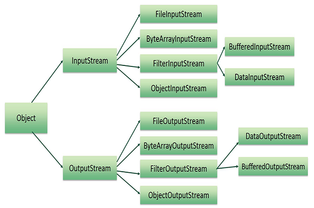

Implementation with file is very crucial for programmer. Master read/write file is obligated with them. 

In C++, there are some functions that is related to the implementation with file, such as: read file with text, binary mode by ifstream (support read file), ofstream (support write file), fstream (support both read/write file). 

But in Java, it supports so many classes, methods for reading/writing file. It will make you difficult about how to use it. Today, in this article, we will find out something about it, and specify them when to use, which pros and cons of them.

<br>

## Table of Contens
- [Introduction about stream](#introduction-about-stream)
  - [The Byte stream classes](#the-byte-stream-classes)
  - [The Character stream classes](#the-character-stream-classes)
  - [Data streams](#data-streams)
  - [Object streams](#object-streams)
- [When to use Byte streams](#when-to-use-byte-streams)
- [When to use Character streams](#when-to-use-character-streams)
- [The difference between FileInputStream and FileReader](#the-difference-between-fileinputstream-and-filereader)
- [Wrapping up](#wrapping-up)

<br>

## Introduction about stream
In order to use classes, methods that perform I/O, especially reading, writing file, you must use **java.io** package. This package support many data such as primitives, object, localized characters, ...

IO streams are flows of data that you can read, write.

There are two kinds of stream in Java. 
- **InputStream** : used to read file
- **OutputStream** : used to write file

Similiarity with C++, when implementing with files, it has two mode: binary mode, text mode, Java also supports Byte stream and Character stream. But these classes can used in a larger context when comparing with C++.

- Byte streams are used to perform input and output of 8-bit bytes, like *InputStream* or *OutputStream*, but with the exception of the *DataInputStream* and *DataOutputStream* can also read and write *int, long, float* and *double* values. All other stream types are built on byte streams.

- Character streams are used to perform input and output for 16-bit Unicode. It can be called as **Reader** or **Writer**. Character stream I/O automatically translates this format to and from the local character set. In Western locales, the locale character set is usually an 8-bit superset of ASCII.

    Character streams are often "wrapper" for byte streams. The character stream uses the byte stream to perform the physical I/O, while the character stream handles translation between characters and bytes. 

    For example: 

    FileReader class uses FileInputStream

    FileWritter class uses FileOutputStream

    ```
    There are two general-purpose byte-to-character "bridge" streams: InputStreamReader and OutputStreamWriter. Use them to create streams when there are no prepackaged character stream classes that meet your needs.
    ```

<br>

Belows are the image about a hierachy of classes in Input/Output stream.



<br>

## The Byte stream classes
The hierarchical layout is as follows:
- InputStream: Top level abstract class for byte-oriented input stream.

    - ByteArrayInputStream: An instance of this class contains an internal buffer to read bytes stream.

    - FilterInputStream: An instance of this class contains some other input stream as a basic source of data for further manipulation.
        - BufferInputStream: This enables a *FilterInputStream* instance to make use of a buffer for input data.
        - DataInputStream: An instance of this class enables reading primitive Java types from an underlying input stream in a machine-independent manner.
        - LineNumberInputStream: An instance of this class aids in keeping track of the current line number of the input stream.
        - PushbackInputStream: This provides the ability to push back, or "unread," a data byte after reading it.

    - FileInputStream: An instance of this class is used to obtain input bytes from a file in a file system.

    - ObjectInputStream: An instance of this class is used to deserialize an object after it has been serialized by ObjectOutputSteam.

    - PipedInputStream: An instance of this class provides a pipe or buffer for an input byte that works in the FIFO manner.

    - SequenceInputStream: An instance of this class represents a logical concatenation of two or more input streams which are read in sequence, one after another.

- OutputStream: Top-level abstract class for byte-oriented input stream.

    - ByteArrayOutputStream: An instance of this class contains an internal buffer to write a bytes stream.

    - FilterOutputStream: An instance of this class contains some other output stream as a basic source of data for further manipulation.
        - BufferedOutputStream: This enables a FilterOutputStream instance to make use of a buffer for output data.
        - DataOutputStream: An instance of this class enables writing primitive Java types to an underlying output stream in a machine-independent manner.
        - PrintStream: This empowers the OutputStream objects with the ability to print representations of various data values conveniently.

    - FileOutputStream: An instance of this class is used to output a stream for writing data to a file or to a file descriptor.

    - ObjectOutputStream: An instance of this class is used to serialize an object which can be deserialized with ObjectInputStream.

    - PipedOutputStream: An instance of this class provides a pipe or buffer for output byte that works in the FIFO manner.

<br>

## The Character stream classes
Belows are the hierachy of classes in Character streams.

- Reader: Top-level abstract class to read to character streams.

    - BufferedReader: Provides an in-between buffer for efficiency while reading text from character input stream.
        - LineNumberReader: Uses a buffered character input stream that keeps track of line numbers.

    - CharArrayReader: Implements an auto-increasing character buffer that may be used as a reader.

    - FilterReader: An instance of this class is used for reading character files.
        - PushbackReader: This enables a character to be pushed back into the stream after reading.

    - InputStreamReader: An instance of this class provides a bridge from byte streams to character streams. Bytes are decoded into characters using a specified character set.
        - FileReader: An instance of this class is used for reading character files.

    - PipedReader: Uses a pipe for character input stream.

    - StringReader: Character output stream reader from source string.

- Writer: Top-level abstract class to write to character streams.

    - BufferedWriter: Provides an in-between buffer for efficiency while writing text to a character output stream.

    - CharArrayWriter: Implements an auto-increasing character buffer that may be used as a writer.

    - FilterWriter: Abstract class for writing filtered character streams.

    - OutputStreamWriter: An instance of this class provides a bridge between character streams and byte streams. Characters are encoded into bytes using a specified character set.
        - FileWriter: An instance of this class is used for writing character files.

    - PipedWriter: Uses a pipe for character output stream.

    - PrintWriter: Prints a formatted representation of an object to a test-output stream.

    - StringWriter: Character output stream is collected in a string buffer and may be used for constructing a string.

<br>

## Data streams

Data streams support binary I/O of primitive data type values (boolean, char, byte, short, int, long, float and double) as well as String values. 

All data streams implement either the **DataOutput** interface or the **DataInput** interface. 

To read/write numeric data, use **readXXX()** method or **writeXXX()** method. XXX can be something like Int, Double, Short, ...

To read/write string data type, use **readUTF()** method or **writeUTF()** method with encoding UTF8.

For example: To make the **DataOutputStream**, **DataInputStream**, follow the below way:

```Java
DataOutputStream out = new DataOutputStream(new BufferedOutputStream(new FileOutputStream(dataFile)));
...

DataInputStream in = new DataInputStream(new BufferedInputStream(new FileInputStream(dataFile)));

try {
    while (true) {
        price = in.readDouble();
        unit = in.readInt();
        desc = in.readUTF();
        System.out.format("You ordered %d" + " units of %s at $%.2f%n",
            unit, desc, price);
        total += unit * price;
    }
} catch (EOFException e) {
    ...
}
```

DataStreams detects an end-of-file condition by catching **EOFException**, instead of testing for an invalid return value.

DataStreams uses one very bad programming technique: it uses floating point numbers to represent monetary values. In general, floating point is bad for precise values. It's particularly bad for decimal fractions,because common values (such as 0.1) do not have a binary representation.

The correct type to use for currency values is **java.math.BigDecimal**. Unfortunately, **BigDecimal** is an object type, so it won't work with data streams. However, **BigDecimal** will work with object streams, which are covered in the next section.

<br>

## Object streams

Object streams support I/O of objects. Most standard classes support serialization of their objects. They implement interface Serializable.

The object stream classes are **ObjectInputStream** and **ObjectOutputStream**. These classes implement **ObjectInput** and **ObjectOutput**, which are subinterfaces of **DataInput** and **DataOutput**. 

That means that all the primitive data I/O methods covered in Data Streams are also implemented in object streams. So an object stream can contain a mixture of primitive and object values.

To read/write with Object streams, use **readObject()** method and **writeObject()** method.

<br>

## When to use Byte streams
- When you want to process raw data like binary files.

    For example, we can use FileInputStream to read byte-oriented data such as image data, audio, video, ...

<br>

## When to use Character streams
- Process text files. These text files can be processed character by character. A character size is typically 16 bit.

<br>

## The difference between FileInputStream and FileReader
1. **FileInputStream** reads data from Byte stream, **FileReader** reads data from Character stream.

    - The **read()** method of **FileReader** will read one character at a time.

        ```java
        try {
            String path = "...";
            FileReader fileReader = new FileReader(path);
            int i = fileReader.read();

            while (i != -1) {
                System.out.print((char) i);
                i = fileReader.read();
            }
        } catch(FileNotFoundException ex) {
            // log exception
        }
        ```

    - The **read()** method of **FileInputStream** will read one byte at a time.

        ```java
        try {
            String path = "...";
            FileInputStream fis = new FileInputStream(path);
            int b = fis.read();
            
            while(b != -1) {
                System.out.print(b);
                b = fis.read();
            }
        } catch (FileNotFoundException ex) {
            // ... log
        }
        ```

        Each time **FileInputStream.read()** is called, a call is made to read a system file. This **read()** method will read 1 byte (8-bit) at a time.

2. **FileReader** automatically converts the raw bytes into characters by using platform's default character encoding.

    So, we will use **FileReader** to read file that has same character encoding with platform's default character encoding.

    If that file is encoded in a different character encoding, we should use **InputStreamReader** that we can configure character encoding. Also, we can use FileInputStream as a source for **InputStreamReader**. **InputStreamReader** caches the character encoding which means we cannot change the encoding scheme programmatically.

<br>

## The difference between ByteArrayInputStream and BufferedInputStream

- The **ByteArrayInputStream** and **BufferedInputStream** are extended from **InputStream** class.

    - About **ByteArrayInputStream**

        A **ByteArrayInputStream** contains an internal buffer that contains bytes that may be read from the stream. An internal counter keeps track of the next byte to be supplied by the read method.

        Closing a **ByteArrayInputStream** has no effect. The methods in **ByteArrayInputStream**'s classes can be called after the stream has been closed without generating an **IOException**.

        **ByteArrayInputStream** is like wrapper which protects underlying array from external modification.

        If our input is always a byte[], then we should use ByteArrayInputStream. Because the constructor of **ByteArrayInputStream** that reads through a byte[], does no actual I/O operation.

    - About **BufferedInputStream**

        BufferedInputStream reads bytes from another InputStream such as FileInputStream, ... So, we can wrap another InputStream into BufferedInputStream.

        ```java
        // FileInputStream reads bytes from a file
        FileInputStream fis = new FileInputStream("...");
        BufferedInputStream bis = new BufferedInputStream(fis);
        ```

        When **BufferedInputStream.read()** is called mostly data is read from the buffer. When data is not available in buffer, a call is made to read system file and lot of bytes, maybe 128 bytes, are kept in buffer.

        **BufferedInputStream.readLine()** method reads whole line and keep it in buffer.

<br>

## Wrapping up
- Names of character streams typically end with Reader/Writer and names of byte streams end with InputStream/OutputStream.
- Should use Buffer streams with Byte streams (BufferInputStream / BufferOutputStream) and Character streams (BufferReader / BufferWriter).
- It is highly recommended to close the stream when it is no longer in use. This ensures that the streams won't be affected if any error occurs. 


Refer:

[https://www.geeksforgeeks.org/different-ways-reading-text-file-java/](https://www.geeksforgeeks.org/different-ways-reading-text-file-java/)

[https://www.geeksforgeeks.org/scanner-class-in-java/](https://www.geeksforgeeks.org/scanner-class-in-java/)

[https://www.geeksforgeeks.org/java-io-bufferedreader-class-java/](https://www.geeksforgeeks.org/java-io-bufferedreader-class-java/)

[https://www.geeksforgeeks.org/file-handling-java-using-filewriter-filereader/](https://www.geeksforgeeks.org/file-handling-java-using-filewriter-filereader/)

[https://www.tutorialspoint.com/java/java_files_io.htm](https://www.tutorialspoint.com/java/java_files_io.htm)

[http://tutorials.jenkov.com/java-io/streams.html](http://tutorials.jenkov.com/java-io/streams.html)

[https://www.developer.com/java/data/understanding-byte-streams-and-character-streams-in-java.html](https://www.developer.com/java/data/understanding-byte-streams-and-character-streams-in-java.html)

[https://docs.oracle.com/javase/tutorial/essential/io/index.html](https://docs.oracle.com/javase/tutorial/essential/io/index.html)

<br>

**BufferedInputStream**

[https://www.javamadesoeasy.com/2015/08/difference-between-fileinputstream-and.html](https://www.javamadesoeasy.com/2015/08/difference-between-fileinputstream-and.html)