In this article, we will learn how to use concurrent collections in Java.

<br>

## Table of contents
- [Introduction to collections in Java's multithreading](#)
- [How to use Vector](#how-to-use-vector)
- [How to use Queue/Stack](#how-to-use-queue/stack)
- [How to use Map](#how-to-use-map)
- [How to use Concurrent Skip List](#how-to-use-concurrent-skip-list)
- [Wrapping up](#wrapping-up)


<br>

## Introduction to collections in Java's multithreading

The Collection framework has been released in Java 2 in 1998 with 4 interfaces for collection such as **Collection**, **List**, **Set**, and **SortedSet**.

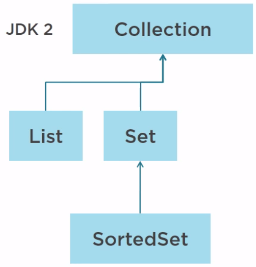

In Java 5, 4 more interfaces have been added such as **Queue** and **Deque**, which stands for double-ended queue, and two concurrent structures, **BlockingQueue** and **BlockingDeque**.

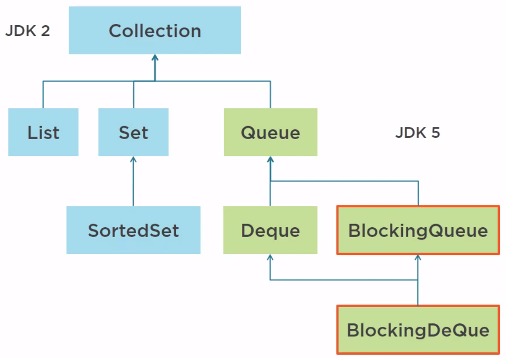

In Java 6, the **NavigableSet** not concurrent has been added. 


In Java 7, the **TransferQueue**, which is an extension of the **BlockingQueue**, has been added to the Collection framework and it is indeed a concurrent structure.

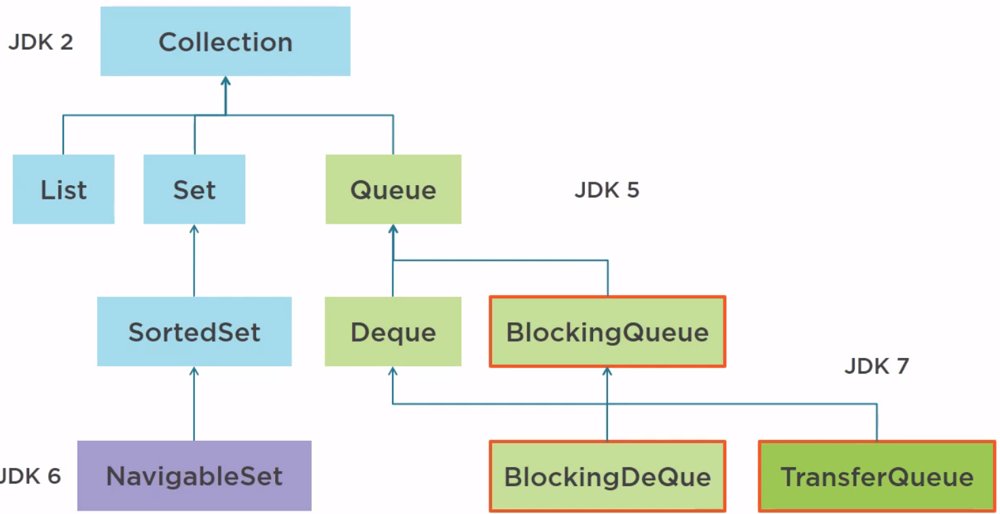

As for the **Map**, the first version of the Collection framework was released with **Map** and **SortedMap**, not concurrent.

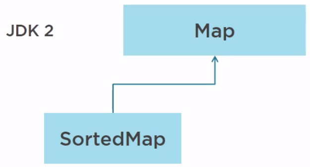

In Java 5, the **ConcurrentMap** has been added.

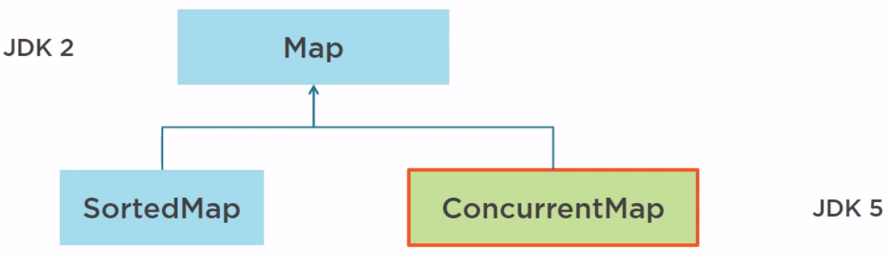

In Java 6, **NavigableMap**, not concurrent, and **ConcurrentNavigableMap** have been added.

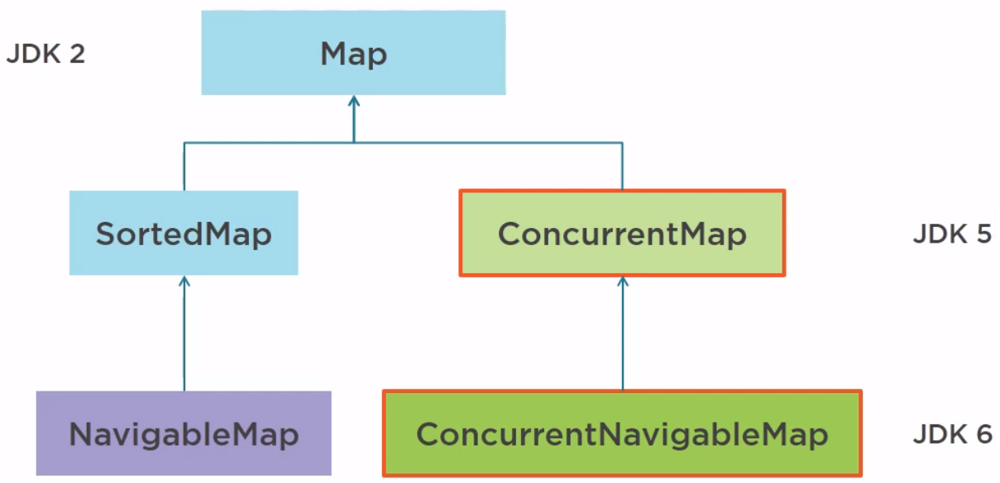


In Java, we have some collections that support multithreading such as:
- With normal collections, we have:

    - **Vector**, **Stack** that extends **Vector**, **Hash Table**, all of them have some methods with **synchronized** keyword by default.

        For instance: 

        ```java
        public class Vector<E> extends AbstractList<E> implements List<E>, RandomAccess, Cloneable, java.io.Serializable {
            
            protected Object[] elementData;
            protected int elementCount;
            protected int capacityIncrement;

            public synchronized void copyInto(Object[] anArray) {
                System.arraycopy(elementData, 0, anArray, 0, elementCount);
            }

            public synchronized void addElement(E obj) {
                modCount++;
                add(obj, elementData, elementCount);
            }

            // ...

        }

        public class Stack<E> extends Vector<E> {

            public synchronized E pop() { ... }

            public E push(E item) {
                addElement(item);
                return item;
            }

            public synchronized E pop() { ... }

            public synchronized E peek() { ... }

            public synchronized int search(Object o) { ... }

            // ...
        }
        ```

        The drawbacks of these collections:
        - they use synchronized keyword for their methods to accept only one thread at the same time. So, these methods has the poor performance when comparing to the concurrent collections.

- With concurrent collelctions, we have:

    - **BlockingQueue** defines a FIFO data structure that blocks or times out when we attempt to add to a full queue, or retrieve from an empty queue.

    - **ConcurrentMap** is a subinterface of **java.util.Map** that defines useful atomic operations. Its standard general-purpose implementation of **ConcurrentMap** is **ConcurrentHashMap**, which is a concurrent analog of **HashMap**.

    - **ConcurrentNavigableMap** is a subinterface of **ConcurrentMap** that supports approximate matches. The standard general-purpose implementation of **ConcurrentNavigableMap** is **ConcurrentSkipListMap**, which is a concurrent analog of **TreeMap**.

    - **CopyOnWriteArrayList** and **CopyOnWriteArraySet**.

<br>

## How to use Vector

1. Given problem

    With the concurrent lists of the Collection framework, there are thread-safe structures, Vector and Stack.

    In fact, those structures are legacy structures from the early days of the JDK. They were there before the Collections framework itself. It turns out that they are indeed thread safe, but very poorly, or at least, very basically implemented. If we check the source code of these class, we will see that all methods are synchronized, so allowing for the basic level of concurrency when one thread is reading a vector, no other thread can access it, whether for read operations or write operations.

    So these structures should not be used anymore. If we are building a new application, do not use them, and if we are handling existing applications with vectors and stacks in them, we can consider removing them and replace them with the new structures.

2. Solution

    The first structure to use is the copy-on-write structure. This copy-on-write structure exists in two forms, one for lists and the other one for sets.

    Belows are some particular properties of this copy-on-write structure.
    - It does not rely on any locking for read operations. So we can read a copy-on-write structure with any number of thread freely and parallel.
    - Write operations create, in fact, internally a copy of the existing structure and the new structure replaces the previous one by just moving a pointer from the old structure to the new one in a synchronized way.

        A copy-on-write released, for instance, is built on an internal array with a pointer called tab. This array cannot modified, so all the read operations can be made in parallel and freely.

        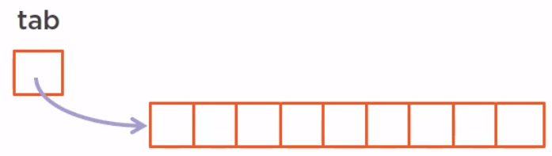

        Now if we want to add an element to this array, it will first create internally a copy of this array and add this element to this copy. 

        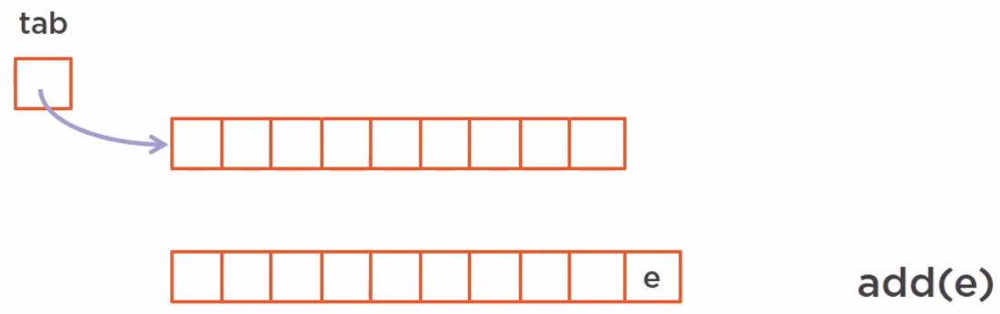

        All the threads that are currently reading the array are reading the previous version freely without seeing this new version. When the new version of this array is ready, we just move the top pointer from the previous version to the new one in a synchronized way.

        

        So the new read operations will see this new structure while there are other threads iterating over the previous one, they will not see the modification.

3. Some notes for this copy-on-write structure

    - For copy-on-write structure, the thread that are already has a reference on the previous array will not see the modification.

    - The new threads will see the modification.

    - We have two structure that implements this concept such as CopyOnWriteArrayList, is an implementation of list with a semantic of list, and the CopyOnWriteArraySet, is an implementation of set with a semantic of set.

    - These copy-on-write structure obviously works well when there are multiple reads and very few writes. If we have many writes, it means that we have many copies of the array, which is costly.
    
        There are use cases adapted to this structure such as:
        - if we want to store parameters for our application during the initialization phase of our application, then we can do so in a thread-safe way. And when our application is initialized, we are not going to touch these parameters again, so we can distribute this copy-on-write array anywhere we want to thread-safe way.


<br>

## How to use Queue/Stack

1. Introduction to Queue

    In Java, we have two interfaces that are relevant to the queue such as Queue and Deque.

    Belows are some its implementations:
    - **ArrayBlockingQueue** is a bounded blocking queue built on an array. Bounded means that we create a blocking queue with a certain amount of cells, a certain size of the array, and once this queue is full, it does not extend itself. Adding element to it would no be possible.

    - **ConcurrentLinkedQueue** is an unbounded blocking queue in which we can add as many elements as we need.

2. How a Queue work

    Suppose our queue is built on an array, the producer will add element from the tail and the consumer will consume them from the head.
    
    
    
    So we have several elements in our queue.

    
    
    Those elements are going to be consumed one by one by the consumer.

    

    In the concurrent environment, we can have as many producers and consumers as we need, and each of them in its own thread. So our queue or deque will be  accessed in a concurrent way. A thread does not know how many elements are in the queue or in a stack and querying a concurrent structure for the number of elements it has is not such as good idea because the time we query that and the time where we use this information, this information might have changed dramatically.

    So this raises two questions:
    - What happens if the queue/stack is full and we need to add an element to it.

        Normally, we will use the **await()** method of the lock framework or **wait()** method in **synchronized** block when queue/stack is full to push that thread into the waiting queue. If the queue/stack is not full, we will use **notify()** method or **signal()** method to call that thread from the waiting queue to add an element to it.

        But in this case, we will use **ArrayBlockingQueue** because it will no occur with the **ConcurrentLinkedQueue** since this **ConcurrentLinkedQueue** can adapt its internal size to the number of elements it has to hold.

        If we use ```boolean add(E e);``` method when the queue is full, it will throw an IllegalArgumentException. There are some ways to deal with this problem.
        - Use ```boolean offer(E e);``` method that will return false instead of throwing an exception.

            We can use ```boolen offer(E e, timeout, timeUnit);``` method with timeout.

        - Use ```void put(E e);``` method that will block until a cell becomes available.

    - What happens if the queue/stack is empty and we need to get an element from it.

    There are two kinds of queues: FIFO (queue) and LIFO (stack).

    In the JDK, we have the following:
    - Queue is the interface for the queue.
    - Deque is the interface for both a queue and a stack.

    In fact, we do not have a pure stack in the JDK, that is an interface that model a stack without modeling also a queue.

3. Some notes about Queue

    - Four different types of queues: they may be blocking or not, may offer access from both sides or not.

    - Different types of failure: special value, exception, blocking.

    - All of them makes the API quite complex, with a lot of methods.

<br>

## How to use Map

1. Introduction to Map

    In fact, we have only one interface, ConcurrentMap, which is an extension of the Map interface. The object of this ConcurrentMap is not to add any new method to the Map interface, but merely to redefine the JavaDoc of those methods.

    We have two implementations of ConcurrentMap:
    - ConcurrentHashMap is available up to JDK 7 and in the JDK 8.
    - ConcurrentSkipListMap introduced in Java 6, which does not rely on any synchronization.

2. Atomic operations

    Besides being thread-safe, ConcurrentMap also defines atomic operations.
    - **putIfAbsent(key, value)** method.

        It will add the key-value pair to the map if the key is not already present in the map. This method is atomic in the sense that between the instances where the present of the key check in the map and the adding of the key-value pair, no other thread can interrupt this method.

    - **remove(key, value)** method.

        This key-value pair will be removed from the map if it is present. There is no interruption possible between the instance where the thread checks for the present of the key in the map associated with the right value and the instance where the remove is performed.

    - **replace(key, value)** method.

        This method takes a key, value and that will replace the value currently associated with that key with a new value. 

    - **replace(key, existingValue, newValue)** method

        This method will replace existing value by the new value if the existingValue is already associated with that key in this map.

    Those two **replace()** method cannot be interrupted between the checking of the present of the key in the map and the replacement of the value.

3. How a HashMap works

    ConcurrencyMap implementations are:
    - thread-safe maps.
    - efficient up to a certain number of threads.
    - a number of efficient, parallel special operations.

    Understanding how a HashMap works is important when we want to know about how it work in concurrency.
    
    In the JDK, a hashmap is built on an array. When we need to add a key-value pair to an array, we will do something:
    - compute a hashcode from the key
    - decide which cell will hold the key-value pair, and when this is done, a pointer will point from this cell to this value pair.

        So, if we have two key-value pair in hashmap, it looks like that.

        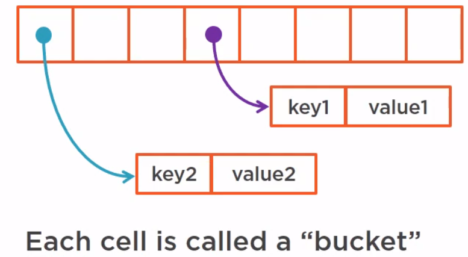

        Each cell is called a bucket, and a bucket can hold several key value pairs since different keys may have the same hash code.

    So, adding a key-value pair to a map is several steps problem.
    - Compute the hashcode of the key.
    - Check if the bucket has been created or not.
    - Check if the key is there or not.
    - Update the map.

    In a concurrent map, these steps must not be interrupted by another thread because if it is the case, it will just corrupt the map by corrupting either the bucket, either the linked list, either the red-black tree.

4. The structure of ConcurrentHashMap in Java 7

    In Java 7, how to solve an above problem when adding a key-value pair to a map. The only way to guard an array-based structure is to lock the array. Synchronizing the put would work, but it would be extremely inefficient because it would block all the map. What we would want to do is:
    - to allow several threads to work on different buckets concurrently
    - to allow concurrent reads on the map

    If we synchronize all the map, it means that we need to synchronize the array itself. It will work, no doubt about that, but it will be very inefficient because it will block everything, even the read operations on the map itself.
    
    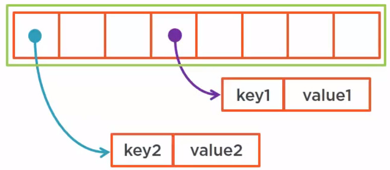

    What we could do is segment the array in several subarrays and synchronize on each segment.

    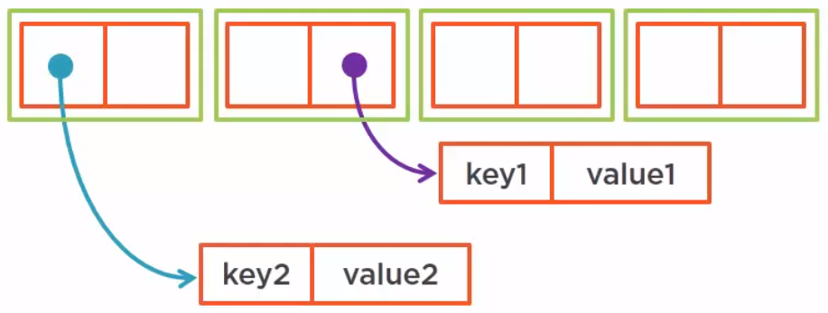

    The benefits of this way is that it works and it allows for a certain level of parallelism. As long as all the threads work on each individual segment, we can have concurrent reads and even concurrent writes.
    
    This is exactly the organization of the ConcurrentHashMap up to JDK 7. It is built on a set of synchronized segment. The number of segments is called the concurrency level. By default, it is set to 16 and it can be set up to 64,000.

    This sets number of threads that can access this map concurrency, but we need to keep in mind that the number of key-value pairs has to be greater than the concurrency level. If the number of key-value pairs is lesser than the concurrency level, then the limit is not the concurrency level, but the number of key-value pairs.

5. The ConcurrentHashMap of Java 8

    The implementation of ConcurrentHashMap has completely changed between Java 7 and Java 8. It is still compatible from the serialization point of view. It means that if we have a serialized Java 7 ConcurrentHashMap, we can deserialize it as a ConcurrentHashMap from Java 8 and vice versa. It has been created to handle very heavy concurrency, thousands of threads, and millions of key-value pairs, and because of that, some more methods not defined on map or ConcurrencyMap have been added with parallel implementations

    ```java
    ConcurrentHashMap<Long, String> map = ...; // JDK 8
    String result = map.search(10_000, (key, value) -> value.startsWith("a") ? "a" : null);
    ```

    In search() method, the first parameter is the parallelism threshold, the second parameter is the operation to be applied. If the number of key-value pairs is greater than the parallelism threshold, it will trigger the parallel search.

    Some versions of search() method such as searchKeys(), searchValues(), and searchEntries() methods.

    ```java
    ConcurrentHashMap<Long, List<String>> map = ...; // JDK 8
    String result = map.forEach(10_000, (key, value) -> value.removeIf(s -> s.length() > 20));
    ```

    In forEach() method, the second parameter is the biconsumer that is applied to all the key-value pairs of the map.

    Som versions of forEach() method such as forEachKeys(), forEachValues(), forEachEntry() methods.

6. Some notes of ConcurrentHashMap Java 8

    - A fully concurrent map

    - It has been made to handle very high concurrency and millions of key-value pairs.

    - It exposes built-in parallel operations. Those operations present in the map or concurrent map.

    - It can be used to create concurrent sets.


<br>

## How to use Concurrent Skip List

1. Introduction to Skip List

    The concurrent skip list is used for two implementations in the JDK. It is another concurrent map introduced in JDK 6. It is based on a structure called a skip list.
    
    A skip list is a smart structure used to create linked list and to provide fast random access to any of its elements. The concurrent version of this skip list implemented in Java 6 relies on atomic reference operations and no synchronization is used in it, making it a very efficient structure even in high concurrency environment. It can be used to create maps and sets.

    In JDK, we have two implementations that use this structure.
    - ConcurrentSkipListMap 

        All references in this skip list are implemented using AtomicReference. So it is a thread-safe map with no synchronization.

    - ConcurrentSkipListSet

    Both structures can be used in high concurrency environment as long as there are enough elements in it.


2. How Skip List works

    First, we need to start with a classical linked list, a pointer to the head and another pointer to the tail of this linked list.

    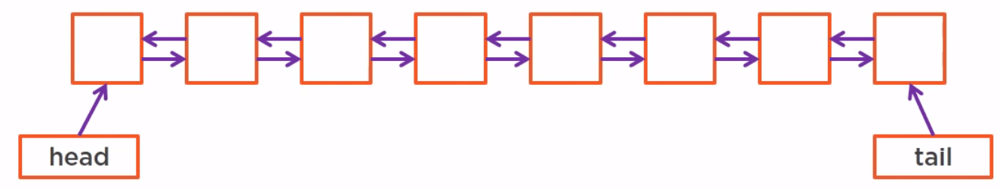

    The problem of the classical linked list:
    - It takes very long time to reach randomly an element of this list, the complexity is O(N).

    The solution is to use Skip List. It creates a fast access list with less elements on top of it. We can even create several layer of such a fast access list, in fact, as many as we need.

    The use of those fast access list assume that the elements of the skip list are sorted. Now, in fact, since it is a list, we can always store key-value pairs in the form of index object and sort those key-value pair using the index. So we are always possible to do that on the list.

    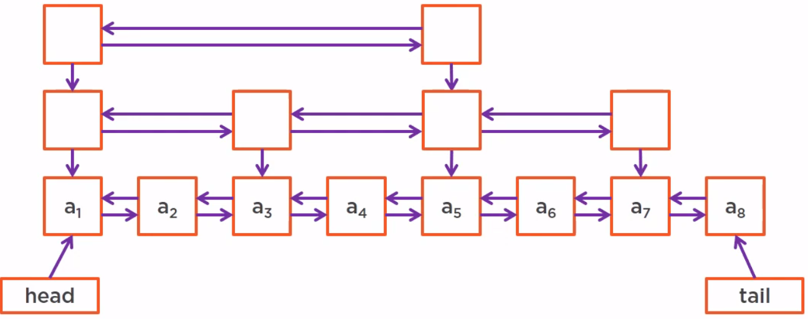

    The complexity of this skip list is O(log(N)).

3. Some notes of Skip List

    - A skip list can be used both to implement linked list and map, as long as the keys are comparable objects.

    - The skip list structure ensures fast access to any key.

    - A skip list is not an array-based structure. Since it is not an array-based structure, we can imagine other ways than locking to guard a skip list, that is to make skip list thread-safe.

<br>

## Wrapping up

- If we have very few writes, use copy-on-write structures.

- If we have low concurrency, we can rely on synchronization.

- In high concurrency, skip lists are usable with many objects, or ConcurrentHashMap.

- If we have high concurrency with few objects, then we are in the problematic area of concurrency. If we rely on synchronization, we will block our threads. If we rely on atomic references or atomic variables, we will generate high CPU load and high memory load.

- Be careful when designing concurrent code:

    - Be sure to have a good idea of what our problem is.

    - we need to keep in mind that concurrent programming is different parallel processing.

    - try to delegate to the API as much as we can.

    - know the concurrent collections well, as they solve many problems.

<br>

Refer:

[Advanced Java Concurrent Patterns by Jose Paumard](https://app.pluralsight.com/library/courses/java-concurrent-patterns-advanced/table-of-contents)