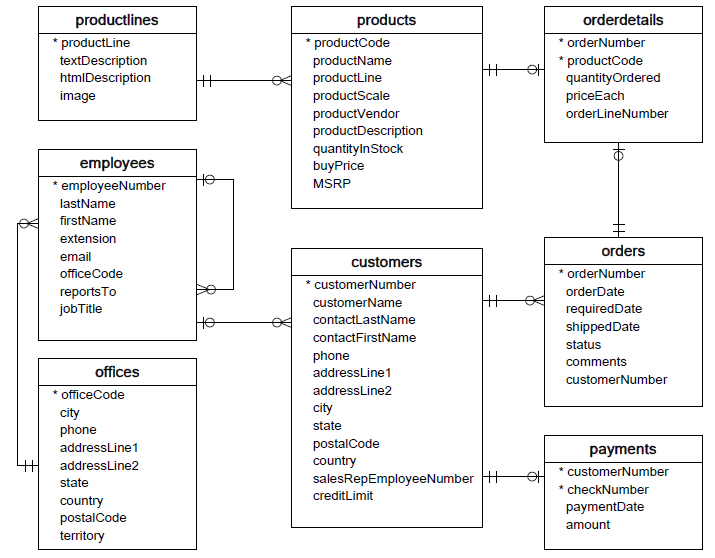

After designing the database that based on some standard rules such as 1NF, 2NF, 3NF, 3.5NF, 4NF, you will have a schema about relationship between each table.

At this stage, you will create the database in MySQL that use statements, not use GUI. Because GUI in MySQL make you interrupt your thought, harder to implement.

In this article, we will get the schema on the [MySQL Tutorial](http://www.mysqltutorial.org) to practice about using statements.

<br>

## Table of Contents
- [Database Schema](#database-schema)
- [Implement with statements in MySQL](#implement-with-statements-in-MySQL)
- [Wrapping up](#wrapping-up)

<br>

## Database Schema
The following is the image about schema that you need to do.



The meaning of each table in this database:
- Customers: stores customer’s data.
- Products: stores a list of scale model cars.
- ProductLines: stores a list of product line categories.
- Orders: stores sales orders placed by customers.
- OrderDetails: stores sales order line items for each sales order.
- Payments: stores payments made by customers based on their accounts.
- Employees: stores all employee information as well as the organization structure such as who reports to whom.
- Offices: stores sales office data.


## Implement with statements in MySQL
1. The first thing to do is you need to make a database new.

    In order to display Vietnamese language, you can choose character_set is utf8, and the value of collate is utf8_general_ci.
    Normally, you can choose utf8 - utf8_general_ci.

    ```sql
    create database if not exists db_test
    character set utf8
    collate utf8_unicode_ci;
    ```

    To delete this database, you can type: **drop database if exists db_test**.

    To appear all of the tables in your database, use **show database;**.

    When you have so many database in your MySQL workbench, you want to utilize specific database - db_test in set of them. Use **use db_test;**.


2. Relationship between **productlines** table and **products** table.

    To see the above image, you can be aware of their relation is one-to-many relationship. Each productlines has zero or more products and each products belongs to only one productlines. Of course, there is a foreign key - id of productlines in the products table.

    The productlines table is called *parent table* or *referenced table*, and the products table is known as *child table* or referencing table*.

    A foreign key can be a column or a set of columns. The columns in the child table often refer to the primary key columns in the parent table.

    A table may have more than one foreign key, and each foreign key in the child table may refer to a different parent table.

    So, you can write sql statement to make these two tables:

    ```sql
    create table if not exists productlines(
        productLine int auto_increment not null,
        textDescription text, 
        htmlDescription text not null, 
        image varchar(255), 
        primary key (productLine)
    ) engine = innodb;

    create table if not exists products(
        productCode int auto_increment not null primary key,
        productName varchar(255) not null,
        productLine int not null,
        productScale int not null,
        productVendor varchar(255),
        productDescription text,
        quantityInStock varchar(255),
        buyPrice decimal(15, 2) not null, 
        MSRP varchar(255), 
        foreign key fk_productlines(productLine)
        references productlines(productLine)
        on update cascade
        on delete restrict
    ) engine = innodb;
    ```

    You can see that *buyPrice* column is the format of money. So you can choose better data types for storing extract money values. The belows paragraph is got from MySQL manual.


    ```
    The DECIMAL and NUMERIC types store exact numeric data values. These types are used when it is important to preserve exact precision, for example with monetary data. In MySQL, NUMERIC is implemented as DECIMAL, so the following remarks about DECIMAL apply equally to NUMERIC.
    ```

    The DECIMAL data type requires you to specify the number of digits before the decimal point and the number of digits after the decimal point.

    For example:

    ```sql
    DECIMAL(15, 2)
    ```

    The **references** clause specifies the parent table and its columns to which the columns in the child table refer. The number of columns in the child table and parent table specified in the **foreign key** and **references** must be the same.

    The **on delete** and **on update** clauses and how to add a foreign key to a table, you can refer to this [link](http://www.mysqltutorial.org/mysql-foreign-key/).


3. Relationship among **products** table, **orderdetails** table and **orders** table.

    It is one-to-one for relationship between **products** table and **orderdetails** table, or **orders** table and **orderdetails** table.

    ```sql
    create table if not exists orderdetails(
        orderNumber int not null, 
        productCode int not null, 
        quantityOrdered varchar(255), 
        priceEach decimal(15, 2) not null,
        orderLineNumber int, 
        primary key (orderNumber, productCode)
    ) engine = innodb;

    create table if not exists orders(
        orderNumber int auto_increment not null primary key, 
        orderDate date, 
        requiredDate date, 
        shippedDate date, 
        statuses text, 
        comments text, 
        customerNumber int not null,
        foreign key fk_customers(customerNumber) 
        references customers(customerNumber)
        on update cascade
        on delete restrict
    ) engine = innodb;
    ```

    In **orderdetails** tables, the primary key is a set of two columns (orderNumber, productCode).

    Because the relationship of **orders** table and **customers** is one-to-many, so the **orders** table will contains the foreign key of **customers** table.


4. Relationship between **customers** table and **payments** table.

    It is one-to-one relationship.

    ```sql
    create table if not exists customers(
        customerNumber int not null auto_increment primary key,
        customerName varchar(255), 
        contactLastName varchar(255), 
        contactFirstName varchar(255), 
        phone varchar(15), 
        addressLine1 varchar(255), 
        addressLine2 varchar(255), 
        city varchar(255), 
        state varchar(255), 
        postalCode varchar(255),
        country varchar(100), 
        employeeNumber int not null, 
        creditLimit decimal(15, 2), 
        foreign key fk_employees(employeeNumber)
        references employees(employeeNumber)
        on update cascade 
        on delete restrict
    ) engine = innodb;

    create table payments(
        customerNumber int not null auto_increment, 
        checkNumber int not null, 
        paymentDate date, 
        amount decimal(15, 2),
        primary key(customerNumber, checkNumber)
    );
    ```

5. Relationship between **employees** table and **offices** table.
    
    It is one-to-many relationship between **offices** table and **employees** table.

    And in **employees** table, there is a recursive relationship: one-to-many.

    ```sql
    create table offices(
        officeCode int auto_increment not null primary key,
        city varchar(255), 
        phone varchar(15), 
        addressLine1 varchar(255), 
        addressLine2 varchar(255), 
        country varchar(100),      
        postalCode varchar(255),
        territory varchar(255)
    );


    create table if not exists employees(
        employeeNumber int auto_increment not null primary key, 
        lastName varchar(255), 
        firstName varchar(255), 
        extension varchar(255), 
        email varchar(100), 
        officeCode int not null, 
        reportsTo int not null, 
        jobTitle varchar(255), 
        foreign key fk_offices(officeCode)
        references offices(officeCode)
        on update cascade
    ) engine = innodb;
    ```

    To implement [self-join](http://www.mysqltutorial.org/mysql-self-join/) query statements in **employees** table, you can use a table alias to help MySQL distinguish the left table from the right table of the same table in a single query. 


## Wrapping up 
- Write all these queries into one file .sql, but you have to arrange the query statements. Query statement has no or a few constraint first. 
- Continuously, find knowledge about join, filter in MySQL.

<br>

Refer: 

[https://hackernoon.com/mysql-tutorial-example-relation-foreign-key-database-funtion-join-table-query-one-namy-nest-41dd09648fbd](https://hackernoon.com/mysql-tutorial-example-relation-foreign-key-database-funtion-join-table-query-one-namy-nest-41dd09648fbd)

[https://letrantrunghieu.wordpress.com/2016/06/07/cac-thao-tac-co-ban-voi-mysql-workbench/#3](https://letrantrunghieu.wordpress.com/2016/06/07/cac-thao-tac-co-ban-voi-mysql-workbench/#3)

[http://www.mysqltutorial.org/mysql-foreign-key/](http://www.mysqltutorial.org/mysql-foreign-key/)

[http://www.mysqltutorial.org/basic-mysql-tutorial.aspx](http://www.mysqltutorial.org/basic-mysql-tutorial.aspx)