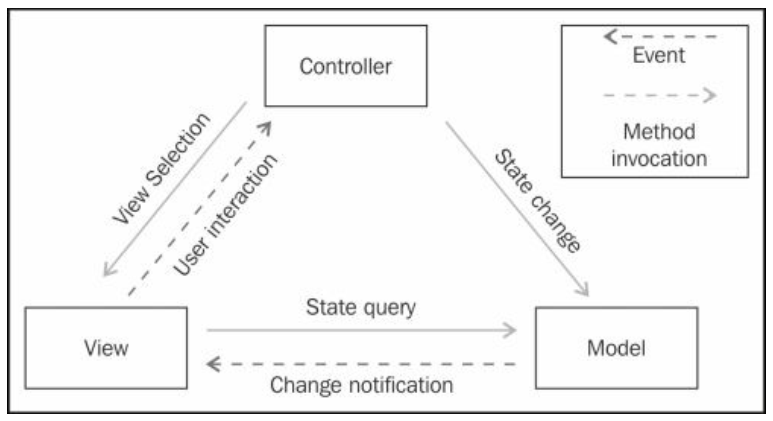
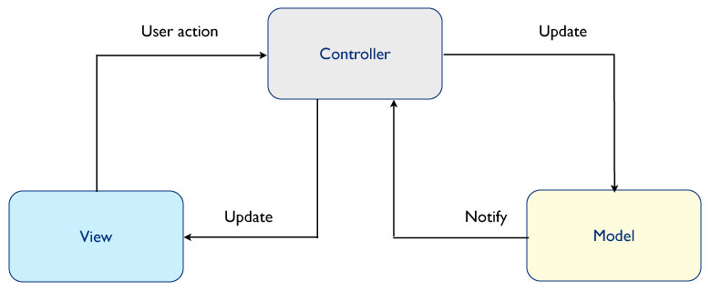
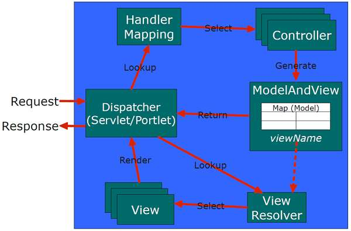

Spring MVC is the framework that helps our build the huge project. It divide project into smaller things such Model, View, Controller. It makes all members in team can be easily understand the whole structure of project. It reduces the number of bugs in developing the new functionalities in project. Because each part can be in charge of a specific target. We can find the position where bug happens immediately.

In this article, we will find out about the structure of Spring MVC and how Spring MVC works. Understanding them make us confident to use with Spring Boot or some other structures in Spring framework.


## Table of Contents
- [Introduction to Spring MVC](#introduction-to-spring-mvc)
- [MVC architectural pattern](#mvc-architectural-pattern)
- [Improved the traditional MVC pattern](#improved-the-tranditional-mvc-pattern)
- [How Spring MVC works](how-spring-mvc-works)
- [Benefits and Drawbacks](#benefits-and-drawbacks)
- [Wrapping up](#wrapping-up)


<br>

## Introduction to Spring MVC

The Spring Framework is an open source Java application framework originally developed based on the principles of dependency injection (DI) and inversion of control (IoC).

Some versions of Spring MVC.
- The first version of the Spring framework was written by Rod Johnson along with a book in 2002. 

- The framework was first released in June 2003 under the Apache license version 2.0. 

- The first milestone release of Spring framework (1.0) was released in March 2004. 

- Spring 2.0, which came in 2006, simplified the XML config files.

- Spring 2.5, which came in 2007, introduced annotation configurations.

- Spring 3.2, which came in 2012, introduced Java configuration, had support for Java 7, Hibernate 4, Servlet 3.0, and also required a minimum of Java 1.5. 

- Spring 4.0, which came in 2014, had support for Java 8.

- Spring Boot also was introduced in 2014.

- Spring 5.0 came out in 2017. Spring Boot 2.x has support for Spring 5.

<br>

## MVC architectural pattern

Before go into the architectural of Spring MVC, we need to understand how the classic MVC architectural pattern works.



1. Components of MVC

    - **Model** - The model represents data and the rules that govern access to and updates of this data. In enterprise software, a model often serves as a software approximation of a real-world process.

    - **View** - The view renders the contents of a model. It specifies exactly how the model data should be presented. If the model data changes, the view must update its presentation as needed. This can be achieved by using a **push model**, in which the view registers itself with the model for change notifications, or a **pull model**, in which the view is responsible for calling the model when it needs to retrieve the most current data.

    - **Controller** - The controller translates the user's interactions with the view into actions that the model will perform. In a stand-alone GUI client, user interactions could be button clicks or menu selections, whereas in an enterprise web application, they appear as GET and POST HTTP requests. Depending on the context, a controller may also select a new view -- for example, a web page of results -- to present back to the user.

    --> So, we can find that the Model contains all business logic of our system, and the Controller only used to be as the bridge between the View and the Model.

2. Flows between components of MVC

    At the first time, when the model, view, and controller are instantiated, the view registers as a listener on the model. Any changes to the underlying data of the model immediately result in a broadcast change notification, which the view receives. This is an example of the **push model** described earlier. Note that **the model is not aware of the view or the controller -- it simply broadcasts change notifications to all interested listeners**. Normally, to implement **push model**, we can use Observer pattern.

    Whenever a user interacts with the view by clicking on a lick or button, the view issues an event notification to the controller, and the controller issues a command notification to the model to update the data.

    Similarly, whenever the data in the model gets updated or changed, a change notification event is issued to the view by the model in response, and the view issues a state query command to the model to get the latest data from the model when these views are displayed, or the modified data can be sent in a change notification event that helps View do not need to call a query to model again.


3. The comparison between push model and pull model of View and Model component

    - When the data in the model gets updated:

        - In push model, the Model will broadcast the notification that contains modified data to the all views. Then View updates data. So, we can find that we only need one method to update view's data.

            This model also can be eager updated.

            Disadvantage: 
            
                - If this view hasn't been opened anymore, this calling method will waste time.
                - If the Model's data will be updated multiple times, these calling can reduce the application's performance.

        - In pull model, after received the changed notification of the Model, when the View can be displayed, it will call a query to get the changed model's data.

            This model also can be lazy updated.

            Advantage:

                - Do not take so much time to update when the View cann't be used.

4. Drawbacks of this traditional design

    - One of the consequences of this powerful design is that the many views can have the same underlying model. When a change in the data model occurs, each view is notified by a property change event and can update itself accordingly.

<br>

## Improved the traditional MVC pattern

A more recent implementation of the MVC design places the controller between the model and the view. This design, which is common in the Apple Cocoa framework.

```
An MVC Design Placing the Controller Between the Model and the View
```

The primary difference between this design and the more traditional version of MVC is that the notifications of state changes in model objects are communicated to the view through the controller. Hence, the controller mediates the flow of data between model and view objects in both directions. View objects, as always, use the controller to translate user actions into property updates on the model. In addition, changes in model state are communicated to view objects through an application's controller objects.

Thus, when all three components are instantiated, the view and the model will both register with the controller. Once a user interacts with the view, the events are nearly identical:

The view recognizes that a GUI action -- for example, pushing a button or dragging a scroll bar -- has occurred, using a listener method that is registered to be called when such an action occurs.

The view calls the appropriate method on the controller.

The controller accesses the model, possibly updating it in a way appropriate to the user's action.

If the model has been altered, it notifies interested listeners of the change. However, in this case, the change is sent to the controller.

Why adopt this design? Using this modified MVC helps to more completely decouple the model from the view. In this case, the controller can dictate the model properties that it expects to find in one or more models registered with the controller. In addition, it can also provide the methods that effect the model's property changes for one or more views that are registered with it.

Below is an image that describe the modified MVC architectural pattern.



--> Contrast to the traditional MVC pattern, the modified MVC pattern will break the connection between the View and the Model component.

<br>

## How Spring MVC works

1. Components in Spring MVC

    Turn it back to our Spring MVC, we will start with some concepts in the Spring MVC architectural pattern.

    

    ```Dispatcher Servlet``` is a class that receives all the requests from users. To understand it, we need to read about **web.xml** file.

    HandlerMapping will find the suitable Controller for our requests to do the business logic.

    ```ModelAndView``` has an responsibility about mapping data that is got from the Model, with the corresponding View.

    ```Views``` are in charge of rendering the actual HTML interface, usually by the execution of some template engine like Thymeleaf.

    ```ViewResolvers``` are the objects in charge of obtaining View objects for a specific operation and locale. Typically, ```controllers``` ask ```ViewResolvers``` to forward to a view with a specific name (a String returned by the controller method), and then all the ```ViewResolvers``` in the application execute in ordered chain until one of them is able to resolve that view, in which case a ```View``` object is returned and control is passed to it for the renderization of HTML.


2. Flows of Spring MVC

    - Firstly, when we enter a URL in the browser, the request comes to the Dispatcher Servlet. The Dispatcher Servlet then acts as a centralized entry point to the web application.

    - Then, the Dispatcher Servlet determines a suitable controller that is capable of handling the request and dispatching this request to the controller.

    - The controller method updates objects in the model and returns the logical view name and update model the Dispatcher Servlet.

    - The Dispatcher Servlet consults with the ViewResolver to determine which view to render and passes the model data to that view.

    - The View furnishes the dynamic values in the web page using the model data, renders the final web page, and returns this web page to the Dispatcher Servlet.

    - At the end, the Dispatcher Servlet returns the final, rendered page as a response to the browser.


3. The difference between Spring MVC and the traditional MVC pattern

    Web application rely on the HTTP protocol, which is a stateless pull protocol. This means that no request implies no reply; every time, we need to request the application to know its state. The MVC pattern requires a push protocol for the views to be notified by the model. So in web MVC, the controller takes more responsibilities for the state changing, state querying, and change notification.

    In web MVC, every interaction between the model and view is taken through the controller only. So, the controller acts as a bridge between the model and view. There is no direct interaction between the model and view, as in the classic MVC pattern.

<br>

## Benefits and Drawbacks

1. Benefits

    - Loose coupling between components.

    - We can develop the front-end and back-end at the same time, so it can improve the speed of our project.


2. Drawbacks

    - When the more business logic bigger, the more our system mess, it's very hard to understand the whole project for the new member. And because our project is about database driven architecture. So if our system have multiple users request at the same time, the database is our bottleneck.

        Solution for this problem is that we can use Microservice architectural pattern, combines with CQRS and Event Sourcing, to separate the read/write queries --> improve our system performance, easily scale system to multiple times.

<br>

## Wrapping up
- Understanding about the traditional MVC pattern, the modified MVC pattern and Spring MVC pattern.

- MVC pattern that is suitable for the small project with easy buiness logic. If our project has complex business logic such as trade, health care, ..., we need to transform to Domain Driven Design to deal with it.

<br>


Refer:

[https://www.oracle.com/technetwork/java/architecture-142923.html](https://www.oracle.com/technetwork/java/architecture-142923.html)

[https://www.oracle.com/technical-resources/articles/java/java-se-app-design-with-mvc.html](https://www.oracle.com/technical-resources/articles/java/java-se-app-design-with-mvc.html)

[https://developer.mozilla.org/en-US/docs/Glossary/MVC](https://developer.mozilla.org/en-US/docs/Glossary/MVC)

[https://justforchangesake.wordpress.com/2014/05/07/spring-mvc-request-life-cycle/](https://justforchangesake.wordpress.com/2014/05/07/spring-mvc-request-life-cycle/)

[https://dzone.com/articles/how-spring-mvc-really-works](https://dzone.com/articles/how-spring-mvc-really-works)

[https://www.intertech.com/Blog/how-to-use-springs-webapplicationinitializer/](https://www.intertech.com/Blog/how-to-use-springs-webapplicationinitializer/)

[https://docs.spring.io/spring/docs/3.0.0.M3/reference/html/ch16s02.html](https://docs.spring.io/spring/docs/3.0.0.M3/reference/html/ch16s02.html)

[https://stackify.com/spring-mvc/](https://stackify.com/spring-mvc/)

[https://javadeveloperzone.com/spring-mvc/spring-multi-controller/](https://javadeveloperzone.com/spring-mvc/spring-multi-controller/)

[https://crunchify.com/spring-mvc-how-to-access-modelmap-values-in-a-jsp/](https://crunchify.com/spring-mvc-how-to-access-modelmap-values-in-a-jsp/)

[https://www.thymeleaf.org/doc/tutorials/3.0/thymeleafspring.html](https://www.thymeleaf.org/doc/tutorials/3.0/thymeleafspring.html)
