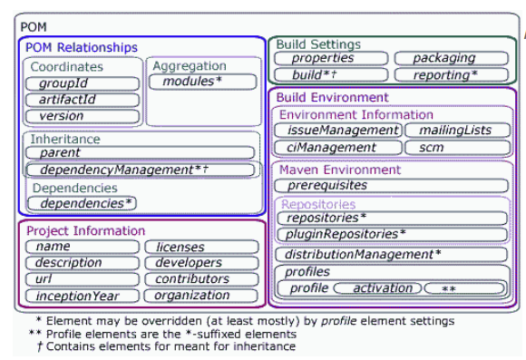
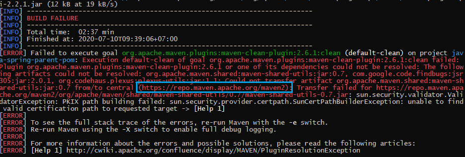
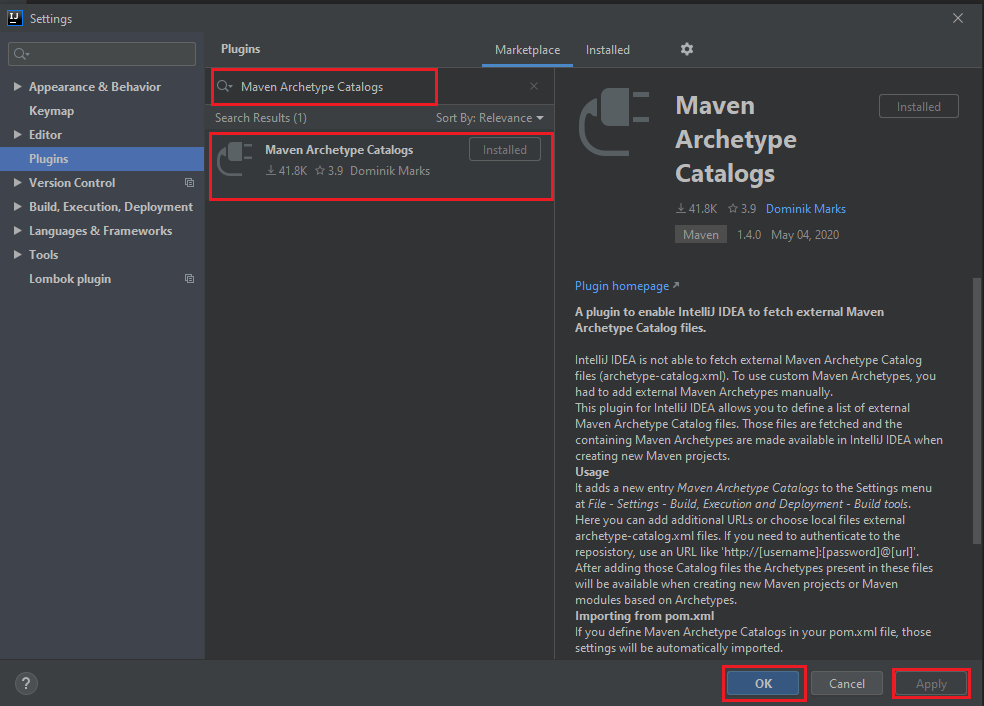
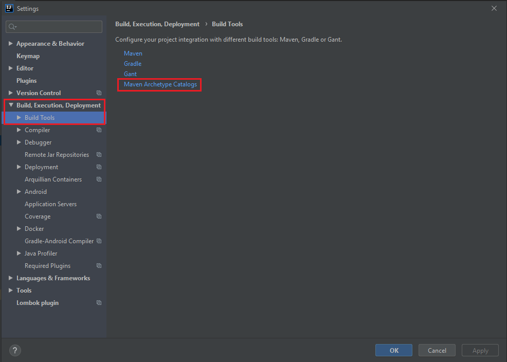
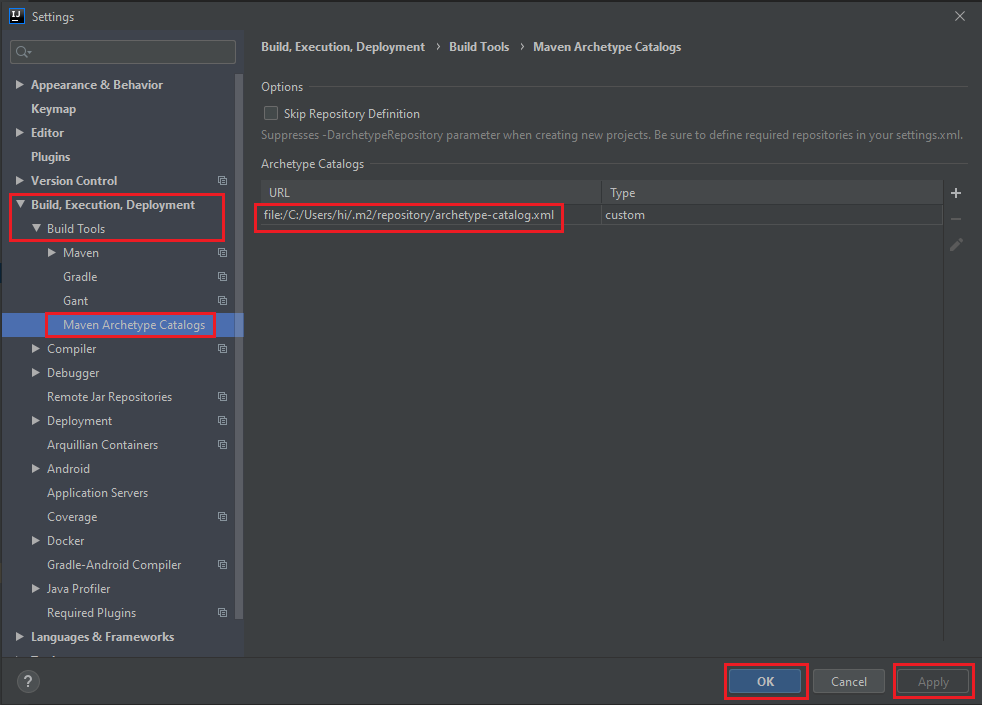

In order to understand the difficulty when we do not use the maven in Java project, there are some tasks that we have to do:
- copy resources such as conf files to the build folder.
- compile the source files.
- copy dependency jars to build folder.
- run unit tests.
- package the build folder as jar.

To make our life easier to breath, Maven was created.

Maven is a tool for managing resource objects or package in Java. It is as same as npm in Node.js. When you want to build a enormous project, absolutely, you need maven. 

Understanding some tricky things about maven will help you easily to write code, use so many packages effectively. You do not manually add many packages into your project. To configure maven, you will cope with understanding some parameter in POM file.

In this article, we will find informations about configuring POM file.

<br>

## Table of Contents
- [Standard structure in Maven project](#standard-structure-in-maven-project)
- [POM file in Maven project](#pom-file-in-maven-project)
- [Add specific package into project through pom file](#add-specific-package-into-project-through-pom-file)
- [How the Maven works](#how-the-maven-works)
- [Wrapping up](#wrapping-up)

<br>

## Standard structure in Maven project
The below is the image about standard folder structure in maven project. 

```
your-app-name
|-- pom.xml
`-- src
    |-- main
    |   |-- java
    |   |   `-- com
    |   |       `-- your-company-name
    |   |           |-- config
    |   |           |   |-- Config.java
    |   |           |   `-- WebInitializer.java
    |   |           |
    |   |           `-- controllers
    |   |               `-- Controller.java
    |   |-- resources     
    |   `-- webapp     
    |       `-- WEB-INF
    |           `-- jsp
    |               `-- index.jsp 
    `-- test
        `-- java
            `-- com
                `-- your-company-name
                    `-- app
                        `-- AppTest.java
```

The followings is the table explains the meanings of each path in your folder structure.

|          Path           |           Meanings            |
| ----------------------- | ----------------------------- |
| src/main/java           | Application/Library sources   |
| src/main/resources      | Application/Library resources |
| src/main/webapp         | Web application sources       |
| src/main/filters        | Resource filter files         |
| src/test/java           | Test sources                  |
| src/test/resources      | Resources is used for unit tests, and it will not be deployed | 
| src/test/filters        | Test resource filter files    |
| src/it                  | Integration tests             |
| src/site                | Files are used to generate the Maven project |

At the top level, files descriptive of the project is a **pom.xml** file.

There are just two sub folders: **src** and **target**. The **target** directory is used to contains all output of the build. The **src** directory contains all the source material for building the project, its site and so on.


<br>

## POM file in Maven project
A POM - Project Object Model is an xml files that contains all informations about project and configuration details used by Maven to build the project. 

All our information will be contained in **project** tag. To be default, some parameters of project will be inserted in pom.xml.



```xml
<project ...>
    <modelVersion>4.0.0</modelVersion>

    <!-- POM relationships -->
    <groupId>...</groupId>
    <artifactId>...</artifactId>
    <version>...</version>
    <parent>...</parent>
    <dependencyManagement>...</dependencyManagement>
    <dependencies>...</dependencies>
    <modules>...</modules>

    <!-- Project information -->
    <name>...</name>
    <description>...</description>
    <url>...</url>
    <inceptionYear>...</inceptionYear>
    <licenses>...</licenses>
    <developers>...</developers>
    <contributors>...</contributors>
    <organization>...</organization>

     <!-- Build Settings -->
    <packaging>...</packaging>
    <properties>...</properties>
    <build>...</build>
    <reporting>...</reporting>

    <!-- Build Environment -->

    <!-- Environment Information -->

    <issueManagement>...</issueManagement>
    <ciManagement>...</ciManagement>
    <mailingLists>...</mailingLists> 
    <scm>...</scm>
  
    <!-- Maven Environment -->

    <prerequisites>...</prerequisites>
    <repositories>...</repositories>
    <pluginRepositories>...</pluginRepositories>
    <distributionManagement>...</distributionManagement>
    <profiles>...</profiles>    
</project>
```

With:
- groupId: a name of your company, ...
- artifactId: a name of package, project
- version: a version of project
- packaging: there are four values: ear, pom, jar (default value) and war. jar - library or java application; war - web application.
- modelVersion: its value will be always 4.0.0 for Maven 2.x POMs.

Note about **jar**, **war** files:
- .jar files: The .jar files contain libraries, resources and accessories files like property files.
- .war files: The war file contains the web application that can be deployed on any servlet/jsp container. The .war file contains jsp, html, javascript and other files necessary for the development of web applications.

Note: 
- ```<version>1.0.0-SNAPSHOT</version>```: The ```SNAPSHOT``` version suffix tells Maven that this project is currently in development. It has implications for the way artifacts are handled by the dependency resolution.
- ```artifacts```: Maven artifacts belong to a group (typically ```com.company.application```), and must have a unique identifier (typically the application's name).
- The main repository for Maven is called the Central Repository and can be searched on at ```http://maven.org```.

<br>

## Add specific packages into project through pom file
In order to import many libraries into our project through Maven, insert informations about these libraries into **dependencies** tag in pom.xml.

**properties** tag helps our define many constant variables, make our do not concern about some problems when we change this value at the other places. It makes our code synchronous. It will used to tell Maven use a specified JDK version to compile the source code.

Belows are the definitions of some common packages that will use for Spring MVC.

```xml
<properties>
    <project.build.sourceEncoding>UTF-8</project.build.sourceEncoding>		
    <maven.compiler.source>1.8</maven.compiler.source>
    <maven.compiler.target>1.8</maven.compiler.target>

    <spring.version>4.0.0.RELEASE</spring.version>
    <jstl.version>1.2</jstl.version>
    <javax.servlet.version>3.0.1</javax.servlet.version>

    <!-- Spring -->
	<spring-framework.version>4.0.2.RELEASE</spring-framework.version>
</properties>

<dependencies>
    <!--Use guava library-->
    <dependency>
        <groupId>com.google.guava</groupId>
        <artifactId>guava</artifactId>
        <version>27.0.1-jre</version>
        <!-- or, for Android: -->
        <version>27.0.1-android</version>
    </dependency>

    <!--hibernate dependencies-->
    <dependency>
        <groupId>org.hibernate.common</groupId>
        <artifactId>hibernate-commons-annotations</artifactId>
        <version>4.0.5.Final</version>
    </dependency>
        
    <dependency>
        <groupId>org.hibernate</groupId>
        <artifactId>hibernate-core</artifactId>
        <version>4.3.11.Final</version>
    </dependency>

    <dependency>
        <groupId>org.hibernate</groupId>
        <artifactId>hibernate-entitymanager</artifactId>
        <version>4.3.11.Final</version>
    </dependency>

    <dependency>
        <groupId>org.hibernate.javax.persistence</groupId>
        <artifactId>hibernate-jpa-2.1-jpa</artifactId>
        <version>1.0.0.Final</version>
    </dependency>

    <!--use Log4j-->
    <dependency>
        <groupId>org.slf4j</groupId>
        <artifactId>slf4j-log4j12</artifactId>
        <version>1.7.25</version>
    </dependency>

    <!--jquery, bootstrap from webjars-->
    <dependency>
        <groupId>org.webjars</groupId>
        <artifactId>bootstrap</artifactId>
        <version>3.3.7</version>
    </dependency>

    <dependency>
        <groupId>org.webjars</groupId>
        <artifactId>jquery</artifactId>
        <version>1.12.4</version>
    </dependency>

    <!--Spring and transactions-->
    <dependency>
        <groupId>org.springframework</groupId>
        <artifactId>spring-context</artifactId>
        <version>${spring-framework.version}</version>
    </dependency>

    <dependency>
        <groupId>org.springframework</groupId>
        <artifactId>spring-tx</artifactId>
        <version>${spring-framework.version}</version>
    </dependency>

    <!--Spring JDBC support-->
    <dependency>
        <groupId>org.springframework</groupId>
        <artifactId>spring-jdbc</artifactId>
        <version>${spring.version}</version>
    </dependency>
    
    <!--MySQL driver-->
    <dependency>
        <groupId>mysql</groupId>
        <artifactId>mysql-connector-java</artifactId>
        <version>5.0.5</version>
    </dependency>

    <dependency>
        <groupId>javax</groupId>
        <artifactId>javaee-web-api</artifactId>
        <version>7.0</version>
        <type>jar</type>
    </dependency>
    
    <dependency>
        <groupId>org.springframework</groupId>
        <artifactId>spring-core</artifactId>
        <version>${spring.version}</version>
    </dependency>
    
    <dependency>
        <groupId>org.springframework</groupId>
        <artifactId>spring-web</artifactId>
        <version>${spring.version}</version>
    </dependency>
    
    <dependency>
        <groupId>org.springframework</groupId>
        <artifactId>spring-webmvc</artifactId>
        <version>${spring.version}</version>
    </dependency>

    <!-- junit 5, unit test -->
    <dependency>
        <groupId>org.junit.jupiter</groupId>
        <artifactId>junit-jupiter-engine</artifactId>
        <version>5.3.1</version>
        <scope>test</scope>
    </dependency>

    <!-- unit test -->
    <dependency>
        <groupId>org.hamcrest</groupId>
        <artifactId>hamcrest-library</artifactId>
        <version>1.3</version>
        <scope>test</scope>
    </dependency>

    <!-- for web servlet -->
    <dependency>
        <groupId>javax.servlet</groupId>
        <artifactId>javax.servlet-api</artifactId>
        <version>${javax.servlet.version}</version>
        <scope>provided</scope>
    </dependency>

    <!-- use for SHA hashing -->
    <dependency>
        <groupId>commons-codec</groupId>
        <artifactId>commons-codec</artifactId>
        <version>1.11</version>
    </dependency>

    <!-- use for hibernate -->
    <dependency>
        <groupId>hibernate</groupId>
        <artifactId>hibernate</artifactId>
        <version>3.0.3</version>
        <scope>compile</scope>
    </dependency>
</dependencies>
```

**scope** tag will help our restrict the usage of libraries. Because some libraries can be used for unit testing, the other can be provided at runtime by the application server.

Maven provides four dependency scopes:
- compile: A compile-scope dependency is available in all phases. It is the default value.
- provided: A provided dependency is used to compile the application, but will not be deployed. You would use this scope when you expect the JDK or application server to provide the JAR. For instance, Servlet. **provided** dependencies are available on the compilation classpath (not runtime). They are not transitive, nor are they packaged.
- runtime: Runtime-scope dependencies are not needed for compilation, only for executing and test the system, such as JDBC drivers.
- test: Test-scope dependencies are needed only to compile and run tests. For instance, JUnit.
- system: It has properties as same as **provided**, except that you have to provide an explicit path to the JAR on the local file system. 

    This is intended to allow compilation against native objects that may be part of the system libraries. The artifact is assumed to always be available and is not looked up in a repository. If you declare the scope to be system, you must also provide the **systemPath** element. Note that this scope is not recommended (you should always try to reference dependencies in a public or custom Maven repository). 
- import: It is used to import some **dependency** but it must be pointed in **\<dependencyManagement\/\>** tags in POM files.

<br>

## How the Maven works
Firstly, we add informations about libraries that we need into **dependencies** tag, then, we save the pom.xml file. Maven will send these informations to its cloud repository. Next, it will download these libraries into local repository of Maven. 

To check the path of this local repository, you can open **User setting** of Netbeans or Eclipse. Finally, Maven will add the path of each libraries into **Dependencies** folder in Netbeans.

And Spring Boot Maven Plugin provides some convenient features:
- It searches for the ```public static void main()``` method to flag as a runnable class.

- It provides a built-in dependency resolver that sets the version number to match ```Spring Boot dependencies```. You can override any version you wish, but it will default to Boot’s chosen set of versions.

<br>

## Some problems when using Maven

1. Unable to find valid certification path to requested target

    When using command line **mvn clean install** for our project, we will encounter a problem that look at an below image.

    

    The cause of this problem:
    - This is due to the fact that we want to access the server ```http://repo.maven.apache.org/maven2```, but Java's security policy does not find some certificates in its security files of a folder **%JAVA_HOME%\jre\lib\security**.

        So, it will throw an exception.

    Solution for this problem:
    - In this case, we will use keytool that is provided by JDK.

    - To list all certificates in cacerts file, we can use the following command.

        ```java
        keytool -list -keystore cacerts
        ```

        When we cope with the prompt ```Enter keystore password```, it's the first time that we set up password for this keytool. So we only type our password for it.

    - Then, we will connect to the server that we want to get certificates. In our current case, it is ```http://repo.maven.apache.org/maven2```.

        ```java
        keytool -printcert -rfc -sslserver repo.maven.apache.org/maven2
        ```

        After typing this command line in cmd window, we need to save the content of these certificates in a file that is in the same folder with **cacerts** file.

        Assuming that we named this file that is ```mpdcertificates.pem``` file.

    - Import these above certificates into cacerts file.

        ```java
        keytool -importcert -file ./mpdcertificates.pem -keystore ./cacerts
        ```

2. The specified user settings file does not exist: ```C:\Users\hi\.m2\settings.xml```

    By default, Maven does not create the settings.xml file under **.m2** folder. To solve this problem, we can copy the **settings.xml** file from folder ```%MAVEN_HOME%\conf``` to **.m2** folder.

3. Set up the Maven Archetype Catalogs plugin

    - Go to File -> Settings -> Plugins -> Browse, then we have:

        

        Select File -> Invalidate Caches/Restart ... item.  

    - Then, go to File -> Settings -> Build, Execution, Deployment -> Build Tools -> Maven Archetype Catalogs.

        

        Find a **archetype-catalog.xml** file in **C:\Users\hi\.m2\repository** folder.

        


<br>

## Wrapping up

- Understanding about structure folder in Maven project.
- The important parameters in POM file such as parent, packaging, dependencies, properties, name, scope, ...
- How to add libraries into our project with Maven.
- Necessary parameters for common libraries in Spring MVC.

<br>

Refer: 

**POM file**

[http://www.codetab.org/apache-maven-tutorial/](http://www.codetab.org/apache-maven-tutorial/)

[https://books.sonatype.com/mvnref-book/reference/pom-relationships-sect-pom-syntax.html](https://books.sonatype.com/mvnref-book/reference/pom-relationships-sect-pom-syntax.html)

[http://www.java2s.com/Tutorials/Java/Maven_Tutorial/1020__Maven_POM_File.htm](http://www.java2s.com/Tutorials/Java/Maven_Tutorial/1020__Maven_POM_File.htm)

[https://o7planning.org/vi/10411/quan-ly-cac-phu-thuoc-trong-maven](https://o7planning.org/vi/10411/quan-ly-cac-phu-thuoc-trong-maven)

[https://o7planning.org/vi/10131/huong-dan-su-dung-maven-cho-nguoi-moi-bat-dau](https://o7planning.org/vi/10131/huong-dan-su-dung-maven-cho-nguoi-moi-bat-dau)

[https://maven.apache.org/guides/introduction/introduction-to-the-standard-directory-layout.html](https://maven.apache.org/guides/introduction/introduction-to-the-standard-directory-layout.html)

[https://www.javaworld.com/article/2071772/java-app-dev/the-maven-2-pom-demystified.html](https://www.javaworld.com/article/2071772/java-app-dev/the-maven-2-pom-demystified.html)

[https://www.javaworld.com/article/2072203/build-ci-sdlc/an-introduction-to-maven-2.html](https://www.javaworld.com/article/2072203/build-ci-sdlc/an-introduction-to-maven-2.html)

<br>

**JAR**, **WAR** files

[https://en.wikipedia.org/wiki/WAR_(file_format)](https://en.wikipedia.org/wiki/WAR_(file_format))

[https://en.wikipedia.org/wiki/JAR_(file_format)](https://en.wikipedia.org/wiki/JAR_(file_format))

[https://web.archive.org/web/20120626012843/http://java.sun.com/developer/Books/javaprogramming/JAR/basics](https://web.archive.org/web/20120626012843/http://java.sun.com/developer/Books/javaprogramming/JAR/basics)

[https://web.archive.org/web/20120626020019/http://java.sun.com/j2ee/tutorial/1_3-fcs/doc/WCC3.html](https://web.archive.org/web/20120626020019/http://java.sun.com/j2ee/tutorial/1_3-fcs/doc/WCC3.html)

[https://maven.apache.org/guides/getting-started/maven-in-five-minutes.html](https://maven.apache.org/guides/getting-started/maven-in-five-minutes.html)

[http://www.vogella.com/tutorials/ApacheMaven/article.html](http://www.vogella.com/tutorials/ApacheMaven/article.html)

<br>

**Project Dependecies**
[https://books.sonatype.com/mvnref-book/reference/pom-relationships-sect-project-dependencies.html#pom-relationships-sect-dependency-scope](https://books.sonatype.com/mvnref-book/reference/pom-relationships-sect-project-dependencies.html#pom-relationships-sect-dependency-scope)


**Setup maven in eclipse**

[https://o7planning.org/vi/10101/cai-dat-maven-vao-eclipse](https://o7planning.org/vi/10101/cai-dat-maven-vao-eclipse)

**Create empty maven project in eclipse**

[https://o7planning.org/vi/11253/tao-maven-web-app-project-rong-tren-eclipse](https://o7planning.org/vi/11253/tao-maven-web-app-project-rong-tren-eclipse)

[https://commandlinefanatic.com/cgi-bin/showarticle.cgi?article=art032](https://commandlinefanatic.com/cgi-bin/showarticle.cgi?article=art032)