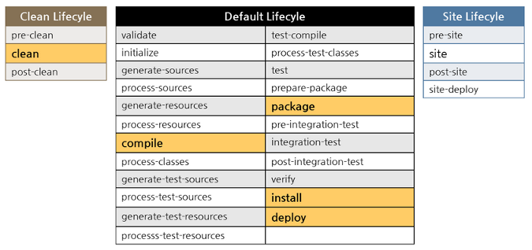
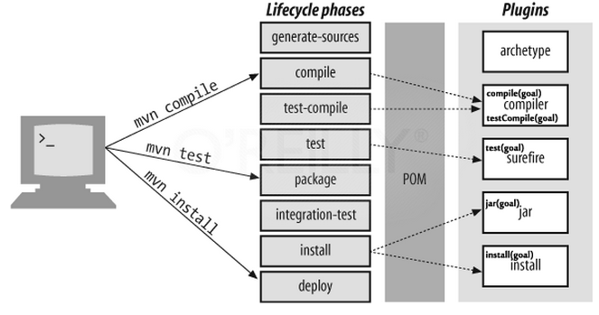
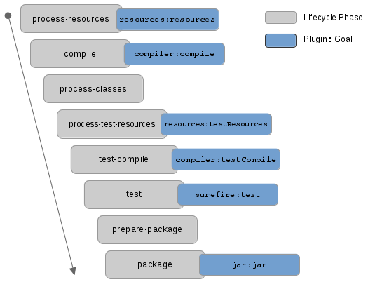

To build the small project, actually, we do a little operations such as typing ```Ctrl + Shift + B``` to build project and ```F5``` to run. It is a pieces of cake to implement manually. 

But the huge problems will happen when we have to make a big project such as we do not build one by one libraries, or run test of each project. Therefore, Maven will appear as superman to help our automatically do some specific operations in the project.

<br>

## Table of Contents
- [Introduction to project lifecycles](#introduction-to-project-lifecycles)
- [Default lifecycle](#default-lifecycle)
- [Clean lifecycle](#clean-lifecycle)
- [Site lifecycle](#site-lifecycle)
- [Plugins](#plugins)
- [Plugin goals](#goals-and-phases)
- [Plugin configurations](#plugin-configurations)
- [Plugin execution](#plugin-execution)

<br>

## Introduction to project lifecycles
In Maven, there are three built-in lifecycles:
- default: lifecycle handles project deployment.
- clean: lifecycle handles project cleaning.
- site: lifecycle handles the creation of project's site documentation.

The syntax of mvn command is:

```
mvn [options] [<goal(s)>] [<phase(s)>]
```

<br>



Each build lifecycle consists of build phases, and the build phases are divided into build goals.

<br>

## Default lifecycle
The **default lifecycle** includes some following phases that are frequently used:



The meaning of each phases is:
- generate-sources: generates any extra source code needed for the application, which is generally accomplished using the appropriate plugins.
- compile: compiles the project source code.
- test-compile: compiles the project unit tests.
- test: runs the unit testing frameworks (typically using JUnit) in the src/test folder.
- package: squeezes the compiled code into its distributed format such jar, war, ear, ...
- integration-test: Processes and deploys the package if necessary into an environment where integration tests can be run.
- install: installs the package into the local repository, for use as a dependency in other projects locally.
- deploy: done in an integration or release environment, copies the final package to the remote repository for sharing with other developers and projects.

Apart from the frequently used phases, we have:
- validate: validate the project is correct and all necessary information is available.
- process-resouces: copy and process the resources (such as properties, XML configuration files, ...) into the destination directory, ready for packing.

Default lifecycle consists of 21 phases.

In default lifecycle or the other lifecycles, these lifecycle phases are implemented continuously.

For example: 
- Command ```mvn deploy``` runs, all of the lifecycle phases before **deploy** will be executed first.
- Command ```mvn install``` runs, the lifecycle phases in order (generate-sources, process resources, compile, process-test-resources, test-compile, ...) will be implemented before executing **install** phase.
- Command ```mvn clean install``` tells the Maven to do the **clean** action in each module (clear any compiled files) before running the **install** action for each module.

  A **target** folder holds Maven-generated temporary files and artifacts. There are times when the **target** folder becomes huge or when certain files that have been cached need to be cleaned out of the folder. The **clean** goal accomplishes exactly that, as it attempts to delete the target folder and all its contents.

In default lifecycle, lifecycle phases do not have capabilities to accomplish some tasks. For instance, comppile phase by itself can not do anything, but it delegates compilation job to a plugin named **maven-compiler-plugin**.

<br>

## Clean lifecycle
The clean lifecycle contains 3 phases: 
- pre-clean
- clean
- post-clean

For example:
- Command ```mvn clean``` will delete the build directory named as target, and its content. First, Maven will load **clean cycle** and execute the phases **pre-clean** and **clean**.
- Command ```mvn pre-clean``` will call the phase pre-clean.
- Command ```mvn post-clean``` will call the phases such as pre-clean, clean, post-clean.

Like the **default lifecycle**, **clean lifecycle** do not have enough abilities to delete the target folder. It delegates its job to a plugin named as **maven-clean-plugin**.

<br>

## Site lifecycle
The **site lifecycle** is used to generate project documentation and reports about the project, or a collection of projects. It has 4 phases.

There are four phases in site lifecycle:
- pre-site
- site
- post-site
- site-deploy

The default goals bound to the site lifecycle:
- site:site
- site:deploy


<br>

## Plugins
The Maven core is small, it can only know about parse XML pom.xml file, manage lifecycle and phases. It is not aware of how to compile source code, make the JAR file.  

To do these problems, Maven will delegate them to Plugins. 

Plugins are broadly grouped as **build plugins** and **reporting plugins**. The followings are some of the frequently used plugins:

**Core plugins**

|           Plugin       |           Description          |
| ---------------------- | ------------------------------ |
| maven-clean-plugin     | clean up after the build       |
| maven-compiler-plugin  | complies sources               |
| maven-resources-plugin | copy the resources to the output folder |
| maven-surefire-plugin  | run the JUnit unit tests       |
| maven-install-plugin   | install the built artifact into the local repository |
| maven-deploy-plugin    | deploy the built artifact to the remote repository |

<br>

**Packaging plugins**

|      Plugin       |        Description         |
| ----------------- | -------------------------- |
| maven-jar-plugin  | build a JAR from the current project |
| maven-war-plugin  | build a WAR from the current project |

<br>

**Tools/IDE Plugins**

|       Plugin       |       Description         |
| ------------------ | ------------------------- |
| maven-help-plugin  | get infomation about the working environment for the project |
| maven-archetype-plugin | generate a skeleton project structure from an archetype |
| maven-assembly-plugin | build an distribution of sources and binaries |
| maven-antrun-plugin | run a set of ant tasks from a phase of the build |
| maven -eclipse-plugin | generate an eclipse project file for the current project |

To check out the availabe plugins in Maven, you can access this [link](http://maven.apache.org/plugins/index.html).

<br>

## Plugin goals
When a lifecycle run, depending on the project type and packaging type, Maven binds plugin goals to the lifecycle phases. 



For example:
- Command ```mvn process-resources``` will be run, Maven binds resources goal of maven-resources-plugin.
- Command ```mvn test``` will be run, Maven binds test goal of maven-surefire-plugin.

When running mvn command with plugin goals such as surefire:test, jar:jar, ..., Maven only run this plugin goal. It doesn't do same as running mvn command with phases. With ```mvn [phase]```, Maven will run all phases that is stand before your phase.

<br>

## Plugin configurations
To configure plugins, insert your configurations into the **build** tag, refer to the [available plugin](http://maven.apache.org/plugins/index.html). Here we have the basic structure of **build** tag element.

```xml
<build>
    ... 
    <plugins>
        <plugin>
            <groupId>...</groupId>
            <artifactId>...<artifactId>
            <version>...</version>
            <configuration>...</configuration>
            <executions>
                <execution>...</execution>
            </executions>
        </plugin>           
    </plugins>
</build>
```

The meaning of elements are:
- build: define the project build.
- plugins: parent element for one or more \<plugin\> elements.
- plugin: the plugin to configure.
- groupId, artifactId, version: coordinates of the plugin to configure.
- configuration: holds the parameters and properties to be passed to the plugin.
- executions: parent element for one or more \<execution\> element.
- execution: configures the execution of a goal of the plugin.

For example: we will configure for maven-compiler-plugin and maven-clean-plugin with some parameters in \<configuration\> element.

```xml
<build>
    <plugins>
        <plugin>
            <groupId>org.apache.maven.plugins</groupId>
            <artifactId>maven-compiler-plugin</artifactId>
            <version>3.1</version>
            <configuration>
                <source>1.6</source>
                <target>1.6</target>
            </configuration>
        </plugin>

        <plugin>
            <groupId>org.apache.maven.plugins</groupId>
            <artifactId>maven-jar-plugin</artifactId>
            <configuration>
                <includes>
                    <include>**/service/*</include>
                </includes>
            </configuration>
        </plugin>

        <plugin>
            <artifactId>maven-clean-plugin</artifactId>
            <configuration>                
                <filesets>
                    <fileset>
                        <directory>src/main/generated</directory>
                        <followSymlinks>false</followSymlinks>
                        <useDefaultExcludes>true</useDefaultExcludes>
                        <includes>
                            <include>*.java</include>
                        </includes>
                        <excludes>
                            <exclude>Template*</exclude>
                        </excludes>
                    </fileset>
                </filesets>
            </configuration>
        </plugin>
    </plugins>
</build>
```

To see the above code of the xml file, we have:
- In **maven-compiler-plugin** plugin, we can pass 2 parameters such as source, target. So, we can set values for two these parameters by inserting value into **\<source\>** element and **\<target\>**. Check this [link](http://maven.apache.org/plugins/maven-compiler-plugin/examples/set-compiler-source-and-target.html) to set -source and -target value for Java compiler
- In **maven-jar-plugin** [plugin](http://maven.apache.org/plugins/maven-jar-plugin/), to include or exclude certain files or folders in the project jar, we can configure this plugin with **\<include\>** and **\<exclude\>** parameters.
- In **maven-clean-plugin** plugin, this plugin is used to delete the target directory by default, but we can configure it to delete additional directories and files. With above code, we will delete *.java files in src/main/generated folder, but excludes the Template\*.

<br>

## Plugin execution
If we want to accomplish the following things: 
- bind a plugin goal to a lifecycle phase.
- configure plugin parameters of a specific goal.
- configure plugin parameters of a specific goal such as complier:compile, surefile:test, ..., that are by default binds to a lifecycle phase.

we will need to configure the execution of a plugin goal in the element **\<execution\>**.

```xml
<build>
    <plugins>
        <plugin>
            <artifactId>maven-antrun-plugin</artifactId>
            <executions>
                <execution>
                    <goals>
                        <goal>run</goal>
                    </goals>
                    <phase>compile</phase>
                    <configuration>
                        <tasks>
                            <echo>Build Dir: ${project.build.directory}
                            </echo>
                        </tasks>
                    </configuration>
                </execution>
            </executions>
        </plugin>

        <plugin>
            <artifactId>maven-jar-plugin</artifactId>
            <executions>
                <execution>
                    <id>default-jar</id>
                    <configuration>
                        <excludes>
                            <exclude>**/extrapackage/*</exclude>
                        </excludes>
                    </configuration>
                </execution>
                <execution>
                    <id>special-jar</id>
                    <phase>package</phase>
                    <goals>
                        <goal>jar</goal>
                    </goals>
                    <configuration>
                        <includes>
                            <include>**/extrapackage/*</include>
                        </includes>
                        <classifier>extra</classifier>
                    </configuration>
                </execution>
            </executions>
        </plugin>
    </plugins>
</build>
```

The meanings of the above actions are:
- In **maven-antrun-plugin** plugin's execution element, we want the action in **execution** element should be applied to antrun:run goal. Then, we will bind the execution to **compile** lifecycle phase and the antrun:run goal bind to compile phase. Finally, we add **\<configuration\>** to the execution, and set task and echo parameters of antrun:run goal to echo the build directory name.


<br>

Refer:

**Make own project lifecycle**

[http://bethecoder.com/applications/tutorials/design-patterns/java-design-patterns/state-project-life-cycle-example.html](http://bethecoder.com/applications/tutorials/design-patterns/java-design-patterns/state-project-life-cycle-example.html)

**Detail for Maven configuration**

[https://books.sonatype.com/mvnref-book/reference/lifecycle-sect-structure.html#lifecycle-sect-default](https://books.sonatype.com/mvnref-book/reference/lifecycle-sect-structure.html#lifecycle-sect-default)

[https://maven.apache.org/guides/introduction/introduction-to-the-lifecycle.html#Lifecycle_Reference](https://maven.apache.org/guides/introduction/introduction-to-the-lifecycle.html#Lifecycle_Reference)

[https://www.javaworld.com/article/2072203/build-ci-sdlc/an-introduction-to-maven-2.html](https://www.javaworld.com/article/2072203/build-ci-sdlc/an-introduction-to-maven-2.html)

[http://www.codetab.org/apache-maven-tutorial/maven-lifecycle-phases/](http://www.codetab.org/apache-maven-tutorial/maven-lifecycle-phases/)

[http://www.codetab.org/apache-maven-tutorial/maven-lifecycle-and-goals/](http://www.codetab.org/apache-maven-tutorial/maven-lifecycle-and-goals/)

[http://www.codetab.org/apache-maven-tutorial/maven-plugins/#sec-plugins](http://www.codetab.org/apache-maven-tutorial/maven-plugins/#sec-plugins)

[http://www.codetab.org/apache-maven-tutorial/maven-plugin-goals/](http://www.codetab.org/apache-maven-tutorial/maven-plugin-goals/)

[http://www.codetab.org/apache-maven-tutorial/maven-plugin-execution/](http://www.codetab.org/apache-maven-tutorial/maven-plugin-execution/)