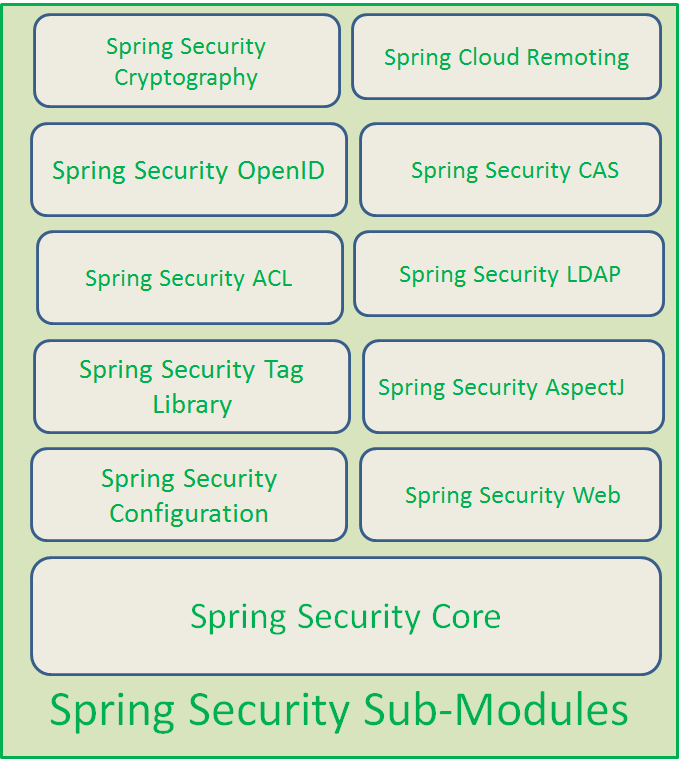
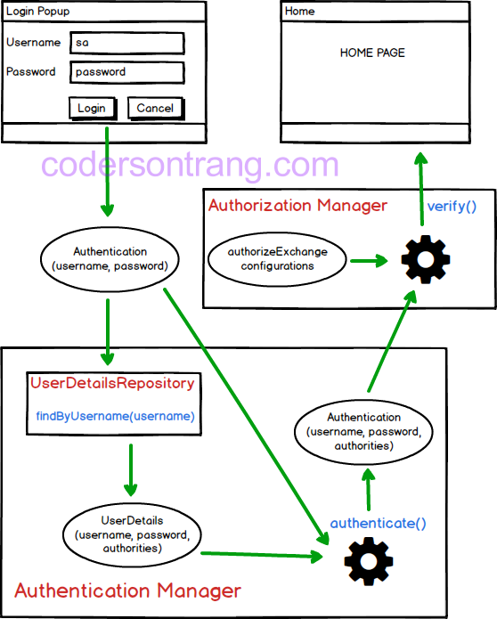

Using Spring security is very useful for our website development. It reduces risks from attacker, protect our data with cryptography.

So, understanding Spring security's the mechanism is essential for us. In this article, we will cover knowledge about how Spring security works.

<br>

## Table of Contents
- [Introduction to Spring security](#introduction-to-spring-security)
- [Mechanism of Spring security](#mechanism-of-spring-security)
- [Some important note in Spring security](#some-important-note-in-spring-security)
- [Recap](#recap)


<br>

## Introduction to Spring security
Spring Security is a Java EE framework that focuses on providing both authentication and authorization to Java applications. 

Some features are included into Spring Security:
- Comprehensive and extensible support for both Authentication and Authorization
- Protection against attacks like session fixation, clickjacking, cross site request forgery, etc
- Servlet API integration
- Optional integration with Spring Web MVC

Next, Spring security will contains some sub-modules:



<br>

## Mechanism of Spring security
Firstly, we will find out the general knowledge about Spring security. This information is referenced from this [link](https://codersontrang.wordpress.com/2017/10/30/xac-thuc-co-ban-va-phan-quyen-bang-spring-security-cho-ung-dung-webflux/).



So, in Spring Security, we have two primary parts: 
- Authentication Manager

    This part is responsible for authenticate user's information that includes ```username``` and ```password``` which are typed in the login form. It will check whether username and password are valid or not. 

    It will be used to answer a question *Who are you?*.

- Authorization Manager

    This part will be used to assign role for user after the above ```authentication``` step passed. Based on their role, the system's resource will be limited.

    It will be used to answer a question *Which part will be limited to the user?*.

We will explain all steps in the above image:
- First of all, a user have to input a username and password in a login form. When a user completely finish this input stage, user will click to ```Login``` button, and username, password will be combined into an object of ```Authentication```.

- Next, this ```Authentication``` object will be sent to an ```authenticate()``` method of ```Authentication Manager``` to check whether a username is valid or not. 

    Based on ```username``` information of ```Authentication``` object, ```Authentication Manager``` will call the ```UserDetailsRepository``` to fetch all information that is stored in database system. All of this information is put into a ```UserDetails``` object, it will include username,password and authorities. 

    Then, a password information in ```UserDetails``` object will be compared to a password of the ```Authentication``` object. 

    If the above condition about password is invalid, user will come back to the login form. Otherwise, a new ```Authentication``` object will be created, and it will contain not only username and password which is input from user, but also contain information about authorities which get from database system.

- The newly created ```Authentication``` will be passed to ```Authorization Manager``` to check user's authorization. 

    The user's authorization will be checked based on a user's role and the role that is needed from these resources. A user's role is in the above ```Authentication``` object. 
    
    The role from resources will be configured in a ```authorizeExchange()``` method. This comparison will be checked in a ```verify()``` method of ```Authorization Manager```.

- Finally, if the above comparison about authorization is valid, a user can access these resources. Otherwirse, a user will be received a notify that these resources can not access.

<br>

To go into the details of Spring security's mechanism with Authetication, we will continue with the following image:


The explaination is referenced to the [link](https://blog.imaginea.com/spring-security-architecture-part-1/).

After a user click a Login button to implement POST method in HTTP protocol, a request will reach the server, then, it is intercepted by the series of filters.

```UsernamePasswordAuthenticationFilter``` will handle the authentication request which extends from ```AbstractAuthenticationProcessingFilter```.

For form based login, our login form must present two parameters to this filter: ```username``` and ```password```.By default, this filter responds to the URL ```/login```. But if we would like to have different parameters and different URL, then we have to override the ```attemptAuthentication()``` method.

```java
public class CustomUsernamePasswordAuthFilter extends UsernamePasswordAuthenticationFilter {
 
    public Authentication attemptAuthentication(HttpServletRequest request,
        HttpServletResponse response) throws AuthenticationException {

        // Your logic here
    }
}
```

- **AbstractAuthenticationProcessingFilter**

    This filter has following abstract method which is implemented by ```UsernamePasswordAuthenticationFilter```.

    ```java
    public abstract Authentication attemptAuthentication(HttpServletRequest    request,HttpServletResponse response)
    ```
    
    This filter does the following operations.
    - First it checks for whether authentication is required or not based on our ```HttpSecurity``` configuration. If authentication is not required, it simply invoke the next filter in the chain.

    - If authentication requires, then it calls the ```attemptAuthentication(request, response)``` which is implemented by ```UsernamePasswordAuthenticationFilter``` and this method returns the ```Authentication``` object.

- **UsernamePasswordAuthenticationFilter**

    - In ```attemptAuthentication()``` method first it obtains the username & password from the request. 

    - Then it constructs the ```UsernamePasswordAuthenticationToken``` using the below code. Which is nothing but ```Authentication``` object.

        ```java
        UsernamePasswordAuthenticationToken authRequest = new UsernamePasswordAuthenticationToken(username, password);
        ```

        This ```Authentication``` object will be as mentioned below.

        ```java
        principal  =  username
        credentials  =  password
        authorities   =  null
        isAuthenticated  =  false
        ```

    - So once it build the ```UsernamePasswordAuthenticationToken/Authentication``` object, then it invokes the ```authenticate()``` method of ```Authentication Manager```. Means this filter delegates the job to the ```AuthenticationManager```.

        ```java
        this.getAuthenticationManager().authenticate(authRequest);
        ```

- **AuthenticationManager**

    ```ProviderManager``` is the implementation of ```AuthenticationManager``` and which has the following method.

    ```java
    public Authentication authenticate(Authentication authentication);
    ```

- **ProviderManager**

    ```ProviderManager``` iterates through all the provided/configured ```AuthenticationProvider```s and delegate the actual ```Authentication``` job to ```AuthenticationProvider```s.

    ```java
    for(AuthenticationProvider provider : getProviders()) {
        Authentication result = provider.authenticate(authentication);
    }
    ```

- **AuthenticationProvider**

    - There are many implementations for ```AuthenticationProvider```. One of the implementation is ```DAOAuthenticationProvider```. Which extends from the ```AbstractUserDetailsAuthenticationProvider```.

    - As mentioned above ```AuthenticationManager``` delegates the job to ```AuthenticationProvider``` to authenticate the user. To this ```AuthenticationProvider``` we can pass/inject the following information.
        - UserDetailsService
        - Salt
        - PasswordEncoder

- **UserDetailsService**

    Which is responsible to load the actual user details which means ```UserDetails``` object. We will have our custom implementation of ```UserDetailsService``` to load or retrieve the ```UserDetails``` object either from internal memory or from ```Database```.

    ```java
    public class UserDetailsServiceImpl implements UserDetailsService {
 
        @Override
        public UserDetails loadUserByUsername(String userinput) throws UsernameNotFoundException {
            // Write a logic to retrieve the UserDetails from DB.
        }
    }
    ```

- **PasswordEncoder**

    - We have multiple implementations of Password Encoder like
        - MD4PasswordEncoder
        - MD5PasswordEncoder
        - ShaPasswordEncoder
        - PlaintextPasswordEncoder

    - We can have our own implementation of password encoder.

        ```java
        public class PBKDF2PasswordEncoder implements  PasswordEncoder {
	
            private static final int ITERATIONS = 10000;
            private static final int KEY_LENGTH = 256;
            private final static Logger LOG = LoggerFactory.getLogger(PBKDF2PasswordEncoder.class);
        
            @Override
            public String encodePassword(String rawPass, Object salt) {
                byte[] hashedPassword = null;
                if (rawPass != null && salt != null) {
                    char[] passwordChars = rawPass.toCharArray();
                    byte[] saltBytes = (byte[]) salt;
                    PBEKeySpec spec = new PBEKeySpec(passwordChars, saltBytes, ITERATIONS, KEY_LENGTH);
                    try {
                        SecretKeyFactory key = SecretKeyFactory.getInstance("PBKDF2WithHmacSHA1");
                        hashedPassword = key.generateSecret(spec).getEncoded();
                    } catch (InvalidKeySpecException e) {
                        LOG.error("Invalid key spec exception", e);
                        throw new RuntimeException(e);
                    } catch (NoSuchAlgorithmException e) {
                        LOG.error("Not a valid algorithm", e);
                        throw new RuntimeException(e);
                    }
                    return toBase64(hashedPassword);
                }
                return null;
            }
        
            @Override
            public boolean isPasswordValid(String encPass, String rawPass, Object salt) {
                byte[] saltBytes = fromBase64((String) salt);
                String encPasswd = encodePassword(rawPass,saltBytes);
                if(encPasswd != null && encPass != null) {
                    return encPasswd.equals(encPass);
                }
                return false;
            }
            
            public byte[] fromBase64(String hex) throws IllegalArgumentException {
                return DatatypeConverter.parseBase64Binary(hex);
            }
        
            public String toBase64(byte[] array) {
                return DatatypeConverter.printBase64Binary(array);
            }
        }
        ```

- **Salt**

    Salt is a random Byte [] array. We can generate the salt as mentioned below.

    ```java
    public byte[] generateSalt() {
        byte[] salt = new byte[32];
        Random random = new SecureRandom();
        random.nextBytes(salt);
        return salt;
    }
    ```

Now finally ```AuthenticationProvider``` authenticate the user and build the ```Authentication``` object and return to the ```AuthenticationManager```. Here i have mentioned some of the code blocks which helps you to understand the flow in detail.

```java
public Authentication authenticate(Authentication authentication) {
   UserDetails user = retrieveUser(username,
                             (UsernamePasswordAuthenticationToken) authentication);
   additionalAuthenticationChecks(user,
                           (UsernamePasswordAuthenticationToken) authentication);
   return createSuccessAuthentication(principalToReturn, authentication, user);
}
```

This method retrieves the ```UserDetails``` object from DB using custom implementation of ```UserDetailsService```.

```java
protected final UserDetails retrieveUser(String username,
                              UsernamePasswordAuthenticationToken authentication) {
   UserDetails loadedUser = this.getUserDetailsService().loadUserByUsername(username);
   return loadedUser;
}
```

This method checks whether the provided password is valid or not.

```java
protected void additionalAuthenticationChecks(UserDetails user ,  UsernamePasswordAuthenticatonToken authentication) {
 
    String presentedPassword = authentication.getCredentials().toString();
    if(!passwordEncoder.isPasswordValid(userDetails.getPassword(),presentedPassword,salt)) {
       logger.debug("Authentication failed: password does not match stored value");
       throw new BadCredentialsException(messages.getMessage(
       "AbstractUserDetailsAuthenticationProvider.badCredentials", "Bad  credentials"));
}
```

Once password validated successfully, this method creates the ```Authentication``` object with ```Authorities``` and sets the ```isAuthenticated``` flag as true.

```java
protected Authentication createSuccessAuthentication(Object principal,
                                 Authentication authentication, UserDetails user) {
   UsernamePasswordAuthenticationToken result = 
                       new  UsernamePasswordAuthenticationToken(principal,authentication.getCredentials(),
                             authoritiesMapper.mapAuthorities(user.getAuthorities()));
   return result;
}
```

- ```createSuccessAuthentication()``` method creates the following ```Authentication``` object.

    ```java
    principal  =  username
    credentials  =  password
    authorities   =  REGULAR_USER
    isAuthenticated  =  true
    ```

- ```AuthenticationProvider``` returns the ```Authentication``` object to ```AuthenticationManager```.

- In the above mentioned ```Authentication``` process if ```Authentication``` fails, then filter clears the ```Security``` context and invokes the failure-handler.

    ```java
    protected void unsuccessfulAuthentication(HttpServletRequest request,
			HttpServletResponse response, AuthenticationException failed)
			throws IOException, ServletException {
 
		SecurityContextHolder.clearContext();
 
		failureHandler.onAuthenticationFailure(request, response, failed);
    }
    ```

- If it successfully gets the ```Authentication``` object then it does following things.
    - It stores the ```Authentication``` object in the ```SecurityContextHolder```.
    - And it invokes the success-handler.

        ```java
        protected void successfulAuthentication(HttpServletRequest request,
			HttpServletResponse response, FilterChain chain, Authentication authResult)
			throws IOException, ServletException {
 
 
            SecurityContextHolder.getContext().setAuthentication(authResult);
    
            successHandler.onAuthenticationSuccess(request, response, authResult);
        }
        ```        

<br>

## Some important note in Spring security
- The difference between ```loginPage()``` and ```loginProcessingURL()```

    The method ```loginPage("/login")``` instructs Spring security:
    - when authentication is required, redirect the browser to ```/login```.
    - we are in charge of rendering the login page when ```/login``` is requested
    - when authentication attempt fails, redirect the browser to ```/login?error``` (since we have not specified otherwise)
    - we are in charge of rendering a failure page when ```/login?error``` is requested
    - when we successfully logout, redirect the browser to ```/login?logout``` (since we have not specified otherwise)
    - we are in charge of rendering a logout confirmation page when /login?logout is requested

    With method ```loginProcessingURL("/login/process")```:
    - this url is used to submit the username and password to ```defaultSuccessUrl()``` - the landing page after a successful login.
    - tells Spring security to process the submitted credentials when sent the specified path and, by default, redirect user back to the page user came from. It will not pass the request to Spring MVC and controller.

- Explain about ```customlogin.html```

    ```html
    <html xmlns:th="http://www.thymeleaf.org">
        <head th:include="layout :: head(title=~{::title},links=~{})">
            <title>Please Login</title>
        </head>
        <body th:include="layout :: body" th:with="content=~{::content}">
            <div th:fragment="content">
                <form name="f" th:action="@{/login}" method="post">     <!--(1)-->          
                    <fieldset>
                        <legend>Please Login</legend>
                        <div th:if="${param.error}" class="alert alert-error">    <!--(2)-->
                            Invalid username and password.
                        </div>
                        <div th:if="${param.logout}" class="alert alert-success">   <!--(3)-->
                            You have been logged out.
                        </div>
                        <label for="username">Username</label>
                        <input type="text" id="username" name="username"/>        <!--(4)-->
                        <label for="password">Password</label>
                        <input type="password" id="password" name="password"/>    <!--(5)-->
                        <div class="form-actions">
                            <button type="submit" class="btn">Log in</button>
                        </div>
                    </fieldset>
                </form>
            </div>
        </body>
    </html>
    ```

    - (1) - The URL we submit our username and password to is the same URL as our login form (i.e. /login), but a POST instead of a GET.
    - (2) - When authentication fails, the browser is redirected to /login?error so we can display an error message by detecting if the parameter error is non-null.
    - (3) - When we are successfully logged out, the browser is redirected to /login?logout so we can display an logout success message by detecting if the parameter logout is non-null.
    - (4) - The username should be present on the HTTP parameter username
    - (5) - The password should be present on the HTTP parameter password

- The meaning of some methods in ```configure()``` method of ```WebSecurityConfigurerAdapter``` class

    - ```loginPage("/login")```: The url which points to a ```@RequestMapping which returns the login form.
    - ```loginProcessingUrl("/login")```: The url which triggers the ```UsernamePasswordAuthenticationFilter```. It is equivalent to build a POST processing controller method.
    - ```defaultSuccessUrl("/user")```: The default page where the user will be redirected after providing a valid user credentials.
    - ```failureUrl("/login?error=true")```: The url where user will be redirected in case of trying to login with invalid credentials.

- Why to use POST method with URL is "/login" as parameter of ```loginPage("/login")``` in login.html, it can not be called.

    ```java
    @RequestMapping(value = "/login", method = RequestMethod.POST)
    public ModelAndView doLogin() {
        System.out.println("***LOGIN_POST***");
        return new ModelAndView("users/home");
    }
    ```

    So, the above code won't be reached.

    When mapping a post to ```/login``` uri, the ```UsernamePasswordAuthenticationFilter``` will perform it's ```doFilter()``` method to catch the user provided credentials, build a ```UsernamePasswordAuthenticationToken``` and delegate it to the ```AuthenticationManager```, where this ```Authentication``` will be executed in the matching ```AuthenticationProvider```.

- ```UsernamePasswordAuthenticationFilter``` class

    It is extended from ```AbstractAuthenticationProcessingFilter``` class and some other interfaces.

    When the url in ```loginProcessingURL("/login")``` is implemented, this class will process an authentication form submission. And login form must present two parameters to this filter: a username and password. 

    So, this class's responsibility is to get username and password from login form.

    We can refer this [link](https://docs.spring.io/spring-security/site/docs/4.2.11.BUILD-SNAPSHOT/apidocs/org/springframework/security/web/authentication/UsernamePasswordAuthenticationFilter.html) to read about some methods of this class.


- ```UsernamePasswordAuthenticationToken``` class

    It is extended from the abstract class ```AbstractAuthenticationToken``` and implemented interfaces such as ```Serializable```, ```Principal```, ```Authentication```, ```CredentialsContainer```. 

    **An ```Authentication``` implementation that is designed for simple presentation of a username and password.**

    In the ```UsernamePasswordAuthenticationToken``` class, we can see that it has two constructor:

    ```java
    UsernamePasswordAuthenticationToken(java.lang.Object principal, java.lang.Object credentials);
    UsernamePasswordAuthenticationToken(java.lang.Object principal, java.lang.Object credentials, java.util.Collection<? extends GrantedAuthority> authorities);
    ```
    In the above two constructors, we have to pass ```principal``` and ```credentials``` objects, or authorities of user.

    And this class also support some method to make an action with ```principal``` and ```credentials```.

    ```java
    void eraseCredentials();
    Object getCredentials();
    Object getPrincipal();
    void setAuthenticated(boolean isAuthenticated);
    ```

    So, we have two questions: 
    - *What is principal and credential?* 
    - *When/How are two object - principal and credentials created?*
    
    To end up this class, we have conclusion - ```UsernamePasswordAuthenticationToken``` class will contain all information about ```principal``` (the principal can be username), ```credentials``` (the credentials are a password) and ```authorities```.

- ```AuthenticationManager``` class

    It is an interface class, has derived class that is ```ProviderManager``` class.

    This class has only one method:

    ```java
    Authentication authenticate(Authentication authentication) throws AuthenticationException;
    ```

    ```authenticate()``` method will attempts to authenticate the passed ```Authentication``` object, returning a fully populated ```Authentication``` object (including granted authorities) if successful.

    
- ```AuthenticationProvider``` class

    It is also interface class and some classes implementing this interface are ```AbstractJaasAuthenticationProvider, AbstractLdapAuthenticationProvider, AbstractUserDetailsAuthenticationProvider, ActiveDirectoryLdapAuthenticationProvider, AnonymousAuthenticationProvider, AuthenticationManagerBeanDefinitionParser.NullAuthenticationProvider, CasAuthenticationProvider, DaoAuthenticationProvider, DefaultJaasAuthenticationProvider, JaasAuthenticationProvider, LdapAuthenticationProvider, OpenIDAuthenticationProvider, PreAuthenticatedAuthenticationProvider, RememberMeAuthenticationProvider, RemoteAuthenticationProvider, RunAsImplAuthenticationProvider, TestingAuthenticationProvider```.

    It also provides a method for performing authentication with the same contracts as ```AuthenticationManager.authenticate(Authentication)```.

    ```java
    Authentication authenticate(Authentication authentication) throws AuthenticationException;
    ```

- ```ProviderManager``` class

    It is extended from Object class and implemented from some interfaces such as ```AuthenticationManager```, ...

    We can see some constructors to know about it.

    ```java
    ProviderManager(List<AuthenticationProvider> providers);
    ProviderManager(List<AuthenticationProvider> providers, AuthenticationManager parent);
    ```

    So, ```ProviderManager``` will manage the list of ```AuthenticationProvider```. 

    And it also provides an ```authenticate()``` method that do the same meaning with an ```authenticate()``` method of ```AuthenticationManager``` and ```AuthenticationProvider``` classes.

    ```java
    public Authentication authenticate(Authentication authentication) throws AuthenticationException;
    ```

    This method will attempt to authenticate the passed ```Authentication``` object.

    The list of ```AuthenticationProvider```s will be successively tried until an ```AuthenticationProvider``` indicates it is capable of authenticating the type of ```Authentication``` object passed. ```Authentication``` will then be attempted with that ```AuthenticationProvider```.

    If more than one ```AuthenticationProvider``` supports the passed ```Authentication``` object, the first one able to successfully authenticate the ```Authentication``` object determines the result, overriding any possible ```AuthenticationException``` thrown by earlier supporting ```AuthenticationProvider```s. On successful authentication, no subsequent ```AuthenticationProvider```s will be tried. If authentication was not successful by any supporting ```AuthenticationProvider``` the last thrown ```AuthenticationException``` will be rethrown.

- Explain about ```principal``` and ```credentials```

    Authentication represents the process by which the identify of a subject is verified, , and must be performed in a secure fashion; otherwise a perpetrator may impersonate others to gain access to a system. Authentication typically involves the subject demonstrating some form of evidence to prove its identity.

    Once authenticated, a Subject is populated with associated identities, or Principals (of type java.security.Principal). A Subject may have many Principals. For example, a person may have a name Principal ("John Doe") and an SSN Principal ("123-45-6789"), which distinguish it from other Subjects.

    In addition to associated Principals, a Subject may own security-related attributes, which are referred to as credentials. A credential may contain information used to authenticate the subject to new services. Such credentials include passwords, Kerberos tickets, and public key certificates. Credentials might also contain data that enables the subject to perform certain activities. Cryptographic keys, for example, represent credentials that enable the subject to sign or encrypt data. Public and private credential classes are not part of the core Java SE API. Any class, therefore, can represent a credential.

<br>

## Recap
- Understanding about mechanism of Spring Security will help us to customize the authentication and authorization to follow our thought.


<br>

Refer:

**Spring security architecture**

[https://spring.io/guides/topicals/spring-security-architecture/](https://spring.io/guides/topicals/spring-security-architecture/)

[https://blog.imaginea.com/spring-security-architecture-part-1/](https://blog.imaginea.com/spring-security-architecture-part-1/)

[https://www.blog.labouardy.com/spring-security-authentication/](https://www.blog.labouardy.com/spring-security-authentication/)

[https://www.dineshonjava.com/spring-security-take-baby-step-to-secure/](https://www.dineshonjava.com/spring-security-take-baby-step-to-secure/)

[https://en.wikipedia.org/wiki/Spring_Security](https://en.wikipedia.org/wiki/Spring_Security)

[https://docs.spring.io/spring-security/site/docs/4.2.2.RELEASE/guides/html5/hellomvc-javaconfig.html#security-config-java](https://docs.spring.io/spring-security/site/docs/4.2.2.RELEASE/guides/html5/hellomvc-javaconfig.html#security-config-java)

[https://stackoverflow.com/questions/53140629/spring-security-loginpage-vs-loginprocessingurl](https://stackoverflow.com/questions/53140629/spring-security-loginpage-vs-loginprocessingurl)


**Creating the custom login page**

[https://docs.spring.io/spring-security/site/docs/current/guides/html5/form-javaconfig.html](https://docs.spring.io/spring-security/site/docs/current/guides/html5/form-javaconfig.html)

[https://docs.spring.io/spring-security/site/migrate/current/3-to-4/html5/migrate-3-to-4-xml.html#m3to4-xmlnamespace-form-login](https://docs.spring.io/spring-security/site/migrate/current/3-to-4/html5/migrate-3-to-4-xml.html#m3to4-xmlnamespace-form-login)

[https://www.baeldung.com/spring-security-login](https://www.baeldung.com/spring-security-login)

**Spring security overview**

[https://docs.spring.io/spring-security/site/docs/3.2.x/reference/htmlsingle/html5/#technical-overview](https://docs.spring.io/spring-security/site/docs/3.2.x/reference/htmlsingle/html5/#technical-overview)

**Send information username and password from form-submit to Server**

[https://stackoverflow.com/questions/7562675/proper-way-to-send-username-and-password-from-client-to-server](https://stackoverflow.com/questions/7562675/proper-way-to-send-username-and-password-from-client-to-server)

[https://docs.spring.io/spring-security/site/docs/current/reference/html/overall-architecture.html#core-services-authentication-manager](https://docs.spring.io/spring-security/site/docs/current/reference/html/overall-architecture.html#core-services-authentication-manager)

**SecurityContext and SecurityContextHolder**
[https://www.javacodegeeks.com/2018/02/securitycontext-securitycontextholder-spring-security.html](https://www.javacodegeeks.com/2018/02/securitycontext-securitycontextholder-spring-security.html)

[https://docs.oracle.com/javase/8/docs/technotes/guides/security/jgss/tutorials/glossary.html](https://docs.oracle.com/javase/8/docs/technotes/guides/security/jgss/tutorials/glossary.html)

**AuthenticationProvider**

[https://www.baeldung.com/spring-security-authentication-provider](https://www.baeldung.com/spring-security-authentication-provider)

[https://www.logicbig.com/tutorials/spring-framework/spring-security/custom-authentication-provider.html](https://www.logicbig.com/tutorials/spring-framework/spring-security/custom-authentication-provider.html)