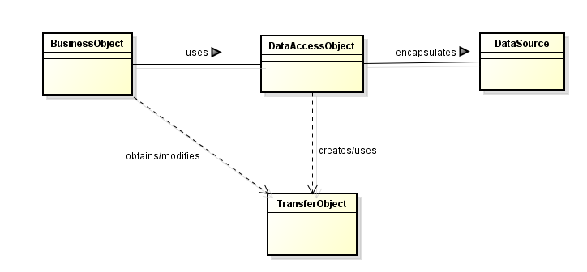

We have known that the Spring framework 4.0.3 has a seven-layered architecture that includes a core container, context, Aspect-Oriented Programming (AOP), Data Access Object (DAO), Object-relational mapping (ORM), Web, and Model-View-Controller (MVC). So, to master about Spring framework, we should study each layer architecture. 

In this article, we will find out about DAO pattern, some interesting informations in this pattern.

Let's get started!

<br>

## Table of Contents
- [Given Problem](#given-problem)
- [Solution with DAO pattern](#solution-with-dao-pattern)
- [Source code](#source-code)
- [When to use](#when-to-use)
- [Advantages and Disadvantages](#advantages-and-disadvantages)
- [Related Design Patterns](#related-design-patterns)
- [Wrapping up](#wrapping-up)

<br>

## Given Problem
Assuming that we have a web application project that utilize MySQL database to follow the requirements from customer. So, we will use driver of MySQL to interact with database. But in other beautiful day, the customer want to use additional database such as PostgreSQL, then, we have to modify our code to compatible with this database. It makes our layers that has tightly coupling with persistence layer when we change to other database. 

Therefore, what is solution to prevent the tightly coupling of other layers with persistence layer?

<br>

## Solution with DAO pattern
The DAO pattern is a structural pattern that allow us to isolate the application/business layer from the persistence layer (usually a relational database, but it could be any other persistence mechanism) using an abstract API.

DAO pattern is based on design principles such as **abstraction** and **encapsulation**. It will protect the rest of application from many operations in persistence layer. For example, change database from MySQL to PostgreSQL, change storage by file to database.

The DAO pattern is commonly used pattern to persist domain objects into a database. The most common form of a DAO pattern is a class that contains CRUD methods for a particular domain entity type.

So, DAO class is an intermediate layer to help other layers to communicate with persistence layers regardless of any storage mechanism such as file, database management, ..., then, performs some operations such as CRUD.

For example:

DAO pattern can be represented with many ways such as Java Persistence API (JPA), Enterprise Java Bean (EJB), Object-Relational Mapping (ORM) with many specific implementations such as Hibernate, iBATIS, Spring JPA, ...



<br>

## Source code
Now, we will use Java language to describe the DAO pattern. And based on these code, we will analyze the advantages and disadvantages of DAO pattern.

```java
// Domain class
public class Student {
    private int     studentId;
    private String  userName;
    private int     age;

    public int getStudentID() {
        return studentId;
    }

    public void setStudentID(int studentId) {
        this.studentId = studentId;
    }

    public String getUserName() {
        return userName;
    }

    public void setUserName(String userName) {
        this.userName = userName;
    }

    public int getAge() {
        return age;
    }

    public void setAge(int age) {
        this.age = age;
    }
}

// DAO class
public interface StudentDAO {
    Student get(String userName);
    void create(Student student);
    void update(Student student);
    void delete(String userName);
}


// Implementation of DAO class
public class StudentDAOImpl implements StudentDAO {
    ...
}


// Main Application
public void main(String[] args) {
    ...
}
```

<br>

## When to use
- When we need to change the current database to the other database such as Oracle, MySQL, MariaDB, SQL Server, MongoDB.
- We want to separate a data source's client interface from its data access mechanism.
- We want to adapt a specific data resource's access API to a generic client interface.
- In a larger project, different teams work on different parts of the application: the DAO pattern allows clean separation of concerns.

<br>

## Advantages and Disadvantages
1. Advantages
    - It separeates the domain logic that use it from any particular persistence mechanism or APIs --> loose coupling between layers.

    - The interface methods signature are independent of the content of the Domain class. When we add some fields to the Domain class, we do not need to change the DAO interface nor its caller.

    - Testing our service that calls the DAO: We can write a mock DAO that behaves just as we need it in the test (Ex: simulate that there is no DB connection, which is hard to reproduce automatically).

    - Generate some layers around our DAO: We could use Aspect Oriented Programming - AOP to generate caching or transaction handling around our DAO methods. In this case, we have an object that implements the DAOs interface but has nothing to do with the original implementation.

    - Switching the DB technology: if we switch from MySQL to DB2, we just need to write another implementation of the interface and switch the MySQL DAO and the DB2 DAO.

2. Disadvantages
    - Potential disadvantages of using DAO include leaky abstraction, code duplication, and abstraction inversion. 
    
        A leaky abstraction is an abstraction that leaks details that it is supposed to abstract away.

    - When application requires multiple DAOs, one might find oneself repeating essentially the same create, read, update, and delete code for each DAO 
    
        --> Solution: implementing a generic DAO that handles these common operations.

    - Any changes to the interface require edits in not just one implementation, but in multiple implementations in multiple classes. When the Open/Closed rule is violated here, it really blows up.

<br>

## Related Design Patterns
- Abstract Factory pattern and Factory Method pattern

    Applications often use a Factory to select the right DAO implementation at run time.

    To understand about how to use Abstract Factory pattern with DAO pattern, refer to the [link](https://www.oracle.com/technetwork/java/dataaccessobject-138824.html).

- Transfer Object
    
    DAO pattern often uses a Transfer Object to send data source to its client and vice versa.

- Broker pattern

    DAO pattern is related to the Broker pattern, which describes approaches for decoupling clients and servers in distributed systems. DAO pattern more specifically applies this pattern to decouple the resouce tier from clients in another tier, such as the business or presentation tier.

<br>

## Wrapping up
- Some assumptions behind the DAO implementation:
    - All database access in the system is made through a DAO to achieve encapsulation.

    - Each DAO instance is responsible for one primary domain object or entity. If a domain object has an independent lifecycle, it should have its own DAO.

    - The DAO is responsible for creations, reads (by primary key), updates, and deletions -- that is CRUD -- on the domain object.

    - The DAO may allow queries based on criteria other than the primary key. We refer to these as *finder methods* or *finders*. The return value of a finder is normally a collection of the domain object for which the DAO is responsible.
    
    - The DAO is not responsible for handling transactions, sessions, or connections. These are handled outside the DAO to achieve flexibility.

- A typical DAO implementation has the following components:
    - A DAO factory class.
    - A DAO interface.
    - A concrete class that implements the DAO interface.
    - Data transfer object (sometimes called **Value Objects**)

- The concrete DAO class contains logic for accessing data from a specific data source.

- Use a DAO pattern when we need a DAO, whereas we do not need a repository. A DAO can basically be used as a messaging system, between the application and the database. 

    So, if we need to generate a report, which is often a rendering of read-only data, or update any logging tables, then a DAO should suffice. No need for managing such transaction in session, just quick data dumps and updates.

    For managing actual domain entities, and not **Value Object**, use a repository.

- In the absence of an ORM frameowork, the DAO pattern handles the impedance mismatch that a relational database has with object-oriented techniques. In DDD, we inject Repositories, not DAO's in domain entities. 

- DAO's are related to peristence, and persistence is infrastructure, not domain. The main problem is that we have lots of different concerns polluting the domain. According to DDD, an object should be distilled unitl nothing remains that does not relate to its meaning or support its role in interactions. And that's exactly the problem the Repository pattern tries to solve.

<br>

Refer:

**Advanced DAO programming**

[https://www.ibm.com/developerworks/library/j-dao/](https://www.ibm.com/developerworks/library/j-dao/)

[https://pkp.sfu.ca/wiki/index.php?title=Data_Access_Objects_(DAO)](https://pkp.sfu.ca/wiki/index.php?title=Data_Access_Objects_(DAO))

[https://www.oracle.com/technetwork/java/dataaccessobject-138824.html](https://www.oracle.com/technetwork/java/dataaccessobject-138824.html)

<br>

[http://best-practice-software-engineering.ifs.tuwien.ac.at/patterns/dao.html](http://best-practice-software-engineering.ifs.tuwien.ac.at/patterns/dao.html)

[https://en.wikipedia.org/wiki/Data_access_object](https://en.wikipedia.org/wiki/Data_access_object)

[https://thinkinginobjects.com/2012/08/26/dont-use-dao-use-repository/](https://thinkinginobjects.com/2012/08/26/dont-use-dao-use-repository/)

[https://www.oracle.com/technetwork/java/dataaccessobject-138824.html](https://www.oracle.com/technetwork/java/dataaccessobject-138824.html)

[https://www.journaldev.com/16813/dao-design-pattern](https://www.journaldev.com/16813/dao-design-pattern)

[https://www.baeldung.com/java-dao-pattern](https://www.baeldung.com/java-dao-pattern)

[https://thinkinginobjects.com/2012/08/26/dont-use-dao-use-repository/](https://thinkinginobjects.com/2012/08/26/dont-use-dao-use-repository/)

[https://www.ibm.com/developerworks/library/j-genericdao/index.html](https://www.ibm.com/developerworks/library/j-genericdao/index.html)

[https://xebia.com/blog/jpa-implementation-patterns-data-access-objects/](https://xebia.com/blog/jpa-implementation-patterns-data-access-objects/)