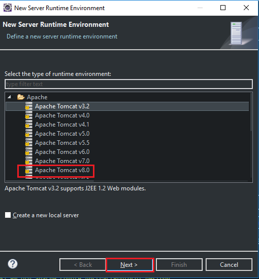
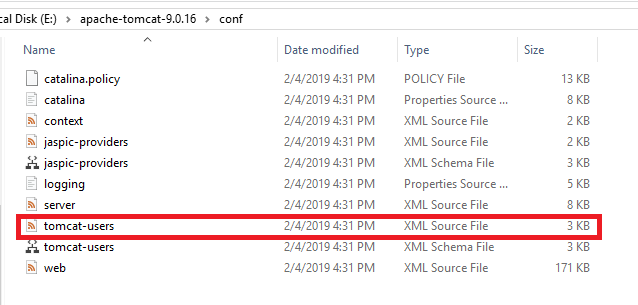

In this turorial, we will find out about how to configure Tomcat in eclipse, and how to configure Tomcat to deploy web application.

<br>

## Table of contents
- [Introduction to Tomcat](#introduction-to-tomcat)
- [Configure Tomcat in Eclipse](#configure-tomcat-in-eclipse)
- [Configure Tomcat server to deploy web application](#configure-tomcat-server-to-deploy-web-application)
- [Understanding about some configuration files in Tomcat](#understanding-about-some-configuration-files-in-tomcat)
- [Some errors in Eclipse when configure Tomcat](#some-errors-in-eclipse-when-configure-tomcat)
- [Wrapping up](#wrapping-up)


<br>

## Introduction to Tomcat

Tomcat is actually composed of a number of components, including a Tomcat JSP engine and other connectors, but the main component is Catalina, which provides the implementation of the servlet specification. When starting the Tomcat server, it's Catalina that is actually starting. The variable ```CATALINA_HOME``` is a configuration property that stores the location of the Catalina files.

These are the configuration files in Tomcat's ```CATALINA_BASE/conf``` directory:
- **catalina.policy**
- **catalina.properties**
- **logging.properties**
- **content.xml**
- **server.xml**
- **tomcat-users.xml**
- **web.xml**


<br>

## Configure Tomcat in Eclipse
- The first thing we have to do is to download ```Apache Tomcat``` in a link such as [https://tomcat.apache.org/download-90.cgi](https://tomcat.apache.org/download-90.cgi).

    

- Unzip this file and we have;

    

- This step we will add Tomcat into our Eclipse:

    

    

    

    And click ```Apply and Close``` to agree our Tomcat version.

<br>

## Configure Tomcat server to deploy web application
After we unzip Tomcat file, we will do something like: 
- specify JDK for Tomcat.
- Open ```startup.bat``` file in ```bin``` folder of Tomcat. (With Linux/Ubuntu OS, we have ```startup.sh``` file).

    

- We will add some code into ```startup.bat``` file.

    ```bat
    # With Windows
    set JAVA_HOME="C:\Program Files\Java\jdk1.8.0_181"

    # With Linux/Ubuntu
    JAVA_HOME="/usr/lib/jvm/open-jdk"
    ```

    

- Next, we will configure for account to use Tomcat. Open ```tomcat-users.xml``` in ```conf``` folder.

    

    Tomcat was defined 4 roles: 
    - ```manager-gui``` - allows access to the HTML GUI and the status pages
    - ```manager-script``` - allows access to the text interface and the status pages
    - ```manager-jmx``` - allows access to the JMX proxy and the status pages
    - ```manager-status``` - allows access to the status pages only

    We can declare a user with 4 roles

    ```xml
    <role rolename="manager-gui"/>
    <role rolename="manager-script"/>
    <role rolename="manager-jmx"/>
    <role rolename="manager-status"/>
    
    <user username="tomcat"
        password="mypassword"
        roles="manager-gui,manager-script,manager-jmx,manager-status"/>
    ```

    

- To run Tomcat, we double click into ```startup.bat``` file. (or ```startup.sh``` file if we use Linux/Ubuntu).

- On browser, we type ```localhost:8080```.

    

- With Tomcat, we have authenticate ```username```/```password``` that we write in ```tomcat-users.xml``` file.

    

- In Tomcat, we have ```/manager``` (Tomcat Manager Application) is the most important. It will help us to manage Tomcat, and we can access it with following path: ```localhost:8080/manager```.

    

- In order to deploy web application to Tomcat, we can do the following image.

    

- After that, demo application will be deployed to Tomcat.

    

- Run demo application, we have:

    


<br>

## Some errors in Eclipse when configure Tomcat
- ```WARNING: Unable to load server configuration from ... server.xml```
    
    We only need to copy a path ```E:\apache-tomcat-9.0.16\conf``` into our path where has error.

- ```Getting 404 - Page not found error```

    

    We can solve this error that follows some steps:
    - Step 1

        - Go to Eclipse IDE
        - Click on Servers Tab
        - Double click on Tomcat v9.0 Server at localhost

            

    - Step 2

        - New Apache Tomcat configuration page will open
        - Go to ```Server Location``` section
        - Select ```Use Tomcat installation``` (takes control of Tomcat installation)

            

    - Step 3

        - Save configuration
        - ```Restart``` Server by right clicking on tomcat server and click ```Restart```
        - Visit ```http://localhost:8080``` again and now you should see working tomcat page

            

<br>

## Wrapping up


<br>

Refer:

[https://o7planning.org/vi/11583/cai-dat-va-cau-hinh-tomcat-server](https://o7planning.org/vi/11583/cai-dat-va-cau-hinh-tomcat-server)

[https://crunchify.com/tomcat-starts-but-home-page-does-not-open-on-browser-with-url-http-localhost8080/](https://crunchify.com/tomcat-starts-but-home-page-does-not-open-on-browser-with-url-http-localhost8080/)