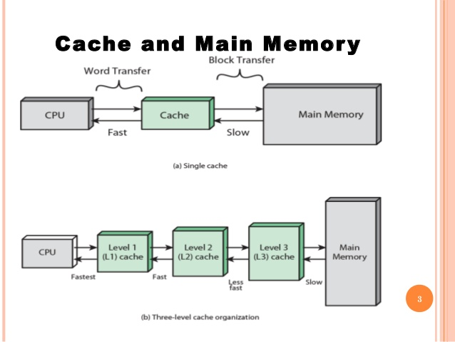
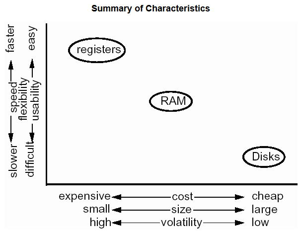

In this article, we will learn how to manage application cache from Spring framework caching support. Spring has nice features around caching and the abstraction on the Spring cache API is very much simple to use.

## Table of contents
- [Introduction to memory in computer](#introduction-to-memory-in-computer)
- [The cause to create cache](#the-cause-to-create-cache)
- [Introduction to cache](#introduction-to-cache)
- [Types of cache](#types-of-cache)
- [How Spring Caching mechanism works](#how-spring-caching-mechanism-works)
- [Wrapping up](#wrapping-up)


<br>

## Introduction to memory in computer

Before diving into Spring caching, we need to understand about how many ways to contains data in computer. Generally speaking, we have a picture that discribe the speed and amount of each part.


At the top of pyramid, it is CPU Register. It is nearest to the CPU, so it has the highest speed in all of components, and it has the smallest amount of memory when compared with other memories, simply because CPU always need to optimize the space.

The contents of a register are lost if power to the CPU is turned off, so registers are unsuitable for holding long-term information or information that is needed for retention after a power-shutdown or failure. 

The second thing is Cache (this is not relevant to our cache in this article). Modern computers have both L1 and L2 caches, and may now also have L3 cache. To understand why these cache is faster than RAM, permanent storage such as HDD, SSD, ... we need to see the below image:



RAM - Random Access Memory is the most commom form of Main Memory. RAM is normally located on the motherboard. Although slower than register, L-cache, the contents of any location in RAM can still be read or written very quickly.The time to read or write is referred to as the access time and is the same for all RAM locations. 

ROM - Read Only Memory or some permanent memories such as HDD, SSD, removable disk, ... are the slowest memories. 

ROM is often used to store the **boot** or start-up program that a computer executes when powered on.

Here is the summary of characteristic about memories.



<br>

## The cause to create cache

Our cache is not the same as L-cache in hardware. Our cache is a part of RAM memory.

In web development, we always to interact with database. This implementation with database takes so much time mainly because we have to access to disk memory such as HDD, SSD, ... 

In ```Introduction to memory in computer```, it turns out that disk is the slowest memory. So when we need to access database in disk so much time, our program is really slow. It makes annoyed for us.

Therefore, to remove this limitation, we will use the concept - Cache. 

<br>

## Introduction to caching

Caching is a mechanism to enhace the performance of system. It is a temporary memory that lies between the application and the persistent database. 

Cache memory stores recently used data items in order to reduce the number of database hits as much as possible.

Data access from memory is always faster in comparison to fetching from storage like database, file system or other service calls.

<br>

## Types of cache

There are some following types of cache:
- In-memory caching

    This is the most frequently used area where caching is used extensively to increase performance of the application.
     
    In-memory caches such as Memcached and Radis are key-value stores between your application and your data storage. Since the data is held in RAM, it is much faster than typical databases where data is stored on disk.

    RAM is more limited than disk, so cache invalidation algorithms such as least recently used (LRU) can help invalidate ‘cold’ entries and keep ‘hot’ data in RAM. Memcached is in-momory caching where Redis is more advanced which allows us to backup and restore facility as well as it is distributed caching tool where we can manage caching in distributed clusters.

- Database caching

    Our database usually includes some level of caching in a default configuration, optimized for a generic use case. Tweaking these settings for specific usage patterns can further boost performance. One popular in this area is first level cache of Hibernate or any ORM frameworks.

- Web server caching

    Reverse proxies and caches such as Varnish can serve static and dynamic content directly. Web servers can also cache requests, returning responses without having to contact application servers. In today’s API age, this option is a viable if we want to cache API responses in web server level.

- CDN caching

    Caches can be located on the client side (OS or browser), server side, or in a distinct cache layer.

<br>

## How Spring Caching mechanism works

The below image is used to describe the mechanism of Spring Caching.


1. Server receives requests from user.

2. ```Spring Created Proxy``` is created, and intercept these requests. It will check whether information that user need whether is in ```Data Cache```. If found, use it. If not, jump to step 3. 


3. Go to the function that manage this request from controller.

4. Finally, ```Spring Created Proxy``` will add their result into ```Data Cache```.

<br>

## Wrapping up
- Our caching will lie between application and database. When database is updated, immediately, cache will be updated. 
- There are 4 types of cache; In-memory caching, Database caching, Webserver caching, CDN caching.

<br>

Thanks for your reading.

<br>

Refer:

[https://codeboje.de/caching-spring-boot/](https://codeboje.de/caching-spring-boot/)

[http://learningviacode.blogspot.com/2012/09/caching-in-spring.html](http://learningviacode.blogspot.com/2012/09/caching-in-spring.html)

[https://www.javadevjournal.com/spring/spring-caching/](https://www.javadevjournal.com/spring/spring-caching/)

[https://howtodoinjava.com/spring-boot2/spring-boot-cache-example/](https://howtodoinjava.com/spring-boot2/spring-boot-cache-example/)

[https://computer.howstuffworks.com/cache3.htm](https://computer.howstuffworks.com/cache3.htm)

[http://learningviacode.blogspot.com/2012/09/caching-in-spring-2.html](http://learningviacode.blogspot.com/2012/09/caching-in-spring-2.html)

[https://visola.github.io/2012/07/22/simple-caching-with-spring/index.html](https://visola.github.io/2012/07/22/simple-caching-with-spring/index.html)