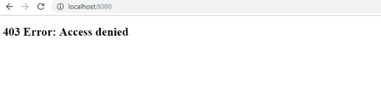

When using Spring security, I always cope with problem about permision of account, regardless of right my account. It's annoyed for me. After digging into this problem, I have some interesting information.

So, in this article, we will discuss some solutions for this permission problem.

<br>

## Table of contents
- [Problem's context](#context's-problem)
- [Solutions](#solutions)
- [What does ROLE_ means?](#what-does-role_-mean)
- [Difference between Role and GrantedAuthority](#difference-between-role-and-grantedauthority)
- [Wrapping up](#wrapping-up)

<br>

## Problem's context
In order to configure Spring Security, we will do all settings in ```configure()``` method in our Web configuration that inherited from ```WebSecurityConfigurerAdapter``` class, and get username, password, authorization from database in ```loadUserByUsername()``` method of ```UserDetailsServiceImpl``` class that inherited from ```UserDetailsService```.

To get more information, we can visit this [link](https://ducmanhphan.github.io/2019-02-09-The-mechanism-of-spring-security).

```java
@Configuration
@EnableWebSecurity
public class WebSecurityConfig extends WebSecurityConfigurerAdapter implements WebMvcConfigurer {

    @Autowired
    private UserDetailsService userDetailService;

    @Bean
    public PasswordEncoder passwordEncoder() {
        return new BCryptPasswordEncoder();
    }

    @Autowired
    public void configureGlobal(AuthenticationManagerBuilder auth) throws Exception {
        auth.userDetailsService(userDetailService).passwordEncoder(passwordEncoder());                
    }

    @Override
    protected void configure(HttpSecurity http) throws Exception {
        http.authorizeRequests()
                .antMatchers("/items/**").permitAll()       // for rest api
                .antMatchers("/").access("hasAnyRole('USER', 'ADMIN')")
                .antMatchers("/admin/**").access("hasRole('ADMIN')")
                .and()
            .formLogin()
                .loginProcessingUrl("/login") // link to submit username-password
                .loginPage("/login")
                .usernameParameter("username")
                .passwordParameter("password")
                .defaultSuccessUrl("/")
                .failureUrl("/login?error")
                .and()
            .logout()
                .logoutRequestMatcher(new AntPathRequestMatcher("/logout"))
                //.logoutUrl("/logout")              
                .logoutSuccessUrl("/login")
                .invalidateHttpSession(true)
                .deleteCookies("JSESSIONID")
                .and()
            .exceptionHandling()
                .accessDeniedPage("/403")
                .and()
            .rememberMe()
                .tokenRepository(this.persistentTokenRepository())
                .tokenValiditySeconds(1*24*60*60);
    }

    @Bean
    public PersistentTokenRepository persistentTokenRepository() {
        JdbcTokenRepositoryImpl db = new JdbcTokenRepositoryImpl();
        db.setDataSource(dataSource);
        
        return db;
    }
}
```

```java
@Service
public class UserDetailsServiceImpl implements UserDetailsService {

    @Autowired
    private UserRepository userRepository;

    @Override
    @Transactional
    public UserDetails loadUserByUsername(String username) throws UsernameNotFoundException {
        com.vietis.smartkids.domain.User user = userRepository.findByUsername(username);
        if (user == null) {
            throw new UsernameNotFoundException("User not found");
        }

        Set<GrantedAuthority> grantedAuthorities = new HashSet<>();
        Set<Role> roles = user.getRoles();
        for (Role role : roles) {
            System.out.println(role.getName());
            grantedAuthorities.add(new SimpleGrantedAuthority(role.getName()));
        }               
        
        UserDetails userDetails = (UserDetails) new org.springframework.security.core.userdetails.User(user.getUsername(), user.getPassword(), grantedAuthorities);
        
        return userDetails;
    }
}
```

And in database, we only save two fields about account's role such as ```ADMIN```, and ```USER```.

So when following these steps, we will have problem like this below image:



Immediately, we will wonder that everything is right, why it has ```403 - Access Denied``` ?

And we will try to do something with code by adding "ROLE_":

```java
http.authorizeRequests()
    .antMatchers("/items/**").permitAll() 
    .antMatchers("/").access("hasAnyRole('ROLE_USER', 'ROLE_ADMIN')")
    .antMatchers("/admin/**").access("hasRole('ROLE_ADMIN')");
```

But we will see the highlight error ```You do not add ROLE_ into above```

At the end, we will think about it is a arduous problem.

<br>

## Solutions
There are two ways to solve this problem. Therefore, we will do each solution step by step.

- First solution

    This solution is very easy to do simply because we only change some roles in database by appending ```ROLE_``` to our text about role such as ```ROLE_USER```, and ```ROLE_ADMIN```.

- Second solution

    Assume that in database, we have roles without ```ROLE_``` at beginning of text such as ```USER```, and ```ADMIN```.

    So, we will add ```ROLE_``` before ```role.getName()```:

    ```java
    Set<GrantedAuthority> grantedAuthorities = new HashSet<>();
        Set<Role> roles = user.getRoles();
        for (Role role : roles) {
            System.out.println(role.getName());
            grantedAuthorities.add(new SimpleGrantedAuthority("ROLE_" + role.getName()));
    }    
    ```

The two solution is easy to do, but we have to wonder why can we use ```ROLE_``` so?

We will continue to find out about ```ROLE_```.

<br>

## What does ROLE_ means
This information is referenced from [documenentation](https://docs.spring.io/spring-security/site/docs/4.2.1.RELEASE/reference/htmlsingle/#appendix-faq-role-prefix).

```
Spring Security has a voter-based architecture which means that an access decision is made by a series of AccessDecisionVoters. The voters act on the "configuration attributes" which are specified for a secured resource (such as a method invocation). With this approach, not all attributes may be relevant to all voters and a voter needs to know when it should ignore an attribute (abstain) and when it should vote to grant or deny access based on the attribute value. 

The most common voter is the RoleVoter which by default votes whenever it finds an attribute with the "ROLE_" prefix. It makes a simple comparison of the attribute (such as "ROLE_USER") with the names of the authorities which the current user has been assigned. If it finds a match (they have an authority called "ROLE_USER"), it votes to grant access, otherwise it votes to deny access.

The prefix can be changed by setting the rolePrefix property of RoleVoter. If you only need to use roles in your application and have no need for other custom voters, then you can set the prefix to a blank string, in which case the RoleVoter will treat all attributes as roles.
```


<br>

## Difference between Role and GrantedAuthority
- GrantedAuthority

    We can consider that each ```GrantedAuthority``` as an individual privilege, permission, or right. 

    Those permissions are normally expressed as strings (with the ```getAuthority()``` method). Those strings let us identify the permissions and let our voters decide if they grant access to something.

    We can grant different ```GrantedAuthority```s (permissions) to users by putting them into the security context. We normally do that by implementing our own UserDetailsService that returns a UserDetails implementation that returns the needed GrantedAuthorities.

    When using ```GrantedAuthority```, such as through the use of an expression like ```hasAuthority('READ_AUTHORITY')```, we are **restricting access in a fine-grained manner.**

- Role

    Roles (as they are used in many examples) are just **permissions** with a naming convention that says that a role is a ```GrantedAuthority``` that starts with the prefix ```ROLE_```.

    When using a Role directly, such as through an expression like hasRole(“ADMIN”), we are **restricting access in a coarse-grained manner.**

    We can see a lot of places in Spring Security where the role with its ```ROLE_``` prefix is handled specially as E.g. in the ```RoleVoter```, where the ```ROLE_``` prefix is used as a default. This allows us to provide the role names withtout the ```ROLE_``` prefix.

    Prior to Spring security 4, this special handling of "roles" has not been followed very consistently and authorities and roles were often treated the same (as we e.g. can see in the implementation of the ```hasAuthority()``` method in ```SecurityExpressionRoot``` - which simply calls ```hasRole()```).

    With Spring Security 4, the treatment of roles is more consistent and code that deals with "roles" (like the ```RoleVoter```, the ```hasRole``` expression etc.) always adds the ```ROLE_``` prefix for us. So ```hasAuthority('ROLE_ADMIN')``` means the the same as ```hasRole('ADMIN')``` because the ```ROLE_``` prefix gets added automatically. 

In reality, we have use case:

```
Users have roles and roles can perform certain operations.
```

We could end up in ```GrantedAuthorities``` for the roles a user belongs to and the operations a role can perform. The ```GrantedAuthorities``` for the roles have the prefix ```ROLE_``` and the operations have the prefix ```OP_```. An example for operation authorities could be ```OP_DELETE_ACCOUNT```, ```OP_CREATE_USER```, ```OP_RUN_BATCH_JOB```, etc. Roles can be ```ROLE_ADMIN```, ```ROLE_USER```, etc.

We could end up having our entities implement ```GrantedAuthority``` like in this (pseudo-code) example:

```java
@Entity
class Role implements GrantedAuthority {
    @Id
    private String id;

    @OneToMany
    private final List<Operation> allowedOperations = new ArrayList<>();

    @Override
    public String getAuthority() {
        return id;
    }

    public Collection<GrantedAuthority> getAllowedOperations() {
        return allowedOperations;
    }
}

@Entity
class User {
    @Id
    private String id;

    @OneToMany
    private final List<Role> roles = new ArrayList<>();

    public Collection<Role> getRoles() {
        return roles;
    }
}

@Entity
class Operation implements GrantedAuthority {
    @Id
    private String id;

    @Override
    public String getAuthority() {
        return id;
    }
}
```

The ids of the roles and operations we create in our database would be the ```GrantedAuthority``` representation, e.g. ```ROLE_ADMIN```, ```OP_DELETE_ACCOUNT```, etc. 

When a user is authenticated, make sure that all ```GrantedAuthority```s of all its roles and the corresponding operations are returned from the ```UserDetails.getAuthorities()``` method.

For example: 
- The admin role with id ```ROLE_ADMIN``` has the operations ```OP_DELETE_ACCOUNT```, ```OP_READ_ACCOUNT```, ```OP_RUN_BATCH_JOB``` assigned to it. 
- The user role with id ```ROLE_USER``` has the operation ```OP_READ_ACCOUNT```.

If an admin logs in the resulting security context will have the ```GrantedAuthority```s: ```ROLE_ADMIN```, ```OP_DELETE_ACCOUNT```, ```OP_READ_ACCOUNT```, ```OP_RUN_BATCH_JOB```

If a user logs it, it will have: ```ROLE_USER```, ```OP_READ_ACCOUNT```.

The ```UserDetailsService``` would take care to collect all roles and all operations of those roles and make them available by the method ```getAuthorities()``` in the returned ```UserDetails``` instance.

<br>

## Wrapping up
- The default voter in Spring security is RoleVoter. So, Spring security will add the ```ROLE_``` prefix by default when using ```hasRole()``` method, but it is not true for using ```hasAuthority()```.

    For example: 
    
    In Spring security 3, ```@PreAuthorize("hasRole('ROLE_XYZ')")``` is the same as ```@PreAuthorize("hasAuthority('ROLE_XYZ')")```. 
    
    In Spring security 4, ```@PreAuthorize("hasRole('XYZ')")``` is the same as ```@PreAuthorize("hasAuthority('ROLE_XYZ')")```.

- To custom voter for granting access to our website, we can make own object of ```AccessDecisionManager``` class which contains a list of voters.


<br>

Thanks for your reading.

<br>

Refer:

[https://stackoverflow.com/questions/42180028/spring-security-always-return-the-403-accessdeniedpage-after-login?rq=1](https://stackoverflow.com/questions/42180028/spring-security-always-return-the-403-accessdeniedpage-after-login?rq=1)

[https://docs.spring.io/spring-security/site/docs/4.2.1.RELEASE/reference/htmlsingle/#appendix-faq-role-prefix](https://docs.spring.io/spring-security/site/docs/4.2.1.RELEASE/reference/htmlsingle/#appendix-faq-role-prefix)

[https://www.baeldung.com/spring-security-custom-voter](https://www.baeldung.com/spring-security-custom-voter)

[https://javadeveloperzone.com/spring-boot/spring-security-custom-rolevoter-example/](https://javadeveloperzone.com/spring-boot/spring-security-custom-rolevoter-example/)

[https://javadeveloperzone.com/spring-boot/spring-security-custom-rolevoter-example/](https://javadeveloperzone.com/spring-boot/spring-security-custom-rolevoter-example/)

[https://stackoverflow.com/questions/19525380/difference-between-role-and-grantedauthority-in-spring-security](https://stackoverflow.com/questions/19525380/difference-between-role-and-grantedauthority-in-spring-security)

[https://stackoverflow.com/questions/33205236/spring-security-added-prefix-role-to-all-roles-name](https://stackoverflow.com/questions/33205236/spring-security-added-prefix-role-to-all-roles-name)

[https://webdevchoices.wordpress.com/2009/07/01/accessdecisionvoter-based-on-content-related-roles/](https://webdevchoices.wordpress.com/2009/07/01/accessdecisionvoter-based-on-content-related-roles/)

[https://www.journaldev.com/2736/spring-security-example-userdetailsservice](https://www.journaldev.com/2736/spring-security-example-userdetailsservice)

[https://www.javacodegeeks.com/2013/11/spring-security-behind-the-scenes.html](https://www.javacodegeeks.com/2013/11/spring-security-behind-the-scenes.html)

**Automatic ROLE_ prefixing**

[https://docs.spring.io/spring-security/site/migrate/current/3-to-4/html5/migrate-3-to-4-jc.html#m3to4-role-prefixing](https://docs.spring.io/spring-security/site/migrate/current/3-to-4/html5/migrate-3-to-4-jc.html#m3to4-role-prefixing)