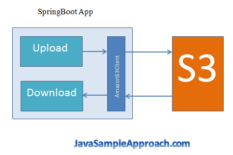
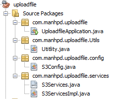

Nowadays, knowledge about cloud is essential for us, mainly because, to business, optimize all the operation cost affect to the business's living. So, use cloud help them to focus on business logic of software, but do not take care of the storage's problem, and expand their server when the amount of user raise rapidly.

In this article, we will find out about the way to upload files to AWS S3 in Spring Boot. 

<br>

## Table of contents
- [Introduction to S3](#introduction-to-s3)
- [Source code](#source-code)
- [Common Problems](#common-problems)
- [Wrapping up](#wrapping-up)

<br>

## Introduction to S3
Before diving into this problem about uploading file into AWS S3, we need to understand about how Spring Boot support the uploading file to S3. 

We can reference to the [article](https://ducmanhphan.github.io/2019-02-14-Introduction-to-AWS-S3).

We can see the following image:



So, we will use intermediate part in Spring Boot, it is AmazonS3 class. Next, to use this class, we have to import some ```dependency```s such as ```aws-java-sdk-s3```, ```aws-java-sdk-dynamodb```.

We will import this information into pom.xml file.

```xml
<dependency>
        <groupId>com.amazonaws</groupId>
        <artifactId>aws-java-sdk-s3</artifactId>
        <version>1.11.327</version>
</dependency>

<dependency>
        <groupId>com.amazonaws</groupId>
        <artifactId>aws-java-sdk-dynamodb</artifactId>
        <version>1.11.327</version>
</dependency>                    
```

But we still have one issue. It is some parameters for S3, including access key, secret access key, bucket, and region. All information we can configure in ```application.properties``` file.

```
mpd.aws.access_key_id=our-access-key
mpd.aws.secret_access_key=our-secret-access-key
mpd.s3.bucket=upload-folder
mpd.s3.region=ap-southeast-1

mpd.s3.uploadfile=C:\\s3\\test-upload-file-s3.txt
mpd.s3.key=TEST-upload-file-s3.txt
```

At this stage, all configuration is done. Now, we will starting code.

<br>

## Source code
Our source code will represented to follow the below image:



- First step - Write Bean object in Configuration class

    To understand why we use ```@Bean```, ```@Value```, ```@Configuration``` annotations in ```S3Config``` class, we can refer to the following [link](https://ducmanhphan.github.io/2019-01-09-Annotations-in-java).

    In config folder's ```S3Config.java```, we have:

    ```java
    @Configuration
    public class S3Config {
            @Value("${mpd.aws.access_key_id}")
            private String awsId;
            
            @Value("${mpd.aws.secret_access_key}")
            private String awsKey;
            
            @Value("${mpd.s3.region}")
            private String region;
            
            @Bean 
            public AmazonS3 s3client() {
                    BasicAWSCredentials awsCreds = new BasicAWSCredentials(awsId, awsKey);
                    AmazonS3 s3Client = AmazonS3ClientBuilder.standard()
                                                            .withRegion(Regions.fromName(region))
                                                            .withCredentials(new AWSStaticCredentialsProvider(awsCreds))
                                                            .build();
                    
                    return s3Client;
            }
    }
    ```

- Second step - Create our service classes

    Service classes will have two state such as download file, upload file.

    In services folder's ```S3Services.java```, we have;

    ```java
    public interface S3Services {
    
        public void downloadFile(String keyName);
        
        public void uploadFile(String keyName, String uploadFilePath);
    }
    ```

    In ```S3ServicesImpl.java```, we have:

    ```java
    @Service
    public class S3ServicesImpl implements S3Services {

        private Logger logger = LoggerFactory.getLogger(S3ServicesImpl.class);

        @Autowired
        private AmazonS3 s3client;

        @Value("${mpd.s3.bucket}")
        private String bucketName;

        @Override
        public void downloadFile(String keyName) {
            try {
                System.out.println("Downloading an object.");
                S3Object s3object = s3client.getObject(new GetObjectRequest(bucketName, keyName));
                System.out.println("Content-Type: " + s3object.getObjectMetadata().getContentType());
                Utitlity.displayText(s3object.getObjectContent());
                logger.info("===================== Import File - Done! =====================");

            } catch (AmazonServiceException ase) {
                logger.info("Caught an AmazonServiceException from GET requests, rejected reasons:");
                logger.info("Error Message:    " + ase.getMessage());
                logger.info("HTTP Status Code: " + ase.getStatusCode());
                logger.info("AWS Error Code:   " + ase.getErrorCode());
                logger.info("Error Type:       " + ase.getErrorType());
                logger.info("Request ID:       " + ase.getRequestId());
            } catch (AmazonClientException ace) {
                logger.info("Caught an AmazonClientException: ");
                logger.info("Error Message: " + ace.getMessage());
            } catch (IOException ioe) {
                logger.info("IOE Error Message: " + ioe.getMessage());
            }
        }

        @Override
        public void uploadFile(String keyName, String uploadFilePath) {
            try {

                File file = new File(uploadFilePath);
                ObjectMetadata objMetadata = new ObjectMetadata();
                objMetadata.setContentLength(15L);
                
                s3client.putObject(new PutObjectRequest(bucketName, keyName, new FileInputStream(file), objMetadata).withCannedAcl(CannedAccessControlList.PublicRead));
                logger.info("===================== Upload File - Done! =====================");

            } catch (AmazonServiceException ase) {
                logger.info("Caught an AmazonServiceException from PUT requests, rejected reasons:");
                logger.info("Error Message:    " + ase.getMessage());
                logger.info("HTTP Status Code: " + ase.getStatusCode());
                logger.info("AWS Error Code:   " + ase.getErrorCode());
                logger.info("Error Type:       " + ase.getErrorType());
                logger.info("Request ID:       " + ase.getRequestId());
            } catch (AmazonClientException ace) {
                logger.info("Caught an AmazonClientException: ");
                logger.info("Error Message: " + ace.getMessage());
            } catch (FileNotFoundException ex) {
                java.util.logging.Logger.getLogger(S3ServicesImpl.class.getName()).log(Level.SEVERE, null, ex);
            }
        }
    }
    ```

- Third step - Create utility method

    In Utils folder, create ```Utility.java``` file, we have:

    ```java
    public class Utitlity {

        public static void displayText(InputStream input) throws IOException {
            // Read one text line at a time and display.
            BufferedReader reader = new BufferedReader(new InputStreamReader(input));
            while (true) {
                String line = reader.readLine();
                if (line == null) {
                    break;
                }
                System.out.println("    " + line);
            }
        }
    }
    ```

- Final step - Run our application

    In ```UploadfileApplication.java``` file, we have:

    ```java
    @SpringBootApplication
    public class UploadfileApplication implements CommandLineRunner {

        @Autowired
        S3Services s3Services;

        @Value("${mpd.s3.uploadfile}")
        private String uploadFilePath;

        @Value("${mpd.s3.key}")
        private String downloadKey;

        public static void main(String[] args) {
            SpringApplication.run(UploadfileApplication.class, args);
        }

        @Override
        public void run(String... args) throws Exception {
            System.out.println("---------------- START UPLOAD FILE ----------------");
            s3Services.uploadFile("TEST-upload-file-s3.txt", uploadFilePath);
            System.out.println("---------------- START DOWNLOAD FILE ----------------");
            s3Services.downloadFile(downloadKey);
        }
    }
    ```

<br>

## Common Problems
- Region problem

    ```
    The bucket is in this region: ap-southeast-1. Please use this region to retry the request.
    ```

    This problem occurs when our AmazonS3Client is set to a different region, then, the bucket we are calling.

    So, we have to change our old region into correct region.

    Or 

    When we are using code:

    ```java
    AmazonS3 s3Client = new AmazonS3ClientBuilder()
            .withEndpointConfiguration(
                    new EndpointConfiguration("s3-us-west-2.amazonaws.com", ""us-west-2"))
            .build());
    ```

    Also we recommend configuring just a region rather than endpoint and region. The SDK will automatically compute the endpoint for you.

    Use this [link](https://docs.aws.amazon.com/AWSJavaSDK/latest/javadoc/com/amazonaws/services/s3/AmazonS3Builder.html#enableForceGlobalBucketAccess--) to reference ```enableForceGlobalBucketAccess()```.

    ```java
    AmazonS3 s3Client = new AmazonS3ClientBuilder()
            .withRegion(Regions.US_WEST_2)
            .enableForceGlobalBucketAccess()
            .build());
    ```

- Key problem

    ```
    The specified key does not exist.
    ```

    This problem happens when we download files form AWS S3.

- Uploaded files path problem

    When we want to know about URL of files that has just uploaded in AWS S3, we have to know about our endpoint that is correponsed to our region, bucket's name, and file's name.

    For example: 

        ```
        Bucket's name: AMAZON_S3_BUCKET 
        File's name: our-file

        Our region: ap-southeast-1
        => endpoint: apigateway.ap-southeast-1.amazonaws.com
        or https://s3.amazonaws.com        

        => URL of our file will be: 
        apigateway.ap-southeast-1.amazonaws.com/AMAZON_S3_BUCKET/our-file
        
        or 

        https://s3.amazonaws.com /AMAZON_S3_BUCKET/our-file

        or

        https://AMAZON_S3_BUCKET.OUR_BUCKET_REGION.s3.amazonaws.com/our-file

        ```

<br>

## Wrapping up
- ```AmazonS3``` class is used to communicate with AWS S3. And the first thing we have to do is to configure all information about access key, secret access key for object of ```AmazonS3``` class. And we need surely to know about region and bucket name in S3.
- All information about access key, secret access key, bucket name, regions should be written in ```application.properties``` file, mainly because Spring Boot will automatically read it. Or if we do not want to write in ```application.properties``` file, we have to configure about classpath again.

<br>

Thanks for your reading.

<br>

Refer:

[https://grokonez.com/spring-framework/spring-cloud/amazon-s3-uploaddownload-files-springboot-amazon-s3-application](https://grokonez.com/spring-framework/spring-cloud/amazon-s3-uploaddownload-files-springboot-amazon-s3-application)

[https://docs.aws.amazon.com/general/latest/gr/rande.html#s3_region](https://docs.aws.amazon.com/general/latest/gr/rande.html#s3_region)