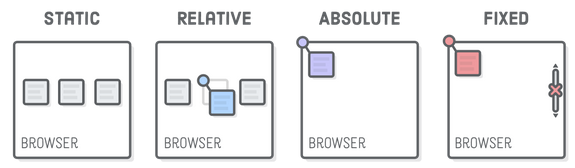
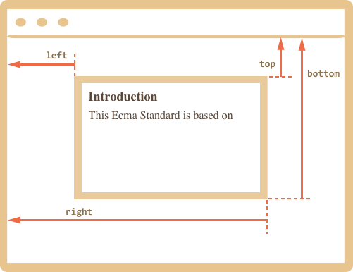
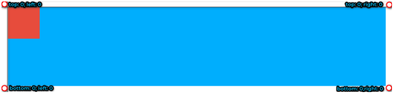
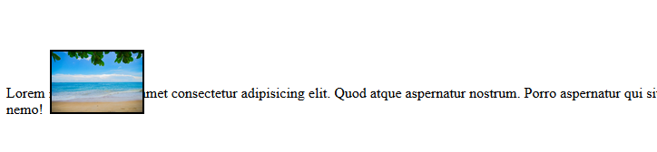
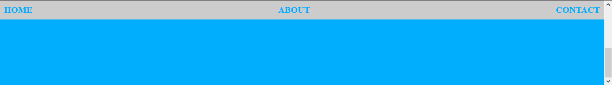

When we want to change the position of element in css, we have to use ```position``` property. It make us easy to set a new position of element to follow many conditions such as parent element, browser window, ...

So, in this article, we will find out some basic information about ```position``` property in CSS.

<br>

## Table of contents
- [Introduction to position property](#introduction-to-position-property)
- [Properties accompany with position property](#properties-accompany-with-position-property)
- [Static value](#static-value)
- [Relative value](#relative-value)
- [Absolute value](#absolute-value)
- [Fixed value](#fixed-value)
- [Wrapping up](#wrapping-up)


<br>

## Introduction to position property
According to [w3schools.com](https://www.w3schools.com/cssref/pr_class_position.asp), we have:

```
The position property specifies the type of positioning method used for an element (static, relative, absolute, fixed, or sticky).
```


The below image and table describe some values of ```position``` property:



<br>

|      value     |            Description              |
| -------------- | ----------------------------------- |
| static         | Default value. Elements render in order, as they appear in the document flow |
| absolute       | The element is positioned relative to its first positioned (not static) ancestor element |
| fixed          | The element is positioned relative to the browser window |
| relative       | The element is positioned relative to its normal position, so "left: 20px" adds 20 pixels to the element's LEFT position |
| sticky         | The element is positioned based on the user's scroll position |

<br>

## Properties accompany with position property
Before, go deeper into some properties ```top```, ```right```, ```bottom```, and ```left```, we will  have to understand about coordinate system in CSS.



- top - Y-coordinate for the top element edge.
- left - X-coordinate for the left element edge.
- right - X-coordinate for the right element edge.
- bottom - Y-coordinate for the bottom element edge.

So, an origin point in coordinate system is the most top-left with top = 0, left = 0.

- **top**: if its value > 0, element will go from up to down; if not, element go from down to up.
- **bottom**: if its value > 0, element will go from down to up; it not, element will go from up to down.
- **right**: if its value > 0, element will run from right to left; it not, element will run from left to right. 
- **left**: if its value > 0, element will run from left to right; if not, element will run from right to left.

To understand about values of ```top```, ```right```, ```bottom```, and ```left``` properties, we have an image:



When we have a parent element that has ```position: relative```, we want to align a child element with ```position: absolute``` to follow a parent's position. We will have some conditions:
- If ```top = 0``` and ```left = 0```, a child element will at the most top-left.
- If ```top = 0``` and ```right = 0```, a child element will at the most top-right.
- If ```bottom = 0``` and ```left = 0```, a child element will at the most bottom-left.
- If ```bottom = 0``` and ```right = 0```, a child element will at the most bottom-right.
- If ```top = 0```, ```right = 0```, ```bottom = 0```, and ```left = 0```, a child element will expand whole a parent element with a condition: do not set values for ```width```, ```height``` properties of a child element.
- If ```left = 0```, ```right = 0``` and we do not set value for ```width``` property of a child element, a child element has ```width``` property that is equal to 100% of a parent element's width.
- If ```top = 0```, ```bottom = 0``` and we do not set value for ```height``` property of a child element, a child element has ```height``` property that is equal to 100% of parent element's height.
- The other properties such as ```margin```, ```background```, ... can be used to go with ```position``` property.

<br>

## Static value
The element is positioned according to the normal flow of the document. 

The ```top```, ```right```, ```bottom```, ```left``` and ```z-index``` properties have no effect.

This is the default value.

<br>

## Relative value
This value will help us to change the position of element without influencing the other element. It do not push the other element to a new position.

```html

<p>Lorem ipsum dolor sit amet consectetur adipisicing elit. Quod atque aspernatur nostrum. Porro aspernatur qui sit saepe placeat eum quae impedit ut atque cupiditate eligendi numquam nisi, quasi repudiandae nemo!</p>
```

```css
img {
    position: relative;
    top: 50px;
    left: 50px;
    outline: 2px solid #000;
    max-width: 100px;
}
```

We have a result: 



So, we have:
- The element is **positioned according to the normal flow of the document**, and then offset relative to itself based on the values of ```top```, ```right```, ```bottom``` and ```left```.
- The offset does not effect the position of any other elements, thus, the space given for the element in the page layout is the same as if the position were static.
- This value creates a new ```stacking context``` when the value of ```z-index``` is not ```auo```. Its effect on ```table-*-group```, ```table-row```, ```table-column```, ```table-cell```, and ```table-caption``` elements is undefined.

<br>

## Absolute value
This value is usually used with a case: a parent element has ```position: relative```, a child element has ```position: absolute```. 

So, the position of child element will set based on a parent element.

```html
<div class="parent-element">
	<div class="child-element"></div>
</div>
```

```css
.parent-element {
	position: relative;
	height: 250px;
	background-color: #00aefd;
	margin: 20px;
}
.child-element {
	position: absolute;
	width: 100px;
	height: 100px;
	top: 100px;
	left: 10px;
	background-color: #e74c3c;
}
```

The result will be:


So, we will have:
- The element is **removed from the normal document flow, and no space is created for the element in the page layout**. 
- It is positioned relative to its closet positioned ancestor, if any; otherwise, it is placed relative to the initial containing block. Thus, its final position is determined by the values of ```top```, ```right```, ```bottom```, and ```left```.
- It creates a new ```stacking context``` when the value of ```z-index``` is not ```auto```. The margins of absolutely positioned boxes do not collapse with other margins.

<br>

## Fixed value
This value is usually used for navigation bar when scrolling content in browser.

```html
<div class="content">
    <ul>
        <li><a href="">home</a></li>
        <li><a href="">about</a></li>
        <li><a href="">contact</a></li>
    </ul>
</div>
```

```css
body {
    height: 200vh;
}
.content {
    width: 100%;
    height: 400px;
    background-color: #00aefd;
}

ul {
    padding: 10px;
    background-color: #ccc;
    display: flex;
    justify-content: space-between;
    position: fixed;
    top: 0;
    left: 0;
    right: 0;
}

ul li {
    list-style-type: none;
}

a {
    text-decoration: none;
    color: #00aefd;
    font-size: 20px;
    text-transform: uppercase;
    font-weight: bold;
}
```

We will have a result for this case.



So, we have:
- The element is **removed from the normal document flow, and no space is created for the element in the page layout**.
- It is positioned relative to the initial containing block established by the viewport, except when one of its ancestors has a ```transform```, ```perspective```, or ```filter``` property set to something other than ```none```. Its final position is determined by the values of ```top```, ```right```, ```bottom```, and ```left```.
- It creates a new ```stacking context```.

<br>

## Wrapping up
- When an element is set the ```position``` property with ```relative```, it has two functions:
    - First, it is a parent of the other element when child element has ```position``` property with ```absolute```.
    - Second, it will change the origin position to follow the values of ```top```, ```right```, ```bottom```, ```left```.

- Usually, using the ```sticky``` value of ```position``` property is for navigation menu.


<br>

Refer:

[https://www.w3schools.com/cssref/playit.asp?filename=playcss_position&preval=fixed](https://www.w3schools.com/cssref/playit.asp?filename=playcss_position&preval=fixed)

[https://kipalog.com/posts/Tim-hieu-thuoc-tinh-position-trong-CSS](https://kipalog.com/posts/Tim-hieu-thuoc-tinh-position-trong-CSS)

**Coordinate system in CSS**

[https://javascript.info/coordinates](https://javascript.info/coordinates)

[https://developer.mozilla.org/en-US/docs/Web/CSS/position](https://developer.mozilla.org/en-US/docs/Web/CSS/position)
