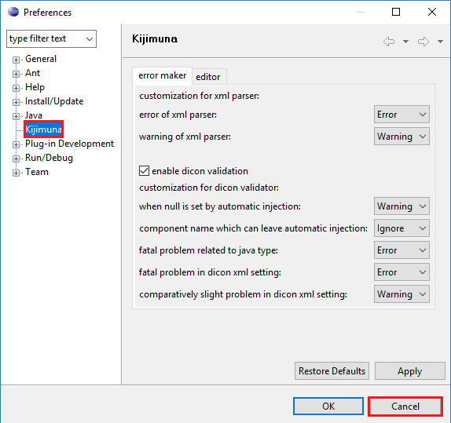

Seasar is the most popular open source framework in Japan. It is created simply because the authors see that dependency injection is really bad thing and they want to free us from such annoyance of DI.

So, in this article, we will discuss about seasar framework and we have to answer some question by ourself.
- How to use seasar framework in NetBeans / Eclipse.
- How to make our project easier breath without using DI.
- How to interact with database.

<br>

## Table of contents
- [Introduction to Seasar](#introduction-to-seasar)
- [Environment and Configuration](#environment-and-configuration)
- [Kijimuna](#kijimuna)
- [Some important parts in Seasar framework](#some-important-parts-in-seasar-framework)

<br>

## Introduction to Seasar
Seasar2 is an open-source application framework similar to the Spring framework (Java). Initially, it was developed for the Java platform by Yasuo Higa, but .NET and PHP platforms are currently supported as well. Seasar2 has a large base of Japanese users, but there is a steady increase of non-Japanese user since English support was annouced at the JavaOne 2005 Tokyo conference.

Seasar2 is currently supported by the Seasar Foundation, a non-profit open source organization. 

The main difference with other frameworks is the support of the concept "Convention over Configuration" to reduce the XML configuration prominent when using framework such as Spring. The aim is to reduce the number or eliminate configuration files by making developers conform to programming and configuration conventions and letting the framework do the work. For example, if a property type is an interface and there is an object that implements this interface, dependency is configured by the container. If the test method name ends with a "Tx", a transaction is initiated before the unit test and rolledback after the test. 


<br>

## Environment and Configuration
The first thing to remember is that Eclipse is used to develop Seasar and most Seasar packages use eclipse as a development platform. Then, they highly recommended us that we should use eclipse.

To configure seasar framework successfully, we can visit their [website](http://www.seasar.org/en/tutorial/index.html).

Some steps to setup for using Seasar with Eclipse:
- Setup eclipse 3.1.1 for 32-bit windows.
    
    We can refer to the [https://archive.eclipse.org](https://archive.eclipse.org/eclipse/downloads/drops/R-3.1.1-200509290840/).

    When we can run into a error such as ```Can't load IA 32-bit .dll on a AMD 64-bit platform```. It means that version 32-bit of eclipse does not run in 64-bit JVM, simply because our windows is 64-bit, so, we are installing 64-bit version JVM.

    We can two ways to solve this error:
    - Switch to a 32-bit JVM. We can refer this [link for JDK 8](https://www.oracle.com/technetwork/java/javase/downloads/jdk8-downloads-2133151.html) to download JDK.
    - Turn into 32-bit computer to load the DLL.

    Then, we have an interesting information about this error. We can install multiple versions of both 32-bit and 64-bit Java at the same time on the same machine.

    But Eclipse 3.1.1 is ver old version of this IDE. So, we think that you can use the other latest version of IDE.

- Before creating project with seasar framework, we need to change our workspace folder for seasar framework. 

    Go to ```File``` -> ```Switch Workspace```. 

- Setting up Omondo UML Eclipse plugin.

    Because Omondo UML plugin is not suitable for some latest version of eclipse. So, we do not need to install it in our eclipse.

- Setting Kijimuna Plugin installation

    Kijimuna is an Eclipse plugin to validate against Seasar syntax. Without Kijimuna, we should have to look at Java compilation errors to find syntactical errors.

    - In Eclipse 3.1.1 32-bit windows, select ```Help```, next ```Software Updates``` --> ```Find and Install```.

    - At ```Install/Update``` dialog, choose ```Search for new features to install``` checkbox, then, click to ```Next``` button.

    - At ```Install``` dialog, select the ```New Remote Site ...``` button.

    - Next, in ```New Update Site``` dialog, enter ```Kijimuna``` for ```Name``` field, and enter ``` http://www.seasar.org/eclipse/updates/3.1/``` as the URL. Then, select the ```OK``` button.

    - Return to ```Install``` dialog, conduct whether ```Kijimuna``` checkbox is checked or not. If right, choose ```Finish``` button.

    - In ```Updates``` dialog, check ```Kijimuna``` checkbox as feature to install and select the ```Next``` button. Select the ```I accepte the terms in the license agreement``` and select the ```Next``` button.

    - Make sure the directory Eclipse is installed in displayed as the ```Install Location```. If it is different, select the ```Change Location...``` button to select the folder where Eclipse was installed. Select the ```Finish``` button.

    - In ```Update Manager``` dialog, necessary files will be downloaded. Do not select any buttons in this dialog box.

    - In ```Verification``` dialog, choose the ```Install All``` button.

    - At ```Install/Update``` dialog, select the ```Yes``` to restart Eclipse.

    - After Eclipse is restarted, let's check if Kijimuna was properly installed. Select ```Windows - Preferences...```.

    - Verify that Kijimuna is listed. 
    Select the ```Cancel``` button. This completes Kijimuna plugin installation

    

- Setting Tomcat 5.5.9

    We can download ```jakarta-tomcat-5.0.26.zip.``` from this [link about Tomcat](https://archive.apache.org/dist/tomcat/tomcat-5/archive/v5.0.26-beta/bin/).

    With Tomcat, we can refer to this [link](https://gamethapcam.github.io/2019-02-18-Configure-Tomcat-for-Java-web/)

- Setup external jar files for using Seasar framework

    This step is the most important when we want to utilize seasar framework. Therefore, we need to remeber all jar files that is included.

    To use Seasar, following jar files are required:
    - javaassist.jar
    - commons-logging.jar
    - lig4j-1.2.8.jar
    - ognl-2.6.5.jar
    - aopalliance.jar
    - servlet-api.jar
    - s2-framework-2.3.0.jar

<b>

## Kijimuna
Kijimuna is an Eclipse plugin that supports application development using Seasar.

It has the following features:
- Dicon Editor
    - Syntax highlighting.
    - Content Assistant for XML-tags, class name, OGNL and more.
    - Hyperlink by Ctrl + Click.
    - DTD based validation.

- Outline
    - Display of a component tree. 

<br>

## Some important parts in Seasar framework
Seasar2 support of other open source software are prefixed with S2. Like most open source software, Seasar2 software may be divided into 3 major categories:
- Seasar2 core
- Related software
- Sandbox software - software still under development

Related software may further be subdivided into the following subdivision:
- Database related: S2DAO, S2Hibernate, S2Unit(JUnit)
- Presentation: S2JSF, S2Struts, S2Tapestry, Flash player
- Communication related: S2RMI, S2Axis
- Miscellaneous: Kijimuna


<br>

Thanks for your reading.

<br>

Refer:

[http://www.seasar.org/en/index.html](http://www.seasar.org/en/index.html)

[https://www.fiorano.com/documentation/display/MQ1020/31.9+Integration+with+Seasar+Framework](https://www.fiorano.com/documentation/display/MQ1020/31.9+Integration+with+Seasar+Framework)

[http://s2container.seasar.org/2.3/en/DIContainer.html](http://s2container.seasar.org/2.3/en/DIContainer.html)

[http://www.seasar.org/en/tutorial/eclipse/kijimuna/index.html](http://www.seasar.org/en/tutorial/eclipse/kijimuna/index.html)

[http://itref.fc2web.com/java/seasar/](http://itref.fc2web.com/java/seasar/)