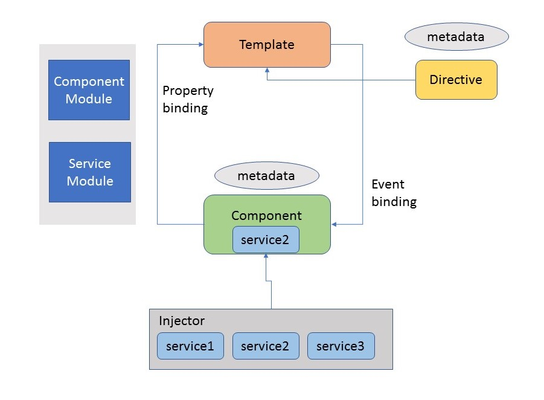

Before, we has only one version that is AngularJs, or Angular 1.x. The architecture of AngularJS is very different with the version of Angular at the moment. Because AngularJS is utilizing MVC architecture pattern, then, Angular 2.x or above uses MVVM pattern, Dependency Injection, ...

Angular 2.x is a platform and framework for building client applications in HTML and Typescript. Angular is written in Typescript. It implements core and optional functionality as a set of Typescript libraries that we import into our apps.

So, in this article, we will discuss about the architecture of Angular 2.x, some parts in this framework.

<br>

## Table of contents
- [Introduction to Angular](#introduction-to-angular)
- [1. Module](#1-module)
- [2. Component](#2-component)
- [3. Metadata](#3-metadata)
- [4. Template](#4-template)
- [5. Data Binding](#5-data-binding)
- [6. Service](#6-service)
- [7. Directive](#7-directive)
- [8. Dependency Injection](#8-dependency-injection)


<br>

## Introduction to Angular
To understand about the architecture of Angular, we will see the below image:



So, we can conclude that there are eight main building blocks.
1. Module
2. Component
3. Metadata
4. Template
5. Data Binding
6. Service
7. Directive
8. Dependency Injection

<br>

## 1. Module
Module is the block of code which is designed to perform a single task. 

Angular apps are modular and Angular has its own modularity system called *NgModules*. 

*NgModules* are containers for a cohesive block of code dedicated to an application domain, a workflow, or a closely related set of capabilities. They can contain ```components```, ```services providers```, and other code files whose scope is defined by the containing *NgModules*.

Every Angular app has at least one *NgModule* class, the root module, which is conventionally named *AppModule* and resides in a file named *app.module.ts*. We can launch our app by bootstrapping the *root NgModule*.

While a small application might have only one *NgModule*, most apps have many more *feature modules*. The *root NgModule* can include *child NgModules* in a hierarchy of any depth.

An *NgModule* is defined by a class decorated with ```@NgModule()```. The ```@NgModule()``` decorator is a function that takes a single metadata object, whose properties describe the module.

The most important properties are as follows:
- ```declarations```: It declares the view class that belongs to this *NgModule*. There are three type of view classes supported by Angular ```components```, ```directives```, and ```pipes```.
- ```exports```: The subset of ```declarations``` that should be visible and usable in the ```componenet template``` of other *NgModules*.
- ```imports```: Other modules whose exported classes are needed by ```component templates``` declared in this *NgModule*.
- ```providers```: Creators of ```services``` that this *NgModule* contributes to the global collection of services; they become accessible in all parts of the app. (You can also specify ```providers``` at the component level, which is often preferred.)
- ```bootstrap```: The main application view, called the ```root component```, which hosts all other app views. Only the ```root NgModule``` should set the ```bootstrap``` property.

The below is source code app module: src/app/app.module.ts

```javascript
import { BrowserModule } from '@angular/platform-browser';
import { NgModule } from '@angular/core';

import { AppRoutingModule } from './app-routing.module';
import { AppComponent } from './app.component';

@NgModule({
  declarations: [
    AppComponent
  ],
  imports: [
    BrowserModule,
    AppRoutingModule
  ],
  providers: [],
  bootstrap: [AppComponent]
})
export class AppModule { }
```

<br>

## 2. Component
The ```component``` is class with the ```template``` that deals with the View of application and it holds data and contains the core logic for the page.

```Components``` and corresponding ```templates``` communicate through property bindings and event bindings.

Source code of file src/app/app.component.ts

```javascript
import { Component } from '@angular/core';

@Component({
  selector: 'app-root',
  template: '<h1>This is my First Angular 2 Application</h1>' +  
            '<br/>' +  
            '<input #txtName type = "text" (keyup)="0" />' +  
            '<br/> ' +  
            '<p>You have Enter: {{txtName.value}}</p>',
  templateUrl: './app.component.html',
  styleUrls: ['./app.component.scss']
})
export class AppComponent {
  title = 'giaoban';
}

```

With the above code, we have:
- ```selector``` creates an instance of the component. 
- ```template```: a small part view with html.
- ```templateUrl```: the path contains .html file for our view in this component.
- ```styleUrls```: the path contains .scss or .css file for our view style in this component.

<br>

## 3. Metadata
Metadata is the way of defining the processing of a class. 

In TypeScript, we can define metadata by using decorator. 

For example, if we define any component in Angular application, we need to tell Angular that this is the component, by using metadata of the class (using @Component decorator).

```javascript
@Component({
  selector: 'app-root',
  template: '<h1>This is my First Angular 2 Application</h1>' +  
            '<br/>' +  
            '<input #txtName type = "text" (keyup)="0" />' +  
            '<br/> ' +  
            '<p>You have Enter: {{txtName.value}}</p>',
  templateUrl: './app.component.html',
  styleUrls: ['./app.component.scss']
})
```

<br>

## 4. Template
The template is the component View that tells Angular how to display the component. It looks like normal HTML.

<br>

## 5. Data Binding
Data binding is a connection between **View** and the business logic - **View Model** of the application. 

There are four type of binding:
- Interpolation - It displays the component value within the HTML tags. So, it is undirectional.
- Property binding - It passes the value of property from the parent to the property of the child. So, it is undirectional.
- Event binding - It fires the event when we click on the components method name. And it is undirectional and it's bound from template to component.
- Two-way binding - It is an important form that combines event and property binding in single notation by using *ngModule* directive. And it's bidirectional.

<br>

## 6. Service
Service in Angular is a function or an object that can be used to share the data and the behavior across the application. 

It is JavaScript function which is used to perform a specific task. It includes the function, values, or any other feature required by the application. 

Typical examples of services are logging service, data service, message service etc. There is no base class for service.

<br>

## 7. Directive
Directives are extended HTML attributes. They are markers on the DOM element which provides some special behavior to DOM elements and tell Angular's HTML compiler to attach. It is a class with directive metadata. 

To create directive, we have to apply ```@Directive``` decorator on attached metadata to the class.

There are three types of directives:
- Decorator directive - It decorates the elements using additional behavior. There are many built-in directives like *ngModel*, ...

- Component directive - It is extended of ```@Directive``` decorates with template-oriented features.

- Template directive - It converts HTML into a reusable template. It is also known as Structural directive.

<br>

## 8. Dependency Injection
Dependency Injection is a software design pattern in which objects are passed as dependencies. 

It helps us remove the hard coded dependencies, and makes dependencies configurable. Using Dependency Injection, we can make components maintainable, reusable, and testable.

Point to remember about Dependency Injection,
- It is stimulated into the Angular framework so that it can be use anywhere in an application.
- The injector is a main mechanism to maintain the service instance and can be created using a provider.
- The provider is the way of creating a service.
- We can register the providers along with injectors


<br>

Thanks for your reading.

<br>

Refer:

[https://angular.io/guide/architecture](https://angular.io/guide/architecture)

[https://www.c-sharpcorner.com/article/basic-architecture-of-angular-2-applications/](https://www.c-sharpcorner.com/article/basic-architecture-of-angular-2-applications/)

[https://www.code-sample.com/2018/01/angular-4-and-5-architecture-overview.html](https://www.code-sample.com/2018/01/angular-4-and-5-architecture-overview.html)