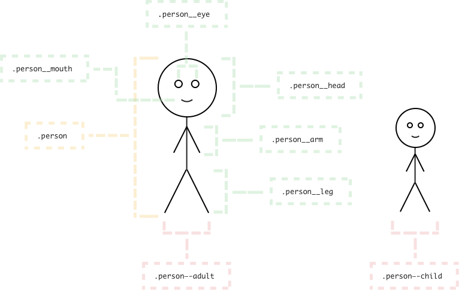
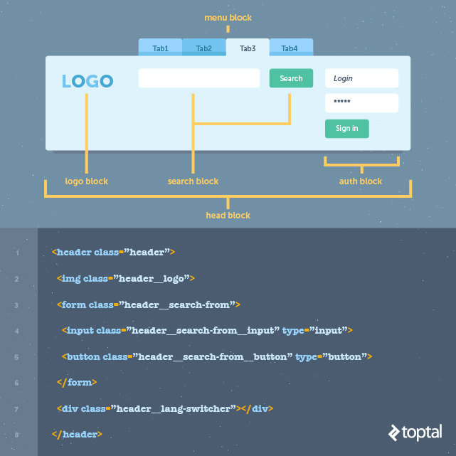

To the software development, naming convention is very important for maintaining code easily, reducing time to read code, ... So, when we work on web development, naming convention in css is needed to know. 

In this article, we will find out about BEM methodology for CSS. All this information is referenced from [www.toptal.com](https://www.toptal.com/css/introduction-to-bem-methodology).

<br>

## Table of contents
- [Introduction to BEM](#introduction-to-bem)
- [Block](#block)
- [Element](#element)
- [Modifier](#modifier)
- [Naming conventions](#naming-conventions)
- [Wrapping up](#wrapping-up)

<br>

## Introduction to BEM
BEM methodology, an abbreviation of **Block**, **Element**, **Modifier**, is a  popular naming convention for classes in html and css. It developed by the team at Yandex, its goal is to help developers better understand the relationship between the html and css in a given project.



<br>

## Block
A block represents an object in our website. Most common blocks on website are header, body, content, sidebar, footer, column in the grid, and search.

It means that a block must contain at least one element inside it.

Blocks in BEM are always a starting point of chaning our CSS classes. 

For example:

```css
.header {
    ...
}

.container {
    ...
}

.footer {
    ...
}
```

<br>

## Element
An element is a component within the block that performs a particular function.

For example:

```css
.header__logo {
    ...
}

.header__search {
    ...
}
```

<br>

## Modifier
A modifier is how we represent the variations of a block.

For example:

```css
.header__logo--red {
    ...
}

.header__search__input--icon {
    ...
}
```

<br>

## Naming conventions
- ```Block``` name is usually a single word like ```.header```, but if we have longer block definition then it is divided with a single hyphen ```-```.

    ```css
    .lang-switcher {
        ...
    }
    ```

- ```Element``` name starts with double underscore ```__```.

    ```css
    .lang-switcher__flag {
        ...
    }
    ```

- Modifier name starts with double hyphen ```--```.

    ```css
    .lang-switcher__flag--basic {
        ...
    }
    ```

    Rule for modifier: a modifier can not used outside of the context of its owner.

    Some examples about modifier can be saw in Bootstrap framework.

- Example about BEM 

    

- Use BEM with CSS preprocessor

    ```css
    .person {
        &__hand {/* Styles */}

        &__leg {/* Styles */}

        &--male {
            /* Styles */

            &__hand {
            /* Styles */

            &--left {/* Styles */}

            &--right {/* Styles */}
            }

            &__leg {
            /* Styles */

            &--left {/* Styles */}

            &--right {/* Styles */}
            }
        }

        &--female {
            /* Styles */

            &__hand {
            /* Styles */

            &--left {/* Styles */}

            &--right {/* Styles */}
            }

            &__leg {
            /* Styles */

            &--left {/* Styles */}

            &--right {/* Styles */}
            }
        }
    }
    ```

    If we use ```mixin``` for BEM, we have:

    ```css
    /// Block Element
    /// @param {String} $element - Element's name
    @mixin element($element) {
        &__#{$element} {
            @content;
        }
    }

    /// Block Modifier
    /// @param {String} $modifier - Modifier's name
    @mixin modifier($modifier) {
        &--#{$modifier} {
            @content;
        }
    }
    ```

    Then, we have a result for this ```mixin```:

    ```css
    .person {
        @include element('hand') {/* Person hand */}

        @include element('leg') {/* Person leg */}

        @include modifier('male') {
            /* Person male */
            
            @include element('hand') {
            /* Person male hand */
                @include modifier('left') {
                    /* Person male left hand */
                }
                @include modifier('right') {
                    /* Person male right hand */
                }
            }
        }
    }
    ```

- Use namespace techniques in BEM

    From this [link](https://csswizardry.com/2015/03/more-transparent-ui-code-with-namespaces/), we will have some namespace techniques for BEM.

    - ```l-```: signify that something is a **Layout module**. These modules have no cosmetics and are purely used to position ```c-``` components and structure an application's layout.

        ```css
        .l-grid {
            ...
        }

        .l-container {
            ...
        }
        ```

    - ```o-```: signify that something is an **Object**, and that it may be used in any number of unrelated contexts to the one you can currently see it in. Making modifications to these types of class could potentially have knock-on effects in a lot of other unrelated places. Tread carefully.

    - ```c-```: signify that something is a **Component**. This is a concrete, implementation specific piece of UI. All of the changes you make to its styles should be detectable in the context you're currently looking at. Modifying these styles should be safe and have no side effects.

        ```css
        .c-card {
            ...
        }

        .c-checklist {
            ...
        }
        ```

    - ```u-```: signify that this class is a **Utility** class. It has a very specific role (often providing only one declaration) and should not be bound onto or changed. It can be reused and it not tied to any specific piece of UI.You will probably recognise this namespace from libraries and methodologies like [SUIT](https://suitcss.github.io/).

    - ```t-```: signify that a class is responsible for adding a **Theme** to a view. It lets us know that UI Components’ current cosmetic appearance may be due to the presence of a theme.

    - ```s-```: signify that a class creates a new styling context or **Scope**. Similar to a Theme, but not necessarily cosmetic, these should be used sparingly—they can be open to abuse and lead to poor CSS if not used wisely.

    - ```is-, has-```: signify that the piece of UI in question is currently styled a certain way because of a state or condition. This stateful namespace is gorgeous, and comes from [SMACSS](https://smacss.com). It tells us that the DOM currently has a temporary, optional, or short-lived style applied to it due to a certain state being invoked. It also indicates different states that a ```c-``` component can have.

        ```css
        .is-visible {
            ...
        }

        .has-loaded {
            ...
        }
        ```

    - ```_```: signify that this class is the worst of the worst—a hack! Sometimes, although incredibly rarely, we need to add a class in our markup in order to force something to work. If we do this, we need to let others know that this class is less than ideal, and hopefully temporary (i.e. "do not bind onto this").

    - ```js-```: signify that this piece of the DOM has some behaviour acting upon it, and that JavaScript binds onto it to provide that behaviour. If you’re not a developer working with JavaScript, leave these well alone.

        ```css
        js-tab-switcher
        ```

    - ```qa-```: signify that a QA or Test Engineering team is running an automated UI test which needs to find or bind onto these parts of the DOM. Like the JavaScript namespace, this basically just reserves hooks in the DOM for non-CSS purposes.

    To go the details into namespace techniques, visit webiste [https://csswizardry.com](https://csswizardry.com/2015/03/more-transparent-ui-code-with-namespaces/).

    For example: 

    ```css
    <ul class="l-grid">        
        <li class="l-grid__item">
            <div class="c-card">
                <div class="c-card__header">
                    <h2 class="c-card_title">Title text here</h2>
                </div>
                <div class="c-card__body">
                    
                    <p class="c-card__text">Lorem ipsum dolor sit amet, consectetur</p>
                    <p class="c-card__text">Adipiscing elit.
                        <a href="/somelink.html" class="c-card__link">Pellentesque amet</a>
                    </p>
                </div>
            </div>
        </li>
        
        ...
    </ul>

    ```

<br>

## Wrapping up
- The best practice is to use BEM only with classes, and not IDs because classes allow us to repeat names if necessary and create more consistent coding structure. 

Refer:

[https://www.toptal.com/css/introduction-to-bem-methodology](https://www.toptal.com/css/introduction-to-bem-methodology)

[https://github.com/khoipro/bem-css](https://github.com/khoipro/bem-css)

[https://www.smashingmagazine.com/2012/04/a-new-front-end-methodology-bem/](https://www.smashingmagazine.com/2012/04/a-new-front-end-methodology-bem/)

[https://www.smashingmagazine.com/2016/06/battling-bem-extended-edition-common-problems-and-how-to-avoid-them/](https://www.smashingmagazine.com/2016/06/battling-bem-extended-edition-common-problems-and-how-to-avoid-them/)

[https://csswizardry.com/2015/03/more-transparent-ui-code-with-namespaces/](https://csswizardry.com/2015/03/more-transparent-ui-code-with-namespaces/)

