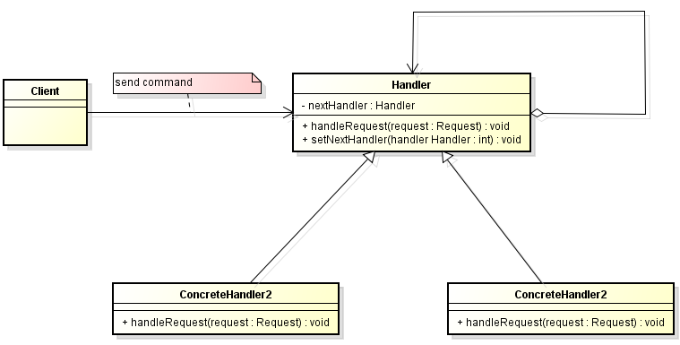

In this article, we will discuss about ```Chain of Responsibility``` pattern, and when to use, advantages and disadvantages of it.

<br>

## Table of contents
- [Given Problem](#given-problem)
- [Solution with Chain of Responsibility pattern](#solution-with-chain-of-responsibility-pattern)
- [When to use](#when-to-use)
- [Benefits & Drawback](#benefits-&-drawback)
- [Code C++ /Java / Javascript](#code-c++-java-javascript)
- [Relations with other Patterns](#relations-with-other-patterns)
- [Application & Examples](#application-&-examples)


<br>

## Given Problem
Assuming that when we are working at a factory, we need to check products that abide by some standards of the world. So with each standard, we need to write some functions to check their inputs. 

We have to arrange all sequence functions to conduct all of our standards. It means that we are using hard-wiring handler relationships.

When our project is bigger than original, split into some small modules is difficult. It makes our own software tightly couple to each other, difficult maintain.

<br>

## Solution with Chain of Responsibility pattern
With some problems that have continuous actions, we need to uitlize ```Chain of Responsibility pattern```.

Chain of Responsibility is a behavioral design pattern that let we pass requests along a chain of handlers. Upon receiving a request, each handler decides either to process the request or to pass it to the next handler in the chain.

The pattern chains the receiving objects together, and then passes any request messages from object to object until it reaches an object capable of handling the message. The number and type of handler objects isn't known a priori, they can be configured dynamically. The chaining mechanism uses recursive composition to allow an unlimited number of handlers to be linked.



<br>

## When to use / When not to use
- When to use 
    - when we can conceptualize our program as a chain made up of links, where each link can either handle a request or pass it up the chain.
    - when we want to decouple a request's sender and receiver.
    - multiple handlers determined at runtime.
    - more than one object may handle a request, and the handler is not known in advance. 
    - the handler should be ascertained automatically.
    - we may want to issue a request to one of several objects without specifying the receiver explicitly.
    - the set of handlers that can handle a request should be specified dynamically.
	- a scenario within you need to pass a request to one handler among a list of handlers at run-time based on certain conditions.

- When not to use
    - when each request is only handled by one handler.
    - when the client object knows which service object should handle the request.

Note: A request no handled at all by any handler is a valid use case.

<br>

## Benefits & Drawback
1. Benefits

    - avoid coupling the sender of a request to its receiver by giving more than one object a chance to handle the request.
    - simplified object. The object does not need to know the chain structure.
    - enhance flexibility of object assigned duties. By changing the members within the chain or change their order, allow dynamic adding or deleting responsibility.
    - increase the request processing new class of very convenient.
	- Unfortunately, the Chain doesn't guarantee that every command is handled, which makes the problem worse, since unhandled commands propagate through the full length of the chain, slowing down the application. One way to solve this is by checking if, at the end of the chain, the request has been handled at least once, otherwise we will have to implement handlers for all the possible requests that may appear.
	- Broken Chain problem: Sometimes we could forget to include in the implementation of the handleRequest method the call to the successor, causing a break in the chain. The request is not sent forward from the broken link and so it ends up unhandled. However,  A variation of the pattern can be made to send the request to all the handlers by removing the condition from the handler and always calling the successor. e.g. moving the code to traverse the chain into the base class keeping the request handling in a different method in the subclasses.
	- As with the Observer pattern, Chain of Responsibility can make it difficult to follow through the logic of a particular path in the code at runtime.
	- If new operations need to be added to the Handler, modifying the source code is required.
	- Do not use Chain of Responsibility when each request is only handled by one handler, or, when the client object knows which service object should handle the request.

2. Drawback
    - Mostly, it can get broken easily
        - if a handler fails to call the next handler, the request gets dropped. 
        - if a handler calls the wrong handler, it can lead to a cycle. So, the request must be received not guarantee.
    - It can deep stack traces, which can affect performance. 
    - It can lead to duplicate code across handlers, increasing maintance.
    - it many not be easy to observe the characteristic of operation, due to debug.
	- the number of operations when a new handler is added into the pipeline. We need to break an existing next or successor/predecessor link, insert the new handler, then relink it to the chain. It is very similar to a linked list. If a successor link is a badly set accidently, the whole chain is broken.

<br>

## Code C++ /Java / Javascript

Below is an example about Chain of Responsibility in C++.

```C++
class Request 
{
public:
	Request(int num)
	{
		m_nNum = num;
	}

	int getNum()
	{
		return m_nNum;
	}


private:
	int m_nNum;
};


class Handler 
{
public:
	Handler(Handler* handler = nullptr) : m_pNextHandler(handler) 
	{
		// nothing to do
	}

	virtual void handleRequest(Request request) 
	{
		// nothing to do
	}

	virtual void setNextHandler(Handler* handler) 
	{
		m_pNextHandler = handler;
	}

	Handler* getNextHandler()
	{
		return m_pNextHandler;
	}

private:
	Handler* m_pNextHandler;
};

class ConcreteHandler1 : public Handler 
{
public:
	void handleRequest(Request request) 
	{
		int val = request.getNum();

		if (val < 0)
		{
			std::cout << "Handler with nagative number is called: " << val << "\n";
		} 
		else
		{
			getNextHandler()->handleRequest(request);
		}
	}
};

class ConcreteHandler2 : public Handler
{
public:
	void handleRequest(Request request)
	{
		int val = request.getNum();

		if (val == 0)
		{
			std::cout << "Handler with 0 is called: " << val << "\n";
		}
		else
		{
			getNextHandler()->handleRequest(request);
		}
	}
};


class ConcreteHandler3 : public Handler
{
public:
	void handleRequest(Request request)
	{
		int val = request.getNum();

		if (val > 0)
		{
			std::cout << "Handler with positive number is called: " << val << "\n";
		}
		else
		{
			getNextHandler()->handleRequest(request);
		}
	}
};


int main()
{    
	Handler* handler1 = new ConcreteHandler1();
	Handler* handler2 = new ConcreteHandler2();
	Handler* handler3 = new ConcreteHandler3();

	handler1->setNextHandler(handler2);
	handler2->setNextHandler(handler3);

	handler1->handleRequest(Request(2));
	handler1->handleRequest(Request(-1));
	handler1->handleRequest(Request(0));

	system("pause");
	return 0;
}
```

Finally, we have a result:

```
Handler with positive number is called: 2
Handler with negative number is called: -1
Handler with 0 is called: 0
```


<br>

## Relations with other Patterns
- **Chain of Responsibility**, **Command**, **Mediator** and **Observer** address various ways of connecting senders and receivers of requests:
    - **Chain of Responsibility** passes a request sequentially along a dynamic chain of potential receivers until one of them handles it.
    - **Command** establishes unidirectional connections between senders and receivers
    - **Mediator** eleminates direct connections between senders and receivers, forcing them to communicate indirectly via a mediator object.
    - **Observer** lets receivers dynamically subscribe to and unsubscribe from receiving requests.

- **Chain of Responsibility** is often used in conjunction with **Composite**. In this case, when a leaf component gets a request, it may pass it through the chain of all of the parent components down to the root of the object tree.

- Handlers in **Chain of Responsibility** can be implemented as **Commands**. In this case we can execute a lot of different operations over the same context object, represented by a request.

    However, there's another approach, where the request itself is a Command object. In this case, we can execute the same operation in a series of different contexts linked into a chain.

- **Chain of Responsibility** and **Decorator** have very similar class structures. Both patterns rely on recursive composition to pass the execution through a series of objects. However, there are several crucial differences.

    The CoR handlers can execute arbitrary operations independently of each other. They can also stop passing the request further at any point. On the other hand, various Decorators can extend the object’s behavior while keeping it consistent with the base interface. In addition, decorators aren’t allowed to break the flow of the request.

- **Chain of Responsibility**, **Command**, **Mediator**, and **Observer**, address how you can decouple senders and receivers, but with different trade-offs. **Chain of Responsibility** passes a sender request along a chain of potential receivers.

- **Chain of Responsibility** can use **Command** to represent requests as objects.

- **Chain of Responsibility** is often applied in conjunction with **Composite**. There, a component’s parent can act as its successor.


<br>

## Application & Examples
- Example 1

    In designing the software that uses a set of GUI classes where it is needed to propagate GUI events from one object to another.

    When an event, such as the pressing of a key or the click of the mouse, the event is needed to be sent to the object that has generated it and also to the object or objects that will handle it.

    The Client is, of course, the object that has generated the event, the request is the event and the handlers are the objects that can handle it. So, if we have a handler for the click of the mouse, a handler for the pressing of the ‘Enter’ key and a handler for the pressing of the ‘Delete’ key, that is the chain of handlers that take care of the events that are generated.

- Example 2

    In designing the software for a system that approves the purchasing requests.

    In this case, the values of purchase are divided into categories, each having its own approval authority. The approval authority for a given value could change at any time and the system should be flexible enough to handle the situation.

    The Client in the example above is the system in need of the answer to the approval. It sends a request about it to an purchase approval authority. Depending on the value of the purchase, this authority may approve the request or forward it to the next authority in the chain.

    For example let’s say a request is placed for the purchase of a new keyboard for an office. The value of the purchase is not that big, so the request is sent from the head of the office to the head of the department and then to the materials department where it stops, being handled locally. But if equipment for the whole department is needed then the request goes form the head of the department, to materials department, to the purchase office and even to the manager if the value is too big.

- Example 3

	In Windows system, this pattern is used to handle events generated from the keyboard or mouse. 

	Exception handling system also implement this pattern with the runtime checking if a handler is provided for the exeception through the call stack. If no handler is defined, the exeception will cause a crash in the program, as it is unhandled.

	.NET framework implements COR pattern for HttpModule.

	In JavaEE, the concept of Servlet filters implements the COR pattern, and may also decorate the request to add extra information before the request is handled by a servlet.

- ```Event handlers```
	
	For example, most GUI frameworks use the chain-of-responsibility pattern to handle events. Let's say, for example, a window contains a panel that contains some buttons. We have to write the event handler of the button. If we decide to skip it and pass it on, the next one in the chain will be able to handle the request: the panel. If the panel skips it, it will go to the window.

- ```Log handlers```

	Similar to the event handlers, each log handler will log a specific request based on its status, or it will pass it on to the next handler.

- ```Servlets```
	
	In Java, [javax.servlet.Filter](http://docs.oracle.com/javaee/7/api/javax/servlet/Filter.html) is used to filter requests or responses. The ```doFilter()``` method also receives the filter chain as a parameter, and it can pass the request on.

- In Java 8, we can use lambda to do with it.

	Decisions using ```filter(Predicate)```. Handle using ```map(Function)```.

	Java 9 adds ```stream``` method to ```Optional```.

<br>

Thanks for your reading.

<br>

Refer: 

[https://refactoring.guru/design-patterns/chain-of-responsibility](https://refactoring.guru/design-patterns/chain-of-responsibility)

[https://sourcemaking.com/design_patterns/chain_of_responsibility](https://sourcemaking.com/design_patterns/chain_of_responsibility)

[https://www.javaworld.com/article/2072857/the-chain-of-responsibility-pattern-s-pitfalls-and-improvements.html](https://www.javaworld.com/article/2072857/the-chain-of-responsibility-pattern-s-pitfalls-and-improvements.html)

[https://www.oodesign.com/chain-of-responsibility-pattern.html](https://www.oodesign.com/chain-of-responsibility-pattern.html)

[https://www.geeksforgeeks.org/chain-responsibility-design-pattern/](https://www.geeksforgeeks.org/chain-responsibility-design-pattern/)

[https://www.hojjatk.com/2012/11/chain-of-responsibility-pipeline-design.html](https://www.hojjatk.com/2012/11/chain-of-responsibility-pipeline-design.html)