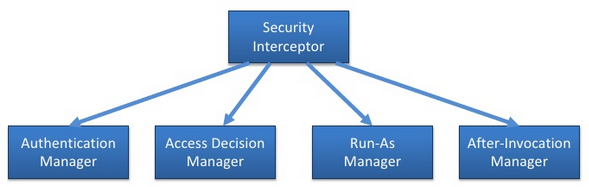
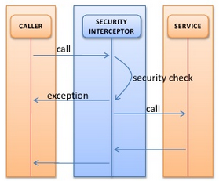
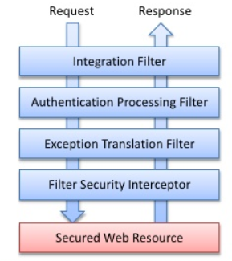
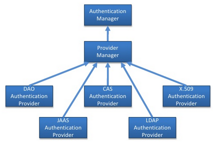
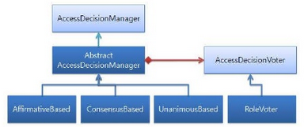

Security for website is very essential simply because we can be robbed all user information such as credit card, address, email, password, ... So, Spring Security will appear to help us to reduce our attempt.

In this article, we will find out about basic knowledge about Spring Security, and help us have background about this framework.

<br>

## Table of contents
- [Introduction to Spring Security](#introduction-to-spring-security)
- [Filter Chains](#filter-chains)
- [Authentication in Spring Security](#authentication-in-spring-security)
- [Authorization in Spring Security](#authorization-in-spring-security)
- [Wrapping up](#wrapping-up)


<br>

## Introduction to Spring Security
Spring Security is started in 2003, and it easily became extremely popular. It provides declarative security for our Spring-based applications.

It handles authentication and authorization. It also takes full advantage of dependency injection - DI and aspect-oriented techniques based on the Spring framework.

There are some information about being popular of Spring Security:
- Over 231,000 downloads on SourceForge.
- At least 20,000 downloads per release.
- Over 14,000 posts in the community forum.
- Used in many demanding environments
    - Large banks and business.
    - Defence and government.
    - Universities.
    - Independent software vendors.

Spring Security includes some functionalities:
- Filters (Security interceptor)
- Authentication
- Authorization
    - Web authorization
    - Method authorization

<br>

## Filter Chains
The below image is about Security Interceptors



It means we have to pass all the security interceptors before we can get resources from server.

So, the following is parts to describe how security interceptor works.
- A latch that protects secured resources, to get past users typically enter a username and password.

    

- Implementation depends on resource being secured.
    - URLs - Servlet filter.
    - Methods - Aspects

- Delegates the responsibilities to the various managers.



|            Filter          |                          What it does                     |
| -------------------------- | --------------------------------------------------------- |
| Integration fileter        | responsible for retrieving a previously stored authentication (most likely stored in the HTTP session) so that it will be ready for Spring Security's other filters to process. |
| Authentication Processing Filter | determine if the request is an authentication request. If so, the user information (typically a username / password pair)  is retrieved from the request and passed on to the authentication manager. |
| Exception Translation Filter | translates exceptions, for AuthenticationException request will be sent to a login screen, for AccessDeniedException returns HTTP 403 to the browser. |
| Filter Security Interceptor | examine the request and determine whether the user has the necessary privileges to access the secured resource. It leans heavily on the authentication manager and the access decision manager. | 
| HttpRequestIntegrationFilter | populates the security context using information from the user principla. |
| CaptchaValidationProcessingFilter | helps to identify a user as a human using Captcha techniques. |
| ConcurrentSessionFilter | ensures that a user is not simultaneously logged in more than a set number of times. |
| HttpSessionContextIntegrationFilter | populates the security context using information obtained from the http session. |
| FilterSecurityInterceptor | Decides whether or not to allow access to a secured resource. |
| AnonymousProcessingFilter | Used to identify an unauthenticated user as an anonymous user. |
| ChannelProcessingFilter | Ensures that a request is being sent over HTTP or HTTPS. |
| BasicProcessingFilter | Attempts to authenticate a user by processing an HTTP basic authentication. |
| CasProcessingFilter | Authenticates a user by processing a CAS (Central Authentication Service) ticket. |
| DigestProcessingFilter | Attempts to authenticate a user by processing an HTTP Digest authentication. |
| ExceptionTranslationFilter | Handles any AccessDeniedException or AuthenticationException. |
| LogoutFilter | Used to log a user out of the application. |
| RememberMeProcessingFilter | Automatically authenticates a user who has asked to be "remembered" by the application. | 
| SwitchUserProcessingFilter | Used to switch out a user. Provides functionality similar to Unix's su. | 
| AuthenticationProcessingFilter | Accepts the user's principal and credentials and attempts to authenticate the user. |
| SiteminderAuthenticationProcessingFilter | Authenticates a user by processing CA/Netegrity SiteMinder headers. |
| X509ProcessingFilter | Authenticates a user by processing an X.509 certificate submitted by a client web browser. |
| SecurityContextHolderAwareRequestFilter | populates the servlet request with a request wrapper. |

Finally, we have an image about FilterChain.


<br>

## Authentication in Spring Security
The part that is responsible for managing authentication in Spring Security is ```AuthenticationManager``` class. 
- verifies principal (typically a username) and credentials ()

- Spring Security comes with a handful of flexible authentication managers that cover the most common authentication strategies. 




<br>

## Authorization in Spring Security
Of course, ```AccessDecisionManager``` class is used for authorization.
- repsonsible for deciding whether the user has the proper access to secured resources by invoking Voters and tallying votes. 
- Spring Security comes with three implementations of Access Decision Manager. 



Belows is the table about properties in ```AccessDecisionManager``` class. 

|           Access decision manager          |    How it decides to grant/deny access     |
| ------------------------------------------ | ------------------------------------------ |
| Affirmative Based                          | Allow access if at least one voter votes to grant access. |
| Consensus Based                            | Allow access if a consensus of voters vote to grant access. |
| Unanimous Based                            | Allow access if all voters vote to grant access. |


<br>

## Wrapping up
- When user send principal and credential, they will be combine into ```UsernamePasswordAuthentication``` class, and is checked through filter chain. After passing all processing filter, we will get our destination.
- Default, in authorization, Spring Security uses Voter.

<br>

Thanks for your reading.

<br>

Refer:

[https://www.slideshare.net/boymeetstechnology/spring-security?next_slideshow=2](https://www.slideshare.net/boymeetstechnology/spring-security?next_slideshow=2)