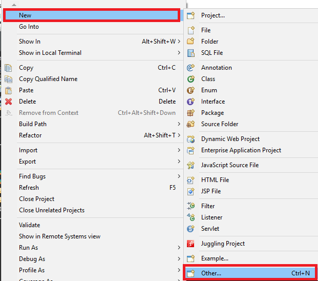
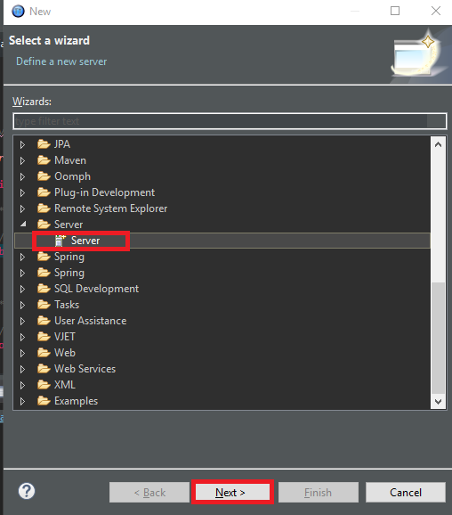
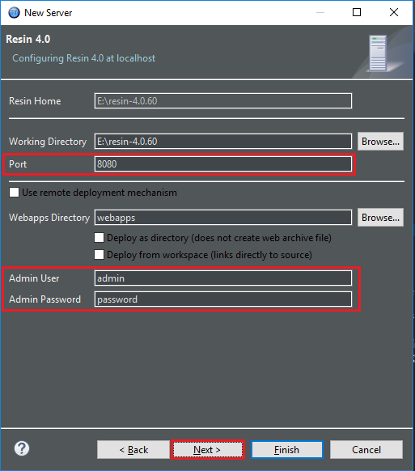

In this article, we will discuss about how to configure Resin server into our IDE Eclipse, and how to overcome some common errors when running project.

<br>

## Table of contents
- [Configure Resin in e builder](#configure-resin-in-e-builder)
- [Create new Server for our project](#create-new-server-for-our-project)
- [Deploy WAR file with Resin](#deploy-war-file-with-resin)
- [Errors with Resin when running project](#errors-with-resin-when-running-project)

<br>

## Configure Resin in e Builder
- Download Resin 

    We can go to the download website of resin [http://caucho.com/products/resin/download](http://caucho.com/products/resin/download).

    Download the lastest version of Resin.

    And we will unzip this Resin file into our folder.

    

- Add Resin server into eclipse.

    - Open **Window\Preferences**, we have **Preference dialog**. Then, select **Server** tab, choose option **Runtime Environments**:

        

    - In **Preference dialog**, select **Add** button. Open **New Server Runtime Environment**. 

        

        If you see anything that do not look like the above image, you still select the option in **Resin folder**. And click **Next** button. 

        Then, we have to choose **JRE version** and click **Download and Install** button to install Resin driver for our eclipse.

        We can wait for approximately 5 minutes to finish this task. After done, it will restart our eclipse. 

        Finally, when eclipse appear again, the **New Server Runtime Development** looks like the above image.

        Then, click **Next** button.

        

        In this dialog, we should fill the home path of Resin into the textbox - **Resin Home**.

        Click **Finish** button or **Next** button.

    - A result will be looked like:

        

<br>

## Create new Server for our project
In order to run our project, first of all, we need to add new server such as Resin, Tomcat, Glassfish.
- Right click on our project in ```Project Explorer```. Select ```New``` item, then, choose ```Other``` item.

    

- Go to the ```New``` dialog. Select ```Server``` folder, choose ```Server```. Click ```Next``` button.

    

- Go to the ```New Server``` dialog. Choose ```Resin``` and ```Resin 4.0```. 

    

- Click ```Next``` button.

    

    In this dialog, we can repair some information about server such as Port, username, password, ...

- Click ```Next``` button.

    

- Click ```Finish``` button.

<br>

## Deploy WAR file with Resin 
In eclipse or e Builder IDE, we have to make an WAR file that is created by IM Juggling.

In case of Windows:
- Open Command Prompt.
- Type commands

    ```
    cd <%RESIN_HOME%>
    resin deploy WAR_FILE_PATH
    ```

In case of Linux:

```
# <%RESIN_HOME%>/bin/resinctl deploy any directory path/war file name
```


<br>

## Errors with Resin when running project
- ```javac compiler is not available in Java(TM) SE Runtime Environment 1.8.0_181-b13. Check that you are using the JDK, not the JRE.```

    - Reason: Because in our project, we are choosing default ```Installed JREs``` is JRE 1.81. So, Eclipse or E-builder do not find javac compiler.
    - Solution: Change the path of ```Installed JREs``` to JDK 1.81.

        - Step 1: Open ```Windows``` --> ```Preferences```. Then select ```Add``` button.

            

        - Step 2: Select ```Add``` button, we have:

            

        - Step 3: Select ```Next``` button, we have:

            

            In this dialog, we type the path for JRE home is the path of JDK. Because in JDK folder, we have JRE.

            Click ```Finish``` button.
        
        - Step 4: Check to option that has JDK.

            Click ```Apply``` button --> ```OK``` button.

- Note: In order to use e Builder property, we need to configure JDK and JRE that is allowed with this [link](https://www-en.intra-mart.jp/document/library/ebuilder/public/e_builder_setup_guide/texts/jre/index.html)

<br>

Refer:

**Setting for JDK and JRE for e Builder**

[https://www-en.intra-mart.jp/document/library/ebuilder/public/e_builder_setup_guide/texts/jre/index.html](https://www-en.intra-mart.jp/document/library/ebuilder/public/e_builder_setup_guide/texts/jre/index.html)

<br>

[https://blog.csdn.net/lifelegendc/article/details/63684433](https://blog.csdn.net/lifelegendc/article/details/63684433)

[https://wagenknecht.org/blog/archives/2006/03/resin-plug-in-for-eclipse.html](https://wagenknecht.org/blog/archives/2006/03/resin-plug-in-for-eclipse.html)

[https://help.eclipse.org/mars/index.jsp?topic=%2Forg.eclipse.wst.server.ui.doc.user%2Ftopics%2Ftwprefin.html](https://help.eclipse.org/mars/index.jsp?topic=%2Forg.eclipse.wst.server.ui.doc.user%2Ftopics%2Ftwprefin.html)