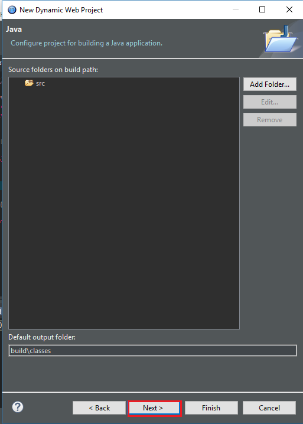

In this article, we will find out about how to create dynamic web project with servlet, jsp in eclipse, how to add external jar files, add new server into our project. 

<br>

## Table of contents
- [Create dynamic web project Java](#create-dynamic-web-project-java)
- [Add new server into our project](#add-new-server-into-our-project)
- [Add external libraries](#add-external-libraries)


<br>

## Create dynamic web project Java
- Select ```File``` -> ```New``` -> ```Project```.

    

- Go to the ```New Project``` dialog.

    

    Select ```Web``` folder --> ```Dynamic Web Project```.

- Click ```Next``` button.

    

    Type our project name, and select ```Dynamic web module version```.

- Click ```Next``` button.

    

- Click ```Next``` button.

    

    We should select checkbox ```Generate web.xml deployment description```.

    And finally, click ```Finish``` button.

<br>

## Add new server into our project
In order to run our project, first of all, we need to add new server such as Resin, Tomcat, Glassfish.
- Right click on our project in ```Project Explorer```. Select ```New``` item, then, choose ```Other``` item.

    

- Go to the ```New``` dialog. Select ```Server``` folder, choose ```Server```. Click ```Next``` button.

    

- Go to the ```New Server``` dialog. Choose ```Resin``` and ```Resin 4.0```. 

    

- Click ```Next``` button.

    

    In this dialog, we can repair some information about server such as Port, username, password, ...

- Click ```Next``` button.

    

- Click ```Finish``` button.

<br>

## Add external libraries
- Right click on our project in ```Project Explorer```.

    

    Select ```Build Path``` --> ```Configure Build Path ...```. 

- Go to the ```Properties for ...``` dialog. 

    

    Click ```Add External JARs...``` button.

- Go to the ```JAR selection``` dialog.

    

    At this dialog, we will choose some jar file that we need in our project. 

- After finished to choose some jar files, we have:

    

    Click ```Apply``` button --> ```OK``` button.


<br>


Refer:

[https://www.javahelps.com/2015/04/java-web-application-hello-world.html](https://www.javahelps.com/2015/04/java-web-application-hello-world.html)

[https://www.studytonight.com/servlet/creating-servlet-in-eclipse.php](https://www.studytonight.com/servlet/creating-servlet-in-eclipse.php)

[https://stackoverflow.com/questions/2349633/doget-and-dopost-in-servlets](https://stackoverflow.com/questions/2349633/doget-and-dopost-in-servlets)

[https://stackoverflow.com/questions/11731377/servlet-returns-http-status-404-the-requested-resource-servlet-is-not-availa](https://stackoverflow.com/questions/11731377/servlet-returns-http-status-404-the-requested-resource-servlet-is-not-availa)