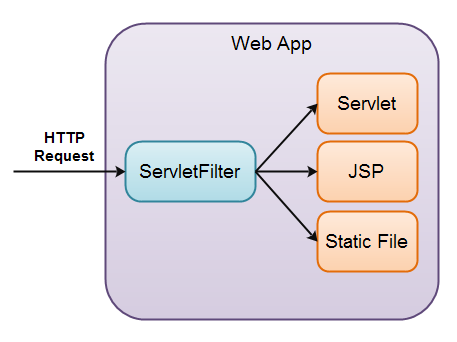

In this article, we will discuss about configuration in web.xml file, especially in Servlet programming for maintaining project, simply because nowadays, we normally use annotations to configure our application.

<br>

## Table of contents
- [Introduction to web.xml file](#introduction-to-web.xml-file)
- [Configuration with web.xml in Spring](#configuration-with-web.xml-in-spring)
- [Structure of web.xml file](#structure-of-web.xml-file)
- [Servlets and URLs paths](#servlets-and-urls-paths)
- [JSPs](#jsps)
- [The welcome file list](#the-welcome-file-list)
- [Filters](#filters)
- [Error handlers](#error-handlers)
- [Context Parameters](#context-parameters)

<br>

## Introduction to web.xml file
Java web applications use a deployment descriptor file to determine how URLs map to servlets, which URLs require authentication, and other information. A web application's deployment descriptor describes the classes, resources and configuration of the application and how the web server uses them to serve web requests.

The file is named ```web.xml```, and resides in the app's WAR under the ```WEB-INF/``` directory. ```web.xml``` is part of the servlet standard for web applications.

Here is a simple web.xml example that maps all URL paths (/*) to the servlet class mysite.server.ComingSoonServlet:

```xml
<web-app xmlns="http://java.sun.com/xml/ns/javaee" version="2.5">
    <servlet>
        <servlet-name>comingsoon</servlet-name>
        <servlet-class>mysite.server.ComingSoonServlet</servlet-class>
    </servlet>
    <servlet-mapping>
        <servlet-name>comingsoon</servlet-name>
        <url-pattern>/*</url-pattern>
    </servlet-mapping>
</web-app>
```

<br>

## Configuration with web.xml in Spring
If we deal with legacy Spring projects it is very common to find XML configuration and until Spring 3.1 the only way to configure the DispatcherServlet was with the ```WEB-INF/web.xml``` file.

For example:

```xml
<servlet>
    <servlet-name>dispatcher</servlet-name>
    <servlet-class>
        org.springframework.web.servlet.DispatcherServlet
    </servlet-class>
    <init-param>
        <param-name>contextConfigLocation</param-name>
        <param-value>/WEB-INF/spring/dispatcher-config.xml</param-value>
    </init-param>
    <load-on-startup>1</load-on-startup>
</servlet>
```

With this block of XML we are declaring a servlet that:
- Is named ```dispatcher```.
- Is an instance of ```org.springframework.web.servlet.DispatcherServlet```.
- Will be initialized with a parameter named ```contextConfigLocation``` which contains the path to the configuration XML

```load-on-startup``` is an integer value that specifies the order for multiple servlets to be loaded. So if you need to declare more than one servlet you can define in which order they will be initialized. Servlets marked with lower integers are loaded before servlets marked with higher integers.

Now our servlet is configured. The second step is declaring a ```servlet-mapping```:

```xml
<servlet-mapping>
    <servlet-name>dispatcher</servlet-name>
    <url-pattern>/</url-pattern>
</servlet-mapping>
```

With the servlet mapping we are bounding it by its name to a URL pattern that specifies what HTTP requests will be handled by it.

<br>

In the version 3.0 of Servlet APIs, we can configure both ```web.xml``` file and using Java to configure the ```DispatcherServlet```.

```java
public class MyWebAppInitializer implements WebApplicationInitializer {
    @Override
    public void onStartup(ServletContext container) {
        XmlWebApplicationContext context = new XmlWebApplicationContext();
        context.setConfigLocation("/WEB-INF/spring/dispatcher-config.xml");
 
        ServletRegistration.Dynamic dispatcher = container
          .addServlet("dispatcher", new DispatcherServlet(context));
 
        dispatcher.setLoadOnStartup(1);
        dispatcher.addMapping("/");
    }
}
```

So we used Java to declare the servlet and bind it to a URL mapping but we kept the configuration in a separated XML file: ```dispatcher-config.xml```.

<br>

Now, we will completely use Java configuration like the below code:

```java
public class MyWebAppInitializer implements WebApplicationInitializer {
    @Override
    public void onStartup(ServletContext container) {
        AnnotationConfigWebApplicationContext context
          = new AnnotationConfigWebApplicationContext();
        context.setConfigLocation("com.example.app.config");
 
        container.addListener(new ContextLoaderListener(context));
 
        ServletRegistration.Dynamic dispatcher = container
          .addServlet("dispatcher", new DispatcherServlet(context));
         
        dispatcher.setLoadOnStartup(1);
        dispatcher.addMapping("/");
    }
}
```

Java and annotation configuration offers many advantages. Usually it leads to shorter and more concise configuration and annotations provide more context to declarations, as it’s co-located with the code that they configure.

But this is not always a preferable or even possible way. For example some developers may prefer keeping their code and configuration separated, or you may need to work with third party code that you can’t modify.

<br>

## Structure of web.xml file
The below is a common content of web.xml file.

```xml
<?xml version="1.0" encoding="UTF-8"?>
<web-app xmlns="http://java.sun.com/xml/ns/j2ee"
        xmlns:xsi="http://www.w3.org/2001/XMLSchema-instance"
        xsi:schemaLocation="http://java.sun.com/xml/ns/j2ee http://java.sun.com/xml/ns/j2ee/web-app_2_4.xsd"
        version="2.4">

        <!-- ========================================================== -->
        <!-- General -->
        <!-- ========================================================== -->

        <!-- Name the application -->
        <display-name>Example App</display-name>
        <description>An example application which is used to play with some of the features of Tomcat</description>

        <!-- This app is cluster-ready -->
        <distributable />

        <!-- Set timeout to 120 minutes -->
        <session-config>
            <session-timeout>120</session-timeout>
        </session-config>


        <!-- ========================================================== -->
        <!-- Custom Tag Libraries -->
        <!-- ========================================================== -->

        <!-- Taglib declarations are no longer required since JSP 2.0, see Removing taglib from web.xml -->
        <!-- The <taglib> did not need to be a child of <jsp-config> in earlier versions but is required as of Tomcat 7 -->
        <!-- Note that you can only have one <jsp-config> element per web.xml -->
        <!--
        <jsp-config>
            <taglib>
                <taglib-uri>mytags</taglib-uri>
                <taglib-location>/WEB-INF/jsp/mytaglib.tld</taglib-location>
            </taglib>
        </jsp-config>
        -->


        <!-- ========================================================== -->
        <!-- JSP Configuration -->
        <!-- ========================================================== -->

        <jsp-config>
            <jsp-property-group>
                <url-pattern>*.jsp</url-pattern>
                <include-prelude>/WEB-INF/jspf/prelude1.jspf</include-prelude>
                <include-coda>/WEB-INF/jspf/coda1.jspf</include-coda>
            </jsp-property-group>
        </jsp-config>


        <!-- ========================================================== -->
        <!-- Context Parameters -->
        <!-- ========================================================== -->

        <context-param>
            <description>Enable debugging for the application</description>
            <param-name>debug</param-name>
            <param-value>true</param-value>
        </context-param>
        <context-param>
            <description>The email address of the administrator, used to send error reports.</description>
            <param-name>webmaster</param-name>
            <param-value>address@somedomain.com</param-value>
        </context-param>


        <!-- ========================================================== -->
        <!-- JNDI Environment Variables -->
        <!-- ========================================================== -->

        <env-entry>
            <env-entry-name>webmasterName</env-entry-name>
            <env-entry-value>Ms. W. Master</env-entry-value>
            <env-entry-type>java.lang.String</env-entry-type>
        </env-entry>
        <env-entry>
            <env-entry-name>cms/defaultUserSettings/recordsPerPage</env-entry-name>
            <env-entry-value>30</env-entry-value>
            <env-entry-type>java.lang.Integer</env-entry-type>
        </env-entry>
        <env-entry>
            <env-entry-name>cms/enableXMLExport</env-entry-name>
            <env-entry-value>false</env-entry-value>
            <env-entry-type>java.lang.Boolean</env-entry-type>
        </env-entry>
        <env-entry>
            <env-entry-name>cms/enableEmailNotifications</env-entry-name>
            <env-entry-value>true</env-entry-value>
            <env-entry-type>java.lang.Boolean</env-entry-type>
        </env-entry>


        <!-- ========================================================== -->
        <!-- Servlets -->
        <!-- ========================================================== -->

        <!-- Simple Servlet, provide a name, class, description and map to URL /servlet/SimpleServlet -->
        <servlet>
            <servlet-name>Simple</servlet-name>
            <servlet-class>SimpleServlet</servlet-class>
            <description>This is a simple Hello World servlet</description>
        </servlet>
        <servlet-mapping>
            <servlet-name>Simple</servlet-name>
            <url-pattern>/servlet/SimpleServlet</url-pattern>
        </servlet-mapping>

        <!-- CMS Servlet, responds to *.cms URL's -->
        <servlet>
            <!-- Identification -->
            <servlet-name>cms</servlet-name>
            <servlet-class>com.metawerx.servlets.ContentManagementSystem</servlet-class>
            <description>This servlet handles requests for the CMS (it is a controller in an MVC architecture)</description>

            <!-- This servlet has two parameters -->
            <init-param>
                    <param-name>debug</param-name>
                    <param-value>true</param-value>
            </init-param>
            <init-param>
                    <param-name>detail</param-name>
                    <param-value>2</param-value>
            </init-param>

            <!-- Load this servlet when the application starts (call the init() method of the servlet) -->
            <load-on-startup>5</load-on-startup>
            <!-- <run-at>0:00, 6:00, 12:00, 18:00</run-at> This tag is only valid for Resin -->
        </servlet>

        <!-- Map some URLs to the cms servlet (demonstrates *.extension mapping) -->
        <servlet-mapping>
            <!-- For any URL ending in .cms, the cms servlet will be called -->
            <servlet-name>cms</servlet-name>
            <url-pattern>*.cms</url-pattern>
        </servlet-mapping>

        <!-- Rewriter Servlet, responds to /content/* and /admin/RewriterStatistics URL's -->
        <!-- Define a servlet to respond to /content/* URL's -->
        <servlet>
            <servlet-name>rewriter</servlet-name>
            <servlet-class>com.metawerx.servlets.URLRewriter</servlet-class>
        </servlet>

        <!-- Map some URL's to the rewriter servlet (demonstrates /path/* and specific URL mapping) -->
        <servlet-mapping>
            <!-- For any URL starting with /content/, the rewriter servlet will be called -->
            <servlet-name>rewriter</servlet-name>
            <url-pattern>/content/*</url-pattern>
        </servlet-mapping>
        <servlet-mapping>
            <!-- The rewriter servlet can also be called directly as /admin/RewriterStatistics, to return stats -->
            <servlet-name>rewriter</servlet-name>
            <url-pattern>/admin/RewriterStatistics</url-pattern>
        </servlet-mapping>

        <!-- PathJSP Servlet, maps /shop/item/* URL's to a JSP file -->
        <!-- Define a JSP file to respond to /shop/item/* URL's -->
        <servlet>
            <servlet-name>pathjsp</servlet-name>
            <jsp-file>pathfinder.jsp</jsp-file>
        </servlet>

        <!-- Map some URL's to the pathjsp servlet (demonstrates /long/path/* URL mapping) -->
        <servlet-mapping>
            <!-- For any URL starting with /shop/item/, the pathjsp servlet will be called -->
            <servlet-name>pathjsp</servlet-name>
            <url-pattern>/shop/item/*</url-pattern>
        </servlet-mapping>


        <!-- ========================================================== -->
        <!-- Filters -->
        <!-- ========================================================== -->

        <!-- Example filter to set character encoding on each request (from Tomcat servlets-examples context) -->
        <filter>
                <filter-name>Set Character Encoding</filter-name>
                <filter-class>filters.SetCharacterEncodingFilter</filter-class>
                <init-param>
                    <param-name>encoding</param-name>
                    <param-value>EUC_JP</param-value>
                </init-param>
        </filter>
        <filter-mapping>
            <filter-name>Set Character Encoding</filter-name>
            <url-pattern>/*</url-pattern>
        </filter-mapping>

        <!-- Example filter to dump the HTTP request at the top of each page (from Tomcat servlets-examples context) -->
        <filter>
            <filter-name>Request Dumper Filter</filter-name>
            <filter-class>filters.RequestDumperFilter</filter-class>
        </filter>
        <filter-mapping>
            <filter-name>Request Dumper Filter</filter-name>
            <url-pattern>/*</url-pattern>
        </filter-mapping>


        <!-- ========================================================== -->
        <!-- Listeners -->
        <!-- ========================================================== -->

        <!-- Define example application events listeners -->
        <listener>
            <listener-class>com.metawerx.listener.ContextListener</listener-class>
        </listener>
        <listener>
            <listener-class>com.metawerx.listener.SessionListener</listener-class>
        </listener>


        <!-- ========================================================== -->
        <!-- Security -->
        <!-- ========================================================== -->

        <!-- Define roles -->
        <security-role>
            <role-name>admin</role-name>
        </security-role>
        <security-role>
            <role-name>cms_editors</role-name>
        </security-role>
        
        <!-- Define a constraint to restrict access to /private/* -->
        <security-constraint>

            <display-name>Security constraint for the /private folder</display-name>

            <web-resource-collection>
                    
                <web-resource-name>Protected Area</web-resource-name>
                <url-pattern>/private/*</url-pattern>
                
                <!-- If you list http methods, only those methods are protected. -->
                <!-- Leave this commented out to protect all access -->
                <!--
                <http-method>DELETE</http-method>
                <http-method>GET</http-method>
                <http-method>POST</http-method>
                <http-method>PUT</http-method>
                -->

            </web-resource-collection>

            <auth-constraint>
                <!-- Only only administrator and CMS editors to access this area -->
                <role-name>admin</role-name>
                <role-name>cms_editors</role-name>
            </auth-constraint>

        </security-constraint>

        <!-- FORM based authentication -->
        <!-- Leave this commented out, we will use BASIC (HTTP) authentication instead -->
        <!--
        <login-config>
                <auth-method>FORM</auth-method>
                <form-login-config>
                        <form-login-page>/login.jsp</form-login-page>
                        <form-error-page>/error.jsp</form-error-page>
                </form-login-config>
        </login-config>
        -->
        <!-- This application uses BASIC authentication -->
        <login-config>
            <auth-method>BASIC</auth-method>
            <realm-name>Editor Login</realm-name>
        </login-config>

        <!-- Define a constraint to force SSL on all pages in the application -->
        <security-constraint>

            <web-resource-collection>
                <web-resource-name>Entire Application</web-resource-name>
                <url-pattern>/*</url-pattern>
            </web-resource-collection>

            <user-data-constraint>
                <transport-guarantee>CONFIDENTIAL</transport-guarantee>
            </user-data-constraint>

        </security-constraint>


        <!-- ========================================================== -->
        <!-- Error Handler -->
        <!-- ========================================================== -->

        <!-- Define an error handler for 404 pages -->
        <error-page>
            <error-code>404</error-code>
            <location>/error404.jsp</location>
        </error-page>

        <!-- Define an error handler for java.lang.Throwable -->
        <error-page>
            <exception-type>java.lang.Throwable</exception-type>
            <location>/errorThrowable.jsp</location>
        </error-page>


        <!-- ========================================================== -->
        <!-- Extra MIME types -->
        <!-- ========================================================== -->

        <!-- Set XML mime-mapping so spreadsheets open properly instead of being sent as an octet/stream -->
        <mime-mapping>
            <extension>xls</extension>
            <mime-type>application/vnd.ms-excel</mime-type>
        </mime-mapping>


        <!-- ========================================================== -->
        <!-- Locale -->
        <!-- ========================================================== -->

        <!-- Set Locale Encoding -->
        <locale-encoding-mapping-list>
            <locale-encoding-mapping>
                <locale>ja</locale>
                <encoding>Shift_JIS</encoding>
            </locale-encoding-mapping>
        </locale-encoding-mapping-list>


        <!-- ========================================================== -->
        <!-- Welcome Files -->
        <!-- ========================================================== -->

        <!-- Define, in order of preference, which file to show when no filename is defined in the path -->
        <!-- eg: when user goes to http://yoursite.com/ or http://yoursite.com/somefolder -->
        <!-- Defaults are provided in the server-wide web.xml file, such as index.jsp, index.htm -->
        <!-- Note: using this tag overrides the defaults, so don't forget to add them here -->
        <welcome-file-list>
            <!-- Use index.swf if present, or splash.jsp, otherwise just look for the normal defaults -->
            <welcome-file>index.swf</welcome-file>
            <welcome-file>splash.jsp</welcome-file>
            <welcome-file>index.html</welcome-file>
            <welcome-file>index.htm</welcome-file>
            <welcome-file>index.jsp</welcome-file>
        </welcome-file-list>

</web-app> 
```

<br>

## Servlets and URLs paths
```web.xml``` defines mappings between URL paths and the servlets that handle requests with those paths. The web server uses this configuration to identify the servlet to handle a given request and call the class method that corresponds to the request method. For example: the ```doGet()``` method for HTTP **GET** requests.

To map a URL to a servlet, you declare the servlet with the ```<servlet>``` element, then define a mapping from a URL path to a servlet declaration with the ```<servlet-mapping>``` element.

The ```<servlet>``` element declares the servlet, including a name used to refer to the servlet by other elements in the file, the class to use for the servlet, and initialization parameters. You can declare multiple servlets using the same class with different initialization parameters. The name for each servlet must be unique across the deployment descriptor.

For example: 

```xml
<servlet>
    <servlet-name>redteam</servlet-name>
    <servlet-class>mysite.server.TeamServlet</servlet-class>
    <init-param>
        <param-name>teamColor</param-name>
        <param-value>red</param-value>
    </init-param>
    <init-param>
        <param-name>bgColor</param-name>
        <param-value>#CC0000</param-value>
    </init-param>
</servlet>

<servlet>
    <servlet-name>blueteam</servlet-name>
    <servlet-class>mysite.server.TeamServlet</servlet-class>
    <init-param>
        <param-name>teamColor</param-name>
        <param-value>blue</param-value>
    </init-param>
    <init-param>
        <param-name>bgColor</param-name>
        <param-value>#0000CC</param-value>
    </init-param>
</servlet>
```

With the above code, we use ```<init-param>``` to pass parameters to a servlet from the ```web.xml``` file. The init parameter of a servlet can only be accessed by that servlet. 

And we can get init parameters from inside our servlet - in the servlets ```init()``` method.

```java
public class SimpleServlet extends GenericServlet {

  protected String myParam = null;

  public void init(ServletConfig servletConfig) throws ServletException{
    this.myParam = servletConfig.getInitParameter("myParam");
  }

  public void service(ServletRequest request, ServletResponse response)
        throws ServletException, IOException {

    response.getWriter().write("<html><body>myParam = " +
            this.myParam + "</body></html>");
  }
}
```

A servlets **init()** method is called when the servlet container loads the servlet for the first time. No one can access the servlet until the servlet has been loaded, and the **init()** method has been called successfully. 

The ```<servlet-mapping>``` element specifies a URL pattern and the name of a declared servlet to use for requests whose URL matches the pattern. The URL pattern can use an asterisk (*) at the beginning or end of the pattern to indicate zero or more of any character. The standard does not support wildcards in the middle of a string, and does not allow multiple wildcards in one pattern. The pattern matches the full path of the URL, starting with and including the forward slash (/) following the domain name. The URL path cannot start with a period (.).

For example:

```xml
<servlet-mapping>
    <servlet-name>redteam</servlet-name>
    <url-pattern>/red/*</url-pattern>
</servlet-mapping>

<servlet-mapping>
    <servlet-name>blueteam</servlet-name>
    <url-pattern>/blue/*</url-pattern>
</servlet-mapping>
```

With this example, a request for the URL ```http://www.example.com/blue/teamProfile``` is handled by the TeamServlet class, with the teamColor parameter equal to blue and the bgColor parameter equal to #0000CC. The servlet can get the portion of the URL path matched by the wildcard using the ServletRequest object's ```getPathInfo()``` method.

The servlet can access its initialization parameters by getting its servlet configuration using its own ```getServletConfig()``` method, then calling the getInitParameter() method on the configuration object using the name of the parameter as an argument.

```java
String teamColor = getServletConfig().getInitParameter("teamColor");
```


<br>

## JSPs
An app can use JavaServer Pages (JSPs) to implement web pages. JSPs are servlets defined using static content, such as HTML, mixed with Java code.

App Engine supports automatic compilation and URL mapping for JSPs. A JSP file in the application's WAR (outside of **WEB-INF/**) whose filename ends in **.jsp** is compiled into a servlet class automatically, and mapped to the URL path equivalent to the path to the JSP file from the WAR root. For example, if an app has a JSP file named **start.jsp** in a subdirectory named **register/** in its WAR, App Engine compiles it and maps it to the URL path **/register/start.jsp**.

If you want more control over how the JSP is mapped to a URL, you can specify the mapping explicitly by declaring it with a ```<servlet>``` element in the deployment descriptor. Instead of a ```<servlet-class>``` element, you specify a ```<jsp-file>``` element with the path to the JSP file from the WAR root. The ```<servlet>``` element for the JSP can contain initialization parameters.

For example:

```xml
<servlet>
    <servlet-name>register</servlet-name>
    <jsp-file>/register/start.jsp</jsp-file>
</servlet>

<servlet-mapping>
    <servlet-name>register</servlet-name>
    <url-pattern>/register/*</url-pattern>
</servlet-mapping>
```

Note: The ```<jsp-file>``` must start with a forward slash (/) if the JSP is in the application's root directory.

You can install JSP tag libraries with the ```<taglib>``` element. A tag library has a path to the JSP Tag Library Descriptor (TLD) file (```<taglib-location>```) and a URI that JSPs use to select the library for loading (```<taglib-uri>```).

Note that App Engine provides the JavaServer Pages Standard Tag Library (JSTL), and you do not need to install it.

For example:

```xml
<taglib>
    <taglib-uri>/escape</taglib-uri>
    <taglib-location>/WEB-INF/escape-tags.tld</taglib-location>
</taglib>
```

<br>


## The welcome file list
When the URLs for your site represent paths to static files or JSPs in your WAR, it is often a good idea for paths to directories to do something useful as well. A user visiting the URL path ```/help/accounts/password.jsp``` for information on account passwords might try to visit ```/help/accounts/``` to find a page introducing the account system documentation. The deployment descriptor can specify a list of filenames that the server should try when the user accesses a path that represents a WAR subdirectory that is not already explicitly mapped to a servlet. The servlet standard calls this the "welcome file list."

For example, if the user accesses the URL path /help/accounts/, the following ```<welcome-file-list>``` element in the deployment descriptor tells the server to check for ```help/accounts/index.jsp``` and ```help/accounts/index.html``` before reporting that the URL does not exist:

For example:

```xml
<welcome-file-list>
    <welcome-file>index.jsp</welcome-file>
    <welcome-file>index.html</welcome-file>
</welcome-file-list>
```

<br>

## Filters
A filter is a class that acts on a request like a servlet, but can allow the handling of the request to continue with other filters or servlets. A filter may perform an auxiliary task, such as logging, performing specialized authentication checks, or annotating the request or response objects before calling the servlet. Filters allow you to compose request processing tasks from the deployment descriptor.

A servlet filter can intercept requests both for servlets, JSP's, HTML files or other static content, as illustrated in the diagram below: 



A filter class implements the ```javax.servlet.Filter``` interface, including the ```doFilter()``` method. Here is a simple filter implementation that logs a message, and passes control down the chain, which may include other filters or a servlet, as described by the deployment descriptor:

```java
package mysite.server;

import java.io.IOException;
import java.util.logging.Logger;
import javax.servlet.Filter;
import javax.servlet.FilterChain;
import javax.servlet.FilterConfig;
import javax.servlet.ServletException;
import javax.servlet.ServletRequest;
import javax.servlet.ServletResponse;

public class LogFilterImpl implements Filter {

    private FilterConfig filterConfig;
    private static final Logger log = Logger.getLogger(LogFilterImpl.class.getName());

    public void doFilter(ServletRequest request, ServletResponse response, FilterChain filterChain)
        throws IOException, ServletException {
        log.warning("Log filter processed a " + getFilterConfig().getInitParameter("logType")
            + " request");

        filterChain.doFilter(request, response);
    }

    public FilterConfig getFilterConfig() {
        return filterConfig;
    }

    public void init(FilterConfig filterConfig) {
        this.filterConfig = filterConfig;
    }

    public void destroy() {}

}
```

When the servlet filter is loaded the first time, its ```init()``` method is called, just like with servlets.

When a HTTP request arrives at your web application which the filter intercepts, the filter can inspect the request URI, the request parameters and the request headers, and based on that decide if it wants to block or forward the request to the target servlet, JSP etc.

It is the ```doFilter()``` method that does the interception.

Similar to servlets, you configure a filter in the deployment descriptor by declaring the filter with the ```<filter>``` element, then mapping it to a URL pattern with the ```<filter-mapping>``` element. You can also map filters directly to other servlets.

The ```<filter>``` element contains a ```<filter-name>```, ```<filter-class>```, and optional ```<init-param>``` elements.

For example:

```xml
<filter>
    <filter-name>logSpecial</filter-name>
    <filter-class>mysite.server.LogFilterImpl</filter-class>
    <init-param>
        <param-name>logType</param-name>
        <param-value>special</param-value>
    </init-param>
</filter>

<filter-mapping>
    <filter-name>logSpecial</filter-name>
    <url-pattern>*.simple</url-pattern>
</filter-mapping>
```

With this configuration all requests with URL's ending in ```.simple``` will be intercepted by the servlet filter. All others will be left untouched. 

The ```<filter-mapping>``` element contains a ```<filter-name>``` that matches the name of a declared filter, and either a ```<url-pattern>``` element for applying the filter to URLs, or a ```<servlet-name>``` element that matches the name of a declared servlet for applying the filter whenever the servlet is called.

<br>

## Error Handlers
You can customize what the server sends to the user when an error occurs, using the deployment descriptor. The server can display an alternate page location when it's about to send a particular HTTP status code, or when a servlet raises a particular Java exception.

The ```<error-page>``` element contains either an ```<error-code>``` element with an HTTP error code value (such as 500), or an ```<exception-type>``` element with the class name of the expected exception (such as ```java.io.IOException```). It also contains a ```<location>``` element containing the URL path of the resource to show when the error occurs.

```xml
<error-page>    
    <error-code>500</error-code>
    <location>/errors/servererror.jsp</location>
</error-page>
```

<br>

## Context Parameters
We can also set some context parameters which can be read from all servlets in our application. 

For example:

```xml
<context-param>
    <param-name>myParam</param-name>
    <param-value>the value</param-value>
</context-param>
```

Here is how we access the parameter from inside an HttpServlet subclass: 

```java
String myContextParam =
        request.getSession()
               .getServletContext()
               .getInitParameter("myParam");
```

<br>


Refer:

[https://docs.oracle.com/cd/E13222_01/wls/docs81/webapp/web_xml.html#1019996](https://docs.oracle.com/cd/E13222_01/wls/docs81/webapp/web_xml.html#1019996)

[http://tutorials.jenkov.com/java-servlets/web-xml.html](http://tutorials.jenkov.com/java-servlets/web-xml.html)

[http://tutorials.jenkov.com/java-servlets/servlet-filters.html](http://tutorials.jenkov.com/java-servlets/servlet-filters.html)

[https://cloud.google.com/appengine/docs/standard/java/config/webxml](https://cloud.google.com/appengine/docs/standard/java/config/webxml)

[http://wiki.metawerx.net/wiki/Web.xml](http://wiki.metawerx.net/wiki/Web.xml)

[https://www.baeldung.com/spring-xml-vs-java-config](https://www.baeldung.com/spring-xml-vs-java-config)

<br>

**Configuring the web.xml file for Struts**

[https://www.oreilly.com/library/view/programming-jakarta-struts/0596003285/ch04s05.html](https://www.oreilly.com/library/view/programming-jakarta-struts/0596003285/ch04s05.html)