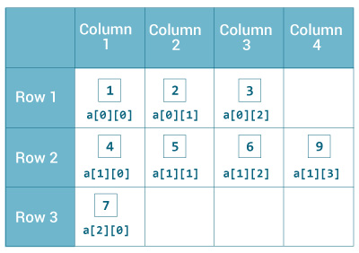

In this article, we will find something out about array in Java Core. This is a fundamental knowldege that we need to know when working with Java.

Let's get started.

<br>

## Table of contents
- [1D Array](#1d-array)
    - [Declaration an array](#declaration-an-array)
    - [Allocate memory for an 1D array](#allocate-memory-for-an-1d-array)
    - [Initialize an array](#initialize-an-array)

- [Multidimensional Array](#multidimensional-array)
    - [Declaration an array](#declaration-an-array)
    - [Allocate memory for an nD array](#allocate-memory-for-an-1d-array)
    - [Initialize an array](#initialize-an-array)
<br>

## 1D Array
### Declaration an array

```java
data_type[] name_variable;
```

- ```data_type```: primitive data type such as ```int```, ```char```, ```Double```, ```byte``` or object.
- ```name_variable```: identifier.

For example: 

```java
int[] values;
Double[] data;
```

### Allocate memory for an 1D array

```java
values = new int[10];
data = new Double[20];
```

Once the length of an array is defined, it cannot changed in the program.

The index of an array starts from 0. So, the first element is ```name_variable[0]```, and the last element is ```name_variable[n - 1]```.

The default initial value of elements of an array is ```0``` for ```numeric types``` and ```false``` for ```boolean```. 

### Initialize an array

```java
int[] values = {1, 2, 3, 4, 5};
```

<br>

## Multidimensional Array
### Declaration an array

```java
int[][] values;
String[][][] data;
```

Multidimensional array is an array that contains other arrays.



### Allocate memory for an nD array

```java
values = new int[2][2];
data = new String[3][4][2];
```

We can ignore the number of columns

```java
String[][] data = new String[3][];
```

but to be able to fill it, you will have to initialize each row separately:

```java
String[][] data = new String[2][];
data[0] = new String[3];
data[1] = new String[3];
```

### Initialize an array

```java
int[][] values = {
    {1, 2, 3}, 
    {4, 5, 6}, 
    {7}
};

int[][][] test = {
    {
        {1, -2, 3}, 
        {2, 3, 4}
    }, 
    { 
        {-4, -5, 6, 9}, 
        {1}, 
        {2, 3}
    }
};
```

<br>


Refer:

[https://www.programiz.com/java-programming/multidimensional-array](https://www.programiz.com/java-programming/multidimensional-array)

[http://grails.asia/two-dimensional-string-array-in-java](http://grails.asia/two-dimensional-string-array-in-java)