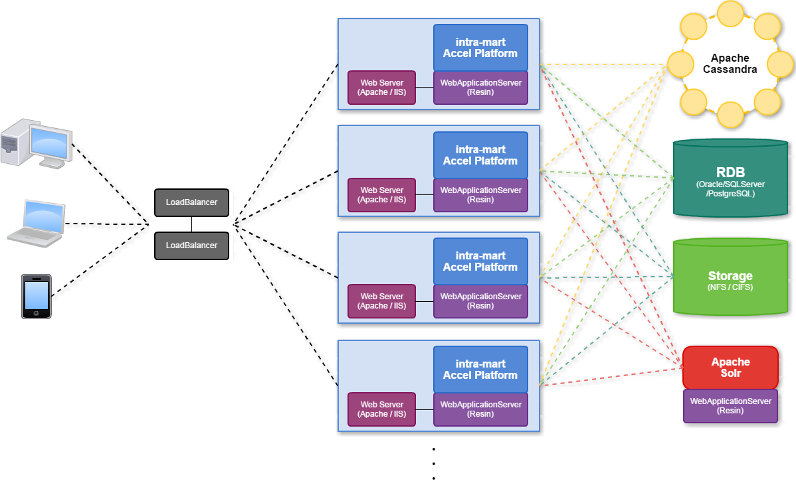

In this article, we will talk about common information about Intra mart Accel platform. 

 

## Table of contents
- [Introduction to Intra mart Accel platform](#introduction-to-intra-mart-accel-platform)
- [The architecture of Intra mart Accel platform](#the-architecture-of-intra-mart-accel-platform)
- [IM Juggling](#im-juggling)
- [Wrapping up](#wrapping-up)

 

## Introduction to Intra mart Accel platform
Intra-mart is a technology platform that connects with multiple business applications to provide a common framework for process automation and workflow management. 

The solution has been used across various industry domains, including insurance, public sector, financial services and retail, and is used by over 5,000 companies and 200 partners in Japan and across Asia Pacific.

In the narture of Intra mart Accel platform, it will include some parts:
- provides some modules such as Authorization, Authentication, ...
- Seasar frameworks
- TERASOLUNA Global framework - a Java framework that is configured on the Spring framework base such as dependency injection, events, resources, i18n, validation, data binding, type conversion, SpEL, AOP.

 

## The architecture of Intra mart Accel platform
Below is the system architecture of intra mart accel platform.

|        Part       |                 Description             | 
| ----------------- | --------------------------------------- |
| LoadBalancer      | It is an equipment to transfer connection request from client to Web server, and performs load balancing etc. Use of Load Balancer with the following functions is recommended on intra-mart: Session maintenance function by Cookie, Health check function based on HTTP response contents, Capability to add redundancy to the Load Balancer itself. |
| Web server        | Accel Platform supports Apache WebServer and IIS. In case Resin is used, it utilizes the module called Web Server Connector that is integrated into Web server. It functions as an interface between Web server and Accel Platform by sending the client request from Web server to Accel Platform on Resin, or receiving the execution result from Accel Platform and passing it to Web server. In case multiple Accel Platforms are set as the connection destination of Web Server Connector, automatic process allocation will be possible by the round-robin function. |
| WebApplicationServer | It is a server to run intra-mart Accel Platform, and it supports Resin included in intra-mart Accel Platform as standard, Oracle Weblogic Server, and IBM Websphere Application Server. intra-mart Accel Platform is placed (deployed) as WAR (Web archive) file on this Web application server. |
| intra-mart Accel Platform | This is the product we offer, which is placed (deployed) as WAR (Web Archive) file generated by IM-Juggling, and works on Web application server. |
| RDB | It is used as a save location for various master data or transaction data of intra-mart Accel Platform. intra-mart Accel Platform supports Oracle, SQLServer, DB2, and PostgresSQL as RDB products at connection destination. |
| Storage | It is used as a save location of attachment files or electronic files for various document used on intra-mart Accel Platform. By the setting of intra-mart Accel Platform, you can specify any storage location. However, if you are operating multiple Web/AP servers, it is necessary to provide a Storage Server such as NFS or CIFS, which allows the operations of the same disk area on every Web/AP server. |
| Apache Cassandra | It is an open source NoSQL server provided by ApacheFoundation. It is needed separately if IMBox is in use. (If IMBox is not used, there is no need to install Apache Cassandra server.) While Cassandra itself provides the redundancy mechanism, operations with 3 or more Cassandra units are recommended from Cassandra/IMBox specifications viewpoint, if you need redundancy and data consistency. |
| Apache Solr | It is an open source search engine provided by ApacheFoundation and used by IM-ContentsSearch. Since Apacphe Solr is also a Web application server like intra-mart, Web application server such as Resin or Jetty must be provided for the operations environment of Apache Solr. (In case IM-ContentsSearch is not used, there is no need to install Solr server.)|

 

## IM Juggling & WAR files
IM-Juggling is an environment building tool can perform module management and the remote management of WAR files.
This tool can be used to install new functions and apply corrections to the defects.

And then, we will need to understand about WAR files:
- It is an acronym of **Web Application Archive** file which is defined in JavaEE and various types of files necessary for the operations of Intra mart Accel platform are included. **WAR files for Intra mart Accel platform are created by IM-Juggling.**

- Various types of files necessary for the operations of Intra mart Accel platform are stored and by deploying WAR files created by IM-Juggling in Web Application Server such as Resin, and running Web Application Server, Intra mart Accel platform itself and various applications for intra mart Accel platform that are stored in the WAR files are started and can be used.

- Since WAR file would be the minimum unit of intra-mart Accel Platform product itself, number of intra-mart Accel Platform licenses are counted by the number of WAR files.

 

## Wrapping up
- Intra mart Accel products will contains so many war files.

 

Refer:

**Architecture of Accel platform**

[http://accel-archives.intra-mart.jp/2014-winter/document/iap/public_en/iap_introduction/texts/std_function/architecture.html](http://accel-archives.intra-mart.jp/2014-winter/document/iap/public_en/iap_introduction/texts/std_function/architecture.html)

 

**Intra mart Accel Documents**

[https://www-en.intra-mart.jp/document/library/?](https://www-en.intra-mart.jp/document/library/?)

 

[http://techinfo.trithucmoi.co/ja/integration-solutions-ja/tong-quan-ve-intra-mart/](http://techinfo.trithucmoi.co/ja/integration-solutions-ja/tong-quan-ve-intra-mart/)

[http://accel-archives.intra-mart.jp/2014-winter/document/iap/public_en/development/tgfw_programming_guide/texts/reference/index.html](http://accel-archives.intra-mart.jp/2014-winter/document/iap/public_en/development/tgfw_programming_guide/texts/reference/index.html)

 

**Standard function in Accel platform**

[http://accel-archives.intra-mart.jp/2014-winter/document/iap/public_en/iap_introduction/texts/std_function/index.html](http://accel-archives.intra-mart.jp/2014-winter/document/iap/public_en/iap_introduction/texts/std_function/index.html)

 

**API for modules**

[https://www.intra-mart.jp/apidoc/iap_en/index.html](https://www.intra-mart.jp/apidoc/iap_en/index.html)

 

**Intra mart e Builder for Accel platform**

[https://www-en.intra-mart.jp/document/library/ebuilder/public/e_builder_user_guide/index.html](https://www-en.intra-mart.jp/document/library/ebuilder/public/e_builder_user_guide/index.html)

 

**Database & JDBC driver**

[https://www-en.intra-mart.jp/document/library/iap/public/setup/iap_setup_guide/texts/install/common/database.html](https://www-en.intra-mart.jp/document/library/iap/public/setup/iap_setup_guide/texts/install/common/database.html)

[https://www-en.intra-mart.jp/document/library/iap/public/setup/iap_setup_guide/texts/install/common/jdbc.html](https://www-en.intra-mart.jp/document/library/iap/public/setup/iap_setup_guide/texts/install/common/jdbc.html)

 

**Setup Debug Server Resin**

[https://www-en.intra-mart.jp/document/library/ebuilder/public/e_builder_setup_guide/texts/environment/index.html](https://www-en.intra-mart.jp/document/library/ebuilder/public/e_builder_setup_guide/texts/environment/index.html)