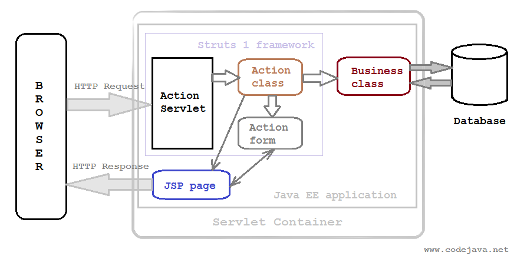

Before diving deeper into how to understand Struts 1 framework works, we need to be aware of how to configure Struts 1 framework with ```struts-config.xml``` file, and ```web.xml``` file. It is very important for the first step simply because when we do not configure our project to run smoothly, we do not do something with it.

So, in this article, we will discuss about configuration in ```struts-config.xml``` file, ```web.xml``` file in Struts 1 framework.

<br>

## Table of contents
- [Background of Struts 1 framework's parts](#background-of-struts-1-framework's-parts)
- [Configuring in web.xml file](#configuring-in-web.xml)
- [Configuring in struts-config.xml file](#configuring-in-struts-config.xml-file)
- [Wrapping up](#wrapping-up)

<br>

## Background of Struts 1 framework's parts
Before to be enable to use Struts 1 framework, we need to understand some parts in this framework. The below image describes these flows:



So, we have some interesting information about the above image:
- Struts 1 handles HTTP requests by its own controller servlet called ```ActionServlet```. Therefore, we need define Struts action servlet and its initialization parameters.

- Specify servlet mapping for the action servlet. There are two types of mapping which delegate the matching URLs to be processed by Struts container.
    - Prefix matching. 
    - Extension matching.

## Configuring in web.xml file
- First step: declare ```org.apache.struts.action.ActionServlet``` in ```web.xml``` file

    In Struts 1 framework, the ```org.apache.struts.action.ActionServlet``` class is the Struts controller servlet. So, in ```web.xml```, we can configure something like this.

    ```xml
    <servlet>
        <servlet-name>StrutsController</servlet-name>
        <servlet-class>org.apache.struts.action.ActionServlet</servlet-class>

        <init-param>
            <param-name>config</param-name>
            <param-value>/WEB-INF/struts-config.xml</param-value>
        </init-param>

        <load-on-startup>1</load-on-startup>
    </servlet>
    ```

    We also declare an initialization parameter named ```config–``` which points to the location of Struts configuration files. Multiple configuration files can be used, and they must be separated by comma, for example:

    ```xml
    <init-param>
        <param-name>config</param-name>
        <param-value>/WEB-INF/struts-config1.xml, /WEB-INF/struts-config2.xml</param-value>
    </init-param>
    ```

    Beside the commonly used parameter config, Struts also defines several parameters for configuring its controller: ```chainConfig```, ```config/${module}```, ```configFactory```, ```convertNull```, ```rulesets```, ```validating```.

    The ```load-on-startup``` tag tells the container to load the servlet upon server starts up, instead of loading when invoked as usual convention. The value of ```1``` means this servlet has highest priority loading. This is necessary for the framework initializes its resources before serving client’s requests.

- Second step: We need to specify with Servlet container that how to map the kind of incoming URLs will be processed by Struts action servlet. Using ```<servlet-mapping>``` element in ```web.xml``` file.

    ```xml
    <servlet-mapping>
        <servlet-name>StrutsController</servlet-name>
        <url-pattern>/services/*</url-pattern>
    </servlet-mapping>
    ```

    The URL pattern /services/*is called prefix matching which means that all URLs start with the prefix will be processed by the action servlet. For example, the following URLs will match the pattern:

    ```http://localhost/webapp/services/deposit```

    ```http://localhost/webapp/services/widthdraw```

    The second pattern is called extension matching which means that all URLs end with the extension will be processed by the action servlet, for example:

    ```xml
    <servlet-mapping>
        <servlet-name>StrutsController</servlet-name>
        <url-pattern>*.do</url-pattern>
    </servlet-mapping>
    ```

    The following example URLs will match the extension matching pattern:

    ```http://localhost/webapp/login.do```

    ```http://localhost/webapp/listProduct.do```

So far a typical configuration for Struts 1 framework in web.xml file looks like this:

```xml
<?xml version="1.0" encoding="UTF-8"?>
<web-app id="WebApp_ID" version="2.4"
    xmlns="http://java.sun.com/xml/ns/j2ee" xmlns:xsi="http://www.w3.org/2001/XMLSchema-instance"
    xsi:schemaLocation="http://java.sun.com/xml/ns/j2ee http://java.sun.com/xml/ns/j2ee/web-app_2_4.xsd">
    <display-name>Struts1Application</display-name>
    <!-- Begin Struts 1 config -->
    <servlet>
        <servlet-name>StrutsController</servlet-name>
        <servlet-class>org.apache.struts.action.ActionServlet</servlet-class>
        <init-param>
            <param-name>config</param-name>
            <param-value>/WEB-INF/struts-config.xml</param-value>
        </init-param>
        <load-on-startup>1</load-on-startup>
    </servlet>
    <servlet-mapping>
        <servlet-name>StrutsController</servlet-name>
        <url-pattern>*.do</url-pattern>
    </servlet-mapping>
    <!-- End Struts 1 config -->     
</web-app>
```

<br>

## Configuring in struts-config.xml file
In the previous part, we configured in ```web.xml``` to use Struts 1 framework and map the kind of URLs to ```org.apache.struts.action.ActionServlet``` to manage.

So, in this part, we will know that the mapping of the request to a specific Action and ActionForm class is done in the ```struts-config.xml``` file. In ```struts-config.xml```, we have:

```xml
<?xml version="1.0"?>

<!DOCTYPE struts-config PUBLIC
          "-//Apache Software Foundation//DTD Struts Configuration 1.2//EN"
          "http://jakarta.apache.org/struts/dtds/struts-config_1_2.dtd">

<struts-config>
    <data-sources>
        <data-source></data-source>        
    </data-sources>

    <form-beans>
        <form-bean name="laf" type="beans.LoginActionForm"></form-bean>
        <form-bean name="daf" type="org.apache.struts.action.DynaActionForm">
            <form-property property="user" type="java.lang.String"/>
            <form-property property="pass" type="java.lang.String">
        </form-bean>
    </form-beans>

    <global-exceptions>
        <exception type="java.sql.SQLException" key="error.sql" scope="request" path="/SQLError.jsp"></exception>
        <exception type="java.lang.NullPointerException" key="error.null" scope="request" path="/NullError.jsp"></exception>
    </global-exceptions>

    <global-forwards>
        <forward name="HOME" path="/index.jsp" redirect="true"></forward>
        <forward name="LOGIN" path="/login.jsp" redirect="false"></forward>
    </global-forwards>

    <action-mappings>
        <action path="/login" name="laf" scope="session|request" validate="true|false"
            input="/Login.jsp" type="beans.LoginAction" parameter="used in Dispatch Action">
            <forward name="SUCCESS" path="/MainMenu.jsp"></forward>
            <exception></exception>
        </action>
    </action-mappings>

    <controller>
        <set-property property="processorClass" value="org.apache.struts.action.requestProcessor"></set-property>
    </controller>

    <message-resources parameter="beans.ApplicationResources"></message-resources>

    <plug-in className="org.apache.struts.validator.ValidatorPlugin">
        <set-property property="pathnames" value="/WEB-INF/validator-rules.xml, /WEB-INF/validator.xml"></set-property>
    </plug-in>
    <plug-in className="org.apache.struts.tiles.TilesPlugin">
        <set-property property="definitions-config" value="/WEB-INF/tiles-defs.xml"></set-property>
    </plug-in>
</struts-config>
```

```<data-source>...</data-source>``` - Connection pools can be configured in struts in this tag. For each DB we need to configure one data-source tag here. But struts framework recommended not to configure connnection pool here because we need to write model layer separately and there we need to configure CPM. For instance, do CPM in hibernate. In Struts 1.3, this tag is removed.

```<form-beans>...</form-beans>``` - We need to give the bean a logical name (referred to in the ```<action-mappings>```) and specify the path for the class file.

```<action-mappings>...</action-mappings>``` - It will have some attributes:
- ```path```: name of a request
- ```type```: the path of the Action class file
- ```name```: is the logical name of the form bean (from the ```form-bean``` section)
- ```input```: validation errors should be shown on this page
- ```scope```: specifies how long the form bean should live. We may specify 

The ```<forward>``` tag tells the servlet where to go if it receives either ```success``` or ```failure``` from the Action class. 

<br>

In the above code, we need to understand about the relationship between ```<form-beans>...</form-beans>``` and ```<action-mappings>...</action-mappings>```. 

```xml
<form-beans>
    <form-bean name="laf" type="beans.LoginActionForm"></form-bean>
    <form-bean name="daf" type="org.apache.struts.action.DynaActionForm">
        <form-property property="user" type="java.lang.String"/>
        <form-property property="pass" type="java.lang.String">
    </form-bean>
</form-beans>

<action-mappings>
    <action path="/login" name="laf" scope="session|request" validate="true|false"
        input="/Login.jsp" type="beans.LoginAction" parameter="used in Dispatch Action">
        <forward name="SUCCESS" path="/MainMenu.jsp"></forward>
        <exception></exception>
    </action>
</action-mappings>
```

The relationship is made by the ```name``` attribute in the ```action``` config. So if we use ```name="laf"```, then, form bean with the name ```laf``` will be injected to the action's execute method.

Our request meight be handled if the relative URL match the path value in the ```action``` config and we have mapped the action servlet to ```*.do``` in servlet mapping pattern.

The ```type``` attribute of the ```<form-bean>``` is used to enter FQCN of the bean class that would probably extend the ```ActionForm```. It's needed by Struts to be able to instantiate a bean when required.

<br>

## Wrapping up
- The core configuration file for Struts framework is by default the ```struts.xml``` for Struts 2 and ```struts-config.xml``` for Struts 1.

    They are both configuration files so that is the same, but they are different beasts because they refer to different versions of the Struts framework. 

    There are large differences between Struts 1 and 2 as you can see [here](https://www.java-samples.com/showtutorial.php?tutorialid=200).

    The files have different structure and content so you can't really compare one with the other (except for their purpose).

<br>


Refer:

**Configure struts-config.xml**

[https://en.wikibooks.org/wiki/Java_Programming/Struts](https://en.wikibooks.org/wiki/Java_Programming/Struts)

[https://www.codejava.net/frameworks/struts/how-to-configure-struts-framework-in-webxml](https://www.codejava.net/frameworks/struts/how-to-configure-struts-framework-in-webxml)

[https://www.java-samples.com/showtutorial.php?tutorialid=576](https://www.java-samples.com/showtutorial.php?tutorialid=576)