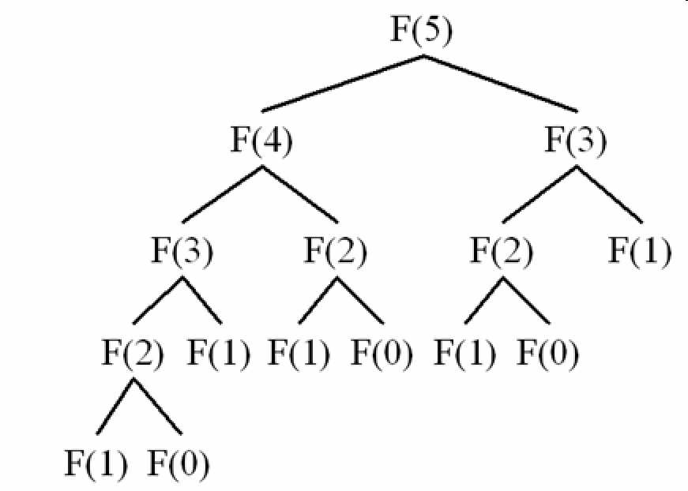

In this article, we will learn how to solve Dynamic Programming problems, and which steps to apply for it. It will make our thought clearly about the road that we have to go.

<br>

## Table of contents
- [Introduction to DP](#introduction-to-dp)
- [Overlapping Subproblems Property](#overlapping-subproblems-property)
- [Optimal Substructure Property](#optimal-substructure-property)
- [Some steps to solve DP problem](#some-steps-to-solve-dp-problem)

<br>

## Introduction to DP
Dynamic Programming is an algorithmic paradigm that solves a given complex problem by breaking it into subproblems and stores the results of subproblems to avoid computing the same results again.

Dynamic Programming (DP) is a technique that solves some particular type of problems in Polynomial Time. 

Dynamic Programming solutions are faster than exponential brute method and can be easily proved for their correctness. 

<br>

## Overlapping Subproblems Property
Dynamic Programming is mainly used when solutions of same subproblems are needed again and again. 

In dynamic programming, computed solutions to subproblems are stored in a table so that these don’t have to be recomputed. So Dynamic Programming is not useful when there are no common (overlapping) subproblems because there is no point storing the solutions if they are not needed again. 

For example, Binary Search doesn't have common subproblems. If we take an example of following recursive program for **Fibonacci Numbers**, there are many subproblems which are solved again and again.



We can see that the function **F(2)** is being called 2 times. If we would have stored the value of **F(2)**, then instead of computing it again, we could have reused the old stored value.

There are following two different ways to store the values so that these values can be reused:
- Memoization (Top Down)

    The memoized program for a problem is similar to the recursive version with a small modification that it looks into a lookup table before computing solutions. We initialize a lookup array with all initial values as NIL. 
    
    Whenever we need the solution to a subproblem, we first look into the lookup table. If the precomputed value is there then we return that value, otherwise, we calculate the value and put the result in the lookup table so that it can be reused later.

- Tabulation (Bottom Up)

    The tabulated program for a given problem builds a table in bottom up fashion and returns the last entry from table. 
    
    For example, for the same Fibonacci number, we first calculate F(0), then F(1), then F(2), then F(3), and so on. So literally, we are building the solutions of subproblems bottom-up.

<br>

## Optimal Substructure Property
A given problems has **Optimal Substructure Property** if optimal solution of the given problem can be obtained by using optimal solutions of its subproblems.


<br>

## Some steps to solve DP problem

```
Steps to solve a DP
1) Identify if it is a DP problem.
2) Decide a state expression with least parameters.
3) Formulate state relationship.    
4) Do tabulation (or add memoization).
```

- Step 1 : How to classify a problem as a Dynamic Programming Problem?

    - Typically, all the problems that require to maximize or minimize certain quantity or counting problems that say to count the arrangements under certain condition or certain probability problems can be solved by using Dynamic Programming.

    - All dynamic programming problems satisfy the overlapping subproblems property and most of the classic dynamic problems also satisfy the optimal substructure property. Once, we observe these properties in a given problem, be sure that it can be solved using DP.

- Step 2 : Deciding the state

    DP problems are all about state and their transition. This is the most basic step which must be done very carefully because the state transition depends on the choice of state definition you make. So, let’s see what do we mean by the term **state**.

    State A state can be defined as the set of parameters that can uniquely identify a certain position or standing in the given problem. This set of parameters should be as small as possible to reduce state space. 

    So, our first step will be deciding a state for the problem after identifying that the problem is a DP problem. As we know DP is all about using calculated results to formulate the final result.
    
    So, our next step will be to find a relation between previous states to reach the current state.

- Step 3 : Formulating a relation among the states

    This part is the hardest part of for solving a DP problem and requires a lot of intuition, observation and practice.

- Step 4 : Adding memoization or tabulation for the state

    his is the easiest part of a dynamic programming solution. We just need to store the state answer so that next time that state is required, we can directly use it from our memory.

    Another way is to add tabulation and make solution iterative. 

<br>

## 


<br>

## Wrapping up


<br>


Refer:

[https://www.geeksforgeeks.org/solve-dynamic-programming-problem/](https://www.geeksforgeeks.org/solve-dynamic-programming-problem/)

[https://www.geeksforgeeks.org/overlapping-subproblems-property-in-dynamic-programming-dp-1/](https://www.geeksforgeeks.org/overlapping-subproblems-property-in-dynamic-programming-dp-1/)

[https://www.geeksforgeeks.org/optimal-substructure-property-in-dynamic-programming-dp-2/](https://www.geeksforgeeks.org/optimal-substructure-property-in-dynamic-programming-dp-2/)