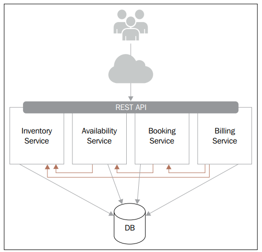

In this tutorial, we will discuss about the endpoint and API response format of RESTful API. These knowledge is ver useful when we want to design API web service scalable.

All of amazing information in this tutorial is referred from **Building a RESTful Web Service with Spring**.

<br>

## Table of contents
- [Introduction to REST](#introduction-to-rest)
- [The endpoint](#the-endpoint)
- [The API response format](#the-api-response-format)
- [Wrapping up](#wrapping-up)


<br>

## Introduction to REST
REST is an acronym of **Representational State Transfer**, and is a software architecture approach for creating scalable web services. The term **REST** was coined by **Roy Fielding** in his PhD dissertation, and revolves around a number of principles. These principles underpin the architecture of RESTful web services.

At the core of REST are resources, and resources are identified using **Uniform Resource Identifier - URIs**. Conceptually, resources are separate from their representation (that is, the format in which they are provided to clients). REST does not mandate any specific format, but typically includes XML and JSON.

Another distinctive property of REST is that clients interact entirely through hypermedia, which is dynamically provided by the application servers. Apart from endpoints, clients need no prior knowledge of how to interact with a RESTful service. This constraint is referred to as **Hypermedia as the Engine of Application State (HATEOAS)**.

REST advocates statelessness. No client state is stored on the server. All the information needed to perform operations is contained in the requests (as part of the URL, request body, or as HTTP header).

RESTful web services must provide caching capabilities. Servers can indicate how and for how long to cache repsonses. Clients can use cached responses instead of contacting the server.

In this article, we will use the architecture that utilize in this book:



- Inventory Service: This component provides the necessary functionality to manage and describe rooms and room types.

- Availability Service: This component lets users see what rooms are available on specific dates.

- Booking Service: This component will be responsible for taking bookings. It will rely on the Inventory Service and Availability Service components to validate bookings.

- Billing Service: Once a booking is made, this component will offer the ability to generate an invoice.

<br>

## The endpoint
We have:

```java
@RestController
@RequestMapping("/rooms")
public class RoomsResource {
    ...

    @RequestMapping(value = "/{roomId}", method = RequestMethod.GET)
    public RoomDTO getRoom(@PathVariable("roomId") String roomId) {
        RoomDTO room = ... 

        // do something

        return room;
    }
}
```

```@org.springframework.web.bind.annotation.RestController``` instruct Spring that ```RoomsResource``` is a controller.

The above code, we can note that: Traditionally, one could expect this controller class to be called ```RoomController```. However, in the RESTful architecture style, the core concept revolves around resources. Therefore, using the ```Resource``` suffix embodies the REST principles more appropriately.

Besides path parameter, we can get request parameter by using ```@org.springframework.web.bind.annotation.RequestParam``` parameter that provides the means to map an HTTP query parameter to a Java method attribute. 

```java
@RequestMapping(method = RequestMethod.GET)
public List<RoomDTO> getRoomsInCategory(@RequestParam("categoryId") long categoryId) {
    ...
}
```

Service designers could also declare this endpoint without using a parameter. For example, the URL pattern could be ```/rooms/categories/{categoryId}```. This approach has the added benefit of improving caching, since not all browsers and proxies cache query parameters.

<br>

## The API response format
It is up to API designers to decide which format best suits their use case. That being said, it is good practice to settle on a common **response envelope format**. With this approach, a RESTful web service provides a uniform interface, enabling the client developers to handle responses in a consistent manner, regardless of the operation being invoked.

- The envelope format

    The first piece of information that is relevant to any operation is whether it was successful. We can encapsulate that information with a status. 

    Secondly, most request will return data. Therefore, a field could provide generic access to the response payload. 

    The following format will form the base of any responses returned by the API:

    ```json
    {
        "status": "OK", 
        "data": {
            ...
        }
    }
    ```

With this response format, we ensure that client developers will have a consistent way to check if a request was successful and access the payload.

- Error management

    Knowing that a request failed is important, so, we should provide some details about why the request failed. 

    For example: 
    - A request could have an invalid parameter value, 
    - A request may not be authorized to perform the operation.

    Error handling is an important aspect of designing a robust and well-documented API. Since most RESTful web services are accessed over HTTP/HTTPS, we can leverage HTTP status codes to categorize errors and provide clues as to what is wrong with a request.

    For example:
    - Servers should be return a 403 HTTP error code if an operation is not permitted, or a 400 HTTP error code if a request parameter is invalid.

    Beyond HTTP response codes, API developers may wish to provide their own error codes in responses to provide service consumers with more clues about why an operation is failing. To facilitate this, we can modify our suggested envelope format to include an error property:

    ```json
    "status": "ERROR",
    "data": null, 
    "error":  {
        "errorCode": 999,
        "description": "..."        
    }
    ```

- Pagination support

    For operations returning a list of resources to be scalable, we need to provide some form of pagination. 

    ```json
    "status": "OK", 
    "data": {
        ...
    }, 
    "error": null, 
    "pageNumber": 1, 
    "nextPage": "http://localhost:8080/rooms?categoryId=1&page=2", 
    "total": 13
    ```

    In addition to the standard properties, we include the page number returned along with the total number of resources available, and a reference to the next page of resources.

- Customize JSON response

    So, in this part, we will use Spring to practice our RESTful API. In Spring, it uses Jackson to perform JSON serialization. Therefore, to customize JSON format, we must configure the Jackson processor. Spring web offers XML-based  or Java-based approaches to handling configuration.
    
    ```java
    @Configuration
    @EnableWebMvc 
    public class JsonConfiguration extends WebMvcConfigurerAdapter {
        @Override
        public void configureMessageConverters(List<HttpMessageConverter<?>> converters) {
            converters.add(new MappingJackson2HttpMessageConverter(
                           new Jackson2ObjectMapperBuilder()
                           .propertyNamingStrategy(PropertyNamingStrategy.CAMEL_CASE_TO_LOWER_CASE_WITH_UNDERSCORES)
                           .serializationInclusion(Include.NON_NULL)
                           .build()));
        }
    }
    ```

    When the application is started, Spring will discover this class, and add our converter, ```MappingJackson2HttpMessageConverter```. We configure this converter to format property names in lower case with underscore, as well as tell Jackson to omit ```null``` properties.

    Before, we have JSON file's content:

    ```json
    {
        "status": "OK", 
        "data": {
            "id": 1,
            "name": "Room 1", 
            "roomCategoryId": 1, 
            "description": "..."
        }, 
        "error": null
    }
    ```

    After configuring for Jackson preprocessor, we have:

    ```json
    {
        "status": "OK", 
        "data": {
            "id": 1,
            "name": "Room 1", 
            "roomCategoryId": 1, 
            "description": "..."
        }        
    }
    ```

    When removing the properties that have ```null``` value, we reduced the size of responses.

    Refer to this [link](https://docs.spring.io/spring/docs/current/javadoc-api/org/springframework/http/converter/json/Jackson2ObjectMapperBuilder.html), we can customize our responses with many options.

- HATEOAS

    

<br>

Thanks for your reading.

<br>

Refer:

[https://restfulapi.net/rest-architectural-constraints/](https://restfulapi.net/rest-architectural-constraints/)

[https://www.oreilly.com/learning/how-to-design-a-restful-api-architecture-from-a-human-language-spec](https://www.oreilly.com/learning/how-to-design-a-restful-api-architecture-from-a-human-language-spec)

[https://en.wikipedia.org/wiki/Representational_state_transfer](https://en.wikipedia.org/wiki/Representational_state_transfer)

[https://blog.cloud-elements.com/restful-architecture-101](https://blog.cloud-elements.com/restful-architecture-101)

[https://dzone.com/refcardz/restful-api-lifecycle-management?chapter=1](https://dzone.com/refcardz/restful-api-lifecycle-management?chapter=1)

[https://dzone.com/refcardz/rest-foundations-restful?chapter=2](https://dzone.com/refcardz/rest-foundations-restful?chapter=2)

[https://dzone.com/articles/interview-rest-author-brian?fromrel=true](https://dzone.com/articles/interview-rest-author-brian?fromrel=true)

[https://dzone.com/articles/restful-services-2?fromrel=true](https://dzone.com/articles/restful-services-2?fromrel=true)

[https://dzone.com/articles/introduction-to-restful-web-service-a-jax-rs-speci?fromrel=true](https://dzone.com/articles/introduction-to-restful-web-service-a-jax-rs-speci?fromrel=true)