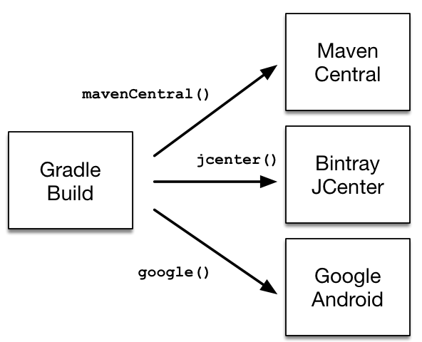
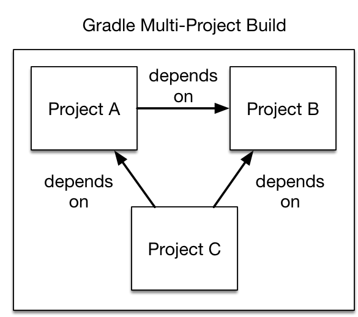
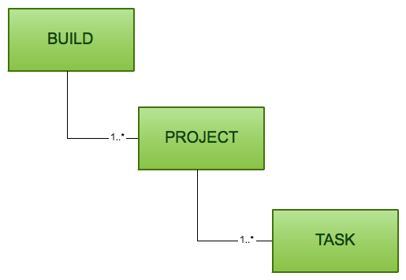
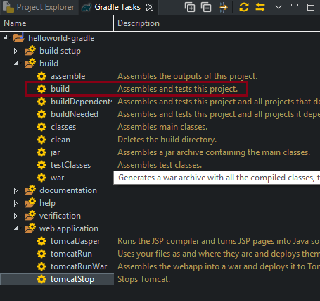
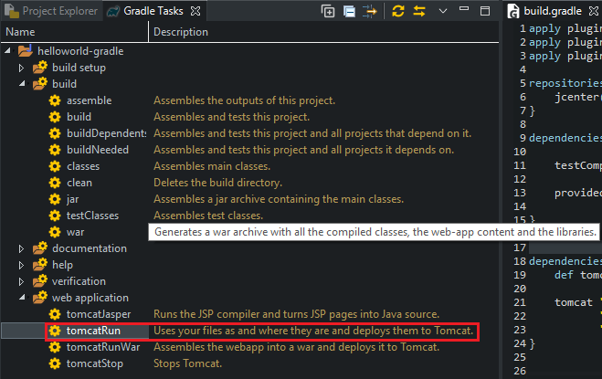
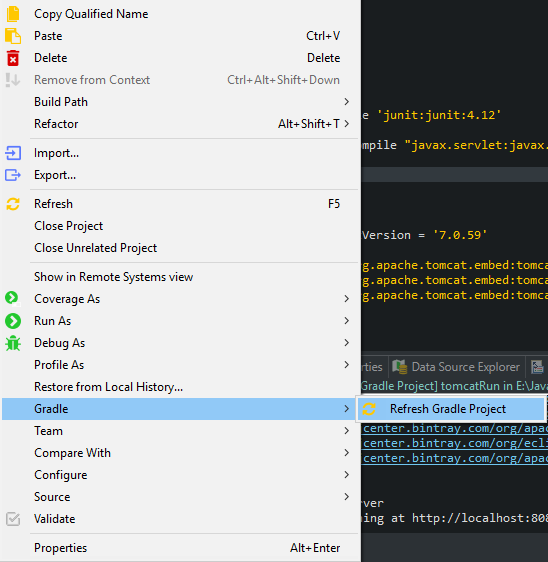

In this tutorial, we will discuss about Gradle to understand how to build our project with it and make our work easier to do. Let's get started.

<br>

## Table of contents
- [Introduction to gradle](#introduction-to-gradle)
- [Setup gradle in our project](#setup-gradle-in-our-project)
- [Some tasks in Gradle](#some-tasks-in-gradle)
- [Understanding build.gradle file](#understanding-build.gradle-file)
- [How dependency resolution work](#how-dependency-resolution-work)
- [Setup Gradle Tomcat plugin](#setup-gradle-tomcat-plugin)
- [Build project with Gradle](#build-project-with-gradle)
- [Run project with Gradle](#run-project-with-gradle)
- [Updating claspath with the latest changes in build.gradle file](#updating-classpath-with-the-latest-changes-in-build.gradle-file)
- [Using JQuery in build.gradle](#using-jquery-in-build.gradle)
- [Configuring the Main class of Jar file](#configuring-the-main-class-of-jar-file)
- [Wrapping up](#wrapping-up)

<br>

## Introduction to gradle
According to ```wikipedia.org```: 

```
Gradle is an open-source build automation system that builds upon the concepts of Apache Ant and Apache Maven and introduces a Groovy-based domain-specific language (DSL) instead of the XML form used by Apache Maven for declaring the project configuration. Gradle uses a ```directed acyclic graph``` ("DAG") to determine the order in which tasks can be run.

Gradle was designed for multi-project builds, which can grow to be quite large. It supports incremental builds by intelligently determining which parts of the build tree are up to date; any task dependent only on those parts does not need to be re-executed. 
```

In the next parts, we will delve into ```build.gradle``` file to understand how to configure our project lonely.

<br>

## Setup gradle in our project
- First way: Download Gradle

    We can download the lastest version of Gradle at [link](https://gradle.org/releases/). After downloaded, we have ```gradle-5.2.1-all.zip``` file.

    Next, we need to create some environment variable for Gradle.
    - Let's pretend that we put gradle folder in ```C:\gradle```.
    - Create system variables ```GRADLE_HOME``` with ```C:\gradle```, and add ```C:\gradle\bin``` to ```PATH```.

- Second way: Setup Buildship for Gradle plugin in Eclipse

    Select ```Help``` --> ```Install New Software...```.

    Select ```Add``` button --> fill in some information:
    - Name: Buildship
    - Location: [http://download.eclipse.org/buildship/updates/e46/releases/1.0/1.0.19.v20160830-1454](http://download.eclipse.org/buildship/updates/e46/releases/1.0/1.0.19.v20160830-1454)

    ```Buildship``` is an Eclipse plugin that allows us to build application and libraries using Gradle through our IDE. The basic functionality of Buildship is well-documented.

    Next, we can setup Buildship in eclipse.

<br>

## Some tasks in Gradle

|          Tasks           |                        Description                    |
| ------------------------ | ----------------------------------------------------- |
| assemble                 | Assembles the outputs of this project.                |
| build                    | Assembles and tests this project.                     |
| buildDependents          | Assembles and tests this project and all projects that depend on it. |
| buildNeeded              | Assembles and tests this project and all projects it depends on. |
| classes                  | Assembles main classes. |
| jar                      | Assembles a jar archive containing the main classes. |
| testClasses              | Assembles test classes. |
| war                      | Generate a war archive with all the compile classes, the web-app content and the libraries. |
| tomcatJasper             | Runs the JSP compiler and turns JSP pages into Java sources. |
| tomcatRun                | Uses our files and where they are and deploys them to Tomcat. |
| tomcatRunWar             | Assembles the webapp into a war and deploys it to Tomcat. |
| tomcatStop               | Stops Tomcat. |

<br>

## Understanding build.gradle file
- Declaring repositories

    - Declaring public-available repository
        
        

        ```java
        respositories {
            jcenter()
            mavenCentral()
            google()
        }
        ```
    - Declaring a custom respository with URL

        Let's pretend that our company will have a repository that use in local. In order to declare this repository in Gradle, we have:

        Repositories with custom URLs can be specified as ```Maven``` or ```Ivy``` repositories by calling the corresponding methods available on the ```RepositoryHandler``` API.

        ```java
        respositories {
            maven {
                url 'http://repo.mycompany.com/maven2'
            }
        }
        ```

    - Declaring multiple repositories 

        This part will be used when some dependencies are only available in one repository but not the other.
        
        ```java
        repositories {
            jcenter()

            maven {
                url "https://maven.springframework.org/release"
            }

            maven {
                url "https://maven.restlet.com"
            }
        }
        ```

        Note: The order of declaration determines how Gradle will check for dependencies at runtime. If Gradle finds a module descriptor in a particular repository, it will attempt to download all of the artifacts for that module from the same repository. You can learn more about the inner workings of ```Gradle’s resolution mechanism```.


    To get more information about declaring repositories, we can refer to the [link](https://docs.gradle.org/current/userguide/declaring_repositories.html#declaring_repositories).

- Declaring dependencies

    - Declaring a concrete version of a dependency

        ```java    
        plugins {
            id 'java-library'
        }

        repositories {
            mavenCentral()
        }

        dependencies {
            implementation 'org.springframework:spring-web:5.0.2.RELEASE'
        }
        ```

        In the above example, we declared a compile-time dependency on the Spring web module by its coordinates: ```org.springframework:spring-web:5.0.2.RELEASE```. Gradle resolves the module including its transitive dependencies from the Maven Central repository and uses it to compile Java source code. The version attribute of the dependency coordinates points to a ```concrete version``` indicating that the underlying ```artifacts``` do not change over time. The use of concrete versions ensure reproducibility for the aspect of dependency resolution.

    - Declaring a dependency without version

        A recommended practice for larger projects is to declare dependencies without versions and use ```dependency constraints``` for version declaration. The advantage is that dependency constraints allow you to manage versions of all dependencies, including transitive ones, in one place.

        ```java
        dependencies {
            implementation 'org.springframework:spring-web'
        }

        dependencies {
            constraints {
                implementation 'org.springframework:spring-web:5.0.2.RELEASE'
            }
        }
        ```

    - Declaring a changing version

        ```java        
        plugins {
            id 'java-library'
        }

        repositories {
            mavenCentral()
            maven {
                url 'https://repo.spring.io/snapshot/'
            }
        }

        dependencies {
            implementation 'org.springframework:spring-web:5.0.3.BUILD-SNAPSHOT'
        }
        ```

        In Maven repositories, changing versions are commonly referred to as snapshot versions. Snapshot versions contain the suffix ```-SNAPSHOT```. By default, Gradle caches changing versions of dependencies for 24 hours.

- Declaring a project dependency

    In a large project, we usually divide it into many components. Each component has a specific functionality. So, in order to link each module to the main project, Gradle has:

    

    The following example declares the dependencies on the ```utils``` and ```api``` project from the ```web-service``` project. The method ```Project.project(java.lang.String)``` creates a reference to a specific subproject by path.

    ```java    
    project(':web-service') {
        dependencies {
            implementation project(':utils')
            implementation project(':api')
        }
    }
    ```

- ```apply plugin: 'java'```

    When we want to create a Java project, we need to apply the [Java plugin](https://docs.gradle.org/2.4/userguide/java_plugin.html).

    Below is the tasks of java plugin that need to know.

    

    So, java plugin will add new conventions such as the default project layout, ... or new tasks, and new properties to our build.

    Consider the case where the Maven directory structure is used for Java sources and resources. These directories are: 
    - src/main/java
    - src/main/resources
    - src/test/java 
    - src/test/resources. 

    In the ```build.gradle```, we have:

    ```java
    apply plugin: 'java'
    ```

    Running gradle build will result in:

    ```java
    > gradle build
    :compileJava
    :processResources
    :classes
    :jar
    :assemble
    :compileTestJava
    :processTestResources
    :testClasses
    :test
    :check
    :build

    BUILD SUCCESSFUL
    ```

    The Java plugin emulates many of the expected Maven lifecycles as tasks in the directed acyclic graph of dependencies for the inputs and outputs of each task. For this simple case, the ```build``` task depends upon the outputs of the ```check``` and ```assemble``` tasks. Likewise, ```check``` depends upon ```test```, and ```assemble``` depends upon ```jar```. 

    For projects that do not follow the Maven conventions, Gradle allows the directory structure to be configured. The following example would support a project that contains source files in ```src/java``` rather than the ```src/main/java``` convention enforced by Maven. 

    In ```build.gradle```, we have:

    ```java
    apply plugin: 'java'
    sourceSets.main.java.srcDirs = ['src/java']
    ```

    or 

    ```java
    sourceSets {
    main {
        java {
            srcDir 'src/java'
        }
        resources {
            srcDir 'src/resources'
        }
    }
}
    ```

- ```sourceSets {}```

    configures the source sets of this project. A ```SourceSetContainer``` manages a set of ```SourceSet``` objects.

    Refer: [SourceDirectorySet](https://docs.gradle.org/current/dsl/org.gradle.api.file.SourceDirectorySet.html)

- ```dependencies {}```

    configures dependencies for this project.

    Refer: [DependencyHandler](https://docs.gradle.org/current/dsl/org.gradle.api.artifacts.dsl.DependencyHandler.html)

    |     Configuration       |      Extends      |     Used by task    |          Description        |
    | ----------------------- | ----------------- | ------------------- | --------------------------- |
    | compile                 | | compileJava | These are the dependencies needed at compile time to compile the source files. |
    | runtime                 | compile | | These are the dependencies for runtime of the application, but are not needed for compilation. |
    | testCompile             | compile | compileTestJava | These are all the dependencies to compile test source files. |
    | testRuntime             | testCompile | test | These are all the dependencies needed to run the tests. |
    | archives                |  | uploadArchives | This contains artifacts, such as JAR files created by the project. |
    | default                 | runtime | | This is the default configuration that contains all runtime dependencies. |
    

- ```buildScript {}```

    configures the build script classpath

    Refer: [ScriptHandler](https://docs.gradle.org/current/javadoc/org/gradle/api/initialization/dsl/ScriptHandler.html)

- ```repositories {}```

    configure the repositories for this project.    

    Refer: [RepositoryHandler](https://docs.gradle.org/current/dsl/org.gradle.api.artifacts.dsl.RepositoryHandler.html)

<br>

## How dependency resolution work
Gradle takes your dependency declarations and repository definitions and attempts to download all of your dependencies by a process called dependency resolution. Below is a brief outline of how this process works.

- Given a required dependency, Gradle attempts to resolve the dependency by searching for the module the dependency points at. Each repository is inspected in order. Depending on the type of repository, Gradle looks for metadata files describing the module (.module, .pom or ivy.xml file) or directly for artifact files.

    - If the dependency is declared as a dynamic version (like 1.+, [1.0,), [1.0, 2.0)), Gradle will resolve this to the highest available concrete version (like 1.2) in the repository. For Maven repositories, this is done using the maven-metadata.xml file, while for Ivy repositories this is done by directory listing.

    - If the module metadata is a POM file that has a parent POM declared, Gradle will recursively attempt to resolve each of the parent modules for the POM.

- Once each repository has been inspected for the module, Gradle will choose the 'best' one to use. This is done using the following criteria:

    - For a dynamic version, a 'higher' concrete version is preferred over a 'lower' version.

    - Modules declared by a module metadata file (.module, .pom or ivy.xml file) are preferred over modules that have an artifact file only.

    - Modules from earlier repositories are preferred over modules in later repositories.

    - When the dependency is declared by a concrete version and a module metadata file is found in a repository, there is no need to continue searching later repositories and the remainder of the process is short-circuited.

- All of the artifacts for the module are then requested from the same repository that was chosen in the process above.

The dependency resolution process is highly customizable to meet enterprise requirements.

<br>

## Setup Gradle Tomcat plugin
Each time when we want to deploy our project on a server, we have to turn project into war file, and manually run it on server based on command line or something like that. I think that it is highly inconvenient. 

So, to make it automatically, we need to install a Tomcat plugin to Eclipse. Therefore, when we build a project via Gradle task, our project will be deployed on a Tomcat server.

To install Gradle Tomcat plugin, we need insert some code into ```build.gradle``` file:

```java
apply plugin: 'com.bmuschko.tomcat'
apply plugin: 'eclipse-wtp'


buildscript {
       repositories {
             jcenter()
       }
       dependencies {
             classpath 'com.bmuschko:gradle-tomcat-plugin:2.4.1'
       }
}

dependencies {
         def tomcatVersion = '8.0.46'
         tomcat "org.apache.tomcat.embed:tomcat-embed-core:${tomcatVersion}",
         "org.apache.tomcat.embed:tomcat-embed-logging-juli:${tomcatVersion}",
         "org.apache.tomcat.embed:tomcat-embed-jasper:${tomcatVersion}"
         api 'org.apache.commons:commons-math3:3.6.1'
}

tomcat {
         httpPort = 8080
         enableSSL = true
         contextPath = '/library-spring'
}
```

<br>

## Build project with Gradle
- Gradle has two basic concepts: projects and tasks.
    
    - A project is either something we build (e.g. a jar file) or do (deploy our application to production environment). A project consists of one or more tasks.

    - A task is an atomic unit work which is performed our build (e.g. compiling our project or running tests).

    --> Every ```Gradle build``` contains one or more projects.

    

    We can configure ```Gradle build``` with:
    - ```build.gradle```: specifies a project and tasks.
    - ```gradle.properties```: configure the properties of the build.
    - ```settings.gradle```: is optional in a build which has only one project. If our Gradle build has more than one projects, it is mandatory because it describes which projects participate to our build. Every multi-project build must have a settings file in the root project of the project hierarchy.

- First way: Use Gradle Tasks View

    If you do not see the ```Gradle Tasks``` View, you can get it from ```Window``` --> ```Show View``` --> ```Other``` --> Search ```gradle``` --> Select ```Gradle Tasks```.

    In ```Gradle Tasks``` View, select ```build``` tasks in folder ```build```, right click --> ```Run Gradle Tasks```.

    

<br>

## Run project with Gradle
In ```Gradle Tasks``` View, select our current project --> select ```web application``` folder --> select ```tomcatRun``` tasks --> right click --> ```Run Gradle Tasks```.




<br>

## Updating claspath with the latest changes in build.gradle file
Eclipse does not automatically update the ```classpath```, if the ```build.gradle``` file is updated. Select ```Gradle``` --> ```Refresh Gradle Project``` from the context menu of the project or from your ```build.gradle``` file for that.



<br>

## Using JQuery in build.gradle

    ```java    
    repositories {
        ivy {
            url 'https://ajax.googleapis.com/ajax/libs'
            patternLayout {
                artifact '[organization]/[revision]/[module](.[classifier]).[ext]'
            }
        }
    }

    configurations {
        js
    }

    dependencies {
        js 'jquery:jquery:3.2.1:min@js'
    }
    ```

<br>

## Configuring the Main class of Jar file
The Java plugin adds a jar task to our project, and every jar object has a ```manifest``` property which is an instance of Manifest.

Using ```attributes()``` method of the Manifest interface will configure the main class of the jar file.

We can refer to this [link](https://docs.oracle.com/javase/tutorial/deployment/jar/manifestindex.html), to understand more deeper about configuring Manifest file.

```java
apply plugin: 'java'
 
jar {
    manifest {
        attributes 'Main-Class': 'com.manhpd.tutorial.HelloWorld'
    }
}
```

<br>

## Wrapping up
- Understanding what we need to run project with Gradle.


<br>

Refer:

**Plugins in Gradle**

[https://docs.gradle.org/2.4/userguide/plugins.html](https://docs.gradle.org/2.4/userguide/plugins.html)

<br>

**Configure task build in Gradle**

[https://docs.gradle.org/2.4/userguide/tutorial_using_tasks.html](https://docs.gradle.org/2.4/userguide/tutorial_using_tasks.html)

[https://docs.gradle.org/current/dsl/org.gradle.api.Project.html#org.gradle.api.Project:configurations(groovy.lang.Closure)](https://docs.gradle.org/current/dsl/org.gradle.api.Project.html#org.gradle.api.Project:configurations(groovy.lang.Closure))

[https://gradle.org/training/](https://gradle.org/training/)

[https://guides.gradle.org/building-java-web-applications/](https://guides.gradle.org/building-java-web-applications/)

[https://medium.com/@wkrzywiec/setting-up-gradle-spring-project-in-eclipse-on-tomcat-server-77d68454fd8d](https://medium.com/@wkrzywiec/setting-up-gradle-spring-project-in-eclipse-on-tomcat-server-77d68454fd8d)

[https://github.com/bmuschko/gradle-tomcat-plugin](https://github.com/bmuschko/gradle-tomcat-plugin)

[https://www.vogella.com/tutorials/EclipseGradle/article.html](https://www.vogella.com/tutorials/EclipseGradle/article.html)

[https://www.tutorialspoint.com/gradle/gradle_eclipse_integration.htm](https://www.tutorialspoint.com/gradle/gradle_eclipse_integration.htm)

[https://www.journaldev.com/7971/gradle](https://www.journaldev.com/7971/gradle)

[https://docs.gradle.org/current/userguide/introduction_dependency_management.html#sub:file_dependencies](https://docs.gradle.org/current/userguide/introduction_dependency_management.html#sub:file_dependencies)

[https://docs.gradle.org/current/userguide/declaring_repositories.html#declaring_repositories](https://docs.gradle.org/current/userguide/declaring_repositories.html#declaring_repositories)

