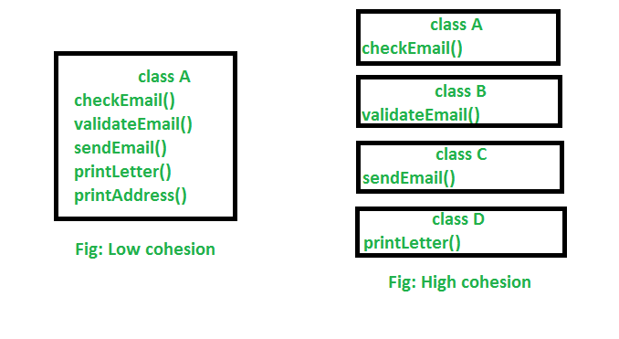

In this article, we will discuss about coupling and cohesion in OOP, mainly because understanding about them is really useful to improve coding skill and some skills about designing architecture.

<br>

## Table of contents
- [Cohesion](#cohesion)
- [Coupling](#Coupling)
- [Difference between cohesion and coupling](#difference-between-cohesion-and-coupling)
- [Refactoring our code with loose coupling and high cohesion](#refactoring-our-code-with-loose-coupling-and-high-cohesion)

<br>

## Cohesion
1. Definition of cohesion

    According to [wikipedia.org](https://en.wikipedia.org/wiki/Cohesion_(computer_science)), we have definition of cohesion:

    ```
    In computer programming, cohesion refers to the degree to which the elements inside a module belong together. In one sense, it is a measure of the strength of relationship between the methods and data of a class and some unifying purpose or concept served by that class. In another sense, it is a measure of the strength of relationship between the class's method and data themselves.
    ```

    Or we have the other definition:

    ```
    Cohesion represents the clarity of the responsibilities of a module.
    ```

    --> So, cohesion focuses on how single module/class is designed. Higher the cohensiveness of the module/class, better is the OO design.

    If our module performs one task and nothing else or has a clear purpose, our module has high cohesion. On the other hand, if our module tries to encapsulate more than one purpose or has an unclear purpose, our module has low cohesion.

    Modules with high cohesion tend to be preferable, simple because high cohesion is associated with several desirable traits of software including **robustness**, **reliability**, and **understandability**.

    Low cohesion is associated with undesirable traits such as being **difficult to maintain, test, reuse, or even understand**.

    Cohesion is often contrasted with coupling. High cohesion often correlates with loose coupling, and vice versa.

    **Single Responsibility Principle** aims at creating highly cohesive classes.

    Cohesion is increased if:
    - The functionalities embedded in a class, accessed through its methods, have much in common.
    - Methods carry out a small number of related activities, by avoiding coarsely grained or unrelated sets of data.

2. The history of Cohesion concept

    The coupling and cohesion were invented by **Larry Constantine** in the late **1960s** as part of Structured Design, based on characteristics of good programming practices that reduced maintainenance and modification costs. 
    
    Structured Design, cohesion and coupling were published in the article Stevens, Myers & Constantine (1974) and the book Yourdon & Constantine (1979), the latter two subsequently became standard terms in software engineering.

3. Advantages of high cohesion

    - Reduced module complexity (they are simpler, having fewer operations).
    - Increased system maintainability, because logical changes in the domain affect fewer modules, and because changes in one module require fewer changes in other modules.
    - Increased module reusability, because application developers will find the component they need more easily among the cohesive set of operations provided by the module.

4. For example about cohesion

    

    We can see that in low cohesion, only one class is responsible for executing a lot of jobs which are not in common. It will reduce the chance of reusability and maintaince. 

    In high cohesion, there is a separate class for all the jobs to execute a specific job, which result better usability and maintaince.

    --> So, we have:
    - High cohesion is when we have a class that does a well defined job. Low cohesion is when a class does a lot of jobs that don’t have much in common.
    - High cohesion gives us better maintaining facility and Low cohesion results in monolithic classes that are difficult to maintain, understand and reduces re-usability

    For example:

    ```java
    public class Person {
        private int     age;
        private String  name;

        // getter, setter properties.

        // method
        public void readInfor();

        public void writeInfor();
    }
    ```

    The ```Person``` class has low cohesion, simply because Person's responsibilities is relevant to save information about people. It do not relate to functionalities about read/write to file. So, to reduce low cohension, we should separate the implementation about read/write file into other class such as File, ...

5. Types of cohesion

    There are some types of cohesion that we need to know:
    - ```Coincidental cohesion``` (worst)

        Coincidental cohesion is when parts of a module are grouped arbitrarily; the only relationship between the parts is that they have been grouped together.

        For example: **Utilities** class.

    - ```Logical cohesion```

        Logical cohesion is when parts of a module are grouped because they are logically categorized to do the same thing even though they are different by nature.

        For example: grouping all mouse and keyboard input handling routines.

    - ```Temporal cohesion```

        Temporal cohesion is when parts of a module are grouped by when they are processed - the parts at a particular time in program execution.

        For example: A function which is called after catching an exception which closes open files, creates an error log, and notifies the user.

    - ```Procedural cohesion```

        Procedural cohesion is when parts of a module are grouped because they always follow a certain sequence of execution.

        For example: a function which checks file permissions and then opens the file.

    - ```Communicational / Informal cohesion```

        Communicational cohesion is when parts of a module are grouped because they operate on the same data.

        There are cases where communicational cohesion is the highest level of cohesion that can be attained under the circumstances.

        For example: a module which operates on the same record of information.

    - ```Sequential cohesion```

        Sequential cohesion is when parts of a module are grouped because the output from one part is the input to another part like an assembly line.

        For example: a function which reads data from a file and processes the data.

    - ```Functional cohesion``` (best)

        Functional cohesion is when parts of a module are grouped because they all contribute to a single well-defined task of the module.

        While functional cohesion is considered the most desirable type of cohesion for a software module, it may no be achievable.

        For example:

        ```java
        Module A {
            /*
            Implementation of arithmetic operations
            This module is said to have functional cohesion because 
            there is an intention to group simple arithmetic operations
            on it. 
            */
            a(x, y) = x + y
            b(x, y) = x * y
        }

        Module B {
            /*
            Module B: Implements r(x) = 5x + 3
            This module can be said to have atomic cohesion. The whole
            system (with Modules A and B as parts) can also be said to have functional
            cohesion, because its parts both have specific separate purposes. 
            */
            r(x) = [Module A].a([Module A].b(5, x), 3)
        }
        ```

    - Perfect cohesion (atomic)

        For example:

        ```java
        Module A {
            /* 
            Implementation of r(x) = 2x + 1 + 3x + 2
            It´s said to have perfect cohesion because it cannot be reduced any more than that.
            */
            r(x) = 5x + 3
        }
        ```

<br>

## Coupling
1. Definition

    According to [wikipedia.org](https://en.wikipedia.org/wiki/Coupling_(computer_programming)), we have a definition of coupling:

    ```
    Coupling is the degree of interdependence between software modules; a measure of how closely connected two routines or modules are; the strength of the relationships between modules.
    ```

    Coupling increases between two classes A and B if:
    - A has an attribute that refers to (is of type) B.
    - A calls on services of an object B.
    - A has a method that reference B (via return type or parameter).
    - A is a subclass of (or implements) class B.

    Low coupling refers to a relationship in which one module interacts with another module through a simple and stable interface and does not need to be concerned with the other module's internal implementation

    

2.  Some properties that need to consider in coupling

    In Coupling, we need to consider some properties:
    - Degree 

        Degree is the number of connections between the module and others. With coupling, we want to keep the degree small. For instance, if the module needed to connect to other modules through a few parameters or narrow interfaces, then the degree would be small, and coupling would be loose. 

    - Ease

        Ease is how obvious are the connections between the module and others. With coupling, we want the connections to be easy to make without needing to understand the implementations of the other modules.

    - Flexibility

        Flexibility is how interchangeable the other modules are for this module. With coupling, we want the other modules easily replaceable for something better in the future.

3. Disadvantages of tightly coupling

    - A change in one module usually forces a ripple effect of changes in other modules.

    - Assembly of modules might require more effort or time due to the increased inter-module dependency.

    - A particular module might be harder to reuse or test because dependent modules must be included.

4. Types of coupling
    In procedural programming, we have:
    - ```Content coupling``` (high)

        Content coupling is said to occur when one module uses the code of other module, for instance a branch. This violates information hiding - a basic design concept.

    - ```Common coupling```

        Common coupling is said to occur when several modules have access to the same global data. But it can lead to uncontrolled error propagation and unforeseen side-effects when changes are made.

    - ```External coupling```

        External coupling occurs when two modules share an externally imposed data format, communication protocol, or device interface. This is basically related to the communication to external tools and devices.

    - ```Control coupling```

        Control coupling is one module controlling the flow of another, by passing it information on what to do

        For example: passing a what-to-do flag.

    - ```Stamp coupling``` (data-structured coupling)

        Stamp coupling occurs when modules share a composite data structure and use only parts of it, possibly different parts(E.g: passing a whole record to a function that needs only one field of it).

        In this situation, a modification in a field that a module does not need may lead to changing the way the module reads the record.

    - ```Data coupling```

        Data coupling occurs when modules share data through, for example, parameters. Each datum is an elementary piece, and these are the only data shared (Ex: passing an integer to a function that computes a square root).

<br>

In OOP, we have:
- Subclass coupling

    Describes the relationship between a child and its parent. The child is connected to its parent, but the parent is not connected to the child.

- Temporal coupling

    When two actions are bundled together into one module just because they happen to occur at the same time.

- Dynamic coupling

    The goal of this type of coupling is to provide a run-time evaluation of a software system. It has been argued that static coupling metrics lose precision when dealing with an intensive use of dynamic binding or inheritance. In the attempt to solve this issue, dynamic coupling measures have been taken into account.

- Semantic coupling

    This kind of coupling considers the conceptual similarities between software entities using, for example, comments and identifiers and relying on techniques.

- Logical coupling

    Logical coupling exploits the release history of a software system to find change patterns among modules or classes.

    For example: Entities that are likely to be changed or sequences of changes (a change in a class A is always followed by a change in a class B).

--> So, one approach to decreasing coupling is functional design, which seeks to limit the responsibilities of modules along functionality.

<br>

## Difference between cohesion and coupling

Below is a table that depict about difference between cohesion and coupling

|           Cohesion          |                  Coupling                |
| --------------------------- | ---------------------------------------- |
| Cohesion is the indication of the relationship within module | Coupling is the indication of the relationships between modules |
| Cohesion shows the module's relative functional strength | Coupling shows the relative independence among the modules |
| Cohesion is a degree (quality) to which a component / module focuses on the single thing | Coupling is a degree to which a component / module is connected to the other modules |
| While designing we should strive for high cohesion. Ex: cohesive component/module focus on a single task with little interaction with other modules of the system | While designing we should strive for low coupling. Ex: dependency between modules should be less |
| Cohesion is the kind of natural extension of data hiding, for example, class having all members visible with a package having default visibility | Making private fields, private methods and non public classes provides loose coupling |
| Cohesion is Intra – Module Concept | Coupling is Inter -Module Concept |

<br>

## Refactoring our code with loose coupling and high cohesion


<br>

Thanks for your reading.

<br>

Refer:

[Object-Oriented Analysis, Design and Implementation, 2nd Edition]()

[https://gravitymodel.net/core-software-principles/](https://gravitymodel.net/core-software-principles/)

[https://en.wikipedia.org/wiki/Cohesion_(computer_science)](https://en.wikipedia.org/wiki/Cohesion_(computer_science))

[https://freefeast.info/difference-between/difference-between-cohesion-and-coupling-cohesion-vs-coupling/](https://freefeast.info/difference-between/difference-between-cohesion-and-coupling-cohesion-vs-coupling/)

[https://sanaulla.info/2008/06/26/cohesion-and-coupling-two-oo-design-principles/](https://sanaulla.info/2008/06/26/cohesion-and-coupling-two-oo-design-principles/)

[https://www.infoworld.com/article/2949579/design-for-change-coupling-and-cohesion-in-object-oriented-systems.html](https://www.infoworld.com/article/2949579/design-for-change-coupling-and-cohesion-in-object-oriented-systems.html)

[https://www.geeksforgeeks.org/cohesion-in-java/](https://www.geeksforgeeks.org/cohesion-in-java/)

[https://freefeast.info/difference-between/difference-between-cohesion-and-coupling-cohesion-vs-coupling/](https://freefeast.info/difference-between/difference-between-cohesion-and-coupling-cohesion-vs-coupling/)

[http://www.cems.uwe.ac.uk/~jsa/UMLJavaShortCourse09/CGOutput/Unit3/unit3(0809)/page_16.htm](http://www.cems.uwe.ac.uk/~jsa/UMLJavaShortCourse09/CGOutput/Unit3/unit3(0809)/page_16.htm)

[https://www.decodejava.com/coupling-cohesion-java.htm](https://www.decodejava.com/coupling-cohesion-java.htm)

[https://www.aivosto.com/project/help/pm-oo-cohesion.html](https://www.aivosto.com/project/help/pm-oo-cohesion.html)