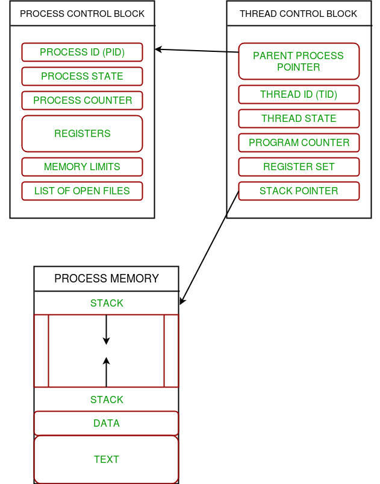

When we want to improve the performance of system, there are many ways to enhance performance such as architecture design, optimization algorithms, ... But we can immediately think about multithread at first. 

So, in this article, we will find something out about multithreading in C++, how to know difference between process and thread, how to create thread in C++, ...

<br>

## Table of contents
- [Introduction to multithread](#introduction-to-multithread)
- [The difference between process and thread](#the-difference-between-process-and-thread)
- [Launching a thread](#launching-a-thread)
- [Transferring ownership of a thread](#transferring-ownership-of-a-thread)
- [How std::thread.join() do](how-std::thread-join()-do)
- [Disadvantages when using join() method](#disadvantages-when-using-join()-method)


<br>

## Introduction to multithread
Before, going deeper into multithreading, we need to understand about the concept - process. 

```
In computing, a process is the instance of a computer program that is being executed. It contains the program code and its activity. Depending on the OS, a process may be made up of multiple threads of execution that execute instructions concurrently.
```

According to the [wikipedia.org](https://en.wikipedia.org/wiki/Multithreading_(computer_architecture)), we have the definition of thread:

```
In computer science, a thread of execution is the smallest sequence of programmed instructions that can be managed independently by a scheduler,which is typically a part of the operating system. 

The implementation of threads and processes differs between operating systems, but in most cases a thread is a component of a process. Multiple threads can exist within one process, executing concurrently and sharing resources such as memory, while different processes do not share these resources. 

In particular, the threads of a process share its executable code and the values of its dynamically allocated variables and non-thread-local global variables at any given time. 
```

A thread can contains all this information in a **Thread Control Block (TCB)**:
- **Thread Identifier**: Unique id (TID) is assigned to every new thread.
- **Stack pointer**: points to thread's stack in the process. Stack contains the local variables under thread's scope.
- **Program counter**: a register which stores the address of the instruction currently being executed by thread.
- **Thread state**: can be running, ready, waiting, start or done.
- **Thread's register set**: registers assigned to thread for computations.
- **Parent processs Pointer**: A pointer to the Process control block (PCB) of the process that the thread lives on.




<br>

## The difference between process and thread

Below is a table that describe the difference between them.

|          Type           |         Process        |             Thread              |
| ----------------------- | ---------------------- | ------------------------------- |
| Definition              | A process is a program under execution | A thread is a lightweight process that can be managed independently by a scheduler |
| Context switching time  | Processes require more time for context switching as they are more heavy | Threads require less time for context switching as they are lighter than processes |
| Memory Sharing          | Processes are totally independent and don't share memory | A thread may share some memory with its peer threads |
| Communication           | Communication between processes requires more time than between threads | Communication between threads requires less time than between processes |
| Blocked                 | If a process get blocked, remaining processes can continue execution | If a user level thread gets blocked, all of its peer threads also get blocked |
| Resource consumption    | Processes require more than resouces than threads | Threads generally need less resources than processes |
| Dependency              | Individual processes are independent data and code segments | Threads are parts of a process and so are dependent |
| Data and Code sharing   | Processes have independent data and code segments | A thread shares the data segment, code segment, files, ... with its peer threads |
| Treatment by OS         | All the different processes are treated separately by the operating system | All user level peer threads are treated as a single task by the operating system |
| Time for termination    | Processes require more time for termination | Threads require less time for termination |


<br>

## Launching a thread
- With normal function

    Assuming that we have:

    ```C++
    void hello() {
        std::cout << "Hello, world with multithread.";
    }

    std::thread t(hello);
    t.join();
    //t.detach();
    ```

    or 

    ```C++
    void printSomething(const std::string& strInput) {
        std::cout << strInput << "\n";
    }

    std::thread t(printSomething, "hello");
    ```

    So, we will embed a name of function to the constructor of ```std::thread``` like the above sample. And it's important to bear in mind that by default the arguments are copied into internal storage, where they can be accessed by the newly created thread of execution, even if the correponding parameter in the function is expecting a reference.

    The reason for this is that the arguments may need to outlive the calling thread, copying the arguments guarantees that. Instead, if we want to really pass a reference, we can use a ```std::reference_wrapper``` created by ```std::ref```.

    ```C++
    std::thread (foo, std::ref(arg1));
    ```  

    By doing this, we are promising that you will take care of guaranteeing that the arguments will still exist when the thread operates on them.

    Note that all the things mentioned above can also be applied to std::async and std::bind.

- With function object

    ```C++
    class background_task {
        public: 
            void operator() {
                do_something();
                do_something_else();
            }
    };

    background_task f;
    std::thread thBackgroundTask(f);
    ```

    The above function object ```f``` is copied into the storage belonging to the newly created thread of execution and invoked from there. It's therefore essential that the copy behave equivalently to the original, or the result may not be what's expected.

- With lambda expression

    Based on the sample in ```With function object```, we have:

    ```C++
    std::thread th([](){
        do_something();
        do_something_else();
    });
    ```

    or 

    ```C++
    class blub {
    private:
        void test() {}
    public:
        std::thread spawn() {
            return std::thread( [this] { this->test(); } );
        }
    };
    ```

    Since ```this->``` can be omitted, it could be shorten to:

    ```C++
    std::thread( [this]{ test(); } );
    ```

    or just

    ```C++
    std::thread( [=] { test(); } );
    ```

- With a method in class

    ```C++
    class test
    {
    public:
        void hello()
        {
            std::cout << "Hello, everyone.\n";
        }
    };

    std::thread t(&test::hello, test());

	t.join();
    ```

    So, to pass a method into a thread, we must specify what class and a object of this class that this method lie.

    The above syntax is defined in terms of the ```INVOKE``` definition:

    ```
    Define INVOKE(f, t1, t2, ..., tN) as follows:
    - (t1.*f)(t2, ..., tN) when f is a pointer to a member function of a class T and t1 is an object of type T or a reference to an object of type T or a reference to an object of a type derived from T;
    - ((*t1).*f)(t2, ..., tN) when f is a pointer to a member function of a class T and t1 is not one of the types described in the previous item;
    - t1.*f when N == 1 and f is a pointer to member data of a class T and t 1 is an object of type T or a reference to an object of type T or a reference to an object of a type derived from T;
    - (*t1).*f when N == 1 and f is a pointer to member data of a class T and t 1 is not one of the types described in the previous item;
    - f(t1, t2, ..., tN) in all other cases.
    ```

--> Once we've started our thread, we need to explicitly decide whether to wait for it to finish (by joining with it) or leave it to run on its own (by detaching it). If we don't decide before the ```std::thread``` object is destroyed, then our program is terminated (the ```std::thread``` destructor calls ```std::terminate()```).

We only have to make this decision before the ```std::thread``` object is destroyed - the thread itself may well have finished long before we join with it or detach it, and if we detach it, then the thread may continue running long after the ```std::thread``` object is destroyed.

And we have a difference between using ```mutex``` and ```join()``` method:

```
join() stops current thread until another one finishes. mutex stops current thread until mutex owner releases it or locks right away if it isn't locked.
```

<br>

## Transferring ownership of a thread
- Context's problem

    - We want to write a function that creates a thread to run in the background but passes back ownership of the new thread to the calling function rather than waiting for it to complete.

    - Create a thread and pass ownership in to some functions that should wait for it to complete.

- Solution

    Use ```std::move()``` method with ```std::thread``` object.

    If ownership should be transferred into a function, it can just accept an instance of ```std::thread``` by value as one of the parameters.

    ```C++
    void f(std::thread t);

    void g() {
        void some_function();
        f(std::thread(some_function));

        std::thread t(some_function);
        f(std::move(t));
    }
    ```

    One benefit of the move support of ```std::thread``` is that we can build on the class is taken advantages of RAII paradigm. This avoids any unpleasant consequences should the RAII class's object outlive the thread it was referencing, and it also means that no one else can join or detach the thread once ownership has been transferred into the object.

    ```C++
    class scope_thread {
    private:
        std::thread t;

    public:
        explicit scoped_thread(std::thread t_) : t(std::move(t_)) {
            if (!t.joinable()) {
                throw std::logic_error("No thread");
            }
        }

        ~scoped_thread() {
            t.join();
        }

        scoped_thread(scoped_thread const&) =delete;
        scoped_thread& operator=(scoped_thread const&) =delete;
    };

    struct func;

    void f() {
        int some_local_state;
        scoped_thread t(std::thread(func(some_local_state)));

        do_something_in_current_thread();
    }
    ```

    Another benefit of the move support ```std::thread``` is to allow for containers of std::thread objects, if those containers are move aware.

    ```C++
    void do_work(unsigned id);

    void f() {
        std::vector<std::thread> threads;
        for (unsigned i = 0; i < 20; ++i) {
            threads.push_back(std::thread(do_work, i));
        }

        std::for_each(threads.begin(), threads.end(), std::mem_fn(&std::thread::join));
    }
    ```

<br>

## How std::thread.join() do
According to [en.cppreference.com](https://en.cppreference.com/w/cpp/thread/thread/join), we have information about ```join()``` method:

```
Blocks the current thread until the thread identified by *this finishes its execution.

The completion of the thread identified by *this synchronizes with the corresponding successful return from join().

No synchronization is performed on *this itself. Concurrently calling join() on the same std::thread object from multiple threads constitutes a data race that results in undefined behavior. 
```

So, in reality, when using ```join()``` method, **current thread will be blocked until thread identified by *this finishes its execution**,  do we need to use ```mutex.lock()```?

--> We still need mutexes and conditions. Joining a thread makes one thread of execution wait for another thread to finish running. We still need mutexes to protect shared resources. It allows main() in this example to wait for all threads to finish before quitting itself.

```C++
#include <iostream>
#include <thread>
#include <chrono>
#include <mutex>

using namespace std;

int global_counter = 0;
std::mutex counter_mutex;

void five_thread_fn(){
    for(int i = 0; i<5; i++){
        counter_mutex.lock();
        global_counter++;
        counter_mutex.unlock();
        std::cout << "Updated from five_thread"  << endl;
        std::this_thread::sleep_for(std::chrono::seconds(5));
    }
    //When this thread finishes we wait for it to join
}

void ten_thread_fn(){
    for(int i = 0; i<10; i++){
        counter_mutex.lock();
        global_counter++;
        counter_mutex.unlock();
        std::cout << "Updated from ten_thread"  << endl;
        std::this_thread::sleep_for(std::chrono::seconds(1));
    }
    //When this thread finishes we wait for it to join
}
int main(int argc, char *argv[]) {
    std::cout << "starting thread ten..." << std::endl;
    std::thread ten_thread(ten_thread_fn);

    std::cout << "Running ten thread" << endl;
    std::thread five_thread(five_thread_fn);


    ten_thread.join();
    std::cout << "Ten Thread is done." << std::endl;
    five_thread.join();
    std::cout << "Five Thread is done." << std::endl;
}
```

```
starting thread ten...
Running ten thread
Updated from ten_thread
Running five_thread
Updated from ten_thread
Updated from ten_thread
Updated from ten_thread
Updated from ten_thread
Updated from five_thread
Updated from ten_thread
Updated from ten_thread
Updated from ten_thread
Updated from ten_thread
Updated from ten_thread
Updated from five_thread
Ten Thread is done.
Updated from five_thread
Updated from five_thread
Five Thread is done.
```

Since std::cout is a shared resource access and use of it should also be mutex protected too.

<br>

## Disadvantages when using join() method
- Encourages continual creating/terminating/destroying of threads, so hammering performance and increasing the probabilty of leaks, thread-runaway, memory-runaway and general loss-of-control of your app.

- Stuffs GUI event-handlers by enforcing unwanted waits, resulting in unresponsive 'hourglass apps' that your customers will hate.

- Causes apps to fail to shutdown because they are waiting for the termination of an unresposive, uninterruptible thread.

- Other bad things.

<br>

Thanks for your reading.

<br>

Refer:

Some keywords to need to understand: pools, tasks, app-lifetime threads, inter-thread comms via producer-consumer queues.

[https://www.geeksforgeeks.org/multithreading-python-set-1/](https://www.geeksforgeeks.org/multithreading-python-set-1/)

[https://stackoverflow.com/questions/10673585/start-thread-with-member-function](https://stackoverflow.com/questions/10673585/start-thread-with-member-function)

[https://stackoverflow.com/questions/15148057/what-does-stdthread-join-do](https://stackoverflow.com/questions/15148057/what-does-stdthread-join-do)

[https://www.tutorialspoint.com/difference-between-process-and-thread](https://www.tutorialspoint.com/difference-between-process-and-thread)