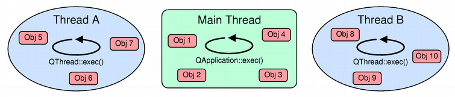

When I work with multithreading in Qt at the first time, I feel it really confused with the concepts Signal/Slot. I always have some error about that it can not create threads in QtNetworkManager thread. 

So, in this article, we will discuss about multithreadin in Qt. To go through this article, we will look forward you can easily grasp all of things about multithreading in Qt.

<br>

## Table of contents
- [Introduction to Multithreading in Qt](#introduction-to-multithreading-in-qt)\
- [How to use multithread in Qt](#how-to-use-multithread-in-qt)
- [When to use alternatives to Threads](#when-to-use-alternatives-to-threads)
- [Passing argument to a SLOT](#passing-argument-to-a-slot)
- [How to call Slot in a thread from different thread](#how-to-call-slot-in-a-thread-from-different-thread)
- [Wrapping up](#wrapping-up)


<br>

## Introduction to Multithreading in Qt
In Qt, it has own cross-platform implementation of threading. The structure about multithreading in Qt is not as same as multithreading in C++. Qt provides some new features for multithreading such as signal / slot, event loop in each thread, ...

As we have already known in Qt, each program has one thread when it is started. This thread is called the ```main thread``` or ```GUI thread``` in Qt applications. The Qt GUI must run in this thread. All widgets and several related classes, for example ```QPixmap```, do not work in secondary threads. A secondary thread is commonly referred to as a worker thread because it is used to offload processing work from the main thread.

There are basically two use cases for threads:
- Make processing faster by making use of multicore processors. 
- Keep the GUI thread or other time critical threads responsive by offloading long lasting processing or blocking calls to other threads.

The ```QThread``` is the central class of the Qt threading system to run code in a different thread.

It's a ```QObject``` subclass.
- Not copiable / moveable.
- Has signals to nofify when the thread starts / finishes.

It is meant to manage a thread.

A ```QThread``` instance manages one thread of execution within the program.

So, to understand all of knowledge about multithreading, we have to really try hard to completely digest them.

<br>

## How to use multithread in Qt
Some below steps will be used to create thread in Qt:
- To create a new thread executing some code, subclass ```QThread``` and reimplement ```run()``` method.
- Then, create an instance of  the subclass and call ```start()```.
- Threads have priorities that we can specify as an optional parameter to ```start()```, or change with ```setPriority()```.

For example:

```C++
class MyThread : public QThread {
private:
    void run() {
        // all code in this segment will be implemented to run concurrent.
        // when exit run(), thread will be removed.
        ...
    }
};

MyThread* thread = new MyThread();
thread->start();    // starts a new thread which calls run()
...

thread->wait();     // waits for the thread to finish
```

Some notes in QThread usage:
- The thread will stop running when (some time after) returning from ```run()```.
- ```QThread::isRunning()``` and ```QThread::isFinished()``` provide information about the execution of the thread.
- We can also connect to the ```QThread::started()``` and ```QThread::sleep()``` functions. Generally, it is a bad idea, being event driven (or polling) is much better.
- We can wait for a ```QThread``` to finish by calling ```wait()``` on it. Optionally, passing a maximum number of milliseconds to wait.
- Be sure to always destroy all the QObjects living in secondary threads before destroying the corresponding QThread object.
- Do not ever block the GUI thread.

<br>

From a non-main thread, we cannot:
- Perform any GUI operation
    - Including, but not limited to: using any ```QWidget``` / ```Qt Quick``` / ```QPixmap``` APIs.
    - Using ```QImage```, ```QPainter``` is OK.
    - Using OpenGL may be OK: check at runtime ```QOpenGLContext::supportsThreadedOpenGL()```.
- Call ```Q(Core|Gui)Application::exec()```.

<br>

Ensuring destruction to QObjects:
- Create them on QThread::run() stack.
- Connect their QObject::deleteLater() slot to the QThread::finished() signal.
- Move them out of the thread.

For example:

```C++
class MyThread : public QThread {
private:
    void run() {
        MyObject obj1, obj2, obj3;

        QScopedPointer<OtherObject> p;
        if (condition) 
            p.reset(new OtherObject);

        auto anotherObj = new AnotherObject;
        connect(this, &QThread::finished, anotherObj, &QObject::deleteLater);

        auto yetAnother = new YetAnotherObject();

        // do somthing
        ...

        // Before quitting the thread, move this object to the main thread.
        yetAnother->moveToThread(qApp->thread);
        // Somehow notify the main thread about this object.
        // so it can be deleted there.
        // Do not touch the object from this thread after this point.
    }
};
```

<br>

There are two basic strategies of running code in a separate thread with QThread:
- Without an event loop

    - Subclass QThread and override QThread::run()
    - Create an instance and start the new thread via QThread::start().

        For example: 

        ```C++
        class MyThread : public QThread {
        private:
            void run() {
                loadFilesFromDisk();
                doCalculations();
                saveResults();
            }
        };

        auto thread = new MyThread();
        thread->start();

        // do stuff
        ...

        thread->wait();
        ```

- With an event loop

    - An event loop is necessary when dealing with timers, networking, queued connections, and so on.
    - Qt supports per-thread event loops
        

    - Each thread-local event loop delivers events for the QObjects living in that thread.

    - For example:

        - We can start a thread-local event loop by calling QThread::exec() from within run():

            ```C++
            class MyThread : public QThread {
            private:
                void run() {
                    auto socket = new QTcpSocket();
                    socket->connectToHost(...);

                    exec(); // run the event loop.

                    // clean up.
                }
            };
            ```

        - ```QThread::quit()``` or QThread::exit() will quit the event loop.

        - We can also use QEventLoop or manual calls to QCoreApplication::processEvents().


<br>

## When to use alternatives to Threads


<br>

## 

## Passing argument to a SLOT
- First way: use ```QSignalMapper``` class.

    ```C++
    QSignalMapper* signalMapper = new QSignalMapper (this) ;
    connect (action1,  SIGNAL(triggered()), signalMapper, SLOT(map())) ;
    connect (action5,  SIGNAL(triggered()), signalMapper, SLOT(map())) ;
    connect (action10, SIGNAL(triggered()), signalMapper, SLOT(map())) ;
    connect (action25, SIGNAL(triggered()), signalMapper, SLOT(map())) ;
    connect (action50, SIGNAL(triggered()), signalMapper, SLOT(map())) ;

    signalMapper -> setMapping (action1, 1) ;
    signalMapper -> setMapping (action5, 5) ;
    signalMapper -> setMapping (action10, 10) ;
    signalMapper -> setMapping (action25, 25) ;
    signalMapper -> setMapping (action50, 50) ;

    connect (signalMapper, SIGNAL(mapped(int)), this, SLOT(onStepIncreased(int))) ;
    ```

    It's worth noting that in Qt5, C++11, ```QSignalMapper``` is deprecated. From the link: "This class is obsolete. It is provided to keep old source code working. We strongly advise against using it in new code."

- Second way: With Qt5 and a C++11 compiler, the idiomatic way to do such things is to give a functor to ```connect```:

    ```C++
    connect(action1,  &QAction::triggered, this, [this]{ onStepIncreased(1); });
    connect(action5,  &QAction::triggered, this, [this]{ onStepIncreased(5); });
    connect(action10, &QAction::triggered, this, [this]{ onStepIncreased(10); });
    connect(action25, &QAction::triggered, this, [this]{ onStepIncreased(25); });
    connect(action50, &QAction::triggered, this, [this]{ onStepIncreased(50); });
    ```

    The third argument to ```connect``` is nominally optional. It is used to set up the thread context in which the functor will execute. It is always necessary when the functor uses a ```QObject``` instance. If the functor uses multiple ```QObject``` instances, they should have some common parent that manages their lifetime and the functor should refer to that parent, or it should be ensured that the objects will outlive the functor.

    On Windows, this works in MSVC2012 & newer.

    Note: If we replace ```&QAction::triggered``` by ```SIGNAL(triggered(bool))```, and something looks like the below:

    ```C++
    connect(action1,  SIGNAL(triggered(bool)), this, [this]{ onStepIncreased(1); });
    ```

    The compiler will send an error, and the error message will tell us why: there's no QObject::connect overload that takes a const char * as the 2nd argument and a functor as the third or fourth argument. The Qt4-style connect syntax doesn't mix with the new syntax. If you wish to use the old syntax, you forfeit the ease of connecting to functors (even though it could be approximated if you had a C++11 compiler but used Qt4).

- Third way: use ```QObject::sender()``` in the slot.

<br>

## How to call Slot in a thread from different thread
Assuming that we have first thread - ```OurThread``` class, second thread - ```AdditionalThread```, and slot in ```OurObject``` class, then, ```OurObject``` will be passed to the ```AdditionalThread``` class. 

Our problem is that we have to emit a signal from ```OurThread```, and slot in ```OurObject``` will be called.

Source code:

- In ```OurThread``` class

    ```C++
    #include <QThread>
    #include <iostream>

    class OurThread : public QThread
    {
        Q_OBJECT

    public:
        OurThread() {
            // nothing to do
        }

        void run() {
            std::cout << "OurThread is started.\n";

            int i = 0;
            while (1)
            {
                msleep(200);
                ++i;
                if (i == 20)
                {
                    emit OurSignal();
                }
            }
        }
    };
    ```

- In ```AdditionalThread``` class

    ```C++
    #include <QThread>
    #include <iostream>

    class AdditionalThread : public QThread
    {
        Q_OBJECT

    public:
        AdditionalThread() {
            // nothing to do
        }

        void run() {
            std::cout << "Thread 2 started.\n";
            exec();
        }
    };
    ```

- In OurObject class

    ```C++
    #include <QObject>
    #include <iostream>

    class OurObject : public QObject
    {
        Q_OBJECT

    public:
        OurObject() {
            // nothing to do
        }

    public slots:
        void OurSlot(void) {
            std::cout << "Our slot is started.\n";
        }
    };
    ```

- In ```main``` function

    ```C++
    #include <QCoreApplication>
    #include <additionalthread.h>
    #include <ourthread.h>
    #include <ourobject.h>

    int main(int argc, char *argv[])
    {
        QCoreApplication a(argc, argv);
        OurThread           firstThread;
        AdditionalThread    secondThread;

        OurObject ourobject;

        QObject::connect(&firstThread, SIGNAL(OurSignal()), &ourobject, SLOT(OurSlot()));

        secondThread.start();
        ourobject.moveToThread(&secondThread);
        firstThread.start();

        return a.exec();
    }
    ```

<br>

## Wrapping up
- Do not subclass QThread. That's the starting point for many programmers' headaches. A QThread is a thread manager, which controls one thread. A QThread is not a thread. Transfer information from thread to thread via signals and slots, using an event-driven approach.

<br>

Thanks for your reading.

<br>

Refer:

[https://www.comp.nus.edu.sg/~cs3249/lecture/multithreading.pdf](https://www.comp.nus.edu.sg/~cs3249/lecture/multithreading.pdf)

[https://conf.qtcon.org/system/attachments/104/original/multithreading-with-qt.pdf%3F1473018682](https://conf.qtcon.org/system/attachments/104/original/multithreading-with-qt.pdf%3F1473018682)

[https://doc.qt.io/qt-5/threads-technologies.html](https://doc.qt.io/qt-5/threads-technologies.html)

[https://doc.qt.io/qt-5/thread-basics.html](https://doc.qt.io/qt-5/thread-basics.html)

[https://www.ynonperek.com/2017/10/16/tutorial-writing-multi-threaded-application-in-qt/](https://www.ynonperek.com/2017/10/16/tutorial-writing-multi-threaded-application-in-qt/)

[https://woboq.com/blog/introduction-to-lockfree-programming.html](https://woboq.com/blog/introduction-to-lockfree-programming.html)

[https://woboq.com/blog/how-qt-signals-slots-work.html](https://woboq.com/blog/how-qt-signals-slots-work.html)

[https://woboq.com/blog/how-qt-signals-slots-work-part2-qt5.html](https://woboq.com/blog/how-qt-signals-slots-work-part2-qt5.html)

[https://www.oreilly.com/library/view/advanced-qt-programming/9780321701688/ch09.html](https://www.oreilly.com/library/view/advanced-qt-programming/9780321701688/ch09.html)

[https://stackoverflow.com/questions/5153157/passing-an-argument-to-a-slot](https://stackoverflow.com/questions/5153157/passing-an-argument-to-a-slot)

[https://crazybaga.blogspot.com/2017/04/handling-signal-using-qsignalmapper-in.html](https://crazybaga.blogspot.com/2017/04/handling-signal-using-qsignalmapper-in.html)

[https://hub.packtpub.com/multithreading-qt/](https://hub.packtpub.com/multithreading-qt/)

[https://nachtimwald.com/2015/05/02/effective-threading-using-qt/](https://nachtimwald.com/2015/05/02/effective-threading-using-qt/)

[https://wiki.qt.io/Threads_Events_QObjects](https://wiki.qt.io/Threads_Events_QObjects)

[https://mayaposch.wordpress.com/2011/11/01/how-to-really-truly-use-qthreads-the-full-explanation/](https://mayaposch.wordpress.com/2011/11/01/how-to-really-truly-use-qthreads-the-full-explanation/)

[https://www.slideshare.net/ICSinc/qthreads-are-you-using-them-wrong](https://www.slideshare.net/ICSinc/qthreads-are-you-using-them-wrong)