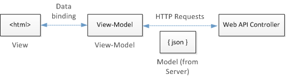

In this article, we will discuss about KnockoutJS, a open source library in front-end. There are many interesting information around KnockoutJS such as data binding, data template, ... 

Before, I only know about Angular that support data binding, but Angular is really big framework, and is not compatible for small project. And now, with the tiny project, we can use KnockoutJS that is replacement way.

Let's go.

<br>

## Table of contents
- [Introduction to KnockoutJS](#introduction-to-knockoutjs)
- [MVVM pattern in KnockoutJS](#mvvm-pattern-in-knockoutjs)
- [How KnockoutJS works](#how-knockoutjs-works)
- [Wrapping up](#wrapping-up)

<br>

## Introduction to KnockoutJS
KnockoutJS is an open source library. It was built to allow us to create dynamic and rich web applications. It is built with the Model-View-ViewModel (MVVM) pattern. Knockout makes it really simple to implement a complex user interface that responds to user interactions.

And KnockoutJS is designed to allow us to use arbitrary Javascript objects as view models.

Knockout has no dependencies. It works without jQuery, Prototype.js, or any other Javascript libraries, and it is compatible with browsers such as Chrome, Firefox, Safari, IE, and Opera.

Knockout is built around three core features:
- Observables and dependency tracking
- Declarative bindings
- Templating

<br>

## MVVM pattern in KnockoutJS

MVVM stands for Model - View - ViewModel, and is a design pattern for building user interfaces. 
- A ```model```: our application’s stored data. This data represents objects and operations in our business domain (e.g., bank accounts that can perform money transfers) and is independent of any UI. When using KO, we will usually make Ajax calls to some server-side code to read and write this stored model data.

- A ```view model```: a pure-code representation of the data and operations on a UI. For example, if we’re implementing a list editor, our view model would be an object holding a list of items, and exposing methods to add and remove items.

    Note that this is not the UI itself: it doesn’t have any concept of buttons or display styles. It’s not the persisted data model either - it holds the unsaved data the user is working with. When using KO, your view models are pure JavaScript objects that hold no knowledge of HTML. Keeping the view model abstract in this way lets it stay simple, so you can manage more sophisticated behaviors without getting lost.

- A ```view```: a visible, interactive UI representing the state of the view model. It displays information from the view model, sends commands to the view model (e.g., when the user clicks buttons), and updates whenever the state of the view model changes.

    When using KO, our view is simply your HTML document with declarative bindings to link it to the view model. Alternatively, we can use templates that generate HTML using data from our view model.




<br>

## How KnockoutJS works
In order to understand how KnockoutJS works, we will do an small example, then, dig deeper into this example.

In index.html file, we have content of ```body``` tag element. 

```html
<h1>Hello <span data-bind="text: name"></span></h1>

<script src="./js/knockout-3.5.0.js"></script>
<script src="./js/view-model.js"></script>
```

Next, in view-model.js, we have its content:

```javascript
let ViewModel = function() {
    this.name = 'Blue Storm';
};

ko.applyBindings(new ViewModel());
```

Finally, when runs this example, we have a result: ```Hello Blue Storm```.

So, in this example, we can learn some interesting keywords such as ```data-bind```, ```ko```, ```applyBindings```, ...

- ko

    ```javascript
    <script type="text/javascript" src="knockout-2.2.1.js"></script>
    ```

    When the above script file is added to the HTML document, a global variable ```ko``` is created and all exposed functions can be reached using this global Knockout variable such as:

    ```javascript
    ko.observableArray();
    ko.observable();
    ko.applyBindings();
    ```

- ```data-bind="text: name"```

    When ```data-bind``` property is added into the other tag element, it means that the built-in binding types - ```text``` will be binded to the ```name``` property of ViewModel.

    Using the data-bind attribute we can specify how to bind the view model to our UI.

    Normally, KnockoutJS use two-way data binding.

- ```applyBindings()```

    The ```data-bind``` attribute isn’t native to HTML, though it is perfectly OK (it’s strictly compliant in HTML 5, and causes no problems with HTML 4 even though a validator will point out that it’s an unrecognized attribute). But since the browser doesn’t know what it means, you need to activate Knockout to make it take effect.

    To activate Knockout, add the following line to a \<script\> block:

    ```javascript
    ko.applyBindings(new ViewModel());
    ```

    We can put either the script block at the bottom of our HTML document, or we can put it at the top and wrap the contents in a DOM -  ready handler such as jQuery's $ function.

    In ```ko.applyBindings()``` method, there is some parameters with responsibilities:
    - The first parameter says what view model object we want to use with the declarative bindings it activates.
    - Optionally, we can pass a second parameter to define which part of the document we want to search for ```data-bind``` attributes. 
        
        For example, ```ko.applyBindings(myViewModel, document.getElementById('someElementId'))```. This restricts the activation to the element with ID ```someElementId``` and its descendants, which is useful if we want to have multiple view models and associate each with a different region of the page.

<br>

## Wrapping up
- KnockoutJS is a library, not framework.
- KnockoutJS use MVVM pattern, data binding in KnockoutJS is based on Obserser pattern.


<br>

Thanks for your reading.

<br>

Refer:

[https://joinhandshake.com/engineering/2016/08/12/how-we-use-knockout.html](https://joinhandshake.com/engineering/2016/08/12/how-we-use-knockout.html)

[https://stackoverflow.com/questions/14045872/knockout-js-multiple-viewmodel-bindings-on-a-page-or-a-part-of-a-page](https://stackoverflow.com/questions/14045872/knockout-js-multiple-viewmodel-bindings-on-a-page-or-a-part-of-a-page)

[https://blogs.oracle.com/geertjan/how-to-separate-html-templates-in-knockout-apps](https://blogs.oracle.com/geertjan/how-to-separate-html-templates-in-knockout-apps)

[https://knockoutjs.com/documentation/introduction.html](https://knockoutjs.com/documentation/introduction.html)

[https://docs.microsoft.com/en-us/aspnet/web-api/overview/older-versions/using-web-api-1-with-entity-framework-5/using-web-api-with-entity-framework-part-5](https://docs.microsoft.com/en-us/aspnet/web-api/overview/older-versions/using-web-api-1-with-entity-framework-5/using-web-api-with-entity-framework-part-5)

[https://www.devbridge.com/articles/knockout-a-real-world-example/](https://www.devbridge.com/articles/knockout-a-real-world-example/)

[http://www.knockmeout.net/2011/06/10-things-to-know-about-knockoutjs-on.html](http://www.knockmeout.net/2011/06/10-things-to-know-about-knockoutjs-on.html)

[https://knockoutjs.com/documentation/fn.html](https://knockoutjs.com/documentation/fn.html)

[https://debugmode.net/2014/01/06/computed-observable-in-knockout-js/](https://debugmode.net/2014/01/06/computed-observable-in-knockout-js/)

[https://debugmode.net/2013/11/20/create-your-first-mvvm-based-javascript-app-in-two-simple-steps-using-knockoutjs/](https://debugmode.net/2013/11/20/create-your-first-mvvm-based-javascript-app-in-two-simple-steps-using-knockoutjs/)

[https://debugmode.net/2013/02/15/working-with-knockout-js-part-5-working-with-visible-binding/](https://debugmode.net/2013/02/15/working-with-knockout-js-part-5-working-with-visible-binding/)

[https://debugmode.net/2013/02/28/working-with-knockout-js-part-6-working-with-text-binding/](https://debugmode.net/2013/02/28/working-with-knockout-js-part-6-working-with-text-binding/)

[https://www.codeproject.com/Articles/507941/KnockoutplusJSplusmappings](https://www.codeproject.com/Articles/507941/KnockoutplusJSplusmappings)