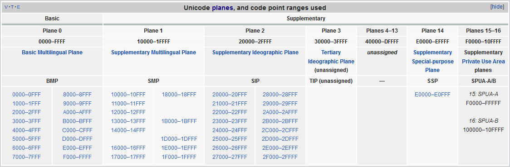
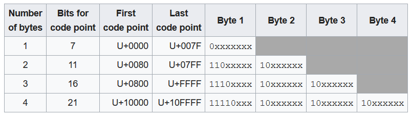
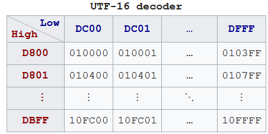

When we work with foreign companies such as Japan, China, ..., we always encourter some problems about character encoding. So, in this article, we will discuss about encoding with Unicode to clear some hides in this problem.

<br>

## Table of content
- [Introduction to Unicode](#introduction-to-unicode)
- [UTF-8 encoding](#utf-8-encoding)
- [UTF-16 encoding](#utf-16-encoding)
- [Security background](#security-background)
- [The relationship between UCS and Unicode](#the-relationship-between-ucs-and-unicode)
- [Wrapping up](#wrapping-up)

<br>

## Introduction to Unicode
- Definition

    According to the [wikipedia.org](https://en.wikipedia.org/wiki/Unicode), we have:

    ```
    Unicode is a computing industry standard for the consistent encoding, representation, and handling of text expressed in most of the world's writing system. The standard is maintained by the Unicode Consortium, and as of March 2019 the most recent version, Unicode 12.0, contains a repertoire of 137,993 characters covering 150 modern and historic scripts, as well as multiple symbol sets and emoji.

    The standard has been implemented in many recent technologies, including modern operating systems, XML, Java (and other programming languages), and the .NET Framework. 
    ```

    Unicode is just a table, which shows glyphs position to encoding system. Encoding takes symbol from table, and tells font what should be painted. But computer can understand binary code only. So, encoding is used number 1 or 0 to represent characters.

- The history of Unicode

    The first version of Unicode was a 16-bit encoding, from 1991 to 1995, but starting with Unicode 2.0 (July, 1996), it has not been a 16-bit encoding. The Unicode Standard encodes characters in the range ```U+0000``` ... ```U+10FFFF```, which amounts to a 21-bit code space.
    
    Depending on the encoding form you choose (UTF-8, UTF-16, or UTF-32), each character will then be represented either as a sequence of one to four 8-bit bytes, one or two 16-bit code units, or a single 32-bit code unit.

- Code space

    Code space is space that contains all code points in Unicode.

- Planes in Unicode

    In the Unicode standard, a plane is a continuous group of 65,536 (2^16) code points. There are 17 planes, identified by the number of 0 to 16, which corresponds with the possible values 00 - 10 (with hexadecimal) of the first position in six position hexadecimal format (U+**hh**hhhh). 

    The very last code point in Unicode is the last code point in plane 16, U+10FFFF. 

    Plane 0 is the Basic Multilingual Plane - BMP, which contains characters for almost all modern languages, and a large number of symbols. A primary objective for the BMP is to support the unification of prior character sets as well as characters for writing. Most of the assigned code points in the BMP are used to encode Chinese, Japanese, and Korean (CJK) characters. 

    As of Unicode 12.0, the BMP comprises 163 blocks.

    The higher planes 1 through 16 are called **supplementary planes**. 

    

    The limit of 17 planes is due to UTF-16, which can encode 220 code points (16 planes) as pairs of words, plus the BMP as a single word.[2]. UTF-8 was designed with a much larger limit of 231 (2,147,483,648) code points (32,768 planes), and can encode 221 (2,097,152) code points (32 planes) even under the current limit of 4 bytes.

    The 17 planes can accommodate 1,114,112 code points. Of these, 2,048 are surrogates (used to make the pairs in UTF-16), 66 are non-characters, and 137,468 are reserved for private use, leaving 974,530 for public assignment.

    Planes are further subdivided into Unicode blocks, which, unlike planes, do not have a fixed size. The 300 blocks defined in Unicode 12.0 cover 25% of the possible code point space, and range in size from a minimum of 16 code points (fourteen blocks) to a maximum of 65,536 code points (Supplementary Private Use Area-A and -B, which constitute the entirety of planes 15 and 16). For future usage, ranges of characters have been tentatively mapped out for most known current and ancient writing systems.

- Code point

    In character terminology, a code point or code position is any of the numerical values that make up the code spaces. Many code points represent single characters but they can also have other meanings, such as for formatting.

    Code point is not related to the representing it in memory. It is only a numerical values in Unicode table.

    For example: Assuming that we have a code point - U+0041. 
    - ```U+``` means ```Unicode```
    - The number part is hexadecimal number.
    - ```00``` means where the number plane that is contained.
    - ```41``` means the position in BMP plane.

    --> U+0041 will represent ```A``` character in Unicode.


    For example: In Unicode, string "hello" is corresponded to the five code points (not 5 bytes):

    ```
    U+0048 U+0065 U+006C U+006C U+006F
    ```

    For example:
    - ASCII comprises 128 code points in the range 0x00 - 0x7F. 
    - Extended ASCII comprises 256 code points in the range 0x00 - 0xFF.
    - Unicode comprises 1,114,112 code points in the range 0x000000 - 0x10FFFF. 

- Code unit

    The code unit is relevant to the encoding method.

    For example: 
    - With UTF-8 encoding, code unit is 1 byte.
    - With UTF-16 encoding, code unit is 2 bytes.
    - With UTF-32 encoding, code unit is 4 bytes.

- Block 

    Block is simply a small set of common traits such as about language or functionality.

    The first block, from U+0000 to U+001F, represents all control characters, and includes 32 characters.

    The second block begins from U+0020 to U+007F, represents all characters in ASCII.

<br>

## UTF-8 encoding
UTF-8 use code unit that is 1 byte, and it is a multibyte encoding able to encode the whole Unicode charset. An encoded character takes between 1 and 4 bytes. The encoding is defined by the Unicode Standard, and was originally designed by Ken Thompson and Rob Pike.

UTF-8 stands for Unicode (Universal Coded Character Set) Transformation Format - 8 bit. It was designed for backward compatibility with ASCII.

Since ASCII bytes do not occur when encoding non-ASCII code points into UTF-8, UTF-8 is safe to use within most programming and document languages that interpret certain ASCII characters in a special way, such as "/" in filenames, "\" in escape sequences, and "%" in printf.

Some advantages of UTF-8 when comparing with UTF-16, UTF-32:
- represent the whole Unicode code points.
- It is compatible with ASCII
- It reduces memory size when compared with UTF-16, UTF-32.
- UTF-8 do not need to use BOM - Byte Order Mark.
- Most C byte functions are compatible with UTF-8 encoded string such as strcat(), printf(), ..., whereas they fail with UTF-16 and UTF-32 encoded strings because these encodings encode small codes with null bytes.

Problem with UTF-8:
- When we compare it to ASCII or ISO 8859-1, is that it is a multibyte encoding: we cannot access a character by its character index directly, you have to iterate on each character because each character may have a different length in bytes. If getting a character by its index is a common operation in your program, use a character string instead of a UTF-8 encoded string.

Below is the table depict that how to encode characters with UTF-8.



So, we have the interesting feature of UTF-8 --> ```Prefix code```: The first byte indicates the number of bytes in the sequence. Reading from a stream can instantaneously decode each individual fully received sequence, without first having to wait for either the first byte of a next sequence or an end-of-stream indication.The length of multi-byte sequences is easily determined by humans as it is simply the number of high-order 1s in the leading byte. An incorrect character will not be decoded if a stream ends mid-sequence.

For example:

Consider the encoding of the Euro sign, €. 
1. The Unicode code point for "€" is U+20AC.
2. According to the scheme table above, this will take three bytes to encode, since it is between U+0800 and U+FFFF.
3. Hexadecimal 20AC is binary 0010 0000 1010 1100. The two leading zeros are added because, as the scheme table shows, a three-byte encoding needs exactly sixteen bits from the code point.
4. Because the encoding will be three bytes long, its leading byte starts with three 1s, then a 0 (1110...)
5. The four most significant bits of the code point are stored in the remaining low order four bits of this byte (1110 0010), leaving 12 bits of the code point yet to be encoded (...0000 1010 1100).
6. All continuation bytes contain exactly six bits from the code point. So the next six bits of the code point are stored in the low order six bits of the next byte, and 10 is stored in the high order two bits to mark it as a continuation byte (so 1000 0010).
7. Finally the last six bits of the code point are stored in the low order six bits of the final byte, and again 10 is stored in the high order two bits (1010 1100).

The three bytes 1110 0010 1000 0010 1010 1100 can be more concisely written in hexadecimal, as E2 82 AC. 

To understand more about UTF-8, we should refer to this [link](https://en.wikipedia.org/wiki/UTF-8).

<br>

## UTF-16 encoding
- Definition
    UTF-16 is an acronym of **16-bit Unicode Transformation Format**, is a character encoding capable of encoding all 1,112,064 valid code points of Unicode. The encoding is variable-length, as code points are encoded with one or two 16-bit code units.

    UTF-16 is used internally by systems such as Windows, Java, and Javascript, and often for plain text and for word-processing data files on Windows. It's rarely used for files on Linux / Unix or macOS. It never gained popularity on the web, where UTF-8 is dominant. UTF-16 is used by under 0.01% of web pages themselves. WHATWG recommends that **for security reasons browser apps should not use UTF-16**.

- The history of UTF-16

    For a long time ago, it's time that was not born UTF-16, the late 1980 like that, IEEE and Unicode consortium together created the early 2-byte encoding that was usually called Unicode, but is now called ```UCS2```. The original idea of UCS2 was to replace the typical 256-character encodings, which required 1 byte per character, with an encoding using 65,536 values, which would require 2 bytes per character. 

    **UCS2 differs from UTF-16 by being a constant length encoding and only capable of encoding character of BMP. It is supported by many programs.**

    And two groups worked on this parallel, the IEEE and Unicode Consoritum, to attempt to synchronize their character assignments so that the developing encodings would by manually compatible.

    So 65,536 characters was not suffice, and IEEE introduced a larger 31-bit space and an encoding UCS4 that would require 4-byte per character. This was resisted by the Unicode Consortium, both because 4 bytes per character wasted a lot of disk space and memory, and because some manufacturers were already heavily invested in 2-byte-per-character technology.

    Therefore, UTF-16 was developed as a compromise to resolve this impassive in version 2.0 of the Unicode standard in July 1996 and is fully specified in RFC 2781 published in 2000 by the IETF.

    In UTF-16, code points greater or equal to 2^16 are encoded using two 16-bit code units. The standards organizations chose the largest block available of un-allocated 16-bit code points to use as these code units. Unlike UTF-8 they did not provide a means to encode these code points. 

- How UTF-16 works

    - U+0000 to U+D7FF and U+E000 to U+FFFF
        
        All code points from U+0000 to U+D7FF and from U+E000 to U+FFFF, are encoded as single 16-bit code units by both UTF-16 and UCS2. But only code points in the Basic Multilingual Plane can be represented in UCS2.

    - U+010000 to U+10FFFF
        
        Code points from other planes - **Supplementary Planes** are encoded as **two 16-bit code units called a surrogate pair**.

        

        The below way to encode code point into UTF-16:
            - ```0x10000``` is subtracted from the code point, leaving a 20-bit number in the range ```0x00000–0xFFFFF```.
            - The high ten bits (in the range ```0x000–0x3FF```) are added to 0xD800 to give the first 16-bit code unit or high surrogate, which will be in the range ```0xD800–0xDBFF```.
            - The low ten bits (also in the range ```0x000–0x3FF```) are added to 0xDC00 to give the second 16-bit code unit or low surrogate, which will be in the range ```0xDC00–0xDFFF```.

        The high surrogate and low surrogate are also known as **leading** and **trailing** surrogates.

        The most commonly used characters are all in the BMP, handling of surrogate pairs is often not thoroughly tested. This leads to persistent bugs and potential security holes, even in popular and well-reviewed application software.

        For example:

        To encode U+10437 (𐐷) to UTF-16:
        - Subtract ```0x10000``` from the code point, leaving ```0x0437```.
        - For the high surrogate, shift right by 10 (divide by 0x400), then add ```0xD800```, resulting in 0x0001 + 0xD800 = 0xD801.
        - For the low surrogate, take the low 10 bits (remainder of dividing by 0x400), then add ```0xDC00```, resulting in 0x0037 + 0xDC00 = 0xDC37.

        To decode U+10437 (𐐷) from UTF-16:
        - Take the high surrogate (0xD801) and subtract 0xD800, then multiply by 0x400, resulting in 0x0001 × 0x400 = 0x0400.
        - Take the low surrogate (0xDC37) and subtract 0xDC00, resulting in 0x37.
        - Add these two results together (0x0437), and finally add 0x10000 to get the final decoded UTF-32 code point, 0x10437.


- Surrogate pair
    
    The ```High Surrogate``` (OxD800 – 0xDBFF) and ```Low Surrogate``` (0xDC00 – 0xDFFF) codes are reserved for encoding non-BMP characters in UTF-16 by using a pair of 16-bit codes: one ```High Surrogate``` and one ```Low Surrogate```. A single surrogate code point will never be assigned a character. 


<br>

## Security background
There is a set of encoding security issues when the producer and consumer do not agree on the encoding in use, or on the way a given encoding is to be implemented.

For instance, an attack was reported in 2011 where a Shift-JIS lead byte 0x82 was used to **mask** a 0x22 trail byte in a JSON resource of which an attacker could control some field. The producer did not see the problem even though this is an illegal byte combination. The consumer decoded it as a single U+FFFD and therefore changed the overall interpretation as U+0022 is an important delimiter. Decoders of encodings that use multiple bytes for scalar values now require that in case of an illegal byte combination, a scalar value in the range U+0000 to U+007F, inclusive, cannot be masked. For the aforementioned sequence the output would be U+FFFD U+0022.

This is a larger issue for encodings that map anything that is an ASCII byte to something that is not an ASCII code point, when there is no lead byte present. These are “ASCII-incompatible” encodings and other than ISO-2022-JP, UTF-16BE, and UTF-16LE, which are unfortunately required due to deployed content, they are not supported. (Investigation is ongoing whether more labels of other such encodings can be mapped to the replacement encoding, rather than the unknown encoding fallback.) An example attack is injecting carefully crafted content into a resource and then encouraging the user to override the encoding, resulting in e.g. script execution.

Encoders used by URLs found in HTML and HTML’s form feature can also result in slight information loss when an encoding is used that cannot represent all scalar values. E.g. when a resource uses the windows-1252 encoding a server will not be able to distinguish between an end user entering “💩” and “&#128169;” into a form.

The problems outlined here go away when exclusively using UTF-8, which is one of the many reasons that is now the mandatory encoding for all things. 

<br>

## The relationship between UCS and Unicode
Both are developed by different organizations, and the purpose is to cover all characters. Since Unicode 2.0, Unicode has started to synchronize with UCS fonts. The historical relationship between the two can refer to the Unicode 5.2.0.

There are two ways to implement UCS encoding: UCS-2, UCS-4.

There are currently implementations of Unicode encoding: UTF-8, UTF-16 and UTF-32. UTF-32 is basically equivalent to UCS-4, using a fixed 32-bit encoding. UTF-16 is originally equivalent to UCS-2, but for now UTF-16 should be the parent of UCS-2.


<br>

## Wrapping up
- Vietnameses uses multiple different blocks in Unicode such as Basic Latin (only include ASCII - 1 byte), Latin-1 Supplement, Latin Extended-B, and Latin Extended Additional.

    All characters in Vietnamese has the length from 1 byte to 3 bytes.

- Common character encoding
    - ASCII character encoding

        The ASCII code is 1 byte (8 bits) to encode the character, but in fact only the last 7 bits of one byte are used. The highest bit is uniformly defined as 0, which can represent 128 (27) characters in total. For example, the encoding of the character 'a' is 0110 0001, which is equivalent to the decimal integer 97, the encoding of the character 'A' is 0100 0001, and the decimal integer is 65. 

    - ISO-5589-1 character encoding

        Also known as Latin-1, it is a code developed by the International Organization for Standardization (ISO) for characters in Western European languages. It encodes characters with 1 byte (8 bits) and can represent 255 characters in total. Compatible with ASCII encoding. (The so-called compatibility means that for the same character, its encoding value is the same). 

    - UCS character encoding

        Universal Character Set (UCS) is a character defined by ISO ISO 10646 (or ISO/IEC 10646) standard The encoding method uses 4-byte encoding. UCS covers all characters in known languages. 

    - Unicode character encoding

        It is the encoding mechanism developed by http://www.unicode.org, which should include the commonly used texts all over the world. Use 2 byte encoding. 

    There are also GB2312 character encoding, GBK character encoding, GB18030, BIG5, Shift-JIS, ...

- UTF-8, UTF-16, UTF-32 are just couple of ways to store Unicode code points in computer's memory. Once Unicode character is converted into bytes, it can be easily persisted in disk, transferred over network and recreated at other end. Fundamental difference between UTF-32 and UTF-8, UTF-16 is that former is fixed width encoding.

- UTF-8 uses one byte at the minimum in encoding the characters while UTF-16 uses minimum two bytes.

- UTF-8 is compatible with ASCII while UTF-16 is incompatible with ASCII.

- UTF-8 take less bytes for many characters it would take less memory that UTF-16, well that really depends on what language the string is in. For non-European languages, UTF-8 requires more memory than UTF-16.

- ASCII is strictly faster than multi-byte encoding scheme because less data to process = faster.

- UTF-32 is fixed width encoding, always takes 32 bits, but UTF-8 and UTF-16 are variable length encoding where UTF-8 can take 1 to 4 bytes while UTF-16 will take either 2 or 4 bytes.


<br>

Refer: 

[https://javarevisited.blogspot.com/2015/02/difference-between-utf-8-utf-16-and-utf.html?m=1](https://javarevisited.blogspot.com/2015/02/difference-between-utf-8-utf-16-and-utf.html?m=1)

[https://viblo.asia/p/tim-hieu-unicode-PwRkgVOXeEd](https://viblo.asia/p/tim-hieu-unicode-PwRkgVOXeEd)

[https://unicodebook.readthedocs.io/unicode_encodings.html](https://unicodebook.readthedocs.io/unicode_encodings.html)

[https://www.unicode.org/faq/utf_bom.html](https://www.unicode.org/faq/utf_bom.html)

[Should UTF-16 be considered harmful?](https://softwareengineering.stackexchange.com/questions/102205/should-utf-16-be-considered-harmful)

[The Absolute Minimum Every Software Developer Absolutely, Positively Must Know About Unicode and Character Sets (No Excuses!)](https://www.joelonsoftware.com/2003/10/08/the-absolute-minimum-every-software-developer-absolutely-positively-must-know-about-unicode-and-character-sets-no-excuses/)

[The difference between UTF-8 and Unicode?](http://www.polylab.dk/utf8-vs-unicode.html)

[UTF-8 Everywhere](http://utf8everywhere.org/)

[https://jonskeet.uk/csharp/unicode.html](https://jonskeet.uk/csharp/unicode.html)

[http://www.programmersought.com/article/7975210414/](http://www.programmersought.com/article/7975210414/)

<br>

**Surrogate Pair**

[https://stackoverflow.com/questions/22121184/difference-between-composite-characters-and-surrogate-pairs](https://stackoverflow.com/questions/22121184/difference-between-composite-characters-and-surrogate-pairs)

[https://docs.microsoft.com/en-us/windows/desktop/intl/surrogates-and-supplementary-characters](https://docs.microsoft.com/en-us/windows/desktop/intl/surrogates-and-supplementary-characters)

<br>

**Get File encoding format**

[http://www.programmersought.com/article/441629448/](http://www.programmersought.com/article/441629448/)

[http://www.programmersought.com/article/9653470343/;jsessionid=CC3DFF8E521F70090E58F7DDD547FF3A](http://www.programmersought.com/article/9653470343/;jsessionid=CC3DFF8E521F70090E58F7DDD547FF3A)

<br>

**Base64 encoding**

[http://www.programmersought.com/article/2537619/](http://www.programmersought.com/article/2537619/)

<br>

**Character encoding**

[http://www.programmersought.com/article/68008542/](http://www.programmersought.com/article/68008542/)

<br>

**Convert Shift-JIS to UTF-8**

[http://www.lab.its55.com/?p=32](http://www.lab.its55.com/?p=32)

[http://www.programmersought.com/article/7975210414/](http://www.programmersought.com/article/7975210414/)

[http://sayahamitt.net/utf8%E3%81%AAstring%E5%85%A5%E3%82%8C%E3%81%9F%E3%82%89shiftjis%E3%81%AAstring%E5%87%BA%E3%81%A6%E3%81%8F%E3%82%8B%E9%96%A2%E6%95%B0%E4%BD%9C%E3%81%A3%E3%81%9F/](http://sayahamitt.net/utf8%E3%81%AAstring%E5%85%A5%E3%82%8C%E3%81%9F%E3%82%89shiftjis%E3%81%AAstring%E5%87%BA%E3%81%A6%E3%81%8F%E3%82%8B%E9%96%A2%E6%95%B0%E4%BD%9C%E3%81%A3%E3%81%9F/)

<br>

**Convert UTF-8 to Shift-JIS**

[http://www.programmersought.com/article/7975210414/](http://www.programmersought.com/article/7975210414/)

[http://sayahamitt.net/utf8%E3%81%AAstring%E5%85%A5%E3%82%8C%E3%81%9F%E3%82%89shiftjis%E3%81%AAstring%E5%87%BA%E3%81%A6%E3%81%8F%E3%82%8B%E9%96%A2%E6%95%B0%E4%BD%9C%E3%81%A3%E3%81%9F/](http://sayahamitt.net/utf8%E3%81%AAstring%E5%85%A5%E3%82%8C%E3%81%9F%E3%82%89shiftjis%E3%81%AAstring%E5%87%BA%E3%81%A6%E3%81%8F%E3%82%8B%E9%96%A2%E6%95%B0%E4%BD%9C%E3%81%A3%E3%81%9F/)

<br>

**All characters in Unicode**

[https://unicode-table.com/en/#cjk-unified-ideographs-extension-a](https://unicode-table.com/en/#cjk-unified-ideographs-extension-a)

<br>

**Security**

[https://encoding.spec.whatwg.org/#security-background](https://encoding.spec.whatwg.org/#security-background)