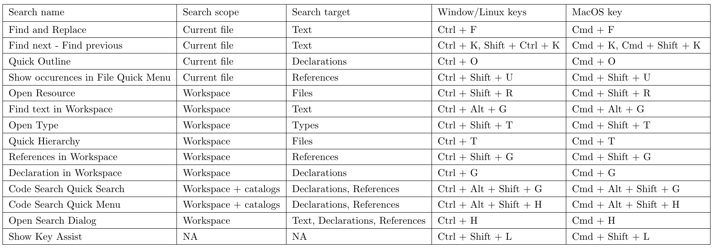

When I'm newbie to work with Eclipse, it is really bored to work with it, mainly because I do not know about shortcut keys in Eclipse. It takes me a long time to search text, files, ... in my project. It reduces my speed to code.

So, in this article, I will discuss about some useful shortcut keys in Eclipse.

 

## Table of contents
- [Search functionalities in Eclipse](#search-functionalities-in-eclipse)
- [Effective shortcut keys](#effective-shortcut-keys)
- [Comment](#comment)
- [Debug program](#debug-program)

 

## Search functionalities in Eclipse

 

## Effective shortcut keys
- Ctrl + D: Delete row

- Alt + Ctrl + Down: Copy lines.

- Shift + Enter: Insert line below current line.

- Shift + Ctrl + Enter: Insert line above current line.

- Alt + Ctrl + Up: Duplicate lines.

- Ctrl + Del: Delete next word.

- Shift + Ctrl + Del: Delete to end of line.

- Ctrl + Backspace: Delete previous word.

- Alt + Shift + W: Shows file in package explorer.

- Shift + Ctrl + M: Add import.

- Shift + Ctrl + X: To upper case.

- Shift + Ctrl + Y: To lower case.

- Alt + Up/Down: Move the row (or the entire selection) up or down.

- Alt + Left/Right: Move to the last location we editted.

- Ctrl + Shift + O: Organize imports. When we press this keys combination, all our missing classes will be imported, and the unused imports will vanish.

- Cltr + 1

    It activates the quick fix. 
    
    Imagine you create a class which implements some interface. You will get an error because the inherited methods are not yet implemented. 
    
    While you are on the line of code where the error occurs, press this combination to activate the quick fix. Now, select the "Add unimplemented methods" option. You can use the quick fix at every error you ever receive.

- Ctrl + E: Shows us a list of all open editors.

- Ctrl + F6: Use to move between open editors.

- Ctrl + F7: Move between views.

- Ctrl + F8: Move between perspectives.

- Ctrl + M: Maximize or unmaximize our current tab.

- Ctrl + Shift + F: Formats code.

- Ctrl + I: Corrects indentation.

- Ctrl + Shift + L: Shows us a list of our currently defined shortcut keys.

- Shift + Alt + R: Rename project, file, ...

- Shift + Alt + M: Extract method.

- Shift + Alt + V: Move method, class, ...

- Shift + Alt + C: Change method signature.

- Shift + Alt + I: Inline.

 

## Comment
- Shift + Ctrl + /: Add block comment.

- Shift + Ctrl + \: Remove block comment.

- Ctrl + /: Toggle comment.

 

## Debug program
- F11: Debug.

- Ctrl + F11: Run.

- Alt + Shift + X, R: Run on server.

- Alt + Shift + D, R: Debug on server.

- Ctrl + Shift + B: Toggle breakpoint.

 

Refer:

[https://www.shortcutfoo.com/app/dojos/eclipse-win/cheatsheet](https://www.shortcutfoo.com/app/dojos/eclipse-win/cheatsheet)

[https://www.linkedin.com/pulse/top-30-eclipse-keyboard-shortcuts-java-programmer-jayveersinh-solanki](https://www.linkedin.com/pulse/top-30-eclipse-keyboard-shortcuts-java-programmer-jayveersinh-solanki)