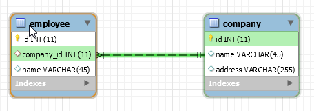

When we work with Java web development, we have to implement with database. Normally, we will use JDBC or JDBC template for doing this problem. But to make it easier, we will use the new technology called ORM - Object Relational Mapping. The standard version of ORM is JPA. JPA will help us to map POJO to each record in table of database. We will do not take care all queries to access database. This action will be sent to the JPA.

So, in this article, we will talk about how to configure an entity class with JPA in Spring Boot, specially these are annotations in JPA. 

<br>

## Table of contents
- [Introduction to JPA](#introduction-to-jpa)
- [JPA Providers](#jpa-providers)
- [JPA Entity class](#jpa-entity-class)
- [Data types of Persistent Fields and Persistent Properties](#data-types-of-persistent-fields-and-persistent-properties)
- [Persistent Fields](#persistent-fields)
- [Persistent Properties](#persistent-properties)
- [Relationship Mappings](#relationship-mappings)
- [Direction in Entity relationships](#direction-in-entity-relationships)
- [Cascade Opeartions and Relationships](#cascade-operations-and-relationships)
- [Orphan Removal in relationships](#orphan-removal-in-relationships)
- [Embeddable Classes in Entity](#embeddable-classes-in-entity)
- [Wrapping up](#wrapping-up)


<br>

## Introduction to JPA
JPA - Java Persistence API is the Java standard for mapping Java objects to a relational database. Mapping Java objects to database tables and vice versa is called Object-relational mapping (ORM). **The Java Persistence API (JPA) is one possible approach to ORM**. Via JPA, the developer can map, store, update and retrieve data from relational databases to Java objects and vice versa. JPA can be used in Java-EE and Java-SE applications.

**JPA defines only specifications, it does not provide an implementation.**

JPA implementation is provided as a reference implementation by the vendors developing O/R Mapper such as Hibernate, EclipseLink and Apache OpenJPA.

JPA permits the developer to work directly with objects rather than with SQL statements. The JPA implementation is typically called ```persistence provider```.

<br>

## JPA Providers
JPA is an open source API, therefore various enterprise vendors such as Oracle, Redhat, Eclipse, etc. provide new products by adding the JPA persistence flavor in them. 

Some of these products include: 
- Hibernate
- EclipseLink
- TopLink 
- Spring Data JPA
- ...

<br>

## JPA Entity class
A JPA Entity class is a POJO (Plain Old Java Object) class that is annotated as having the ability to represent objects in the database. 

To be able to store ```Person``` objects in the database using JPA, we need to define an entity classs. 

The below is source code for JPA entity class.

```java
@Entity
@Table(name = "PERSONS")
@Data
public class Person {    
    
    @Id
    @Column(name = "NAME")
    private String name;  

    @Size(max = 50)
    @Column(name = "EMAIL")
    private String email;

    @Size(max = 12)
    @Column(name = "PHONE")        
    private String phone;

    @Id
    @Size(max = 200)
    @Column(name = "ADDRESS")
    private String address;      
    
    public Person(String name, String email, String phone, String address) {        
        this.name = name;
        this.email = email;
        this.phone = phone;
        this.address = address;
    }
        
}
```

With the above code, an entity is an ordinary Java class. But this Person class has ```@Entity``` annotation, which marks the class as an entity class.

Some rules of requirements to create a JPA entity class:
- The class must be annotated with the ```javax.persistence.Entity``` annotation.

- The class must have a public or protected, no-argument constructor. The class may have other constructors.

- The class must not be declared ```final```. No methods or persistent instance variables must be declared ```final```.

- If an entity instance is passed by value as a detached object, such as through a session bean's remote business interface, the class must implement the ```Serializable``` interface.

- Entities may extend both entity and non-entity classes, and non-entity classes may extend entity classes.

- Persistent instance variables must be declared private, protected, or package-private and can be accessed directly only by the entity class's methods. Clients must access the entity's state through accessor or business methods.

<br>

## Data types of Persistent Fields and Persistent Properties
- Java primitive types
- ```java.lang.String```
- Other serializable types including
    - Wrapper of Java primitive types
    - ```java.math.BigInteger```
    - ```java.math.BigDecimal```
    - ```java.util.Date```
    - ```java.util.Calendar```
    - ```java.sql.Date```
    - ```java.sql.Time```
    - ```java.sql.TimeStamp```
    - User-defined serializable types
    - byte[]
    - Byte[]
    - char[]
    - Character[]
- Enumerated types
- Other entities and/or collections of entities
    - ```java.util.Collection```
    - ```java.util.Set```
    - ```java.util.List```
    - ```java.util.Map```
- Embeddable classes

Entities may use ```persistent fields```, ```persistent properties```, or a combination of both. 

If the mapping annotations are applied to the entity’s instance variables, the entity uses ```persistent fields```. 

If the mapping annotations are applied to the entity’s ```getter methods``` for JavaBeans-style properties, the entity uses ```persistent properties```.

For collection-valued persistent fields and properties:
- If a field or property of an entity consists of a collection of basic types or embeddable classes, use the ```javax.persistence.ElementCollection``` annotation on the field or property.

- ```@ElementCollection``` has two attributes: ```targetClass``` and ```fetch```. 
    - The ```targetClass``` attribute specifies the class name of the basic or embeddable class, and is optional if the field or property is defined using Java programming language generics.
    - The optional ```fetch``` attribute is used to specify whether the collection should be retrieve or eagerly, using the ```javax.persistence.FetchType``` constants or eith ```LAZY``` or ```EAGER```, respectively. Be default, the collection will be fetched lazily.

```java
@Entity 
public class Person {
    ...

    @ElementCollection(fetch = EAGER)
    protected Set<String> nickname = new HashSet();

    ...
}
```

<br>

## Persistent Fields
- We have a field in the class. This can be ```public```, ```protected```, ```private``` or package access but cannot be static or final.
- The field Java type defines whether it is, by default, persitable.
- If the entity class uses persistent fields, the Persistent runtime accesses entity class instance variables directly.
- All fields not annotated ```javax.persistence.Transient``` or not marked as Java ```transient```, will be persisted to the data store.

    ```java
    @Entity
    public class Student {
        @Basic 
        Date birthday

        @Transient
        String otherFields;
    }
    ```

    So, the field ```birthday``` is considered as persistent, whereas field ```otherFields``` is not persisted.

<br>

## Persistent Properties
- Getter/Setter methods is considered as ```properties```. In this situation, we want to persist the output from ```getXXX``` to the database, and use the ```setXXX``` to load up the value into the object when extracting it from the database.

- We have a property in the class with Java Bean getter/setter methods. These methods can be ```public```, ```protected```, ```private``` or package access, but cannot be ```static```. The class must have BOTH ```getter``` AND ```setter``` methods. 

    ```java
    @Entity
    public class Student {

        @Basic 
        public Date getBirthday() {
            ...
        }

        public void setBirthday(Date date) {
            ...
        }
    }
    ```

    Using some annotations, we have marked this class as persistent, and the getter method is marked as persistent. By default, a property is non-persistent, so we have no need in specifying the ```otherFields``` as transisent.

- If the property is a boolean, we can use ```isProperty``` instead  of ```getProperty```. 

- The method signature for single -valued persistent properties are as follows:

    ```java
    Type getProperty();
    void setProperty(Type type);
    ```

- The object/relational mapping annotations for persistent properties must be applied to the getter methods.

<br>

## Primary Key in Entity class
Every entity has a unique object identifier. The unique identifier, or primary key, enables clients to locate a particular entity instance. Every entity must have a primary key. An entity may have either a simple or a composite primary key.

Use ```javax.persistence.Id``` annotation to denote the primary key property or field.

Composite primary key are used when a primary key consists of more than one attribute, which corresponds to a set of single persistent properties or fields.

Composite primary keys must be defined in a primary key class. Composite primary keys are denoted using the ```javax.persistence.EmbeddedId``` and ```javax.persistence.IdClass``` annotations.

Some data types of primary key:
- Java primitive types
- Java primitive wrapper classes
- ```java.lang.String```
- ```java.util.Date``` (the temporal type should be DATE)
- ```java.sql.Date```
- ```java.math.BigDecimal```
- ```java.math.BigInteger```

Floating point types should never used in primary keys. 

Some requirements for primary key:
- The access control modifier of the class must be ```public```.
- The properties of the primary key class must be ```public``` or ```protected``` if property-based access is used.
- The class must have a public default constructor.
- The class must implement the ```hashCode()``` and ```equals(Object other)``` methods.
- The class must be serializable.
- A composite primary key msut be represented and mapped to multiple fields or properties of the entity class, or must be represented and mapped as an embeddable class.
- If the class is mapped to multiple fields or properties of the entity class, the names and types of the primary key fields or properties in the many key class must match those of the entity class.

<br>

## Relationship Mappings
There are four types of multiplicities: ```one-to-one```, ```one-to-many```, ```many-to-one```, and ```many-to-many```.
- One-to-one
    
    Each entity instance is related to a single instance of another entity. For example, to model a physical warehouse in which each storage bin contains a single widget, StorageBin and Widget would have a one-to-one relationship. 
    
    One-to-one relationships use the ```javax.persistence.OneToOne``` annotation on the corresponding persistent property or field.


- One-to-many

    An entity instance can be related to multiple instance.
    
    A sales order, for example, can have multiple line items. In the order 
    application, Order would have a one-to-many relationship with LineItem.
    
    One-to-many relationships ```use the javax.persistence.OneToMany``` annotation on the corresponding persistent property or field.

- Many-to-One

    Multiple instances of an entity can be related to a single instance of the other entity. This multiplicity is the opposite of a one-to-many relationship.

    In the example, from the perspective of LineItem, the relationship to Order is many-to-one. 
    
    Many-to-one relationships use the ```javax.persistence.ManyToOne``` annotation on the corresponding persistent property or field.

- Many-to-Many

    The entity instances can be related to multiple instances of each other. 
    
    For example, in college, each course has many students, and every student may take several courses. Therefore, in an enrollment application, Course and Student would have a many-to-many relationship. 
    
    Many-to-many relationships use the ```javax.persistence.ManyToMany``` annotation on the corresponding persistent property or field.

<br>

## Direction in Entity relationships
There are two directions of a relationship, bidirectional and unidirectional. 
- A bidirectional relationship has both an owning side and inverse side.
- A unidirectional relationship has only an owning side. The owning side of a relationship determines how the Persistent runtime makes updates to the relationship in the database.

1. Bidirectional 

    Each entity has a relationship field or property that refers to the other entity. Through the relationship field or property, and entity class's code can access its related object. If an entity has a related field, then the entity is said to know about its related object. 

    For example, if Order know what LineItem instances it has and if LineItem knows what Order it belongs to, then they have a bidirectional relationship.

    Bidirectional relationships must follow these rules:
    - The inverse side of a bidirectional relationship must refer to its owning side by using the ```mappedBy``` element of the ```@OneToOne```, ```@OneToMany```, or ```@ManyToMany``` annotation. The ```mappedBy``` element designates the property or field in the entity that is the owner of the relationship, it means that the ```mappedBy``` attribute contains the name of the association-field on the owning side.

    - The owning side has to have the ```inversedBy``` attribute of the ```@OneToOne```, ```@ManyToOne```, or ```@ManyToMany``` mapping declarations. The ```inversedBy``` attribute contains the name of the association-field on the inverse-side.

    - ```@ManyToOne``` is always the owning side of a bidirectional association.

    - ```@OneToMany``` is always the inverse side of a bidirectional association.

    - The owning side of a ```@OneToOne``` association is the entity with the table containing the foreign key.

    - The many side of many-to-one bidirectional relationships must not define the ```mappedBy``` element. The many side is always the owning side of the relationship.

    - For one-to-one bidirectional relationships, the owning side corresponds to the side that contains the corresponding foreign key.

    - For many-to-many bidirectional relationships, either side may be the owning side. So, we can pick the owning side of a many-to-many association ourself.

For example:

Assuming that we have two objects that are employee and company. A company that has many employees, but one employee is only worked in one company. So, in employee table, it has id of company.



So, we have our source code about this problem.
- In the owning side, we have:

    ```java
    @Entity 
    @Table(name = "EMPLOYEE")
    @Data
    public class Employee {

        @Id
        @Column(name = "ID")
        private int id;

        @Column(name = "EMPLOYEE_ID")
        private int employeeId;

        @Column(name = "NAME")
        private String name;

        @ManyToOne(fetch = FetchType.LAZY)
        @JoinColumn(name = "EMPLOYEE_ID", referencedColumnName = "ID")
        private Company company;
    }
    ```
- In the inverse side, we have:

    ```java
    @Entity 
    @Table(name = "COMPANY")
    @Data
    public class Company {

        @Id
        @GeneratedValue(strategy = GenerationType.AUTO)
        @Column(name = "ID")
        private int id;

        @Column(name = "NAME")
        private String name;

        @Column(name = "ADDRESS")
        private String address;

        @OneToMany(cascade = CascadeType.ALL, fetch = FetchType.LAZY, mappedBy = "company")
        private Collection<Employee> employees;
    }
    ```
--> ```mappedBy``` is the name of association-mapping attribute on the owning side. With this, we have now established a bidirectional association between Employee and Company entities.

The ```@JoinColumn``` annotation defines the actual physical mapping on the owning side.

```FetchType.LAZY``` indicates that the entity will be fetched on demand. For example, we could query the database for an Employee object. The company object associated will not be fetched until we call ```Employee.getCompany();```.

2. Unidirectional

    Only one entity has a relationship field or property that refers to the other. 

    For example, LineItem would have a relationship field that identifies Product, but Product would not have a relationship field or property for LineItem. In other words, LineItem knows about Product, but Product doesn't know which LineItem instances refer to it.

<br>

## Cascade Opeartions and Relationships
Entities that use relationships often have dependencies on the existence of the other entity in the relationship. 

For example, a line item is part of an order, and if the order is deleted, then the line item should also be deleted. This is called a cascade delete relationship.

The ```javax.persistence.CascadeType``` enumerated type defines the cascade operations that are applied in the cascade element of the relationship annotations.

| Cascade Operation | Description |
| ----------------- | ----------- |
| ALL               | All cascade operations will be applied to the parent entity's relatd entity. ```All``` is equivalent to specifying ```cascade = {DETACH, MERGE, PERSIST, REFRESH, REMOVE}```. |
| DETACH            | if the parent entity is detached from the persistence context, the related entity will also detached. |
| MERGE             | if the parent entity is merged into the persistence context, the related entity will also be merged. |
| PERSIST           | If the parent entity is persisted into the persistence context, the related entity will also be persisted.|
| REFRESH           | If the parent entity is refreshed in the current persistence context, the related entity will also be refreshed. |
| REMOVE            | If the parent entity is removed from the current persistence context, the related entity will also be removed. |

<br>

## Orphan Removal in relationships
When a target entity in one-to-one or one-to-many relationship is removed from the relationship, it is often desirable to cascade the remove operation to the target entity. Such target entities are considered **orphans** and the ```orphanRemoval``` attribute can be used to specify that orphaned entities should be removed. For example, if an order has many line items, and one of the line items is removed from the order, the removed line item is considered an orphan. If ```orphanRemoval``` is set to true, the line item entity will be deleted when the line item is removed from the order.

The ```orphanRemoval``` attribute in ```@OneToMany``` and ```@oneToOne``` takes a boolean value, and is by default ```false```.

```java
@OneToMany(mappedBy="customer", orphanRemoval="true")
public List<Order> getOrders() { 
    ... 
}
```

<br>

## Embeddable Classes in Entity
Embeddable classes are used to represent the state of an entity, but don't have a persistent identity of their own, unlike entity classes. Instances of an embedded class share the identity of the entity that owns it.

Embeddable classes only exist as the state of another entity. An entity may have single valued or collection-valued embeddable class attributes.

For example:

```java
@Embeddable
public class ZipCode {}
    String zip; String plusHour();
}
```

```java
@Entity 
public class Address {
    @Id 
    protected int id;

    String street1;
    String street2;
    String city

    String pronices;

    @Embeded
    ZipCode z
    
    ...
}
```

Entities that own embeddable classes as part of their persistent state may annotate the field or property with the ```javax.persitence.Embedded``` annotation, but are not required to do so.

Embeddable classes may themselves use other embeddable classes to represent their state. They may also contain collections of basic Java programming language types, or other embeddable classes. Embeddable classes may also contain relationships to other entities or collections of entities. If the embeddable class has such a relationship, the relationship is from the target entity or collection of entities to the entity that owns the embeddable class. 

<br>

## Wrapping up
- JPA can not persist ```static``` or ```final``` fields.


<br>


Refer:

[https://www.oracle.com/technetwork/middleware/ias/toplink-jpa-annotations-096251.html](https://www.oracle.com/technetwork/middleware/ias/toplink-jpa-annotations-096251.html)

[http://www.javaguides.net/2019/01/introduction-to-java-persistence-api.html](http://www.javaguides.net/2019/01/introduction-to-java-persistence-api.html)

[http://www.javaguides.net/2018/11/guide-to-jpa-and-hibernate-cascade-types.html](http://www.javaguides.net/2018/11/guide-to-jpa-and-hibernate-cascade-types.html)

[https://docs.oracle.com/cd/E19226-01/820-7627/bnbqc/index.html](https://docs.oracle.com/cd/E19226-01/820-7627/bnbqc/index.html)