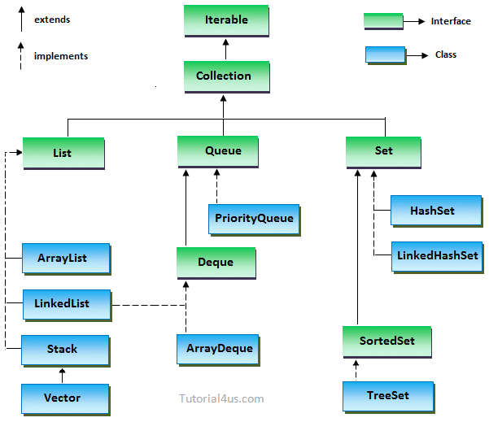

When we are working with Java from a newbie, we're always to think about some common tasks such as convert list to array, ... In order to reduce the time of these problems, we can sum up all solutions to this article. It is convenient that we can see them again.

Let's start.

<br>

## Table of contents
- [Initialize List/ArrayList](#initialize-list/arraylist)
- [Convert List to Array](#convert-list-to-array)
- [Convert List to Set](#convert-list-to-set)
- [Convert List to Map](#convert-list-to-map)
- [Find max/min value from an array](#find-max/min-from-an-array)
- [Convert Map to List](#convert-map-to-list)
- [Get the earlies date of a list](#get-the-earlies-date-of-a-list)
- [Convert String to Int](#convert-string-to-int)
- [Check whether an object is instance of which class](#check-whether-an-object-is-instance-of-which-class)
- [Convert Java Date format to Javascript Date format and vice versa](#convert-java-date-format-to-javascript-date-format-and-vice-versa)
- [Wrapping up](#wrapping-up)

<br>

## Initialize List/ArrayList
1. Initialization with List interface

    - Use the factory methods of Stream.

        ```java
        Student obama =new Student(12,"Bill Gate");
		Student billgate = new Student(22, "Obama");

        List<Student> list = Stream.of(obama, billgate).collect(Collectors.toList());		
		System.out.println(list);
        ```

    - Use with Array.

        ```java
        List<String> list = Arrays.asList("Obama", "Bill Gate");
        ```

    - Use List.of() method

        ```java
        List<String> lst = new ArrayList<>(
            List.of("Hello", "World", "!")
        );
        ```

    - Use another collection

        ```java
        List<String> names = new ArrayList<>(lst);
        ```

<br>

## Convert List to Array
- First way - Use ```List.toArray()```.

    ```java
    @Data
    @NoArgsConstructor
    @AllArgsConstructor
    public class Student {

        private int age;

        private String name;
    }

    // This way that we need to know about the size of array.
    List<Student> lst = new ArrayList<Student>();
    Student[] arr = lst.toArray(new Student[lst.size()]);

    // But we can not exactly be aware of this size of list. JVM can support with us.
    Student[] arrStudent=lst.toArray(new Student[0]);
    ```

- Second way: Use Stream API to convert list to array.
    
    - convert List to Stream using ```List.stream()```.
    - use ```Stream.toArray()``` method to return an array that contains the elements of the stream.

    ```java
    // Use method reference
    Student[] arr = lst.stream.toArray(Student[]::new);
    ```

<br>

## Convert List to Set

```java
Set<Foo> new HashSet<Foo>(list);
```

<br>

## Convert List to Map
Assuming that we have a class Student with two attributes: ```id``` and ```name```.

```java
@Data
@AllArgsConstructor
class Student {
    private int id;

    private String name;
}
```

At the moment, we want to convert list of ```Student``` object to map that contains ```id``` and ```name``` of each ```Student```.

- Use normal stream in Java 8

    ```java
    List<Student> students = ...;
    Map<Integer, String> mp = students.stream()
                                        .collect(Collectors.toMap(Student::getId(), Student::getName()));
    ```

    When our list have many ids that are same, exception ```Duplicate key``` will be thrown.

- Catch exception ```Duplicate key```

    ```java
    List<Student> students = ...;
    Map<Integer, String> mp = students.stream()
                                        .collect(Collectors.toMap(Student::getId, Student::getName, 
                                                    (oldValue, newValue) -> oldValue));     // (oldValue, newValue) -> newValue)
    ```

- Keeping order of elements

    ```java
    List<Student> students = ...;
    Map<Integer, String> mp = students.stream()
                                        .collect(Collectors.toMap(Student::getId, Student::getName, 
                                                    (oldValue, newValue) -> oldValue),     // (oldValue, newValue) -> newValue)
                                                    LinkedHashMap::new));
    ```

<br>

## Find max/min value from an array
1. Find max 

    - With integer: 

        ```java
        List<Integer> listOfIntegers = Arrays.asList(1, 2, 3, 4, 56, 7, 89, 10);
        Integer expectedResult = 89;
    
        Integer maxItem = listOfIntegers
                        .stream()
                        .mapToInt(v -> v)
                        .max().orElseThrow(NoSuchElementException::new);

        // Or we can specify the natural order comparator
        Optional<Integer> maxItem = listOfIntegers.stream().max(Comparator.naturalOrder());
        ```

    - With Objects:

        ```java
        @Data
        @AllArgsConstructor
        public class Student {

            private String name;

            private int score;
        }

        List<Student> students = new ArrayList<>(
            List.of(new Student("Mark", 8), 
                    new Student("Bill Gate", 10), 
                    new Student("Obama", 7), 
                    new Student("Johnson", 9))
        );

        students.stream()
                .max(Comparator.comparing(Student::getScore))
                .orElseThrow(NoSuchElementException::new);
        ```

    - Use ```reduce``` operation:

        ```java
        Optional<Integer> maxItem = listOfIntegers.stream().reduce(Integer::max);
        ```
    - Use Collector:

        ```java
        Optional<Integer> maxItem = listOfIntegers.stream().collect(Collectors.maxBy(Comparator.naturalOrder()));
        ```
    
    - Use IntSummaryStatistics:

        ```java
        int maxItem = listOfIntegers.collect(Collectors.summarizingInt(Integer::intValue)).getMax();
        ```

2. Find min

    With Integer: convert the stream to ```IntStream```.

    ```java
    List<Integer> listOfIntegers = Arrays.asList(1, 2, 3, 4, 56, 7, 89, 10);
    Integer expectedResult = 89;
 
    Integer minItem = listOfIntegers
                    .stream()
                    .mapToInt(v -> v)
                    .min().orElseThrow(NoSuchElementException::new);
    ```

    With Objects:

    ```java
    students.stream()
            .min(Comparator.comparing(Student::getScore))
            .orElseThrow(NoSuchElementException::new);
    ```

<br>

## Convert Map to List
- Convert ```Map<String, Double>``` to ```List<Pair<String, Double>>```

    It means that we need to map ```Stream<Map.Entry<String, Double>>``` into a ```Stream<Pair<String, Double>>```.

    ```java
    List<Pair<String, Double>> mostRelevantTitles = 
                            implicitDataSum.entrySet()
                                        .stream()
                                        .sorted(Comparator.comparing(e -> -e.getValue()))
                                        .map(e -> new Pair<>(e.getKey(), e.getValue()))
                                        .collect(Collectors.toList());
    ```

    We can replace the comparator ```Comparator.comparing(e -> -e.getValue())``` by ```Map.Entry.comparingByValue(Comparator.reverseOrder())```.

- Convert ```Map<String, Double>``` to ```List<String>``` or ```List<Double>```

    There are some ways to convert them such as:
    
    ```java
    Map<String, Double> map = new HashMap<>();

    List<String> lstKeys = new ArrayList(map.keySet());
    List<Double> lstValues = new ArrayList(map.values);
    ```

    ```java
    List<String> lstKeys = map.keySet().stream().collect(Collectors.toList());
    List<Double> lstValues = map.values().stream().collect(Collectors.toList());
    ```

<br>

## Get the earlies date of a list
In ```java.util.Date```, there is available comparator operation. So, we can get it by the following:

```java
Date minDate = Collections.min(listOfDates);
```

<br>

## Convert String to Int
- Use ```Integer.parseInt()``` method

    Because ```parseInt()``` method will throw a ```NumberFormatException```, so, we have to handle it.

    ```java
    int foo;
    try {
        foo = Integer.parseInt(str);
    } catch(NumberFormatException e) {
        foo = 0;
        e.printStackTrace();
    }
    ```

    ```Integer.parseInt()``` method returns a primitive int.

- Use ```Ints``` method from Guava library

    ```java
    import com.google.common.primitives.Ints;

    int foo = Optional.ofNullable(myString)
    .map(Ints::tryParse)
    .orElse(0)
    ```

- Use ```Integer.valueOf()``` method

    ```java
    Integer result = Integer.valueOf(str);
    ```

    ```Integer.valueOf()``` method returns a new Integer() object.

<br>

## Some ways to loop Map
Refer [link](https://stackoverflow.com/questions/1066589/iterate-through-a-hashmap).


<br>

## Check whether an object is instance of which class
Use ```instanceof``` operator to check this condition. An additional benefit of using ```instanceof``` is that when used with a ```null``` reference, ```instanceof``` will return ```false```, while ```a.getClass()``` would throw a ```NullPointerException```.

```java
if (a instanceof X) {
    // do something
}
```

<br>

## Convert Java Date format to Javascript Date format and vice versa
Because Javascript does not have a built in date formatting ability. 

And if we want to pass Date from Java to Javascript, it would be to convert Java Date to milliseconds using ```date.getTime()```, create a Javascript Date initialized with this milliseconds value with ```new Date(milliseconds)```, then format the date with the means of Javascript Date object, like ```date.toLocaleString()```.

<br>

## How to use equals() method and == operator
```equals()``` method and ```==``` operator is used to compare objects to check equality.

- To primitive value, ```equals()``` method and ```==``` operator has the same effection.
- To objects:
    - ```==``` operator will compare the addresses of two objects. It does not compare values in objects.
    - Therefore, ```equals()``` method happens to solve this problem. ```equals()``` method is defined in ```Object``` class. So, in our objects, we have to override ```equals()``` method, and ```hashCode()``` method is always to accompany with ```equals()``` method. As per the API, the result returned from the ```hashCode()``` method for two objects must be the same if our ```equals()``` methods show that they are equivalent. The converse is not necessarily true. 

        In default implementation of ```equals()``` method that provided in ```Object``` class, ```equals()``` method is as same as ```===``` operator.

So, to compare String objects, we should use ```equals()``` method rather than ```==``` operator.

And, we need to remember about some primitive data types in Java: ```byte```, ```char```, ```short```, ```int```, ```long```, ```float```, ```double```, ```boolean```, ```void```.

<br>

## Wrapping up
- The background of data structure in Java:

    

<br>

Refer:

[https://www.techiedelight.com/convert-list-to-array-java/](https://www.techiedelight.com/convert-list-to-array-java/)

[https://dzone.com/articles/how-to-convert-list-to-map-in-java](https://dzone.com/articles/how-to-convert-list-to-map-in-java)

[https://www.geeksforgeeks.org/bigdecimal-intvalue-method-in-java/](https://www.geeksforgeeks.org/bigdecimal-intvalue-method-in-java/)

[https://stackoverflow.com/questions/541749/how-to-determine-an-objects-class](https://stackoverflow.com/questions/541749/how-to-determine-an-objects-class)

[https://www.webucator.com/how-to/how-check-object-type-java.cfm](https://www.webucator.com/how-to/how-check-object-type-java.cfm)

[https://www.mkyong.com/java8/java-8-convert-list-to-map/](https://www.mkyong.com/java8/java-8-convert-list-to-map/)

[https://dzone.com/articles/java-8-optional-handling-nulls-properly](https://dzone.com/articles/java-8-optional-handling-nulls-properly)

[https://dzone.com/articles/10-tips-to-handle-null-effectively?fromrel=true](https://dzone.com/articles/10-tips-to-handle-null-effectively?fromrel=true)

[https://stackoverflow.com/questions/900745/java-compareto-for-string-and-integer-arguments](https://stackoverflow.com/questions/900745/java-compareto-for-string-and-integer-arguments)