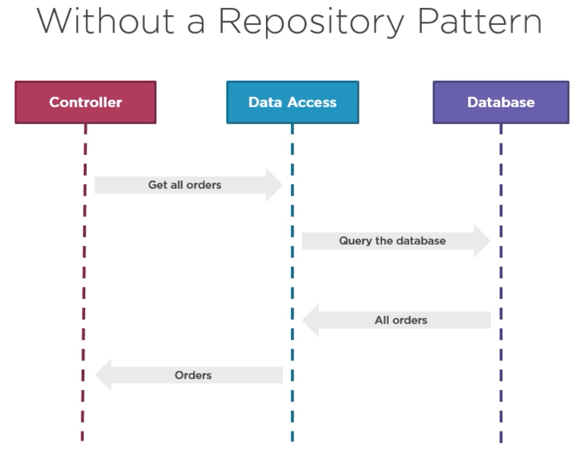
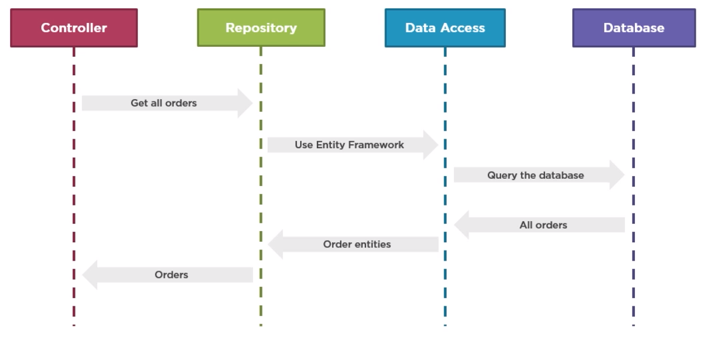
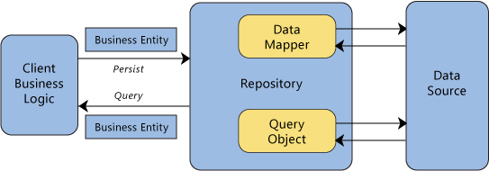

In this article, we will find out something about Repository pattern such as the context's problem, when to use Repository pattern, the advantages and disadvantages, ...

<br>

## Table of contents
- [Given Problem](#given-problem)
- [Solution of Repository Pattern](#solution-of-repository-pattern)
- [When to use](#when-to-use)
- [Benefits & Drawback](#benefits-&-drawback)
- [Code C++ /Java / Javascript](#code-c++-java-javascript)
- [The difference between Repository pattern and DAO pattern](#the-difference-between-repository-pattern-and-dao-pattern)
- [Related Patterns](#related-patterns)
- [Wrapping up](#wrapping-up)


<br>

## Given Problem 
The context of this problem is as same as the problem of DAO pattern. But in order to understand deeper the context of Repository pattern, we need to read about [the difference between DAO pattern and Repository pattern](#the-difference-between-repository-pattern-and-dao-pattern). 

After we read this part, we will gain the background about how to use and when to use DAO pattern and Repository pattern, simply because both DAO pattern and Repository pattern used to separate between Persistence layer and Business Logic layer.

Belows are some specific problems when we don't use Repository pattern.



In this case, we are trying to fetch some data from our Data Access Layer, which then goes to the native queries to our database. The Data Access Layer will then get all the data back to it. In this case, we're loading some orders, and then those orders are returned back to the Controller in our web application.

Some problems without using Repository pattern:
- The controller is tightly coupled with the Data Access layer.

    It means that the controller has to know about the ORM or the way that we work with our database. For example, in this case, it might know that we are leveraging frameworks.

- It's difficult to write a test for the Controller without side effect.

- Hard to extend entities with domain specific behaviour before they're returned back to the Controller.

    And it's also hard to directly communicate with a Data Access layer, out of Controller.

<br>

## Solution of Repository Pattern

1. Solve the above problem

    

    Applying Repository pattern simply means that we introduce a layer that encapsulate our data access code. This means that our repository will know how to communicate with, for instance, hibernate or our file on disk or the other types of databases. This means that the controller can now leverage our repository to ask for data without having to worry about how that data is fetched from our data store.

    So, from an above image, we have some benefits when using Repository pattern:
    - The Controller is now seperated (decoupled) from the data access.
    - It's easy to write a test without side-effects because the Controller can simply replace our repository at runtime using, for instance, the Strategy pattern.
    - Modify and extend entities before they are passed on to the Controller.
    - A sharable abstraction resulting in less duplication of code.
    - Improved maintainability.

2. Introduction to Repository pattern

    Repository pattern was first introduced as a part of Domain Drive Design in 2004.

    In the book **Patterns of Enterprise Application Architecture**, Martin Fowler describes a repository as follows:

    ```
    A repository performs the tasks of an intermediary between the domain model layers and data mapping, acting in a similar way to a set of domain objects in memory. Client objects declaratively build queries and send them to the repositories for answers. Conceptually, a repository encapsulates a set of objects stored in the database and operations that can be performed on them, providing a way that is closer to the persistence layer. Repositories, also, support the purpose of separating, clearly and in one direction, the dependency between the work domain and the data allocation or mapping.
    ```

    

    It is important note about Repository pattern: Repositories play an important part in DDD, they speak the language of the domain and act as mediators between the domain and data mapping layers. They provide a common language to all team members by translating technical terminology into business terminology.

    In a nutshell, a Repository:
    - Is not a data access layer
    - Provides a higher level of data manipulation
    - Is persistence ignorance
    - Is a collection of aggregate roots
    - Offers a mechanism to manage entities

<br>

## When to use
- When working with Domain Driven Design pattern.


<br>

## Benefits & Drawback
1. Benefits

    - Concentrate on logic about data processing or business logic.
    - Repository pattern allows us to easily test our application with unit tests.
    - Improve the flexibility of architecture.
    - When we need to change logic of Data Access Layer or Persistence Layer, business logic, no need to modify Repository.

2. Drawbacks
    - About performance: The more abstract away the repository library, we would need to design and implement more levels of abstraction, covering more cases. However, a specialized repository would perform better, knowing the full abilities of its underlying store.

    - Another disadvantages would be development and maintaince cost. These disadvantages outweigh any advantages of having a fully generic structure...


<br>

## Code C++ /Java / Javascript

We can refer to the [source code of Repository pattern on Github](https://gamethapcam.github.io/2019-02-15-DAO-pattern-in-java).

<br>

## The difference between Repository pattern and DAO pattern

After reading many article about the difference between Repository pattern and DAO pattern, I'm really still confused about these difference, simply because some people say that they are essentially the same, but the difference in only about semantic distinction, not a technical distinction, and DAO pattern sounds more database related, Repository pattern is relevant to the Domain Model in Domain Driven Design. And, DAO pattern still have ability to return collection of objects.

<br>

But, some people still give some differences between them. Actually, we still want to list all the difference based on this idea.

|              DAO pattern               |                       Repository pattern                   |
| -------------------------------------- | ---------------------------------------------------------- |
| DAO is an abstraction of data persistence. --> So, a DAO will be a per-table object. A DAO allows for a simpler way to get data from a storage, hiding the ugly queries. | Repository is an abstraction of a collection of objects. Repository sits at a higher level. It deals with data too and hides the queries and all that but, a repository deals with **Business/Domain objects**. |
| DAOis more lower level, and it would be considered closer to the database/storage dealing only with data, often table-centric. | Repository is a higher level concept, and it would be considered closer to the Domain, dealing only in Aggregate Roots. |
| DAO would not be implemented by using Repository pattern. | Repository could be implemented using DAO's. |
| DAO uses **Read and Write** concept. | Repository uses **Read Only** concept. |

Repository will use a DAO to get the data from the storage and uses that data to restore a business object. Or it will take a business object and extract the data that will be persisted.

If we have an anemic domain, the repository will be just a DAO.

--> The main different between the Repository pattern and the DAO pattern is that the DAO pattern is at a low level of abstraction and does not speak the ubiquitous language of the domain.

<br>

## Related Patterns
- Data Mapper

    This pattern describes how to map data to different schemas. It is often used to map between a data store and a domain model.
  
- Unit of Work

    This pattern keeps track of everything that happens during a business transaction that affects the database. At the conclusion of the transaction, it determines how to update the database to conform to the changes.

<br>

## Wrapping up

- A Repository encapsulates the data access, so the consumer no longer has to know about the underlying data structure.

- In Domain Driven Design, it's important to emphasize that we should only define one repository for each aggregate root. 

    To achieve the goal of the aggregate root to maintain transactional consistency between all the objects within the aggregate, you should never create a repository for each table in the database.

    

- In Domain Driven Design, **it's recommended that we define and place the repository interfaces in the domain model layer**, so the application layer, such as Web API micorservice, does not depend directly on the infrastructure layer where we've implemented the actual repository classes.

    By doing this and using Dependency Injection in the controllers of our Web API, we can implement mock repositories that return fake data instead of data from the database. This decoupled approach allows us to create and run unit tests that focus the logic of our application without requiring connectivity to the database.

- Here are the main differences between Repository and DAO.

    - Repository provides a higher level of data manipulation.
    - Repository is persistence ignorance.
    - Repository is a collection of aggregate roots.
    - Repository offers a mechanism to manage entities.
    - Repository speaks the domain language.
    - Repository is part of the domain model.
    - Repository exposes a DDD-compliant API.

<br>

Thanks for your reading.

<br>

Refer: 

[http://www.bradoncode.com/blog/2013/08/repository-vs-domain-model-vs-data.html](http://www.bradoncode.com/blog/2013/08/repository-vs-domain-model-vs-data.html)

[https://www.infoworld.com/article/3117713/design-patterns-that-i-often-avoid-repository-pattern.html](https://www.infoworld.com/article/3117713/design-patterns-that-i-often-avoid-repository-pattern.html)

[https://stackoverflow.com/questions/12846490/what-are-the-advantages-disadvantages-of-making-a-repository-persistence-ignoran](https://stackoverflow.com/questions/12846490/what-are-the-advantages-disadvantages-of-making-a-repository-persistence-ignoran)

[https://docs.microsoft.com/vi-vn/previous-versions/msp-n-p/ff649690(v=pandp.10)](https://docs.microsoft.com/vi-vn/previous-versions/msp-n-p/ff649690(v=pandp.10))

[https://docs.microsoft.com/en-us/dotnet/standard/microservices-architecture/microservice-ddd-cqrs-patterns/infrastructure-persistence-layer-design](https://docs.microsoft.com/en-us/dotnet/standard/microservices-architecture/microservice-ddd-cqrs-patterns/infrastructure-persistence-layer-design)

[https://martinfowler.com/eaaCatalog/repository.html](https://martinfowler.com/eaaCatalog/repository.html)

[https://deviq.com/repository-pattern/](https://deviq.com/repository-pattern/)

**The difference between DAO pattern and Repository pattern**

[https://blog.fedecarg.com/2009/03/15/domain-driven-design-the-repository/](https://blog.fedecarg.com/2009/03/15/domain-driven-design-the-repository/)

[https://www.dofactory.com/topic/1138/repository-pattern-vs-dao-pattern.aspx](https://www.dofactory.com/topic/1138/repository-pattern-vs-dao-pattern.aspx)

[https://softwareengineering.stackexchange.com/questions/361251/how-domain-repository-and-service-layers-works-vs-original-dao-pattern](https://softwareengineering.stackexchange.com/questions/361251/how-domain-repository-and-service-layers-works-vs-original-dao-pattern)

**The truth about Repository pattern and DAO pattern**

[https://blog.sapiensworks.com/post/2012/11/01/Repository-vs-DAO.aspx](https://blog.sapiensworks.com/post/2012/11/01/Repository-vs-DAO.aspx)

[https://thinkinginobjects.com/2012/08/26/dont-use-dao-use-repository/](https://thinkinginobjects.com/2012/08/26/dont-use-dao-use-repository/)

[https://stackoverflow.com/questions/8550124/what-is-the-difference-between-dao-and-repository-patterns](https://stackoverflow.com/questions/8550124/what-is-the-difference-between-dao-and-repository-patterns)

[http://warren.mayocchi.com/2006/07/27/repository-or-dao/](http://warren.mayocchi.com/2006/07/27/repository-or-dao/)

[http://fabiomaulo.blogspot.com/2009/09/repository-or-dao-repository.html](http://fabiomaulo.blogspot.com/2009/09/repository-or-dao-repository.html)