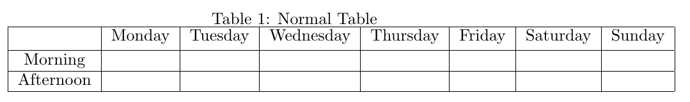
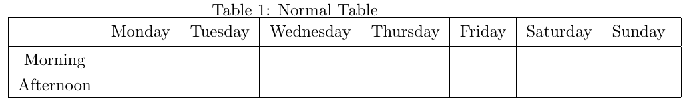
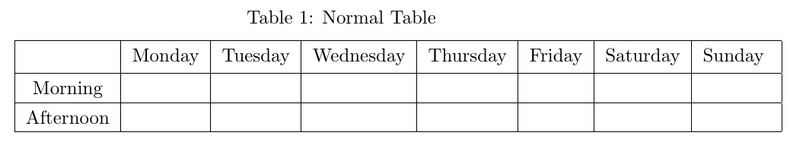

Creating tables are very important when implementing with Office or LaTeX, because the information in table is consistency, not verbose.

So, in this article, we will discuss about how to create a table with different types.

<br>

## Table of contents
- [Creating normal table](#creating-normal-table)
- [Some problems on the normal table](#some-problems-on-the-normal-table)
- [Wrapping up](#wrapping-up)

<br>

## Creating normal table 
Assuming that we need to create normal table that is depicted as:



Then, we have the code LaTeX:

```C#
\documentclass[15pt, a4paper]{article}
\usepackage[british,UKenglish,USenglish,english,american]{babel}

\begin{document}
	\begin{table}[ht]
		\caption{Normal Table}
		\centering
		\begin{tabular}{|c|c|c|c|c|c|c|c|}
			\hline
			& Monday & Tuesday & Wednesday & Thursday & Friday & Saturday & Sunday   \\  [0.5ex]
			\hline 
			Morning    &        &       &       &       &       &       &      \\ 
			\hline 
			Afternoon  &        &       &       &       &       &       &    \\ 
			\hline 
		\end{tabular} 
        \label{table:nonlin}
	\end{table}	
\end{document}
```

With the above LaTeX code, we will find that:
1. Tables are created in the ```table``` environment.

    ```C#
    \begin{table}[where]
    ...
    \end{table}
    ```

    ```where``` argument specifies the allowed locations for the table and it is a sequence of 0 to 4 letters, each one specifying a location where the figure or table my be placed, as follows:

    |  Code  | Meaning                          |
    | ------ | -------------------------------- |
    | h      | Here: at the position in the text where the environment appears. |
    | t      | Top: at the top of the next page. |
    | b      | Bottom: at the bottom of the next page. |
    | p      | Page of floats: on a seperate page containing no text, only figures and tables. |

    The default is ```tbp```.

    If we only specify h (here), and it doesn't fit there, it will float to the end. so, it is best to rank our choices such as htp, ...

    The only things that you can be sure of, however, is that LaTeX will never place a float before it is referenced in the text. But it is possible that it will put it many pages AFTER the place where you actually placed it in the .tex file.


2. The content of table will be written in ```tabular``` environment together with a possible ```\caption``` command.

    ```\caption{title}``` means the title of Table.

    ```\centering``` used for centering table in a page.

    ```\begin{tabular}{|c|c|c|c|}``` command creates a table with four columns and ```c``` is used for centering the column contents. Other column formatting symbols are:
    - ```l```: makes the column contents left justified
    - ```r```: makes the column contents right justified

    The column widths and spacing between the columns are automatically arranged in a table.

    To create multiple columns in a table, we can be used with ```c``` and separate each column with ```|``` symbols: 

    ```C#
    \begin{tabular}{|c|c|c|c|c|c|c|c|}
        \hline
        & Monday & Tuesday & Wednesday & Thursday & Friday & Saturday & Sunday   \\  [0.5ex]
        \hline 
        Morning    &        &       &       &       &       &       &      \\ 
        \hline 
        Afternoon  &        &       &       &       &       &       &    \\          [1ex]
        \hline  
    \end{tabular}
    ```

    ```\hline``` will insert single horizontal line. So, when we want to create a double line under the table title, ```\hline\hline``` command is used.

    ```[0.5ex]``` at the end of the heading row is used to add extra vertical spacing between the heading and the first row of the table.

    ```&``` symbol separates one column from the following column.

    ```\\``` symbol is used to terminate the current row.

    ```\label[table:nonlin]``` command can be used with a marker of ```table:nonlin```. Then ```\ref{table:nonlin}``` refers to this table whenever it is needed to print the table number in the text.


<br>

## Some problems on the normal table
1. When we carefully look at the image on the normal table, we find that the distance between content of rows and horizontal lines is very short. It looks so bad.

    In order to increase this distance, we can create a two commands that is used to define the margin between them.

    ```C#
    \documentclass[15pt, a4paper]{article}

    \newcommand\Tstrut{\rule{0pt}{2.6ex}}           % = 'top' strut
    \newcommand\Bstrut{\rule[-0.9ex]{0pt}{0pt}}     % = 'bottom' strut

    \begin{document}
        \begin{tabular}{|c|c|c|c|c|c|c|c|}
			\hline
			& Monday & Tuesday & Wednesday & Thursday & Friday & Saturday & Sunday  \Tstrut  \\  [0.5ex]
			\hline 
			Morning    &        &       &       &       &       &       &   \Tstrut\Bstrut   \\ 
			\hline 
			Afternoon  &        &       &       &       &       &       &  \Tstrut\Bstrut  \\ 
			\hline 
		\end{tabular} 
    \end{document}
    ```

    So, we have a result that we want:

    

    We will find out about ```\rule``` command:
    - ```\rule[height]{width}{thickness}``` command constructs a box with ```height``` - the height above the baseline to which raise the box (default at 0), ```width``` - the width of the box, ```thickness``` - the thickness of the rule.

2. The space between the table and its caption is very small

    ```C#
    \usepackage{caption}
    \captionsetup[table]{skip=5pt}
    ```

    So, we will have the desired result:

    

<br>

## Wrapping up
- To know about how to create a normal table.
- Note about how to create or define a new command based on the other command.


<br>

Refer:

[http://kb.mit.edu/confluence/pages/viewpage.action?pageId=3907196](http://kb.mit.edu/confluence/pages/viewpage.action?pageId=3907196)

[https://www.techwalla.com/articles/horizontal-line-options-in-latex](https://www.techwalla.com/articles/horizontal-line-options-in-latex)

[https://tex.stackexchange.com/questions/371286/draw-a-horizontal-line-in-latex](https://tex.stackexchange.com/questions/371286/draw-a-horizontal-line-in-latex)

[http://www1.maths.leeds.ac.uk/LaTeX/TableHelp1.pdf](http://www1.maths.leeds.ac.uk/LaTeX/TableHelp1.pdf)

[https://www.latex-tutorial.com/tutorials/tables/](https://www.latex-tutorial.com/tutorials/tables/)

[https://www.latex-tutorial.com/tutorials/tables/](https://www.latex-tutorial.com/tutorials/tables/)