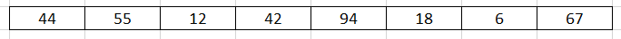

<br>

## Table of contents
- [Given problem](#given-problem)
- [How insertion sort works](#how-insertion-sort-works)
- [Source code](#source-code)
- [When to use](#when-to-use)
- [Wrapping-up](#wrapping-up)


<br>

## Given problem

Suppose we have an array, we need to sort this array followed by increasing order.



In this article, we will use insertion sort to deal with this problem.


<br>

## How insertion sort works

The idea of insertion sort is that assuming that based on an sorted array ```a[0], ..., a[i - 1]```, we want to determine a suitable position of a[i] element to insert it into this array.

Normally, we will go backward from ```i - 1``` index to 0 index. If ```a[i] < a[i - 1]```, swap them.

Belows are some steps to use insertion sort with the above array.

1. Original array

    

2. Insert a new element at the index = 1 into the array's length = 1, from index = 0.

    

    We can find that a new element with value = 55 is always greater than 44. So, we do not swap them.

    Then, our new array that contains both 44, 55 is sorted.

    

3. Insert a new element at the index = 2 into the array's length = 2, from index = 0.

    

    A new element has value = 12 that is less than other elements in our new array.

    Applying the idea of insertion sort, go backward from index = 2 to index = 0, compare a couple element, then swap them.

    

    

    Now, we have our new sorted array:

    

4. Insert a new element at the index = 3 into the array's length = 3, from index = 0.

    

    

    

    Then, we have a sorted array:

    

5. Continue to the other elements, we have the original sorted array.

    


<br>

## Source code

Belows are some versions of the insertion sort's implementation.

1. Version 1

    ```java
    public static void insertionSort(int[] nums) {
        int length = nums.length;

        for (int i = 1; i < length; ++i) {
            for (int j = i; j > 0; --j) {
                if (nums[j] < nums[j - 1]) {
                    // exchange value between nums[j] and nums[j - 1]
                    int tmp = nums[j];
                    nums[j] = nums[j - 1];
                    nums[j - 1] = tmp;
                }
            }
        }
    }

    ```


2. Version 2

    ```java
    public static void insertionSortVersion2(int[] nums) {
        int length = nums.length;

        for (int i = 1; i < length; ++i) {
            int key = nums[i];
            int j = i - 1;

            // shift elements to right side if key < nums[j]
            while (j >= 0 && key < nums[j]) {
                nums[j + 1] = nums[j];
                --j;
            }

            nums[j + 1] = key;
        }
    }

    ```

The complexity of the insertion sort is:
- Time complexity:

    - Worst case: O(n^2) with an array in the descending order.

- Space complexity: O(1)

Insertion sort is a stable sorting algorithm because the order of equal elements is maintained after sorted.

<br>

## When to use

- When our array is nearly sorted.

- When our array has the small size.

- When we need to sort elements online - that is sorting them as they come in.

    Because the idea of insertion sort is that suppose we have an sorted array, then insert a new element into it. Our new array is still sorted.

<br>

## Wrapping up

- Understanding about some versions of insertion sort: exchange and shift elements.

<br>

Refer:

[https://www.acodersjourney.com/insertion-sort/](https://www.acodersjourney.com/insertion-sort/)