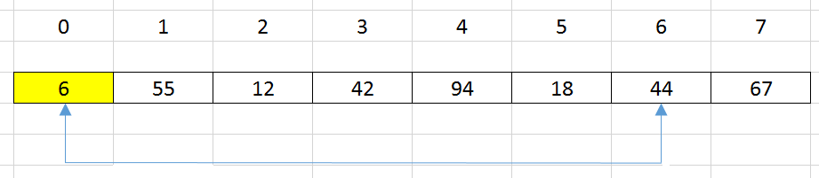
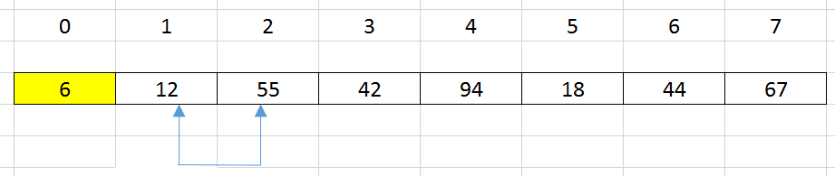
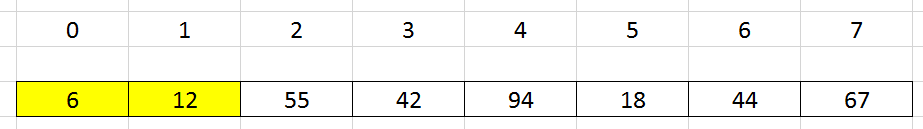
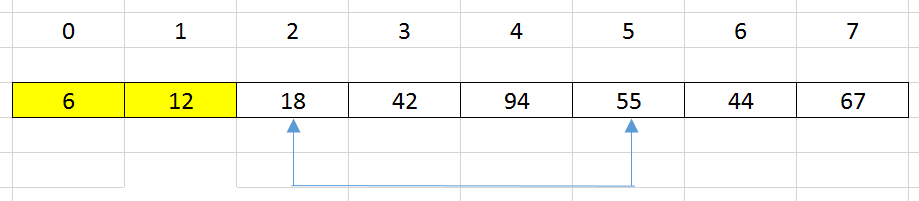
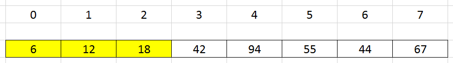
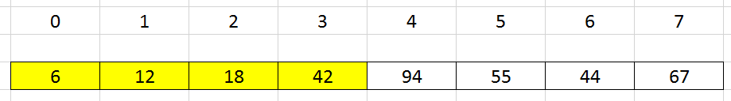
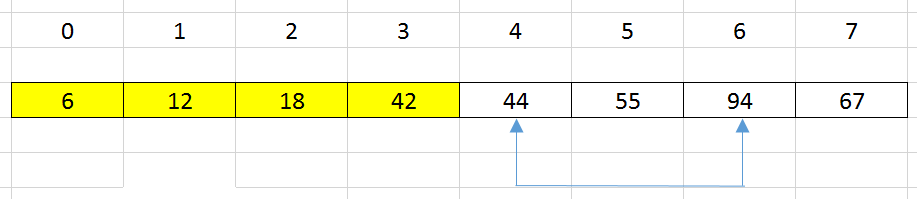
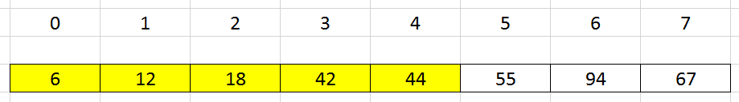
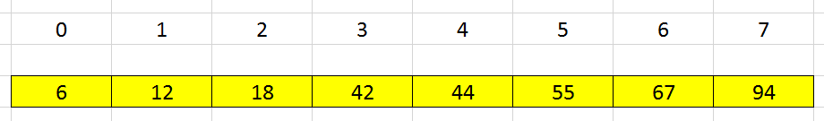

<br>

## Table of contents
- [Given problem](#given-problem)
- [How selection sort works](#how-selection-sort-works)
- [Source code](#source-code)
- [When to use](#when-to-use)
- [Wrapping up](#wrapping-up)


<br>

## Given problem

Suppose we have an array, we need to sort this array followed by increasing order.


In this article, we will use selection sort to deal with this problem.

<br>

## How selection sort works

The idea of the selection sort is that:
- at the step ith, we need to choose the mimimum element in the array ```a[i], ..., a[n - 1]```.
- Then, iterate all element from ```i + 1``` to ```n - 1```, compare ```a[i]``` and ```a[j]``` with ```j = i + 1, ..., n```, and save the index of the minimum element in the ```minIndex``` variable.

- At the end of ith loop, we will exchange value between ```a[i]``` and ```a[minIndex]```.

- Finally, we will have a sorted array.

Belows are some steps to describe the implementation of selection sort.

1. Original array

    

2. At 0th position, select ```a[0]``` as the minimum element of the array has range from 0 to ```n - 1```.

    - Iterate all elements from 1 to n - 1.
    
    - Find the index = 6 is the minimum element.

    - Swap ```a[0]``` and ```a[6]```.

    

3. At 1st position, select ```a[1]``` as the minimum element of the array has range from 1 to ```n - 1```.

    - Iterate all elements from 2 to n - 1.
    
    - Find the index = 2 is the minimum element.

    - Swap ```a[1]``` and ```a[2]```.

    

    Then, we have our array looks like that:

    

4.  At 2nd position, select ```a[2]``` as the minimum element of the array has range from 2 to ```n - 1```.

    - Iterate all elements from 3 to n - 1.
    
    - Find the index = 5 is the minimum element.

    - Swap ```a[2]``` and ```a[5]```.

    

    Then, we have our array looks like that:

    

5.  At 3rd position, select ```a[3]``` as the minimum element of the array has range from 3 to ```n - 1```.

    - Iterate all elements from 4 to n - 1.
    
    - Find it is the minimum element, so we do not need to swap anything.

    Then, we have our array looks like that:

    

6. At 4st position, select ```a[4]``` as the minimum element of the array has range from 4 to ```n - 1```.

    - Iterate all elements from 5 to n - 1.
    
    - Find the index = 6 is the minimum element.

    - Swap ```a[4]``` and ```a[6]```.

    

    Then, we have our array looks like that:

    

7. Continue to do that, we have our final array.

    

<br>

## Source code

```java
public static void selectionSort(int[] nums) {
    int length = nums.length;

    for (int i = 0; i < length; ++i) {
        int minIndex = i;

        for (int j = i + 1; j < length; ++j) {
            if (nums[j] < nums[minIndex]) {
                minIndex = j;
            }
        }

        // swap value at the minIndex and i
        int tmp = nums[minIndex];
        nums[minIndex] = nums[i];
        nums[i] = tmp;
    }
}
```

The complexity of the selection sort:
- Time complexity: O(n^2)
- Space complexity: O(1)

Selection sort is not stable sorting algorithm.


<br>

## When to use

- When our array has the small size.

- When our array is not partially sorted.

<br>

## Wrapping up

- Understanding the idea of the selection sort, and how to implement it.
