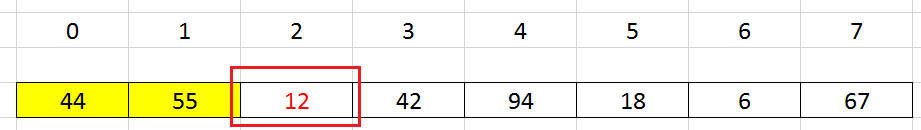
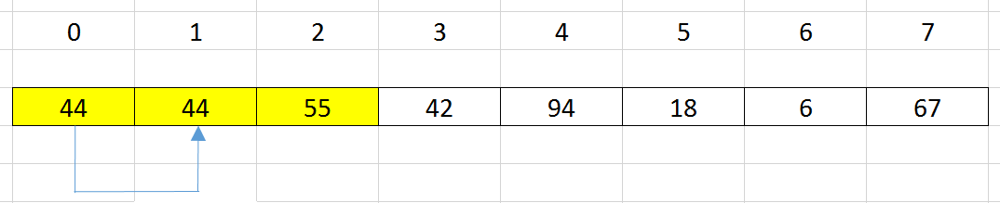

<br>

## Table of contents
- [Given problem](#given-problem)
- [How Binary Insertion Sort works](#how-binary-insertion-sort-works)
- [Source code](#source-code)
- [When to use](#when-to-use)
- [Wrapping up](#wrapping-up)


<br>

## Given problem

Suppose we have an array, we need to sort this array followed by increasing order.


In this article, we will use binary insertion sort to deal with this problem.

<br>

## How Binary Insertion Sort works

Steps of Binary Insertion Sort are similar to Insertion Sort. But to insert a new element into a sorted subarray, we use binary search algorithm to find the suitable position for it, instead of iterating all elements backward from i to 0 position.

Belows are some steps that describe Binary Insertion sort works.
1. Original array


2. Insert an element at index ```i``` = 1 into a sorted subarray has ```length = 1```, from the ```position = 0```.

    - Use binary search to find position --> ```pos = 1```.

    - shift all elements that are from ```pos``` to ```i - 1``` to the right side by one position.

    Because an element at index = 1 always satisfies in the sorted array. So, we have our array:

    


3. Insert an element at index ```i``` = 2 into a sorted subarray has ```length = 2```, from the ```position = 0```.

    

    - Use binary search to find position --> ```pos = 0```.

    - shift all elements that are from ```pos``` to ```i - 1``` to the right side by one position.

        

        

    - update the element's value at index i = pos by the element's value at index i = 2.

        

4. Insert an element at index ```i``` = 3 into a sorted subarray has ```length = 3```, from the ```position = 0```.

    

    - Use binary search to find position --> ```pos = 1```.

    - shift all elements that are from ```pos``` to ```i - 1``` to the right side by one position.

        

        

    - update the element's value at index i = pos by the element's value at index i = 3 that we've saved it.

        

3. Continue with the other elements, we can have a sorted array.

    

The complexity of Binary Insertion sort:
- Time complexity: O(n^2)
- Space complexity: O(1)

Use Binary Insertion Sort will reduce the number of comparisons in Insertion Sort, but the number of exchange elements does not still change.

<br>

## Source code

```java
public static void binaryInsertionSort(int[] nums) {
    int length = nums.length;

    for (int i = 1; i < length; ++i) {
        int key = nums[i];
        int insertedPosition = findPosition(nums, 0, i - 1, key);

        for (int j = i - 1; j >= insertedPosition; --j) {
            nums[j + 1] = nums[j];
        }

        nums[insertedPosition] = key;
    }
}

public static int findPosition(int[] nums, int start, int end, int key) {
    while (start <= end) {
        int mid = start + (end - start) / 2;

        if (key < nums[mid]) {
            end = mid - 1;
        } else {
            start = mid + 1;
        }
    }

    return start;
}
```

<br>

## When to use

- When our array has the small size.

<br>

## Wrapping up

- Understanding how apply binary search with insertion sort algorithm. Note that our array is considered as a sorted array, so we can use binary search here.


