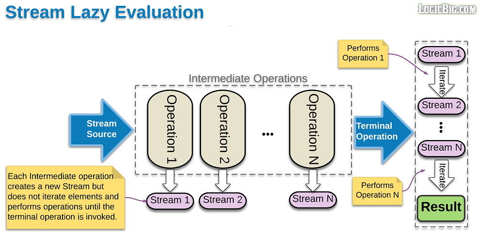

In this article, we will understanding about what is stream, and how to use stream in Java 8. Usually apply stream in java 8 makes our code understandable, maintainable, ...

Let's get started.

<br>

## Table of contents
- [What is Stream in Java 8?](#what-is-stream-in-java-8?)
- [How Stream works](#how-stream-works)
- [Stream pipeline](#stream-pipeline)
- [Some ways to create Stream](#some-ways-to-create-stream)
- [The differences between Streams and Collection](#the-difference-between-streams-and-collection)
- [The difference between map() and flatMap() methods](#the-difference-between-map()-and-flatMap()-methods)
- [Wrapping up](#wrapping-up)


<br>

## What is Stream in Java 8?
Normally, we will use Collections framework to handle data. Though this framework enables a user to handle data quite efficiently, the main complexity lies in using loops and performing repeating checks. It also does not facilitate the use of multi-core system efficiently. So, Stream will deal with this problem.

A Stream is a series of different elements that have been emitted over a time period. Streams are like an array, but not an array. They do have distinct differences. The elements of an array are sequentially arranged in memory, while the elements in a Stream are not. Every Stream has a beginning as well as an end.

In order to understand about stream, we can give an example:

Have you ever sat on the banks of a river or flowing water and put your legs in it? Most of us have at least once enjoyed this peaceful experience. The water moves around our legs and moves ahead. Have you ever observed the same flowing water passing through your legs twice? Obviously, not! It's the same when it comes to Streams.

<br>

## How Stream works



From an above image, we can have some conclusion about the way that Stream works.
- Intermediate operations are lazy because when we call a terminal operation, our intermediate operations will be evaluated.

- Each intermediate operation creates a new stream, stores the provided operation/function and return the new stream.

- The time when terminal operation is called, traversal of streams begins and the associated function is performed one by one.

To understand deeper about Stream, we can get an example.

```java
public void checkLaziLoadOfIntermediateOperations() {
    List<String> list = Arrays.asList("abc1", "abc2", "abc3", "abc21", "abc32", "abc13");
    Stream<String> strStream = list.stream().filter(element -> {
        System.out.println("filter() was called " + element);
        return element.contains("2");
    }).map(element -> {
        System.out.println("map() was called " + element);
        return element.toUpperCase();
    });

    System.out.println("Starting with terminal operation");
    List<String> lst = strStream.collect(Collectors.toList());
}
```

Then, we have a result of the above example.

```yaml
Starting with terminal operation
filter() was called abc1

filter() was called abc2
map() was called abc2

filter() was called abc3

filter() was called abc21
map() was called abc21

filter() was called abc32
map() was called abc32

filter() was called abc13
```


<br>

## Stream pipeline
Stream pipeline is the concept of chaining operations together. Stream pipeline consists of:
- Source

    For example: Collection, an array, a generator function, an I/O channel.

- Operations

    These operations can be separated into two catgories:
    - Intermediate operations

        - They return an new instance of Stream itself when it runs.
        - They are always lazy, executing an intermediate operation such as ```filter()``` does not actually perform any filtering, but instead creates a new stream that, when traversed, contains the elements of the initial stream that match the given predicate. Traversal of the pipeline source does not begin until the terminal operation of the pipeline is executed.
        - They are divided into stateless and stateful operations.
            - Stateless operations, such as ```filter``` and ```map```, retain no state from previously seen element when processing a new element -- each element can be processed independently of operations on other elements.
            - Stateful operations, such as ```distinct``` and ```sorted```, may incorporate state from previously seen elements when processing new elements.
        - For example: 

            ```java
            // returns a stream consisting of the distinct elements of this stream
            Stream<T> distinct();

            // returns a stream consisting of the elements of this stream that match the given predicate.
            Stream<T> filter(Predicate<? super T> predicate);

            // Returns a stream consisting of the elements of this stream, truncated to be no longer than maxSize in length.
            Stream<T> limit(long maxSize);

            // Returns a stream consisting of the results of applying the given function to the elements of this stream.
            <R> Stream<R> map(Function<? super T,? extends R> mapper);

            // Returns a stream consisting of the results of replacing each element of this stream with the contents of a mapped stream produced by applying the provided mapping function to each element.
            <R> Stream<R> flatMap(Function<? super T,? extends Stream<? extends R>> mapper)

            // Returns a stream consisting of the elements of this stream, additionally performing the provided action on each element as elements are consumed from the resulting stream.
            Stream<T> peek(Consumer<? super T> action);

            // Returns a stream consisting of the remaining elements of this stream after discarding the first n elements of the stream.
            Stream<T> skip(long n);

            // Returns a stream consisting of the elements of this stream, sorted according to natural order.
            Stream<T> sorted();

            // Returns a stream consisting of the elements of this stream, sorted according to the provided Comparator.
            Stream<T> sorted(Comparator<? super T> comparator);
            ```

    - Terminal operations

        - It returns an result and terminates our pipeline.
        - It may traverse the stream to produce a result or a side-effect.
        - After the terminal operation is performed, the stream pipeline is considered consumed, and can no longer be used; if we need to traverse the same data source again, we must return to the data source to get a new stream.
        - For example:

            ```java
            // return whether all elements of stream matched the provided predicate
            boolean allMatch(Predicate<? super T> predicate);

            // return whether any elements of stream matched the provided predicate
            boolean anyMatch(Predicate<? super T> predicate);

            // Returns whether no elements of this stream match the provided predicate.
            boolean	noneMatch(Predicate<? super T> predicate);

            // Performs a mutable reduction operation on the elements of this stream using a Collector.
            <R, A> R collect(Collector<? super T,A,R> collector);

            // Performs a mutable reduction operation on the elements of this stream.
            <R> R collect(Supplier<R> supplier, BiConsumer<R, ? super T> accumulator, BiConsumer<R, R> combiner);

            // return the count of elements in this stream
            long count();

            // Returns an Optional describing some element of the stream, or an empty Optional if the stream is empty.
            Optional<T>	findAny();

            // Returns an Optional describing the first element of this stream, or an empty Optional if the stream is empty.
            Optional<T>	findFirst();

            // Performs an action for each element of this stream.
            void forEach(Consumer<? super T> action);

            // Performs an action for each element of this stream, in the encounter order of the stream if the stream has a defined encounter order.
            void forEachOrdered(Consumer<? super T> action);

            // Performs a reduction on the elements of this stream, using an associative accumulation function, and returns an Optional describing the reduced value, if any.   
            Optional<T>	reduce(BinaryOperator<T> accumulator);

            // Performs a reduction on the elements of this stream, using the provided identity value and an associative accumulation function, and returns the reduced value.
            T reduce(T identity, BinaryOperator<T> accumulator)

            // Performs a reduction on the elements of this stream, using the provided identity, accumulation and combining functions.
            <U> U reduce(U identity, BiFunction<U,? super T,U> accumulator, BinaryOperator<U> combiner)

            // Returns the maximum element of this stream according to the provided Comparator.
            Optional<T>	max(Comparator<? super T> comparator);

            // Returns the minimum element of this stream according to the provided Comparator.
            Optional<T>	min(Comparator<? super T> comparator);

            // Returns an array containing the elements of this stream.
            Object[] toArray();
            ```
    
    - Static method for operations

        ```java
        // Returns a builder for a Stream.
        static <T> Stream.Builder<T> builder();

        // Creates a lazily concatenated stream whose elements are all the elements of the first stream followed by all the elements of the second stream.
        static <T> Stream<T> concat(Stream<? extends T> a, Stream<? extends T> b);

        // Returns an empty sequential Stream.
        static <T> Stream<T> empty();

        // Returns an infinite sequential unordered stream where each element is generated by the provided Supplier.
        static <T> Stream<T> generate(Supplier<T> s);

        // Returns an infinite sequential ordered Stream produced by iterative application of a function f to an initial element seed, producing a Stream consisting of seed, f(seed), f(f(seed)), etc.
        static <T> Stream<T> iterate(T seed, UnaryOperator<T> f)

        // Returns a sequential ordered stream whose elements are the specified values.
        static <T> Stream<T> of(T... values);

        // Returns a sequential Stream containing a single element.
        static <T> Stream<T> of(T t);
        ```

<br>

## Some ways to create Stream
1. From a ````Collection```` via the ```stream()``` and ```parallelStream()``` methods.

    ```java
    // use double-brace initialization
    Collection<Integer> collection = new ArrayList<>() {{
        add(1);
        add(2);
        add(3);
        add(4);
    }};

    Stream<Integer> intStream = collection.stream();
    intStream.forEach(item -> System.out.println(item));
    ```

2. From an array via ```Arrays.stream(Object[])```.

    ```java
    Integer[] ints = {1, 2, 3, 4, 5};
    Stream<Integer> intStream = Arrays.stream(ints);
    intStream.forEach(item -> System.out.println(item));
    ```

3. From static factory methods on the stream classes, such as ```Stream.of(Object[])```, ```IntStream.range(int, int)``` or ```Stream.iterate(Object, UnaryOperator)```.

    ```java
    // use of() static method of Stream
    Stream<Integer> intStream = Stream.of(1, 2, 3, 4, 5);
    intStream.forEach(item -> System.out.println(item));

    // use range() or rangeClosed() methods that are only applied for primitive types: int, double, long
    IntStream intStream = IntStream.range(5, 10);
    intStream.forEach(item -> System.out.println(item));

    // use iterate
    Stream<Integer> intStream = Stream.iterate(10, n -> n + 2).limit(10);
    intStream.forEach(item -> System.out.println(item));
    ```

4. The lines of a file can be obtained from ```BufferedReader.lines()```.

    ```java
    String file_path = ".\\data.txt";
    BufferedReader bufferedReader = new BufferedReader(new InputStreamReader(new FileInputStream(file_path)));
    Stream<String> lineStream = bufferedReader.lines();

    lineStream.forEach(line -> System.out.println(line));
    ```

5. Streams of file paths can be obtained from methods in ```Files```.

    ```java
    Path path = Paths.get("./data.txt");
    // Stream<String> contents = Files.lines(path);
    Stream<String> contents = Files.lines(path, Charset.forName("UTF-8"));
    contents.forEach(item -> System.out.println(item));
    ```

6. Streams of random numbers can be obtained from ```Random.ints()```.

    ```java
    Random random = new Random();
    IntStream intStream = random.ints(10);

    intStream.forEach(item -> System.out.println(item));
    ```

7. Numerous other stream-bearing methods in the ```JDK```, including ```BitSet.stream()```, ```Pattern.splitAsStream(java.lang.CharSequence)```, and ```JarFile.stream()```.

8. Use Stream.builder() method

    ```java
    Stream.Builder<Employee> empStreamBuilder = Stream.builder();

    empStreamBuilder.accept(arrayOfEmps[0]);
    empStreamBuilder.accept(arrayOfEmps[1]);
    empStreamBuilder.accept(arrayOfEmps[2]);

    Stream<Employee> empStream = empStreamBuilder.build();
    ```

9. Use Stream.generate() method

    ```java
    Stream<String> streamGenerated =
                Stream.generate(() -> "element").limit(10);
    ```

10. Use lines() static method of Java NIO class Files

    ```java
    String pathFile = "...";
    Path path = Paths.get(pathFile);
    Stream<String> streamOfStrings = Files.lines(path);
    Stream<String> streamWithCharset = 
                Files.lines(path, Charset.forName("UTF-8"));
    ```

<br>

## The differences between Streams and Collection
- Collection efficiently manage and allow access to elements, whereas Stream do not allow direct manipulation or access to elements.

- Stream do not store data. They only allow passing the elements through a computational pipeline. The sources of elements in stream are array, list and map.

- Stream is functional in nature. The function is applied on each element of the stream and produces the result but the source elements are not modified.

- Stream operations are always divided into intermediate operations and terminal operations. Intermediate operations are always lazy.

- Stream is unbounded whereas collection can have finite size. The infinite elements can be computed whitin finite using streams.

- While computation the elements of stream are visited only once during life. The elements can be revisited in another instance of stream which will be the output of computation on previous stream instance.


<br>

## Source code

In order to understand deeper about how stream runs in Java 8, check source code out on [Stream-java-8](https://github.com/gamethapcam/J2EE/tree/master/src/Java_Core/Java%208/Stream).

<br>

## The difference between map() and flatMap() methods
1. Signature of ```map()``` and ```flatMap()``` methods

    ```java
    <R> Stream<R> map(Function<? super T,? extends R> mapper);

    <R> Stream<R> flatMap(Function<? super T,? extends Stream<? extends R>> mapper)
    ```

2. Intention of each method
    From the signature of ```map()``` and ```flatMap()``` method:
    - In ```map()``` method, it receives a functional interface generic ```Function``` with two types ```T``` and ```R```. Then it will map each type of T to R type.

        Therefore, the return type of ```map()``` method is ```Stream<R>```.

        For example:

        ```java
        List<Integer> numbers = {2, 5, 7};
        List<Integer> doubleNumbers = numbers.stream()
                                             .map(i -> i * 2)
                                             .collect(Collectors.toList());
        ```

    - In ```flatMap()``` method, it receives a functional interface generic ```Function``` with two types ```T``` and ```Stream<? extends R>```. It means that we will map each type of ```T``` to ```Stream<? extends R>```. 
    
        Therefore, T is a collection that can be transform to stream.

        The return type of ```flatMap()``` method is ```Stream<R>```.

        For example:

        ```java
        List<List<String>> lst = Arrays.asList( 
            Arrays.asList("Bezos", "Jeff"),
            Arrays.asList("Gates", "Bill"),
            Arrays.asList("Ma", "Jack"));
        
        List<String> namesFlatStream = lst.stream()
            .flatMap(Collection::stream)
            .collect(Collectors.toList());
        ```
<br>

## Wrapping up
- Stream represent a sequence of objects from a source, which supports aggregate operations.

<br>

Refer:

**Stream Java 8 under the hood**

[https://developer.ibm.com/series/java-streams/](https://developer.ibm.com/series/java-streams/)

[https://developer.ibm.com/articles/j-java-streams-3-brian-goetz/](https://developer.ibm.com/articles/j-java-streams-3-brian-goetz/)

<br>

[Reactive programming with Java 9](https://subscription.packtpub.com/book/application_development/9781787124233/1/ch01lvl1sec8/asynchronous-programming)

[https://docs.oracle.com/javase/8/docs/api/java/util/stream/package-summary.html#StreamSources](https://docs.oracle.com/javase/8/docs/api/java/util/stream/package-summary.html#StreamSources)

[https://stackoverflow.com/questions/26684562/whats-the-difference-between-map-and-flatmap-methods-in-java-8](https://stackoverflow.com/questions/26684562/whats-the-difference-between-map-and-flatmap-methods-in-java-8)

[https://www.logicbig.com/tutorials/core-java-tutorial/java-util-stream/lazy-evaluation.html](https://www.logicbig.com/tutorials/core-java-tutorial/java-util-stream/lazy-evaluation.html)

<br>

**Some interesting ways to use Stream Java 8**

[https://www.baeldung.com/java-8-streams](https://www.baeldung.com/java-8-streams)