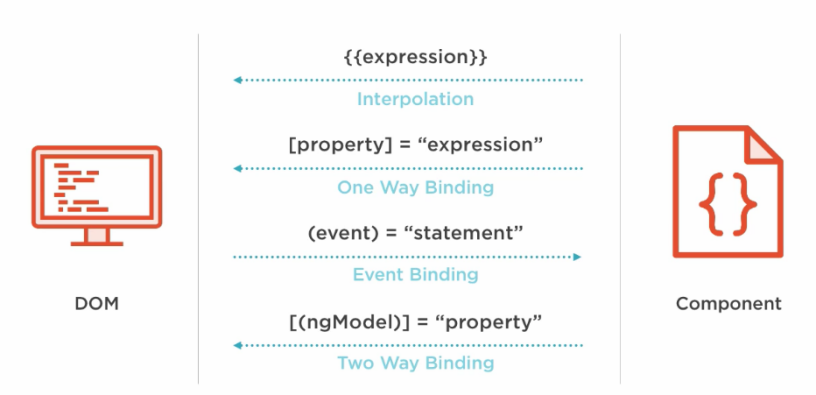

In this article, we will delve into the world of Angular with Data binding. It is the basic knowledge that we must know when working with Angular.

So, let's get started.

<br>

## Table of contents
- [One Way Binding : From Component to View](#one-way-binding-:-from-component-to-view)
    - [Interpolation binding](#Interpolation-binding)
    - [Property binding](#property-binding)
    - [Attribute binding](#attribute-binding)
    - [Class binding](#class-binding)
    - [Style binding](#style-binding)

- [One Way Binding : From View to Component](#one-way-binding-:-from-view-to-component)
    - [Event binding](#event-binding)

- [Two way Binding](#two-way-binding)
- [Wrapping up](#wrapping-up)

<br>

## One Way Binding : From Component to View
In one way binding from Component to View, we have many different types such as:
- Interpolation binding

    It refers to binding expressions into marked up language.

    ```javascript
    // app.component.ts
    import { Component } from '@angular/core';

    @Component({
        selector: 'app-example',
        template: `
                    <div>
                        '{{authorName}}'
                    </div>`
    })
    export class AppComponent {
        authorName = 'Dan Brown';
    }
    ```

- Property binding

    It is used to set a property of a View element by the value of a template expression that is stemed from the attributes of Component.

    When we want to binding which property of View element, we should search or check this property is of that element correctly.

    ```javascript
    // app.component.ts
    import { Component } from '@angular/core';

    @Component({
        selector: 'app-example',
        template: `<input type='text' [disabled]='isDisabled' minLength=4 required >`
    })
    export class AppComponent {
        isDisabled = false;
    }
    ```

    The following is something that we need to avoid during property binding: [https://www.pluralsight.com/guides/property-binding-angular](https://www.pluralsight.com/guides/property-binding-angular)

- Attribute binding

    It is used to set a ```attribute``` property of a View element. Attribute binding is mostly used where we do not have any property view wih respect to an html element attribute.

    For example:

    ```javascript
    <table>
        <tr>
            <td colspan='{{4}}'></td>
        </tr>
    </table>
    ```

    The above code will throw an error **Template parse errors: Can't bindto 'colspan' since it isn't a known native property**.

    The syntax of attribute binding:

    ```javascript
    [attr.attribute-name]='expression'
    ```

    ```attribute-name``` - the name of attribute that we want

    ```expression``` - it will be evaluated to value for ```attribute-name```.

    For example:

    ```javascript
    // app.component.ts
    import { Component } from '@angular/core';

    @Component({
        selector: 'app-example',
        template: ` <table>
                        <tr>
                            <td [attr.colspan]='4'></td>
                        </tr>
                    </table>
        `
    })
    export class AppComponent {
        isDisabled = false;
    }
    ```

    When working with attribute binding, we have the question about **The difference between HTML attribute and DOM property**. Below is the explannation about DOM properties and attributes HTML.

    We can refer the link of [angular.io](https://angular.io/guide/template-syntax#html-attribute-vs-dom-property).

    When writing HTML source code, you can define attributes on your HTML elements. Then, once the browser parses your code, a corresponding DOM node will be created. This node is an object, and therefore it has properties.

    For instance, this HTML element:

    ```javascript
    <input type="text" value="Name:">
    ```

    has 2 attributes (```type``` and ```value```).

    Once the browser parses this code, a ```HTMLInputElement``` object will be created, and this object will contain dozens of properties like: ```accept```, ```accessKey```, ```align```, ```alt```, ```attributes```, ```autofocus```, ```baseURI```, ```checked```, ```childElementCount```, ```childNodes```, ```children```, ```classList```, ```className```, ```clientHeight```, etc.

    For a given DOM node object, properties are the properties of that object, and attributes are the elements of the ```attributes``` property of that object.

    When a DOM node is created for a given HTML element, many of its properties relate to attributes with the same or similar names, but it's not a one-to-one relationship. For instance, for this HTML element:

    ```javascript
    <input id="the-input" type="text" value="Name:">
    ```

    The corresponding DOM node will have ```id```, ```type```, and ```value``` properties (among others):

    - The ```id``` property is a reflected property for the ```id``` attribute: Getting the property reads the attribute value, and setting the property writes the attribute value. id is a pure reflected property, it doesn't modify or limit the value.

    - The ```type``` property is a reflected property for the ```type``` attribute: Getting the property reads the attribute value, and setting the property writes the attribute value. ```type``` isn't a pure reflected property because it's limited to known values (e.g., the valid types of an input). If you had ```<input type="foo">```, then ```theInput.getAttribute("type")``` gives you "foo" but ```theInput.type``` gives you "text".

    - In contrast, the ```value``` property doesn't reflect the ```value``` attribute. Instead, it's the current value of the input. When the user manually changes the value of the input box, the ```value``` property will reflect this change. So if the user inputs **John** into the input box, then:

        ```javascript
        theInput.value // returns "John"
        ```

        whereas:

        ```javascript
        theInput.getAttribute('value') // returns "Name:"
        ```

        The ```value``` property reflects the current text-content inside the input box, whereas the ```value``` attribute contains the initial text-content of the ```value``` attribute from the HTML source code.

        So if you want to know what's currently inside the text-box, read the ```property```. If you, however, want to know what the initial value of the text-box was, read the ```attribute```. Or you can use the ```defaultValue``` property, which is a pure reflection of the value attribute:

        ```javascript
        theInput.value                 // returns "John"
        theInput.getAttribute('value') // returns "Name:"
        theInput.defaultValue          // returns "Name:"
        ```

        There are several properties that directly reflect their attribute (```rel```, ```id```), some are direct reflections with slightly-different names (```htmlFor``` reflects the ```for``` attribute, ```className``` reflects the ```class``` attribute), many that reflect their attribute but with restrictions/modifications (```src```, ```href```, ```disabled```, ```multiple```), and so on. The [spec](https://html.spec.whatwg.org/multipage/common-dom-interfaces.html#reflect) covers the various kinds of reflection.

- Class binding

    It is used to set a ```class``` property of a View element with CSS classes. If we use javascript for this functionality, we will use ```removeClass()``` or ```addClass()``` dynamically.

    Syntax: 

    ```javascript
    [class.className]='expression'
    ```

    ```class``` - the property of a View element.
    ```className``` - then name of class that we want to apply for this element.
    ```expression``` - it will be evaluated to ```true``` or ```false``` to determine if the class should be applied.

    For example:

    ```javascript
    <div [class.alert-danger]='isDanger'>
        ...
    </div>
    ```

    When we use ```class.className``` in our applicatin, it uses only one class name for a View element. So, if we want to apply multiple class name for it. What will we do?

    --> ```ngClass``` directive will be applied in this case. ```ngClass``` should receive an object with class names as keys and expressions that evaluate to ```true``` or ```false``` as values.

    For example:

    ```javascript
    // app.component.ts
    import { Component } from '@angular/core';

    @Component({
        selector: 'app-example',
        template: `
            <div [ngClass]='classes'>
                ...
            </div>
            <div [ngClass]='setClasses()'>
                ...
            </div>
        `
    })
    export class AppComponent {
        ...
        classes = {
            alert-danger: this.isDanger,
            inactive: !this.isActive,
            ...
        };

        setClasses() {
            let classes = {
                alert-danger: this.isDanger,
                inactive: !this.isActive,
                ...
            };

            return classes;
        }
    }
    ```

- Style binding

    It is used to set a ```style``` of a View element. Sometimes, we want to set the property that has the unit such as em, px, % or rem.

    ```javascript
    <button [style.width.px]="'120'">Browse</button>
    <button [style.font-size.em]="isDanger ? '20' : '10'">Take care</button>
    ```

    ```javascript
    // app.component.ts
    import { Component } from '@angular/core';

    @Component({
        selector: 'app-example',
        template: `<div [style.color]='color'>{{authorName}}</div>`
    })
    export class AppComponent {
        color = '#333';
        authorName = 'Dan Brown';
    }
    ```

    Like the class binding, we also want to set multiple style for a View element, we can use ```ngStyle``` directive to do it.

    ```javascript
    // app.component.ts
    import { Component } from '@angular/core';

    @Component({
        selector: 'app-example',
        template: `
            <button [ngStyle]='multipleStyles'>Click me!</button>
            <button [ngStyle]='getStyles()'>Cancel</button>
        `
    })
    export class AppComponent {
        multipleStyles = {
            'background-color': 'red',
            'foreground-color': 'white',
            'font-size': '20px',
            'width': '120px',
            'height': '30px'
        }

        getStyles() {
            'background-color': 'white',
            'foreground-color': 'cyan',
            'font-size': '20px',
            'width': '120px',
            'height': '30px'
        }
    }
    ```

<br>

## One Way Binding : From View to Component
In one way binding from view to component, we can use event binding to implement it.

- Event binding

    For example: 

    ```javascript
    // app.component.ts
    import { Component } from '@angular/core';

    @Component({
        selector: 'app-example',
        template: `<button (click)='displayContent()'>
                        Click me!
                    <button>`
    })
    export class AppComponent {
        displayContent(): void {
            ...
        }
    }
    ```

    So, when we click the above button, ```displayContent()``` method in the Componenet will be called.

    Some notes about event binding:
    - The event binding is composed by a target event surrounded by parentheses equals to an expression to be executed when that event is fired.

    - Each event binding will have information about the event, you can access to this information through the event object: ```$event```.

    - If the event is a native DOM event, then the event object will have the same info as any native DOM event

    - There are three types of events: ```Element event```, ```Component event``` and ```Directive Event```.

        ```html
        <!-- Element event -->
        <button (click) = "onSave()">Save</button>

        <!-- Component event -->
        <hero-detail (deleteRequest)="deleteHero()"></hero-detail>

        <!-- Directive event -->
        <div (myClick)="clicked=$event">click me</div>
        ```

<br>

## Two way Binding
We can use ```ngModel``` directive to implement two way binding.

For example:

```javascript
// In app.module.ts
import { NgModule } from '@angular/core'; 
import { BrowserModule } from '@angular/platform-browser'; 
import { FormsModule } from "@angular/forms"; 
 import { AppComponent } from './app.component'; 
import { FormsModule } from "@angular/forms";
 @NgModule({ 
   imports: [BrowserModule, FormsModule], 
   declarations: [ AppComponent], 
   bootstrap: [AppComponent] 
}) 
export class AppModule { }

// In app.component.ts
import { Component } from '@angular/core'; 
 @Component({ 
   selector: 'app-example', 
   template: ` 
                <input [(ngModel)] ='val'>
                Entered value is:  {{val}}
             ` 
}) 
export class AppComponent { 
   val: string = 'Hello, angular 7'; 
}

```

The first thing to use ```ngModel``` is to import ```FormsModule``` from ```@angular/forms``` in ```app.module.ts``` file.

If we do not import the FormsModule, we will get error like **Template parse errors**.

But, we can wonder that What is the nature of two way binding with ngModel?

In fact, two-way binding is the combination of property binding and event binding. We can do this with the below example:

```html
<!-- earlier version -->
<input [value]="username" (input)="username = $event.target.value" />
<p>Hello {{username}}</p>

<!-- latest version -->
<input [ngModel]="name" (ngModelChange)="name = $event" />
```

With the earlier version, we have:
- ```[value]="username"``` - binds the expression ```username``` to the input element's ```value``` property.

- ```(input)="expression``` - is a declarative way of binding an expression to the input element's ```input``` event.

- ```username=$event.target.value``` - the expression that gets executed when the ```input``` event is fired. 

- ```$event``` - is an expression exposed in event bindings by Angular, which has the value of the event's payload. The payload of the input event is an InputEventObject which comes with a target property, which is a reference to the DOM object that fired the event.

With the latest version, we have:
- The property binding ```[ngModel]="name"``` takes care of updating the underlying input DOM element.

- The event binding ```[(ngModelChange)]``` notifies the outside world when there was a change in the DOM. Then, ```[(ngModelChange)]``` takes care of extracting ```target.value``` from the inner ```$event``` payload and simply emits that.

    Actually, the DefaulValueAccessor will take care of extracting that value and also writing to the underlying DOM object.

<br>

## Wrapping up
- The image below will have overview about data binding in Angular.

    

- ```ngModel``` comes as a built-in directive as part of the ```FormsModule``` to implement two-way binding and should be preferred when building components that serve as custom form controls.

- Unlike AngularJS, Angular does not provide two way binding by default, which avoid all the digest cycle and watchers issues that AngularJS dealt with.

- Data binding in Angular works by synchronizing the data in the components with the UI so that it reflects the current value of the data. To achieve the synchronization of the View and the Model, Angular uses change detection.

<br>

Refer:

[https://www.pluralsight.com/guides/property-binding-angular](https://www.pluralsight.com/guides/property-binding-angular)

[https://www.pluralsight.com/guides/attribute-class-style-bindings-angular](https://www.pluralsight.com/guides/attribute-class-style-bindings-angular)

[https://www.pluralsight.com/guides/one-and-two-way-data-binding-angular](https://www.pluralsight.com/guides/one-and-two-way-data-binding-angular)

[https://angular-2-training-book.rangle.io/components/app_structure_with_components/two_way_data_binding](https://angular-2-training-book.rangle.io/components/app_structure_with_components/two_way_data_binding)

[https://blog.thoughtram.io/angular/2016/10/13/two-way-data-binding-in-angular-2.html](https://blog.thoughtram.io/angular/2016/10/13/two-way-data-binding-in-angular-2.html)

[https://stackoverflow.com/questions/6003819/what-is-the-difference-between-properties-and-attributes-in-html](https://stackoverflow.com/questions/6003819/what-is-the-difference-between-properties-and-attributes-in-html)

[https://medium.com/@bartsis/understanding-two-way-data-binding-in-angular-2-a8eafa850637](https://medium.com/@bartsis/understanding-two-way-data-binding-in-angular-2-a8eafa850637)

[https://medium.com/@preethi.s/angular-custom-two-way-data-binding-3e618309d6c7](https://medium.com/@preethi.s/angular-custom-two-way-data-binding-3e618309d6c7)