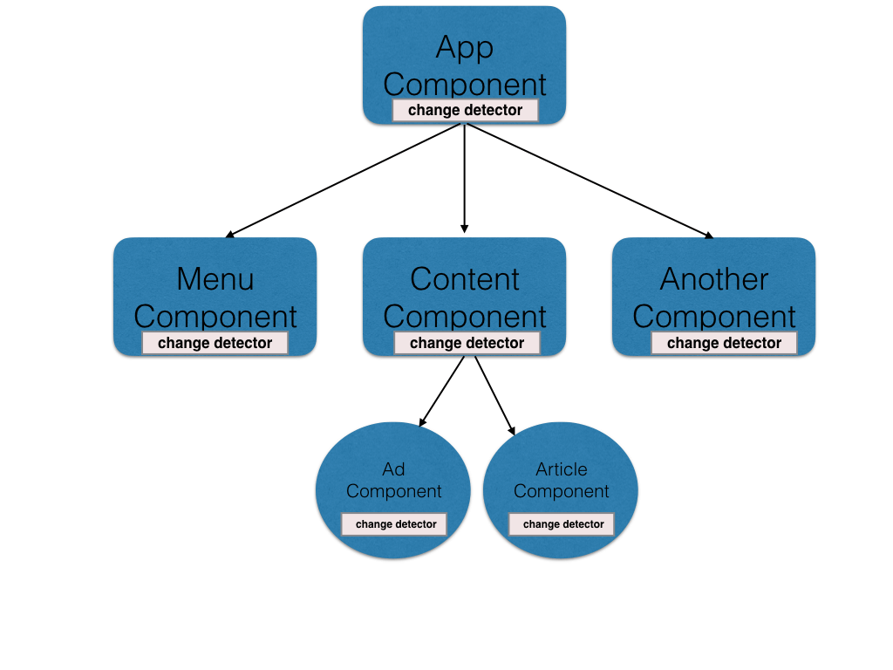

Before moving on this article about custom two way binding, we can read up on [Data binding in Angular](https://gamethapcam.github.io/2019-08-03-Data-binding-in-Angular/). Then, we will dive into custom two way binding in Angular, and understand about the problems of two way binding, how to reduce it.

Let's get started.

<br>

## Table of contents
- [Custom two way binding](#custom-two-way-binding)
- [The problem of two way binding](#the-problem-of-two-way-binding)
- [Solution to prevent using two way binding](#solution-to-prevent-using-two-way-binding)
- [Wrapping up](#wrapping-up)

<br>

## Custom two way binding
Now, we will create the project about custom two binding with Angular CLI, measuring the modification of counter. If we haven't installed Angular CLI yet, we can use the below command:

```javascript
npm install -g @angular/cli
```

Next, create our own project:

```javascript
ng new custom-two-way-binding --style scss --routing
```

Because we want to use SCSS preprocessor for CSS, so, we will use additional parameters such as ```--style scss```. Then, we can use ```--routing``` to navigate to the other page.

After that, we create the new component such as:

```javascript
ng g c custom-counter
```

Fill all the below codes looks like this.

```html
<!-- custom-counter.component.html -->
<div class="content">
  <button (click)="decrement()">-</button>
  <span class="content-number" >{{counter}}</span>
  <button (click)="increment()">+</button>
</div>
```

```css
// custom-counter.component.scss
.content {
    border: solid 1px white;
    margin: 40px;

    .content-number {
        color: dark;
        margin: 0 15px;
    }
}
```

```javascript
import { Component, OnInit, Input, Output, EventEmitter } from '@angular/core';

@Component({
  selector: 'app-custom-counter',
  templateUrl: './custom-counter.component.html',
  styleUrls: ['./custom-counter.component.scss']
})
export class CustomCounterComponent implements OnInit {

  counterValue = 0;

  @Input()
  get counter() {
    return this.counterValue;
  }

  @Output()
  counterChange = new EventEmitter();

  constructor() { }

  ngOnInit() {
  }

  set counter(val) {
    this.counterValue = val;
    this.counterChange.emit(this.counterValue);
  }

  decrement() {
    --this.counterValue;
    this.counterChange.emit(this.counterValue);
  }

  increment() {
    ++this.counterValue;
    this.counterChange.emit(this.counterValue);
  }

}
```

The above code is the code of ```CustomCounterComponent```. To implement two way binding, we will use ```@Input()``` and ```EventEmitter``` to do. Whenever we change the ```counterValue``` variable, we also must fire the change event to notify for parent component that contains child component - ```CustomCounterComponent```.

Continuously, we will see the source code in ```app.component.ts``` and ```app.component.html```.

```javascript
import { Component } from '@angular/core';

@Component({
  selector: 'app-root',
  templateUrl: './app.component.html',
  styleUrls: ['./app.component.scss']
})
export class AppComponent {
  value = 0;
}
```

```html
<app-custom-counter [(counter)]='value'></app-custom-counter>

<p>The value of counter is {{value}}</p>
```

So, we can find that the ```value``` variable of AppComponent will bind to the ```counter``` properties get/set of ```CustomCounterComponent```. So, when ```counter``` is changed by something, it will be reflected to ```value``` of ```AppComponent```.

Source code for this sample here: [https://github.com/gamethapcam/Learn-Javascript/tree/master/src/Angular/src/custom-two-way-binding](https://github.com/gamethapcam/Learn-Javascript/tree/master/src/Angular/src/custom-two-way-binding)

- ```@Input()```

    It will be used to mark this variable that will be passed data from parent component.

- ```@Output()``` and ```EventEmitter```

    It is used to know that the task in child component will update value in the parent component.

<br>

## The problem of two way data binding
Before delving into the problem of two-way data binding, we have to understand the ```Change dectection mechanism``` in Angular and AngularJS. Because change dectection is the mechanism responsible for data binding in Angular.

- The first thing is to be aware of the Angular tree structure.

    An Angular application can be seen as a component tree. A component has a view and a model. Every component has its own change detection, allowing each one to deal with changes in a different way.

    

    The change detection will traverse from the root of the tree to the leaves. It means the first application root is checked and then its siblings, their children will be processed.
    
    So, when we have so many components, the change detection will be work hard. It takes so much time, it means the performance of system will break down when they have to check loop for the creation of change detection, especially the case of two way data binding.

- Some strategies of Change Detection Mechanism

    - How does Change Detection Mechanism works?

    - ```ChangeDetectionStrategy.Default```

        Whenever data is mutated or changed, Angular will run the change detection to update the DOM elements.

    - ```ChangeDetectionStrategy.OnPush```

        Angular will only run the change detection when a new reference is passed to ```@Input()``` data, instead of some properties changed in the object.

    - Use Observable

        If observable is passed to the ```onPush``` change detection strategy that is in enabled component, then **Angular change detection has to be called manually to update the DOM elements**.

<br>

## Solution to prevent using two way binding
- First way, in order to prevent the performance degradation of application, we can use ```ChangeDetectionStrategy.OnPush```
strategy to only run when the variable is referred to the new reference.

    --> Use an Immutable object with ```onPush``` Change detection to improve performance.

    ```javascript
    // child.component.ts
    import { Component, Input, ChangeDetectionStrategy } from '@angular/core';

    @Component({
        selector: 'app-child',
        changeDetection: ChangeDetectionStrategy.OnPush,
        template: "{{course.title}}"
    })
    export class ChildComponent {
      @Input()
      course: any;
    }

    // parent.component.ts
    import { Component } from '@angular/core';

    @Component({
      selector: 'app-parent',
      template: '<app-child [course]='data'></app-child>'
    })
    export class ParentComponent implements OnInit {
      course: any;

      ngOnInit() {
        this.course = {
          title: 'Learn Angular from scratch',
          code: "Angular001"
        }
      }
    }
    ```

- Second way

    We can use RxJS Observable to improve performance of application because they emit new values without changing the reference of the object.

    ```javascript
    // child.component.ts
    import { Component, Input } from '@angular/core'

    @Component({
        selector: 'app-child',
        template: "{{course.title}}"
    })
    export class ChildComponent implements OnInit {
      @Input()
      course: Observable<any>;

      _data;

      constructor(private changeDetectorRef: ChangeDetectorRef) {
        // nothing to do
      }

      ngOnInit() {
        this.course.subscribe(data => {
          this._data = data;

          // Manually call Change Detection mechanism
          this.changeDetectorRef.markForCheck();
        });
      }
    }

    // parent.component.ts
    import { Component, OnInit } from '@angular/core';
    import { BehaviorSubject } from 'rxjs/BehaviorSubject';

    @Component({
      selector: 'app-parent',
      template: `<app-child [course]="data"></app-child>
                  <button type="button" (click)="onClick()">Click me!</button>
                `
    })
    export class ParentComponent implements OnInit {
      course: any;
      data: BehaviorSubject;

      ngOnInit() {
        this.course = {
          title: 'Learn Angular from scratch',
          code: "Angular001"
        };
        this.data = new BehaviorSubject(this.course);
      }

      onClick() {
        this.course = {
          title: 'C++ programming',
          code: 'C++001'
        };
        this.data.next(this.course);
      }
    }
    ```

<br>

## Wrapping up
- AngularJS support two-way data binding, but Angular doesn't support two-way binding any more. ```[(ngModel)]``` is not a two-way data binding, it is only a symbol of the combination between property binding and event binding.

- Angular generates a change detector for every single component.


<br>

Thanks for your reading.

<br>

Refer:

[https://www.quora.com/What-technique-AngularJS-uses-for-two-way-binding](https://www.quora.com/What-technique-AngularJS-uses-for-two-way-binding)

[https://glebbahmutov.com/blog/improving-angular-web-app-performance-example/](https://glebbahmutov.com/blog/improving-angular-web-app-performance-example/)

[https://dzone.com/articles/understanding-output-and-eventemitter-in-angular](https://dzone.com/articles/understanding-output-and-eventemitter-in-angular)

[https://angular.io/api/core/ChangeDetectionStrategy](https://angular.io/api/core/ChangeDetectionStrategy)

[https://codewithstyle.info/change-detection-angular-versus-angularjs/](https://codewithstyle.info/change-detection-angular-versus-angularjs/)

[https://blog.angular-university.io/how-does-angular-2-change-detection-really-work/](https://blog.angular-university.io/how-does-angular-2-change-detection-really-work/)

[https://blog.angularindepth.com/everything-you-need-to-know-about-change-detection-in-angular-8006c51d206f](https://blog.angularindepth.com/everything-you-need-to-know-about-change-detection-in-angular-8006c51d206f)

[https://blog.angularindepth.com/the-mechanics-of-dom-updates-in-angular-3b2970d5c03d](https://blog.angularindepth.com/the-mechanics-of-dom-updates-in-angular-3b2970d5c03d)

[https://www.gistia.com/angular-performance-optimization-change-detection/](https://www.gistia.com/angular-performance-optimization-change-detection/)

[https://netbasal.com/optimizing-angular-change-detection-triggered-by-dom-events-d2a3b2e11d87](https://netbasal.com/optimizing-angular-change-detection-triggered-by-dom-events-d2a3b2e11d87)

[https://blog.thoughtram.io/angular/2016/02/22/angular-2-change-detection-explained.html](https://blog.thoughtram.io/angular/2016/02/22/angular-2-change-detection-explained.html)