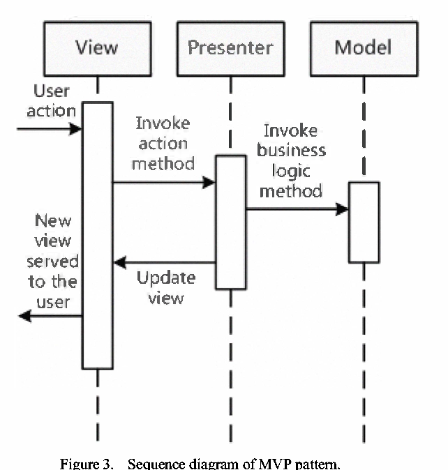

In this article, we will find something out about MVP pattern, it is inherited from MVC pattern. But definitely, it has some changes when compared to MVC pattern. So, we will understand how to use it, how to differentiate between MVC pattern and MVP pattern.

Let's get started.

<br>

## Table of contents
- [Analysis Problem](#analysis-problem)
- [Definition of MVP Pattern](#definition-of-mvp-pattern)
- [When to use](#when-to-use)
- [Benefits & Drawback](#benefits-&-drawback)
- [Wrapping up](#wrapping-up)

<br>

## Analysis Problem
The caution that was born MVP pattern is as same as with [MVC pattern](http://gamethapcam.github.io/2019-07-27-MVC-architecture-pattern). But MVP is used to prevent some drawbacks of MVC pattern such as:
- In MVC pattern, View and Model can be interact each other. So, we usually validate data from Model or use data logic in View. So, it makes automated unit testing difficult.
- It is relevant to the security.

<br>

## Definition of MVVM Pattern
According to [wikipedia.com](https://en.wikipedia.org/wiki/Model%E2%80%93view%E2%80%93presenter), we have the definition of MVP pattern:

```
MVP pattern is a derivation of the Model-View-Controller (MVC) architectural pattern, and is used mostly for building user interfaces.

In MVP, the presenter assumes the functionality of the middle-man.

In MVP, all presetation logic is pushed to the presenter.
```

And MVP pattern originated in the early 1990s at Taligent, a joint venture of Apple, IBM, and Hewlett-Packard.

Below is the content of each part in MVP pattern.
- The Model has entities and services. 
    
    Entities is used to contain data that is mapping with table in database for utilizing some other reasons. 
    
    Services, can be used DAO pattern, or Repository pattern, are thin layer between Application layer and Data Access Layer. They normally manage CRUD opertions with database in local or remote.

- The View has responsibilities that interact with users. 

    It does not contain any logic. It will route user inputs and commands (events) to the Presenter.

    The View usually has a reference to its Presenter.

- The Presenter is the intermediate part between View and Model. It will play same role as Controller in MVC pattern.

    All business logic, data logic, validate input, receives events from Views, converts data from  View to Model or from Model to View is implemented in Presenter.

    When compared to the View and Controller in the MVC pattern, the View and Presenter present in the MVP pattern are fully decoupled from each other and they communicate by means of an interface. (The Presenter interact with the Views via View interface, it means that the Presenter  can perform all presentation and navigation tasks without any dependency on the actual UI technology being used)

    

    And we have sequence diagram of MVP pattern:

    

<br>

## When to use
- Our screen has ```bi-directional-flow```, it means that user interactions need to request something from our Model, and the result of this request will affect the View.

- The View affected by the updates from Model are very limited.

- MVP pattern is not used in a case when the UI is updated without user interactions, like updating UI when an event happens in the Model, this approach is closer to MVVM more than MVP.

<br>

## Benefits & Drawback
1. Benefits
    - The View does not interact directly with the Model. This isolates the View implementation bettern than in MVC and allows easier automated unit testing of the Presenter and Model.

    - The ability to change the UI from Web to Window or Mobile is very easy.

    - Low maintaince cost


2. Drawbacks
    - The Presenter tends to expand to a huge all-knowing class if we are not careful enough and do not break our code according to Single Responsibility Principle.

    - Increased complexity.

    - Extra learning curve.

<br>

## Some patterns that are relevant to MVP pattern
- ```Application Controller``` - If presenters interact with an application controller, the presenters do not need page flow and screen navigation logic. This makes it easier to update the page flow.

- ```Observer pattern```

<br>

## Wrapping up
- The end user interacts only with the View.

- One View is mapped only to one Presenter.

- View references Presenter but it has no reference to Model. And the Presenter is also aware of the View that associated with it.

- The pattern facilities two way communication between the View and the Presenter.

- There are two other implementations of MVP pattern such as Passive View and Supervising Controller.

    - The Passive View is completely controlled by Presenter. By implementing MVP Passive View, it's much easier to handle concurrency and multithreading.

    - In Supervising Presenter, the View interacts directly with the Model to perform any simple data binding that can be declaratively defined, without the Presenter. The Presenter updates the Model. It only changes the state of the View when complex UI logic that cannot be declaratively specified is required.

        

    - Compare to other variations of MVP, such as Passive View, the Supervising Presenter pattern makes simpler code a higher priority than complete testability. The Supervising Presenter pattern requires less code than other MVP patterns because it uses data binding. The code is easier to maintain because simple UI changes do not require code changes in the Presenter to update the View.
<br>

Refer:

[https://www.linkedin.com/pulse/mvp-architecture-pattern-small-article-khaled-kassem/](https://www.linkedin.com/pulse/mvp-architecture-pattern-small-article-khaled-kassem/)

**Book Architectural Patterns_ Uncover essential patterns in the most indispensable realm of enterprise architecture**

[https://www.oreilly.com/library/view/architectural-patterns/9781787287495/38abcb95-0392-4127-a3fa-b80ac2807aa9.xhtml](https://www.oreilly.com/library/view/architectural-patterns/9781787287495/38abcb95-0392-4127-a3fa-b80ac2807aa9.xhtml)

**The other idea about Presenter in MVP pattern and Controller in MVC pattern**

[http://hannesdorfmann.com/mosby/mvp/](http://hannesdorfmann.com/mosby/mvp/)

**Choose MVP pattern over MVC pattern**

[https://www.spaceotechnologies.com/mvp-android-architectural-pattern/](https://www.spaceotechnologies.com/mvp-android-architectural-pattern/)

**Examples for MVP pattern**

[http://aviadezra.blogspot.com/2008/10/model-view-presenter-design-pattern.html](http://aviadezra.blogspot.com/2008/10/model-view-presenter-design-pattern.html)

<br>

[https://www.raywenderlich.com/7026-getting-started-with-mvp-model-view-presenter-on-android](https://www.raywenderlich.com/7026-getting-started-with-mvp-model-view-presenter-on-android)

[https://www.linkedin.com/pulse/when-use-mvc-mvp-mvvm-nothing-ahmed-adel/](https://www.linkedin.com/pulse/when-use-mvc-mvp-mvvm-nothing-ahmed-adel/)

[https://rhamesconsulting.com/2014/01/22/a-model-view-presenter-mvp-implementation-with-asp-net/](https://rhamesconsulting.com/2014/01/22/a-model-view-presenter-mvp-implementation-with-asp-net/)

[https://davidguerrerodiaz.wordpress.com/2015/10/13/a-brief-introduction-to-a-cleaner-android-architecture-the-mvp-pattern/](https://davidguerrerodiaz.wordpress.com/2015/10/13/a-brief-introduction-to-a-cleaner-android-architecture-the-mvp-pattern/)

[https://docs.microsoft.com/en-us/previous-versions/msp-n-p/ff649571(v=pandp.10)](https://docs.microsoft.com/en-us/previous-versions/msp-n-p/ff649571(v=pandp.10))